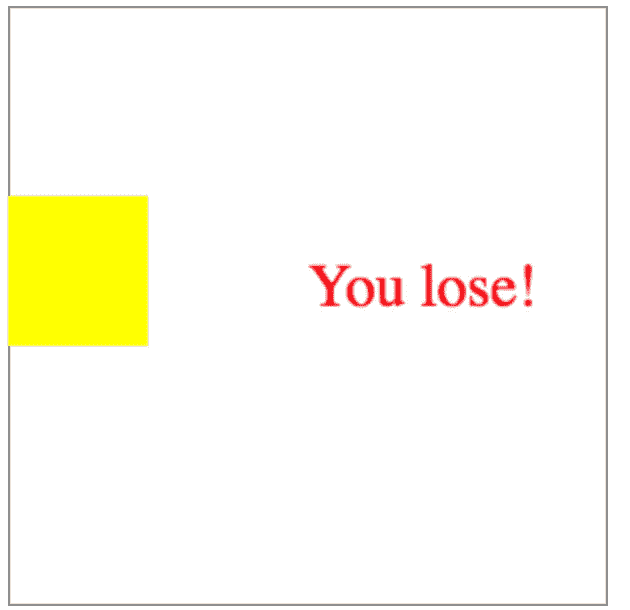

# 【教程】100 行最简单的画布游戏(~5 分钟)

> 原文：<https://itnext.io/tutorial-the-simplest-canvas-game-in-100-lines-5-min-6bfb577403dd?source=collection_archive---------3----------------------->



[*点击这里在 LinkedIn* 上分享这篇文章](https://www.linkedin.com/cws/share?url=https%3A%2F%2Fitnext.io%2Ftutorial-the-simplest-canvas-game-in-100-lines-5-min-6bfb577403dd)

据我所见，许多开发者害怕从游戏原型开始，因为他们不了解总体想法。我发现了很多例子，比如只有一个文件的游戏代码很难理解，或者有很多模块的大型项目。至少，我决定创建一个简单的例子，它将能够扩展基于 canvas API，ES6 的特性，而不需要任何额外的库。

所以，让我们从 index.html 开始。我只是添加了所有真正需要开始的简单东西:

<canvas>是我们计划绘制游戏的地方，player.js 负责游戏中的黄色方块和实际游戏。</canvas>

先说真实的游戏。首先要做的是游戏。我刚刚创建了一个简单的类游戏，需要有一个画布 dom 元素和游戏的宽度和高度。函数 document.getElementsByTagName 可以替换为 document.getElementById，并将 Id 添加到 canvas 元素。

```
**class** Game {
    constructor(canvas, width, height) {
        canvas.width = width;
        canvas.height = height;
        **this**._width = width;
        **this**._height = height;
        **this**._ctx = canvas.getContext('2d');
    }
}**var** game = **new** Game(document.getElementsByTagName('canvas')[0], 300, 300);
game.play();
```

让我们转到最有趣的事情。这个。_ctx (context)是画布中的画笔，您可以将它用作真正的画笔。例如，一个线条画看起来像这样:

```
ctx.moveTo(0,0);
ctx.lineTo(200,100);
ctx.stroke();
```

不管怎样，让我们继续我们的游戏。另一件重要的事情是 requestAnumationFrame，它将每秒钟调用 argument 函数大约 60 次。让我们看看代码示例:

```
class Game{....
   play() { // draw something by this._ctx
       requestAnimationFrame(**this**.play.bind(**this**));
   }
}
```

我们来画一个简单的游戏边框。在画画之前，我们需要清理画布上的一切。

因此，我们将清理整个屏幕，并以每秒 60 次的速度重画矩形，以便有可能处理动画。我们需要创建一个播放器，并通过键盘按钮“向上”、“向下”、“向右”、“向左”来控制它。对于播放器，我们需要存储上下文、大小和动画速度(我们在构造函数中做到了)。玩家绘制函数将调用游戏中的内部函数(我们记得每秒 60 次),这就是为什么我们需要避免大量的内部计算。为了了解我们的播放器的物理大小，我们创建了 getBorders 函数，该函数返回我们的播放器的最大值，而“keydown”处理按钮事件。

因此，我们可以在游戏类中创建一个玩家并运行整个游戏。我添加了' _checkState '和' _playLose '函数来展示如何跟踪游戏输赢状态的简单方法。

整个项目都在这里:

[](https://github.com/maksr51314/simple-game) [## maksr 51314/简单游戏

### 在 GitHub 上创建一个帐户，为简单游戏的开发做出贡献。

github.com](https://github.com/maksr51314/simple-game) 

还有活生生的例子:

[](https://codepen.io/maksr51314/project/editor/XRPoQR) [## 简单的画布游戏

### 编辑描述

codepen.io](https://codepen.io/maksr51314/project/editor/XRPoQR) 

总之，我们完成了一个最简单的游戏项目，这个项目比在一个没有类的文件中编写代码要容易得多。我跳过了代码风格，选择了 ES6 而不是 ES5 来创建尽可能干净的代码。

我希望，这篇文章能帮助你发现画布游戏。
不要犹豫，在评论或直接留言中提出任何问题:)