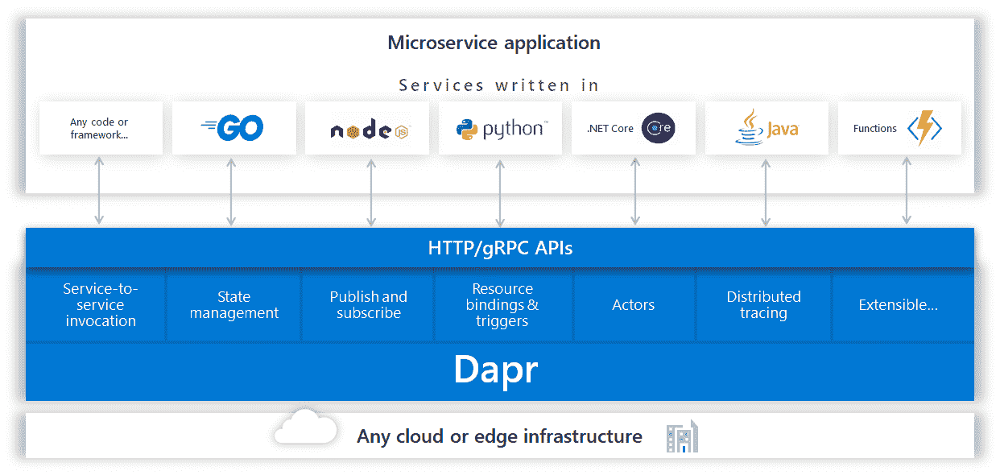
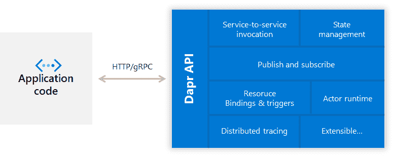

# 教程:通过 Dapr 框架使用 Azure 事件中心

> 原文：<https://itnext.io/tutorial-using-azure-event-hubs-with-the-dapr-framework-81c749b66dcf?source=collection_archive---------3----------------------->

这篇博客用一个例子向你展示如何使用 [**Azure Event Hubs**](https://azure.microsoft.com/services/event-hubs/?WT.mc_id=medium-blog-abhishgu) 与 [**Dapr**](https://dapr.io/) 集成，这是一组用于微服务开发的分布式系统构建模块。

Azure 事件中心将被用作`Dapr`运行时内的“绑定”。这将允许服务与 Azure Event Hubs 通信，而不需要实际了解它或直接耦合到它(通过 SDK、库等)。)，使用由`Dapr`运行时定义的简单模型。

听起来好得难以置信？😉请继续阅读…

您将:

*   学习`Dapr`的基础知识，以及如何为当地发展而设置它
*   部署您的第一个 Dapr 应用
*   在 Azure 上设置事件中心，并尝试一个例子，看看如何使用 Dapr 集成透明地与它通信

> [*Azure Event Hubs*](https://docs.microsoft.com/azure/event-hubs/?WT.mc_id=medium-blog-abhishgu)*是一个完全托管的平台即服务(PaaS)，用于流媒体和事件摄取。它还提供了 Apache Kafka 支持，使客户端和应用程序能够与事件中心对话，而无需设置、配置和管理您自己的 Kafka 集群！*

# Dapr？那是什么？

`Dapr`代表分布式应用运行时。你可以在[这个公告博客](https://cloudblogs.microsoft.com/opensource/2019/10/16/announcing-dapr-open-source-project-build-microservice-applications/)中获得所有的独家新闻，但是这里有一个(流行语兼容！)要点让你开始。

它是一个开源的、可移植的运行时，帮助开发人员构建弹性的、微服务的无状态和有状态应用程序。它通过将构建此类应用程序的最佳实践整理成独立的组件来做到这一点。运行时组件公开的功能可以通过 HTTP 或 gRPC 访问，这使得它完全不可知，并允许它与任何语言和/或框架一起工作。



# Dapr:工作方式

Dapr 采用边车架构，既可以作为单独的容器运行，也可以作为一个进程运行。这意味着应用程序本身不需要包含 Dapr 运行时作为依赖项。这使得集成变得容易，也提供了关注点的分离。



Dapr 还包括针对 [Go](https://github.com/dapr/go-sdk) 、 [Java](https://github.com/dapr/java-sdk) 、 [JavaScript](https://github.com/dapr/js-sdk) 、[的特定语言 SDK。NET](https://github.com/dapr/dotnet-sdk) 和 [Python](https://github.com/dapr/python-sdk) 。这些 SDK 通过类型化的语言 API 而不是调用`http/gRPC` API 来公开 Dapr 构建块中的功能，如保存状态、发布事件或创建参与者。

> *Dapr 与平台无关。您可以在任何 Kubernetes 集群和 Dapr 集成的其他托管环境上本地运行您的应用程序。*

# Dapr 组件

在撰写本文时，`Dapr`处于 alpha 状态，支持以下分布式系统构建模块，您可以将这些模块插入到您的应用程序中——服务调用、状态管理、发布/订阅消息、资源绑定、分布式跟踪和 Actor 模式

> *如需全面了解，请参考 Dapr 文档* 中的[](https://github.com/dapr/docs/blob/master/overview.md)

*如前所述，本文中的示例应用程序利用了 Azure 事件中心的 Dapr 绑定。下面是对什么是“绑定”的一点看法。*

## *Dapr 资源绑定*

*绑定提供了一种通用的方法，通过来自外部系统的事件来触发应用程序，或者通过可选的数据负载来调用外部系统。这些“外部系统”可以是任何东西:队列、消息传递管道、云服务、文件系统等等。*

> *[*目前支持的绑定*](https://github.com/dapr/components-contrib/blob/master/bindings/Readme.md) *包括 Kafka、Rabbit MQ、Azure Event Hubs 等。**

*简而言之，Dapr 绑定允许您专注于业务逻辑，而不是与诸如数据库、发布/订阅系统、blob 存储等个别服务集成。*

*   *您可以利用现成的绑定来集成不同的系统，而无需依赖或包含特定的 SDK 或库*
*   *您还可以交换/替换绑定，而无需更改代码*

*好了，理论到此为止！*

**

# *先决条件*

*你可以在任何地方运行`Dapr`，包括 [Kubernetes](https://kubernetes.io/) ，这要感谢它基于第一类[操作符](https://kubernetes.io/docs/concepts/extend-kubernetes/operator/)的支持。因为这是一篇介绍性的博客文章，所以让我们把重点放在端到端的流程上，保持简单，并把`Dapr`作为一个独立的组件在本地运行。*

> *如果你渴望在 Kubernetes 上运行 `*Dapr*` *，请查看* [*本入门指南*](https://github.com/dapr/docs/blob/master/getting-started/environment-setup.md#installing-dapr-on-a-kubernetes-cluster) *！**

*对于示例应用程序，您需要:*

*   *[码头工人](https://docs.docker.com/install/)*
*   *[Go 1.12 以上](https://golang.org/)*
*   *[蔚蓝事件中心](https://azure.microsoft.com/services/event-hubs/?WT.mc_id=medium-blog-abhishgu)*

# *设置 Dapr*

*首先安装 [Dapr CLI](https://github.com/dapr/cli) ，它允许您在本地开发机器或 Kubernetes 集群上设置 Dapr，提供调试支持，启动和管理 Dapr 实例。*

*例如，在你的 Mac 上，你可以简单地用它来安装`Dapr`到`/usr/local/bin`*

```
*curl -fsSL https://raw.githubusercontent.com/dapr/cli/master/install/install.sh | /bin/bash*
```

> **详见* [*单据*](https://github.com/dapr/docs/blob/master/getting-started/environment-setup.md#installing-dapr-cli)*

*您可以使用 CLI 在独立模式下[安装 Dapr](https://github.com/dapr/docs/blob/master/getting-started/environment-setup.md#installing-dapr-in-standalone-mode)。你所需要的只是一个简单的命令*

```
*dapr init*
```

*..就是这样！*

# *设置 Azure 事件中心*

*如果你还没有一个[微软 Azure 账号](https://docs.microsoft.com/azure/?WT.mc_id=medium-blog-abhishgu)，那就去[注册一个免费的吧！](https://azure.microsoft.com/free/?WT.mc_id=medium-blog-abhishgu)完成后，您可以使用以下快速入门工具之一快速设置 Azure 活动中心:*

*   *Azure 门户网站— [这里是一个分步指南](https://docs.microsoft.com/azure/event-hubs/event-hubs-create?WT.mc_id=medium-blog-abhishgu)*
*   *Azure CLI 或 Azure Cloud shell(在您的浏览器中！)— [这里有一个分步指南](https://docs.microsoft.com/azure/event-hubs/event-hubs-quickstart-cli?WT.mc_id=medium-blog-abhishgu)*

*现在您应该有一个带有名称空间[和相关事件中心(主题)的事件中心实例。作为最后一步，您需要获取连接字符串，以便](https://docs.microsoft.com/azure/event-hubs/event-hubs-features?WT.mc_id=medium-blog-abhishgu#namespace)[向事件中心](https://docs.microsoft.com/azure/event-hubs/authenticate-shared-access-signature?WT.mc_id=medium-blog-abhishgu) — [进行身份验证。使用本指南](https://docs.microsoft.com/azure/event-hubs/event-hubs-get-connection-string?WT.mc_id=medium-blog-abhishgu)完成此步骤。*

# *使用输入绑定接收事件中心数据*

*`Dapr`中的一个输入绑定表示一个事件资源，`Dapr`用它来从您的应用程序中读取事件并将其推送到您的应用程序中。让我们运行一个应用程序，使用它从 Azure 事件中心接收数据。*

# *使用 Dapr 运行应用程序*

*从克隆 repo 开始，并切换到正确的目录*

```
*git clone https://github.com/abhirockzz/dapr-eventhubs-bindings
cd input-binding-app*
```

*更新`components/eventhubs_binding.yaml`以在`spec.metadata.value`部分包含 Azure Event Hubs 连接字符串。请注意，您必须附加事件中心的名称来结束连接字符串，即`;EntityPath=<EVENT_HUBS_NAME>`。下面是`connectionString`属性的值应该是什么样子:*

```
*Endpoint=sb://<EVENT_HUBS_NAMESPACE>.servicebus.windows.net/;SharedAccessKeyName=RootManageSharedAccessKey;SharedAccessKey=<EVENT_HUBS_KEY>;EntityPath=<EVENT_HUBS_NAME>*
```

*启动使用 Azure 事件中心输入绑定的 Go 应用程序*

```
*export APP_PORT=8080
dapr run --app-port $APP_PORT go run app.go*
```

*你应该看看日志*

```
*== DAPR == time="2019-10-29T06:32:07+05:30" level=info msg="starting Dapr Runtime -- version 0.1.0 -- commit 4358565-dirty"
== DAPR == time="2019-10-29T06:32:07+05:30" level=info msg="log level set to: info"
== DAPR == time="2019-10-29T06:32:07+05:30" level=info msg="standalone mode configured"
== DAPR == time="2019-10-29T06:32:07+05:30" level=info msg="dapr id: foobar"
== DAPR == time="2019-10-29T06:32:07+05:30" level=info msg="loaded component messagebus (pubsub.redis)"
== DAPR == time="2019-10-29T06:32:07+05:30" level=info msg="loaded component timebound (bindings.azure.eventhubs)"
== DAPR == time="2019-10-29T06:32:07+05:30" level=info msg="loaded component statestore (state.redis)"
== DAPR == time="2019-10-29T06:32:07+05:30" level=info msg="application protocol: http. waiting on port 8080"
== DAPR == time="2019-10-29T06:32:07+05:30" level=info msg="application discovered on port 8080"
.....*
```

# *运行 Azure 事件中心生成器应用程序*

*这款应用使用 [Azure Event Hubs native Go 客户端](https://github.com/Azure/azure-event-hubs-go)发送消息。*

*设置所需的环境变量:*

```
*export EVENT_HUBS_NAMESPACE="<EVENT_HUBS_NAMESPACE>"
export EVENT_HUBS_KEY="<EVENT_HUBS_KEY>"
export EVENT_HUB_NAME="<EVENT_HUB_NAME>"*
```

> **请确保事件中心的名称与您在输入绑定配置中为连接字符串配置的名称相同**

*运行 producer 应用程序——它将向事件中心发送五条消息并退出*

```
*cd eventhubs-producer
go run producer.go*
```

# *确认*

*检查 Dapr 应用程序日志，您应该看到从事件中心收到的消息。*

```
*== APP == time from Event Hubs 'Thu Oct 31 16:57:45 2019'
== APP == time from Event Hubs 'Thu Oct 31 16:57:49 2019'
== APP == time from Event Hubs 'Thu Oct 31 16:57:52 2019'
== APP == time from Event Hubs 'Thu Oct 31 16:57:54 2019'
== APP == time from Event Hubs 'Thu Oct 31 16:57:56 2019'*
```

# *在幕后*

*下面是其工作原理的总结:*

***输入绑定***

*配置文件`eventhub_binding.yaml`捕获 Azure 事件中心的连接字符串。*

```
*apiVersion: dapr.io/v1alpha1
kind: Component
metadata:
  name: eventhubs-input
spec:
  type: bindings.azure.eventhubs
  metadata:
  - name: connectionString
    value: Endpoint=sb://<EVENT_HUBS_NAMESPACE>.servicebus.windows.net/;SharedAccessKeyName=RootManageSharedAccessKey;SharedAccessKey=<KEY>;EntityPath=<EVENT_HUBS_NAME>*
```

*关键属性包括:*

*   *`metadata.name` -输入绑定组件的名称*
*   *`spec.metadata.name` -事件集线器连接字符串*

> **请注意，连接字符串包含代理 URL (* `*<EVENT_HUBS_NAMESPACE>.servicebus.windows.net*` *)、主键(用于身份验证)的信息，还包含主题或事件中心的名称，您的应用程序将绑定到该主题或事件中心并从其接收事件。**

***使用 app 中的绑定***

*Go 应用程序在`/eventhubs-input`处公开了一个 REST 端点——这与输入绑定组件的名称相同(不是巧合！)*

```
*func main() {
    http.HandleFunc("/eventhubs-input", func(rw http.ResponseWriter, req *http.Request) {
        var _time TheTime
        err := json.NewDecoder(req.Body).Decode(&_time)
        if err != nil {
            fmt.Println("error reading message from event hub binding", err)
            rw.WriteHeader(500)
            return
        }
        fmt.Printf("time from Event Hubs '%s'\n", _time.Time)
        rw.WriteHeader(200)
    })
    http.ListenAndServe(":"+port, nil)
}*
```

*Dapr 运行时负责从事件中心进行消费，并确保它在带有事件有效负载的`/eventhubs-input`端点使用`POST`请求调用 Go 应用程序。然后执行 app 逻辑，在这种情况下只是记录到标准输出。*

# *将数据发送到带有输出绑定的事件中心数据*

*输出绑定表示一个资源，`Dapr`将调用该资源并向其发送消息。让我们使用一个输出绑定向事件中心发送数据。*

# *使用 Dapr 运行应用程序*

*转到正确的目录*

```
*cd output-binding-app*
```

*更新`components/eventhubs_binding.yaml`以在`spec.metadata.value`部分包含 Azure Event Hubs 连接字符串。请注意，您必须附加事件中心的名称来结束连接字符串，即`;EntityPath=<EVENT_HUBS_NAME>`。下面是`connectionString`属性的值应该是什么样子:*

```
*Endpoint=sb://<EVENT_HUBS_NAMESPACE>.servicebus.windows.net/;SharedAccessKeyName=RootManageSharedAccessKey;SharedAccessKey=<EVENT_HUBS_KEY>;EntityPath=<EVENT_HUBS_NAME>*
```

*启动使用 Azure 事件中心输出绑定的 Go 应用程序。它将快速连续地向 Dapr 绑定 HTTP 端点发送五条消息，然后退出。*

```
*dapr run --port 3500 go run app.go*
```

*在应用程序中，您将看到日志:*

```
*== APP == sent message {"data": {"time":"2019-10-31 17:18:07.602377 +0530 IST m=+0.000569729"}}
== APP == response 200 OK
== APP == sent message {"data": {"time":"2019-10-31 17:18:12.375237 +0530 IST m=+4.773393815"}}
== APP == response 200 OK
== APP == sent message {"data": {"time":"2019-10-31 17:18:14.504914 +0530 IST m=+6.903055209"}}
== APP == response 200 OK
== APP == sent message {"data": {"time":"2019-10-31 17:18:16.637992 +0530 IST m=+9.036116365"}}
== APP == response 200 OK
== APP == sent message {"data": {"time":"2019-10-31 17:18:18.763691 +0530 IST m=+11.161800122"}}
== APP == response 200 OK
== APP == finished sending messages... use ctrl+c to exit*
```

*这意味着消息是通过 Dapr 输出绑定发送到 Azure Event Hub 的*

*在接收器(输入绑定)应用程序中，您应该看到*

```
*== APP == time from Event Hubs '2019-10-31 17:18:07.602377 +0530 IST m=+0.000569729'
== APP == time from Event Hubs '2019-10-31 17:18:12.375237 +0530 IST m=+4.773393815'
== APP == time from Event Hubs '2019-10-31 17:18:14.504914 +0530 IST m=+6.903055209'
== APP == time from Event Hubs '2019-10-31 17:18:16.637992 +0530 IST m=+9.036116365'
== APP == time from Event Hubs '2019-10-31 17:18:18.763691 +0530 IST m=+11.161800122'*
```

> **为了简单起见，我们对输入和输出绑定示例使用了相同的事件中心主题。实际上，它们可以独立使用，即需要由事件中心以事件驱动的方式触发的应用程序可以订阅主题(通过 Dapr ),而需要将数据推送到事件中心(不同主题)的另一个应用程序可以使用 Dapr 将 HTTP 端点绑定到* `*POST*` *事件数据。**

# *在幕后*

*输出绑定配置与输入绑定保持相同。*

*Go 应用程序通过输出绑定向事件中心发送消息。它通过向 Dapr HTTP 端点`http://localhost:<dapr_port>/v1.0/bindings/<output_binding_name>`发送一个`POST`请求来实现这一点。*

```
*....
const daprURL = "http://localhost:3500/v1.0/bindings/eventhubs-output"
go func() {
    ....
	for i := 1; i <= 5; i++ {
		body := fmt.Sprintf(format, time.Now().String())
		resp, err := http.Post(daprURL, contentType, strings.NewReader(body))
        .....
		fmt.Println("sent message", body)
		fmt.Println("response", resp.Status)
		time.Sleep(2 * time.Second)
	}
	done <- true
}()
....*
```

*在这个例子中，输出绑定的名称是`eventhubs-output`，Dapr HTTP 端口是`3500`，端点 URL 是:*

```
*[http://localhost:3500/v1.0/bindings/eventhubs-output](http://localhost:3500/v1.0/bindings/eventhubs-output)*
```

*与输入绑定一样，`Dapr`运行时负责将事件发送到事件中心。由于我们运行了输入绑定应用程序，它接收有效负载并显示在日志中。*

# *摘要*

*在这篇博文中，您看到了如何使用`Dapr`“绑定”通过 Azure Event Hubs 连接和集成您的应用程序，而无需了解它！相反，您使用 Dapr HTTP API 通过 Dapr 运行时(只是一个 sidecar)进行连接。*

> **也可以使用 gRPC 或特定语言的 SDK(如前所述)**

*在撰写本文时，`Dapr`正处于 alpha 状态(`v0.1.0`)，并乐于接受社区贡献😃参观 https://github.com/dapr/dapr[潜水吧！](https://github.com/dapr/dapr)*

*如果你觉得这篇文章有帮助，请喜欢并关注🙌很高兴通过 [Twitter](https://twitter.com/abhi_tweeter) 获得反馈或发表评论。*