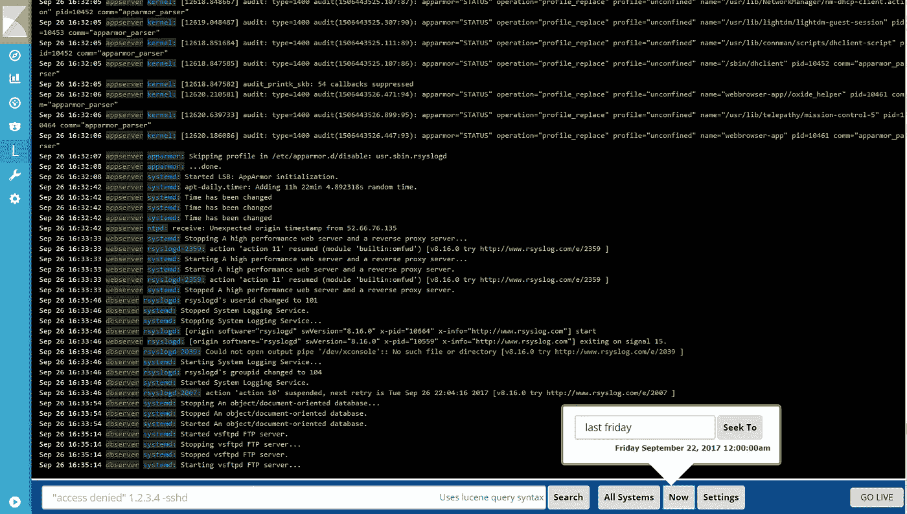

# 调整 Kubernetes 上的 EFK 堆栈:Fluentd 配置和 Logtrail

> 原文：<https://itnext.io/tweaking-an-efk-stack-on-kubernetes-fluentd-configuration-and-logtrail-f89d8a5149c9?source=collection_archive---------1----------------------->

这是我在 Kubernetes 上一篇关于 EFK 的文章的延续。在这篇文章中，我们将主要关注于配置[Fluent d](https://www.fluentd.org/)/[Fluent Bit](https://fluentbit.io/)，但也会有一个关于 Logtrail 插件的 [Kibana](https://www.elastic.co/products/kibana) 调整。

# 配置流体 d

这一部分和下一部分将有相同的目标，但一部分将侧重于 Fluentd，另一部分将侧重于 Fluent Bit。我们的目标是创建一个配置，将不同名称空间的日志分开，并根据它们的标签选择我们想要记录的容器。

# 配置守护进程

我们要做的第一件事是改变 Fluentd 的 DaemonSet。事实上，如果我们使用 Fluentd 提供的[，配置文件被硬编码到映像中，要更改它并不容易。因此，我们将创建一个 Kubernetes ConfigMap，并将其挂载到`/fluentd/etc`文件夹中。如果您启用了 RBAC，并且应该这样做，不要忘记为 Fluentd 配置它:](https://github.com/fluent/fluentd-kubernetes-daemonset)

```
# fluentd-rbac.yml
# If you have RBAC enabled
apiVersion: v1
kind: ServiceAccount
metadata:
  name: fluentd
  namespace: kube-system
---
apiVersion: rbac.authorization.k8s.io/v1beta1
kind: ClusterRole
metadata:
  name: fluentd
  namespace: kube-system
rules:
- apiGroups:
  - ""
  resources:
  - pods
  - namespaces
  verbs:
  - get
  - list
  - watch
---
kind: ClusterRoleBinding
apiVersion: rbac.authorization.k8s.io/v1beta1
metadata:
  name: fluentd
roleRef:
  kind: ClusterRole
  name: fluentd
  apiGroup: rbac.authorization.k8s.io
subjects:
- kind: ServiceAccount
  name: fluentd
  namespace: kube-system
```

现在关于达蒙塞特:

```
# fluentd-daemonset.yml
apiVersion: extensions/v1beta1
kind: DaemonSet
metadata:
  name: fluentd
  labels:
    k8s-app: fluentd-logging
    version: v1
    kubernetes.io/cluster-service: "true"
spec:
  template:
    metadata:
      labels:
        k8s-app: fluentd-logging
        version: v1
        kubernetes.io/cluster-service: "true"
    spec:
      serviceAccount: fluentd # if RBAC is enabled
      serviceAccountName: fluentd # if RBAC is enabled
      tolerations:
      - key: node-role.kubernetes.io/master
        effect: NoSchedule
      containers:
      - name: fluentd
        image: fluent/fluentd-kubernetes-daemonset:v1.1-debian-elasticsearch
        env:
        - name:  FLUENT_ELASTICSEARCH_HOST
          value: "elasticsearch"
        - name:  FLUENT_ELASTICSEARCH_PORT
          value: "9200"
        - name: FLUENT_ELASTICSEARCH_SCHEME
          value: "http"
        - name: FLUENT_ELASTICSEARCH_USER # even if not used they are necessary
          value: "foo"
        - name: FLUENT_ELASTICSEARCH_PASSWORD # even if not used they are necessary
          value: "bar"
        resources:
          limits:
            memory: 200Mi
          requests:
            cpu: 100m
            memory: 200Mi
        volumeMounts:
        - name: varlog
          mountPath: /var/log
        - name: varlibdockercontainers
          mountPath: /var/lib/docker/containers
          readOnly: **true**
        - name: fluentd-config
          mountPath: /fluentd/etc # path of fluentd config file
      terminationGracePeriodSeconds: 30
      volumes:
      - name: varlog
        hostPath:
          path: /var/log
      - name: varlibdockercontainers
        hostPath:
          path: /var/lib/docker/containers
      - name: fluentd-config
        configMap:
          name: fluentd-config # name of the config map we will create
```

> *注意，我们使用的是 Fluentd v1。有些配置在 v0.12 上不起作用！*

你可能会奇怪我为什么加了`FLUENT_ELASTICSEARCH_PASSWORD`和`FLUENT_ELASTICSEARCH_USER`。这是因为如果没有设置这些环境变量，Docker 映像[fluent/fluentd-kubernetes-daemon set](https://hub.docker.com/r/fluent/fluentd-kubernetes-daemonset/)将使用配置文件上的`sed`，并且由于 ConfigMap 是只读的，因此容器将无法启动。我们可以改变 DaemonSet 的基本图像，但添加这两行更简单，而且没有坏处。

随着 DaemonSet 的创建，我们现在可以专注于我们的`fluentd-config`配置图。

# 创建配置图

以下是 Kubernetes 的基本 Fluentd 配置(你可以在他们的文档中了解更多关于配置 Fluentd 的信息):

```
# fluentd-config-map.yml
apiVersion: v1
kind: ConfigMap
metadata:
  name: fluentd-config
data:
  fluent.conf: |
    <match fluent.**>
        # this tells fluentd to not output its log on stdout
        @type null
    </match>

    # here we read the logs from Docker's containers and parse them
    <source>
      @type tail
      path /var/log/containers/*.log
      pos_file /var/log/fluentd-containers.log.pos
      tag kubernetes.*
      read_from_head true
      <parse>
        @type json
        time_format %Y-%m-%dT%H:%M:%S.%NZ
      </parse>      
    </source>

    # we use kubernetes metadata plugin to add metadatas to the log
    <filter kubernetes.**>
        @type kubernetes_metadata
    </filter>

    # we send the logs to Elasticsearch
    <match kubernetes.**>
        @type elasticsearch
        include_tag_key true
        host "#{ENV['FLUENT_ELASTICSEARCH_HOST']}"
        port "#{ENV['FLUENT_ELASTICSEARCH_PORT']}"
        scheme "#{ENV['FLUENT_ELASTICSEARCH_SCHEME'] || 'http'}"
        ssl_verify "#{ENV['FLUENT_ELASTICSEARCH_SSL_VERIFY'] || 'true'}"
        user "#{ENV['FLUENT_ELASTICSEARCH_USER']}" # remove these lines if not needed
        password "#{ENV['FLUENT_ELASTICSEARCH_PASSWORD']}" # remove these lines if not needed
        reload_connections true
        logstash_prefix logstash
        logstash_format true
        <buffer>
            flush_thread_count 8
            flush_interval 5s
            chunk_limit_size 2M
            queue_limit_length 32
            retry_max_interval 30
            retry_forever true
        </buffer>
    </match>
```

> *我们使用的 Docker 镜像中已经安装了* [*Kubernetes 元数据插件*](https://github.com/fabric8io/fluent-plugin-kubernetes_metadata_filter) *。*

这种配置与 Fluentd 提供的配置大致相同。现在，如果您不想发送`kube-system`容器的日志，您可以在 Elasticsearch 输出之前添加以下几行:

```
<match kubernetes.var.log.containers.**kube-system**.log>
    @type null
</match>
```

# 分割关于名称空间的日志

让我们假设您想要根据容器的名称空间来分离日志。例如，您可以将日志从`dev`名称空间发送到一个 Elasticsearch 集群，将日志从`production`名称空间发送到另一个集群。为了实现它，我们将使用[重写标签过滤器](https://github.com/fluent/fluent-plugin-rewrite-tag-filter)。在元数据插件之后，我们可以添加:

```
# this add the namespace name at the begining of the tag
<match kubernetes.**>
    @type rewrite_tag_filter
    <rule>
        key $['kubernetes']['namespace_name']
        pattern ^(.+)$
        tag $1.${tag}
    </rule>
</match>
```

然后我们可以有这样的输出:

```
# match the dev logs
<match dev.kubernetes.**>
    @type elasticsearch
    include_tag_key true
    host "#{ENV['FLUENT_ELASTICSEARCH_HOST_DEV']}"
    port "#{ENV['FLUENT_ELASTICSEARCH_PORT_DEV']}"
    scheme "#{ENV['FLUENT_ELASTICSEARCH_SCHEME_DEV'] || 'http'}"
    ...
</match>
# match the production logs
<match production.kubernetes.**>
    @type elasticsearch
    include_tag_key true
    host "#{ENV['FLUENT_ELASTICSEARCH_HOST_PROD']}"
    port "#{ENV['FLUENT_ELASTICSEARCH_PORT_PROD']}"
    scheme "#{ENV['FLUENT_ELASTICSEARCH_SCHEME_PROD'] || 'http'}"
    ...
</match>
```

> *这只是一个例子，让你的想象力发挥更大的作用:)！*

# 选择要记录的容器

现在，我们要选择要记录或不记录哪些容器。使用 [grep 过滤器](https://docs.fluentd.org/v1.0/articles/filter_grep)是可能的(这只适用于 Fluentd v1，因为嵌套键似乎不适用于 v0.12)。

这里的想法是给想要记录的容器或者不想记录的容器添加一个标签。有两种方法:要么我们标记所有想要记录的容器；或者那些我们不想记录的。

例如，如果我们添加`fluentd: "true"`作为我们想要记录的容器的标签，那么我们需要添加:

```
<filter kubernetes.**>
    @type grep
    <regexp>
        key $.kubernetes.labels.fluentd
        pattern true
    </regexp>
</filter>
```

或者类似地，如果我们添加`fluentd: "false"`作为我们不想记录的容器的标签，我们将添加:

```
<filter kubernetes.**>
    @type grep
    <exclude>
        key $.kubernetes.labels.fluentd
        pattern false
    </exclude>
</filter>
```

这就是 Fluentd 配置。同样，如果你想要更多的配置选项，请查看 Fluentd 和我们使用的插件的文档。

# 配置流畅位

不幸的是，像我们刚刚为 Fluentd 所做的那样配置 Fluent Bit 工作还不行(还不行？)有可能。实现这一点的一种方法是将 Fluent Bit 连接到 Fluentd 聚合器，但我不会在这里介绍它。你可以在 [fluent Github repo](https://github.com/fluent/fluent-bit-docs/blob/master/output/forward.md) 上找到一些关于它的信息。

# 让我们用 Logtrail 插件稍微调整一下 Kibana



> *Logtrail* *是 Kibana 的一个插件，通过 devops 友好的界面实时查看、分析、搜索和跟踪来自多个主机的日志事件，其灵感来自*[*paper trail*](https://papertrailapp.com/)*。*

首先我们需要安装插件(Kibana 5。X & 6。仅限 x)。要安装这个插件，你需要一个 Logtrail 版本的 URL。你可以在这里查看它们。

> 您必须获取与您的 Kibana 版本相对应的 URL。

现在，您可以像这样用 Logtrail 插件构建映像(假设您想要 Kibana 6.2.4):

```
FROM docker.elastic.co/kibana/kibana-oss:6.2.4
RUN kibana-plugin install https://github.com/sivasamyk/logtrail/releases/download/v0.1.27/logtrail-6.2.4-0.1.27.zip
WORKDIR /config
USER root
RUN mv /usr/share/kibana/plugins/logtrail/logtrail.json /config/logtrail.json && \
    ln -s /config/logtrail.json /usr/share/kibana/plugins/logtrail/logtrail.json
USER kibana
```

或者从我的 docker hub:[sh4d 1/ki Bana-log trail](https://hub.docker.com/r/sh4d1/kibana-logtrail/)拉图

> *我只有* `*6.2.4*` *标签。*

下一步是配置 Logtrail，我们将使用配置映射。以下是 Kibana 的配置图和部署:

```
apiVersion: v1
kind: ConfigMap
metadata:
  name: logtrail-config
data:
  logtrail.json: |
    {
        "version" : 1,
        "index_patterns" : [
        {      
            "es": {
                "default_index": "logstash-*"
            },
            "tail_interval_in_seconds": 10,
            "es_index_time_offset_in_seconds": 0,
            "display_timezone": "local",
            "display_timestamp_format": "MMM DD HH:mm:ss",
            "max_buckets": 500,
            "default_time_range_in_days" : 0,
            "max_hosts": 100,
            "max_events_to_keep_in_viewer": 5000,
            "fields" : {
                "mapping" : {
                    "timestamp" : "@timestamp",
                    "hostname" : "kubernetes.host",
                    "program": "kubernetes.pod_name",
                    "message": "log"
                },
                "message_format": "{{{log}}}"
            },
            "color_mapping" : {
            }
        }]
    } 
---
apiVersion: apps/v1beta1
kind: Deployment
metadata:
  name: kibana
  labels:
    component: kibana
spec:
  replicas: 1
  selector:
    matchLabels:
     component: kibana
  template:
    metadata:
      labels:
        component: kibana
    spec:
      containers:
      - name: kibana
        image: sh4d1/kibana-logtrail:6.2.4 # or your image
        volumeMounts:
          - name: logtrail-config
            mountPath: /config
        env:
        - name: CLUSTER_NAME
          value: myesdb # the name of your ES cluster
        resources:
          limits:
            cpu: 1000m
          requests:
            cpu: 100m
        ports:
        - containerPort: 5601
          name: http
      volumes:
        - name: logtrail-config
          configMap:
            name: logtrail-config
```

所以让我们来看看 Logtrail 的配置。第一点是`default-index`；必须设置为 Elasticsearch 使用的索引。
那么重要的部分就是`fields`部分了。它将显示如下:

```
timestamp hostname program:message
```

`message`在`message_format`中定义。我们可以放一些类似于`{{{docker.container_id}}}: {{{log}}}`的东西。
关于进一步的配置，您可以查看 [sivasamyk](https://github.com/sivasamyk/logtrail) 的存储库。

如果您有任何问题，请随时向[发送电子邮件](mailto:patrik@ptrk.io)或通过 [Docker Slack 社区](https://dockercommunity.slack.com/) @Sh4d1 联系我

*原载于 2018 年 5 月 14 日*[*blog . ptrk . io*](https://blog.ptrk.io/tweaking-an-efk-stack-on-kubernetes/)*。*