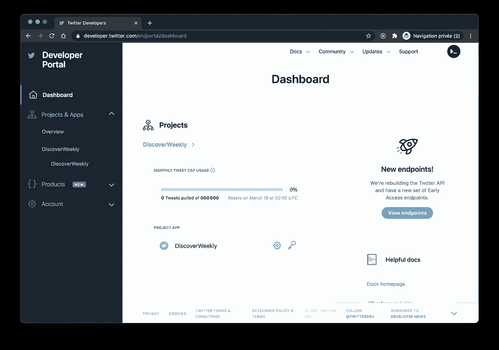
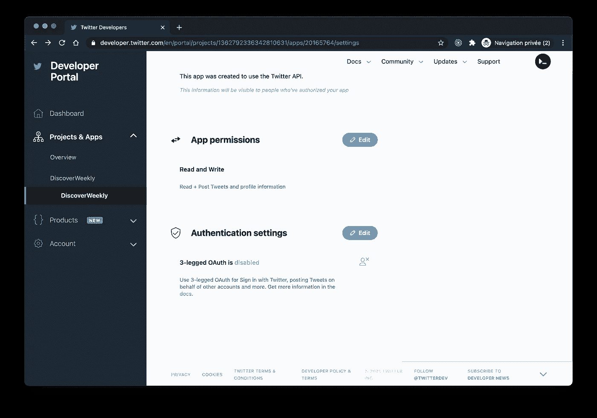
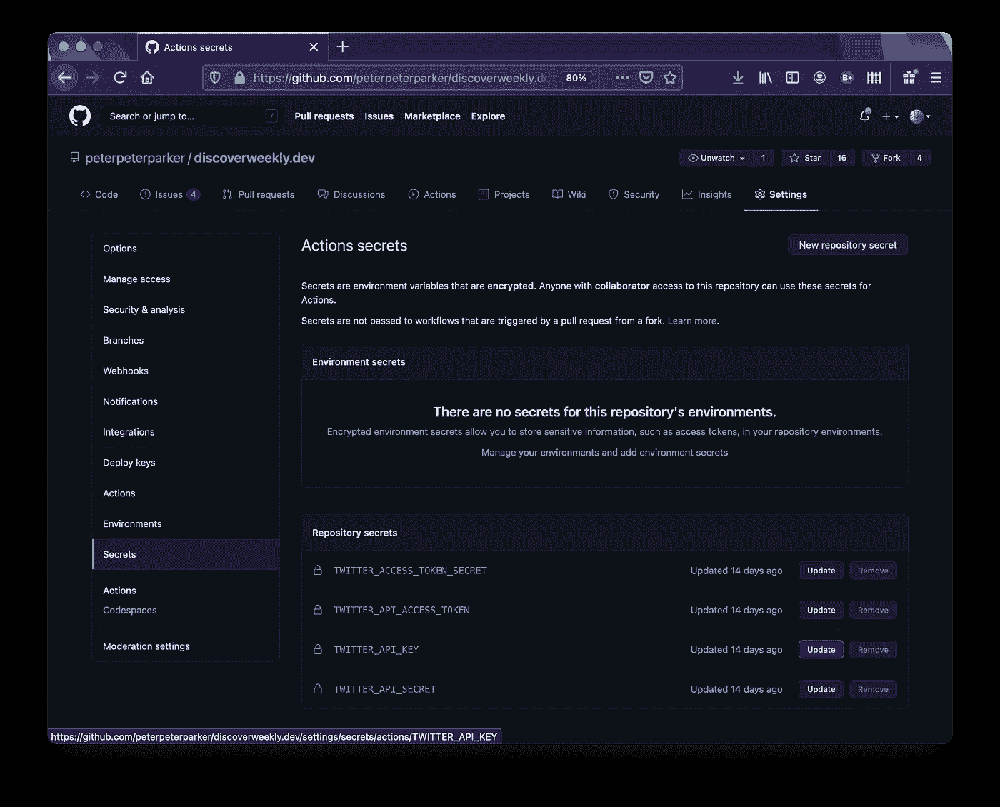

# 来自 GitHub Actions 的推文

> 原文：<https://itnext.io/tweet-from-github-actions-e289de58988a?source=collection_archive---------2----------------------->

## 开发一个在 GitHub 操作中运行的 Twitter 机器人


Ravi Sharma 在 [Unsplash](https://unsplash.com/?utm_source=unsplash&utm_medium=referral&utm_content=creditCopyText) 上拍摄的照片

我最近推出了 [DiscoverWeekly.dev](https://discoverweekly.dev/) 网站，每周三分享开发者制作的新音乐播放列表。

为了传播信息并让人们订阅，除了 RSS 订阅，我还开了一个 Twitter 账户，并开发了一个机器人，每周发一次关于新闻播放列表的微博。

下面是如何创建一个 Twitter Bot，它在 GitHub Actions 中定期运行。

# Twitter API

推文是在 Twitter API 的帮助下发布的。要访问这样的功能，您需要创建一个开发人员帐户并请求访问。您可以在这里启动您的应用[。](https://developer.twitter.com/en/apply-for-access)

这个过程需要几个步骤，但总的来说，可以在几分钟内解决。

一旦您访问了您的[仪表板](https://developer.twitter.com/en/portal/dashboard)，创建一个新项目。



在您的“应用程序权限”中，请求“读写”权限。



最后，在“密钥和令牌”下，生成所有“访问令牌和密码”。


请注意，如果您在请求“读取和写入”权限之前已经生成了您的机密，您必须重新生成您的机密。

# 图书馆

尽管使用 Twitter API 看起来不像火箭科学，但是使用已经制作好的 Node.js 库可以简化这个过程。此外，Twitter 目前正在开发一个新的 API (v2)，但是我们希望使用的这个 API[status/update](https://developer.twitter.com/en/docs/tweets/post-and-engage/api-reference/post-statuses-update)还没有被迁移(v1)。因此，在这种情况下，使用库作为额外的布局可能有助于我们将来不必重写所有内容。

这就是为什么我们要将 [twitter-api-client](https://github.com/FeedHive/twitter-api-client) 库添加到项目中。

```
npm i twitter-api-client --save-dev
```

# 推特机器人

为了开发 Twitter Bot，我们在项目的根目录下创建了一个新文件`twitter.js`。它包含一个使用`twitter-api-client`处理`tweet`本身的函数，以及一个顶层`async`块，当脚本运行时触发它。

为了不公开我们之前创建的令牌，我们通过环境变量来访问它们(见下一章)。

最后，在下面的例子中，tweet 是一个常量消息。任何推文，应该最长 280 个字符，可以标记用户名和指向网址。

```
const {TwitterClient} = require('twitter-api-client');

const tweet = async (status) => {
  const twitterClient = new TwitterClient({
    apiKey: process.env.TWITTER_API_KEY,
    apiSecret: process.env.TWITTER_API_SECRET,
    accessToken: process.env.TWITTER_API_ACCESS_TOKEN,
    accessTokenSecret: process.env.TWITTER_ACCESS_TOKEN_SECRET,
  });

  await twitterClient.tweets.statusesUpdate({status});
};

(async () => {
  try {
    const myTweet = 
          `Checkout @discoverweekly_ https://discoverweekly.dev`;

    await tweet(myTweet);
  } catch (err) {
    console.error(err);
  }
})();
```

为了运行这个机器人，我们在我们的`package.json`中添加了一个相关的`scripts`目标。

```
"scripts": {
  "twitter": "node ./twitter.js"
},
```

# 环境变量

为了使我们的令牌和秘密，我们通过环境变量进行处理，可用于我们的 GitHub 操作，转到您的`GitHub repo > Settings > Secrets`并添加它们各自的值。



# GitHub 操作

最后，将 GitHub 动作如`.github/workflows/twitter.yml`添加到您的项目中，它会定期运行我们之前创建的 Node.js 脚本。

就我而言，由于我每周发布一次新的播放列表，并且只在推特上发布一次，所以工作流程被安排在特定的 UTC 时间运行。

```
name: Twitter bot

on:
  schedule:
    - cron: "0 15 * * 3"

jobs:
  build:
    name: Tweet about the new playlists
    runs-on: ubuntu-latest
    steps:
      - name: Checkout Repo
        uses: actions/checkout@master
      - name: Use Node.js
        uses: actions/setup-node@v1
        with:
          node-version: '14.x'
      - name: Install Dependencies
        run: npm ci
      - name: Run Twitter bot
        run: npm run twitter
        env:
          TWITTER_API_KEY: ${{ secrets.TWITTER_API_KEY }}
          TWITTER_API_SECRET: ${{ secrets.TWITTER_API_SECRET }}
          TWITTER_API_ACCESS_TOKEN: ${{ secrets.TWITTER_API_ACCESS_TOKEN }}
          TWITTER_ACCESS_TOKEN_SECRET: ${{ secrets.TWITTER_ACCESS_TOKEN_SECRET }}
```

# 摘要


我很惊讶地注意到开发这样一个 Twitter 机器人是多么的简单，而且实际上很有趣。希望这篇文章也能帮到你。

到无限和更远的地方！

大卫

你可以通过 [Twitter](https://twitter.com/daviddalbusco) 或我的[网站](https://daviddalbusco.com/)联系我。

尝试使用 [DeckDeckGo](https://deckdeckgo.com/) 制作您的下一张幻灯片🤟。

[](https://deckdeckgo.com)