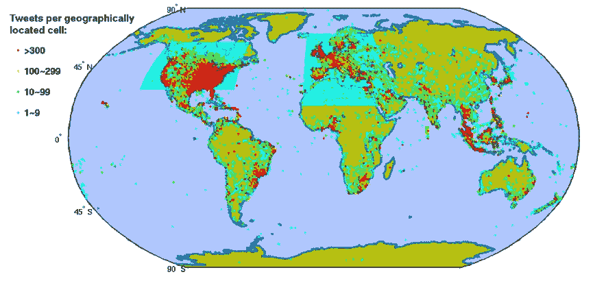
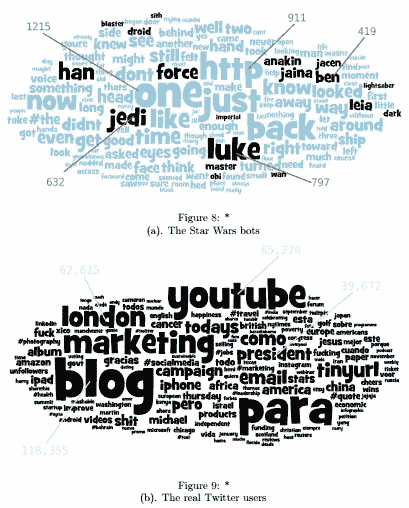
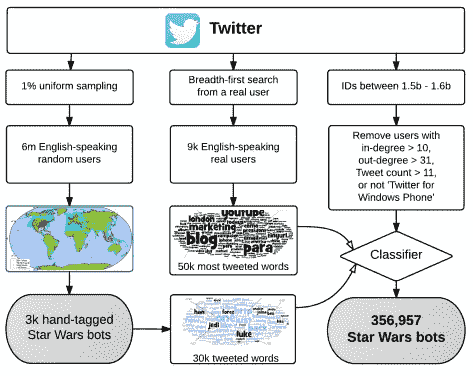

# 被僵尸网络囚禁的 Twitter

> 原文：<https://itnext.io/twitter-in-captivity-of-botnets-20bf6f52c009?source=collection_archive---------3----------------------->

每天，Twitter 上充斥着大约 4 亿条试图向我们提供信息的推文。这些信息大多是头条、可靠的新闻、文章，以及任何符合我们兴趣的东西。毫无疑问，我们的饲料也包含虚假或误导性的信息。然而，还不清楚这种错误信息有多少，我们遇到它的频率有多高。许多这种虚假信息是由作为僵尸网络一部分的 Twitter 机器人传播的。最近，这些 Twitter 机器人吸引了很多[的关注](http://www.public.asu.edu/~fmorstat/bottutorial/)，因为它们对 Twitter 构成了威胁。在这篇文章中，我评估了这种威胁，并找出这些 Twitter 机器人是什么，它们能做什么，以及它们是如何操作的。

# 什么是 Twitter 机器人，它们的影响力是什么？

[麻省理工科技评论](https://www.technologyreview.com/s/603404/cybersecurity-experts-uncover-dormant-botnet-of-350000-twitter-accounts/)将推特机器人描述为*“大部分账户都是自动化的，它们几乎不需要人工干预就能操作。”它继续描述了他们的潜在危险，如产生垃圾邮件，购买假追随者的可能性，以及难以跟踪和防止的暗中操纵辩论和公众舆论的能力。“大量 Twitter 机器人——所谓的僵尸网络——的影响在很大程度上是未知的。”*

俄罗斯涉嫌参与美国总统选举是凸显推特机器人负面影响的最新事件。在即将到来的法国选举中，荷兰投票系统转向纸质选票，社交媒体的广泛使用，这是引发[辩论的几个例子之一。](http://www.economist.com/news/europe/21720665-france-and-germany-fear-propaganda-and-espionage-favouring-pro-kremlin-candidates-europe-trying)

提到的危险影响已经导致像 DARPA(国防高级研究计划局)这样的组织试图找到发现这些僵尸网络的最佳方法。这些组织中有一个是与 UCL(伦敦大学学院)有关联的 [UCL 媒体未来集团](http://www.euronews.com/2017/03/06/view-of-twitter-bots-and-men-star-wars-bots)。属于这个小组的学生意外地检测到了“星球大战”Twitter 僵尸网络——该网络用于制造追随者，发送垃圾邮件，提高对热门话题的兴趣——并让专家们对僵尸网络的内部世界有了一些了解。

# 解开星球大战僵尸网络

“[《星球大战》](https://arxiv.org/pdf/1701.02405v1.pdf)”僵尸网络创建于 2013 年 6 月之前。分配给这些 Twitter 用户的 ID 分布在 15.2 亿到 15.9 亿之间。这些机器人每天发布多达 15 万条推文，集中在与《星球大战》系列相关的短语上。

研究人员是如何发现这个星球大战僵尸网络的？先前发现机器人的研究开始于建立真实 Twitter 用户与确认的 Twitter 机器人的数据集。这些先前的研究使用了各种方法来识别推特机器人，例如使用用户名的推特和最小信息之间的 [Levenshtein 距离](https://en.wikipedia.org/wiki/Levenshtein_distance)。

Levenshtein 的距离被用来检测重复的推文。Levenshtein 距离是将一个字符串转换为另一个字符串所需的最小编辑次数，包括删除、插入和替换。如果需要 3 次编辑才能将一个单词从 kitten 改为 sitting，这意味着该单词的 Levenshtein 距离为 3。为了加强分析，研究人员还过滤掉了#topics 或@ usernames。

在另一项研究中使用了[最小信息](http://ecs.syr.edu/faculty/reza/publications/files/10Bits.pdf)来检测仅使用用户名的恶意 Twitter 账户。为了准备数据集，他们选取了 3200 万个已知的恶意用户名，将它们与一组已知的正常用户进行比较，并结合性别来提高检测能力。他们使用的 3 个基线是关键词、用户名随机性和字母重复。通过监督学习，他们使用这 3 个基线来训练他们的数据集。

# 星球大战探测方法

几项研究表明，你需要一个普通用户和 Twitter 机器人的数据集来进行任何比较分析。为此，[研究人员](https://arxiv.org/pdf/1701.02405v1.pdf)从大约 600 万随机用户中抽取样本，过滤掉非英语用户。在分析推文的过程中，研究人员考虑了与每条推文相关的位置。Twitter 跟踪 2 个位置，每个个人资料上显示的位置和与 tweet 相关的位置。因此，研究人员发现，大量推文分布在欧洲和美国上方的一个区域，超出了通常的人口分布。这种矩形分布跨越海洋、苔原、沙漠和山脉，平均范围为 2064 公里，而不是平均的 39 公里，你可以在图 1 中观察到这一点。

[*图 1*](https://arxiv.org/pdf/1701.02405v1.pdf) *:研究人员绘制的与推文相关的位置分布图*

从这些分布中，他们选取了一组 3244 个人工验证的 Twitter 机器人，并将其与一组 9000 个真实用户进行比较。从这两个数据集中，他们查看了他们的推文，并分析了推文中使用的多达 80000 个单词。后来，他们过滤掉了所有的停用词和其他非字母字符。5 万个属于真实用户，3 万个来自推特机器人。在评估结果的过程中，他们发现推特机器人在他们的推文中使用了相同的词语，并且所有的推文都与《星球大战》有关。你可以在下面的图片中看到。

[*图 2*](https://arxiv.org/pdf/1701.02405v1.pdf) *:真实 Twitter 用户群和他们自己识别的那些 bot 所包含的词的区别。*

研究人员还发现了星球大战机器人的以下附加特征:

*   这些机器人从不转发或提及任何其他 Twitter 用户。
*   每个机器人都创建了<= 11 tweets in its lifetime.
*   Each bot has <= 10 followers and <= 31 friends.
*   The bots only choose ‘Twitter for Windows Phone’ as the source of their tweets.

This method ultimately resulted in the detection of the 350.000 user accounts which formed the Star Wars Twitter botnet.

[*图*](https://arxiv.org/pdf/1701.02405v1.pdf) *3:采取哪种方法找到星球大战僵尸网络的概述。*

# 推特机器人的危险

Twitter 机器人是不言自明的，垃圾邮件通过不想要的广告链接并传播恶意软件。自从[以来，Twitter 处理流行话题](https://github.com/jeffakolb/Gnip-Trend-Detection/raw/master/paper/trends.pdf)和标签；机器人可以通过比普通用户更多地使用相同的标签来影响话题，在撰写本文时(2017 年 4 月 20 日)，一个热门话题是#PanamaCase，有 99800 次提及。由于巴拿马案以及欧洲和美国的选举是一个特别敏感的话题，人们更加关注它，因为它可能会影响他们的情感、经济、政治和社会。拥有 350，000 个 Twitter 机器人可以极大地影响任何热门话题，并将人们置于[错误的轨道上](http://www.independent.co.uk/news/world/europe/french-voters-deluge-fake-news-stories-facebook-twitter-russian-influence-days-before-election-a7696506.html)，影响他们的观点。

公司和研究人员正在使用 Twitter 趋势来跟踪对主题的意见并收集这些数据。社交媒体趋势的可靠来源可以将未来的报告建立在这些数据的基础上，并呈现出用户意见和一致的虚假形象。可以购买假追随者来模拟更高数量的真追随者，让他们[看起来](http://twitter.mpi-sws.org/icwsm2010_fallacy.pdf) [更](https://socialnetworks.mpi-sws.org/papers/TwitterBots_ASONAM15.pdf) [重要](http://firstmonday.org/article/view/4217/3700)。而且，作为一个普通用户，你多久检查一次其他用户的关注者的真实性。我相信我们大多数人只看关注者的数量来验证自己的重要性。除了上面提到的问题， [twitter API](http://www.public.asu.edu/~fmorstat/paperpdfs/www2016.pdf) 可能会被机器人滥用，影响 twitter 分析报告和趋势的方式。

# 未来

到目前为止，我描述了 Twitter 机器人的恶意使用。值得注意的是，还有一些 Twitter 机器人，每当某个网站发布一篇新闻文章时，它们就会自动发布推文。几个属于有影响力的人、公司和科技博客的 [twitter](https://twitter.com/HIGH5BOTS) 账户使用这些机器人来传播信息。为了将恶意僵尸程序与良性僵尸程序区分开来，我们需要考虑多种因素来识别恶意僵尸程序，这一点很重要。本文中提到的各种研究是发现方法的一个例子，为我们提供了以下识别 Twitter 机器人的因素:用户名、推文和位置。

最后，这篇文章和研究中提出的发现强调了寻找识别新 Twitter 机器人的新方法是[正在面临的挑战](http://www.icir.org/vern/papers/twitter-susp-accounts.imc2011.pdf)。

*最初发布于*[*www . linkit . nl*](https://www.linkit.nl/knowledge-base/280/Twitter_in_captivity_of_botnets)*。*