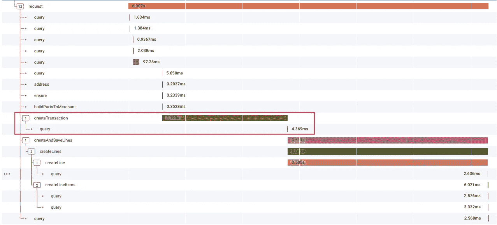
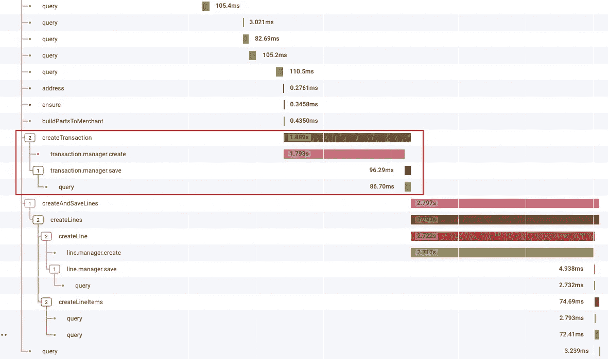
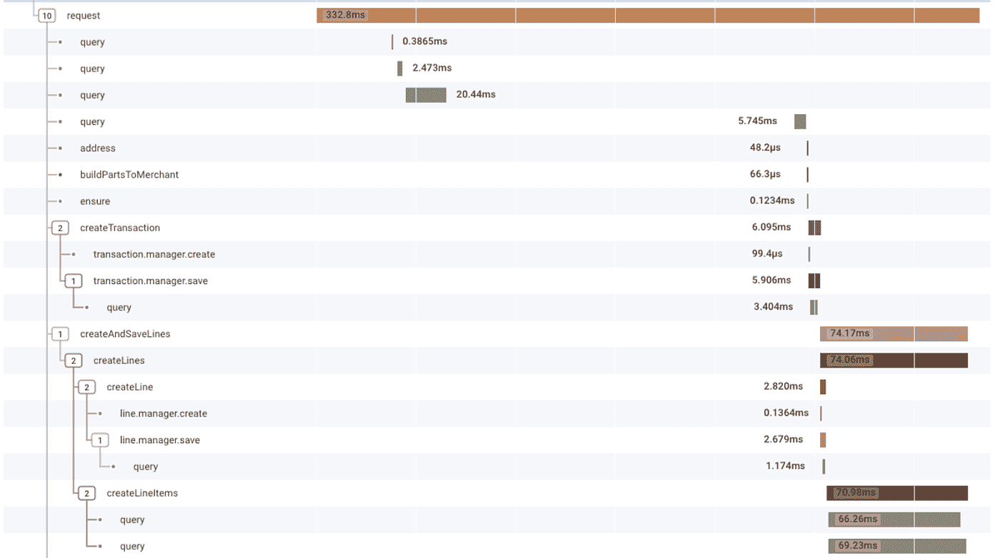
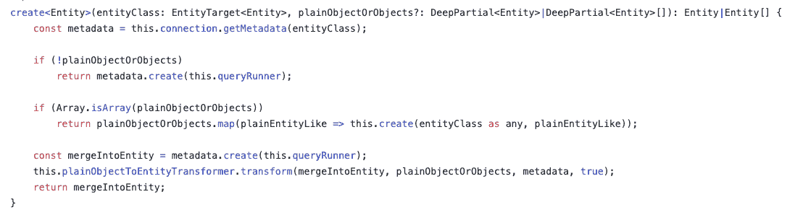
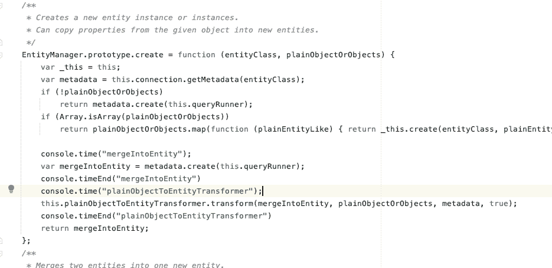
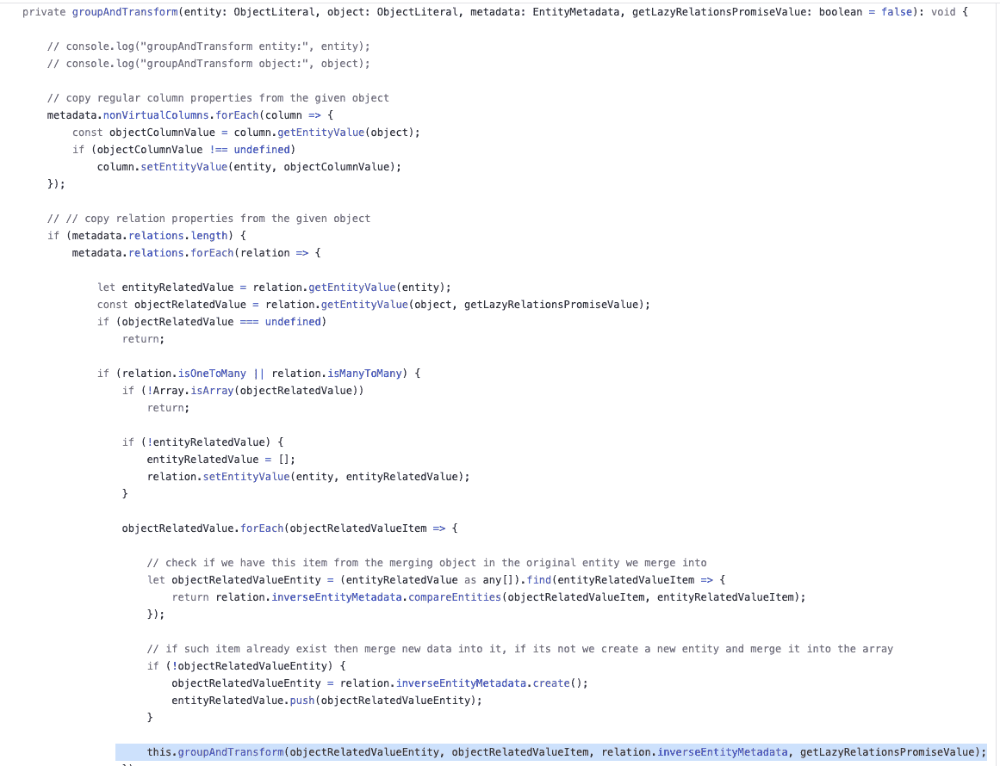

# 两条线的改变将 6 秒的请求变成了 300 毫秒

> 原文：<https://itnext.io/two-lines-change-turned-a-6-sec-request-to-300ms-cf0f13c00a75?source=collection_archive---------1----------------------->

我们系统中一个奇怪的缓慢让我在 TypeOrm 的库代码中寻找宝藏。

对于底线和解决方案，向下滚动到 [**第 3 部分**](#10f7) 。

那是一个安静的下午，我正在做我自己的开发工作，这时我们的 CTO 闯进房间，喊道:“我们有一个大的演示，系统坏了！”
快速查看了一下我的账户，显示一切正常，所以和大多数开发者一样，我回答说“对我来说一切正常”。
但是当我查看主演示帐户(用于所有销售和 CS 演示)时，我发现它用了 6 秒钟(！！)来创造我们的基本实体。

# 背景

在我们的系统中，有 3 个主要的实体:
**卖方** -这个实体代表账户
**买方** -从卖方
**交易**购买的用户-买方和卖方
之间的一个订单，我们花了 6 秒钟创建的实体是“交易”。

填充了所有关系的基本交易示例:

就是这样；我们准备开始了！

# **第 1 部分—调查慢度**

那么，为什么其他帐户都很好，而模拟帐户却很慢呢？我的第一个直觉是，这与这个帐户比其他帐户拥有更多数据的事实有关。

**第一步:检查模拟账户中的数据**
在模拟账户下我发现我们有 4000+的交易，和 800+的买家。虽然这比其他帐户多，但不足以导致这种缓慢。

**第二步:添加指标(感谢** [**蜂巢**](https://www.honeycomb.io/) **！！)**

请求耗时 6.3 秒

从指标中我们可以看到，创建事务(及其相关实体，如行)是瓶颈，但是实际插入的查询似乎非常快。

**步骤 3:查看“createTransaction”内部**

创建事务方法有两个部分，初始化实例并将其保存到数据库:

我的猜测是，问题出在创建事务的“保存”部分，这是异步部分，也是我们调用数据库的地方。“ [create](https://typeorm.io/#/entity-manager-api) ()”部分是一个简单的实例初始化，与 new Transaction()相同；

为了证实这一点，我在两个部分都添加了指标:

这不可能是对的。一个简单的对象初始化怎么可能需要 2 秒钟？
这里很可能隐藏着另一个问题；也许度量库在异步方面有一些缺陷？

我可以很容易地通过手动初始化来反驳这一点，但老实说，我对这个解决方案没有信心。

**步骤 4:更改实例初始化以确保**

变化之前

变化之后

现在来看一下指标:

300 毫秒

什么？为什么？怎么会？6 秒变成了 300 毫秒。

在 TypeOrm create()方法中一定有隐藏的逻辑，但是为什么这个问题只出现在一个帐户中？所有实例的初始化行为应该相同。

我唯一能确定的是，来自 TypeOrm 库的 create()并不像他们的文档中描述的那样是一个简单的“新实例()”

来自 https://typeorm.io/#/entity-manager-api[的文件](https://typeorm.io/#/entity-manager-api)

# **第二部分-调试类型代码**

我的下一步是看看 typeOrm create 方法中的内容:

[https://github . com/type ORM/type ORM/blob/beea 2e 1 e 4429d 13d 7864 ebc 23 aa 6 e 58 fa 01647 ea/src/entity-manager/entitymanager . ts # L239](https://github.com/typeorm/typeorm/blob/beea2e1e4429d13d7864ebc23aa6e58fa01647ea/src/entity-manager/EntityManager.ts#L239)

此时，我开始在 Js TypeOrm 代码中添加指标(当连接到模拟帐户数据库时，我在本地调试它)

这是添加了我的“time()”的 JS TypeOrm 代码

Time()度量显示问题出在转换部分。我们来看一下(transform()方法刚刚调用了 groupAndTransform()):

[https://github . com/type ORM/type ORM/blob/beea 2 E1 e 4429d 13d 7864 ebc 23 aa 6 e 58 fa 01647 ea/src/query-builder/transformer/plainobjecttonetitytransformer . ts # L14](https://github.com/typeorm/typeorm/blob/beea2e1e4429d13d7864ebc23aa6e58fa01647ea/src/query-builder/transformer/PlainObjectToNewEntityTransformer.ts#L14)

这是怎么回事？
突出显示的行是一个递归调用:对于事务中的每个关系字段，该方法都被调用，但是对于该关系的每个关系字段…

让我们以发送给 create()的事务为例，打印我们在 transform 方法中得到的所有对象。

我们得到这个:
交易//我们发送的要创建的交易实体
卖方-S1//卖方与交易的关系
买方-B1//买方 1 与卖方 1 的关系
买方-B2//买方 2 与卖方 1 的关系
买方-B3//买方 3 与卖方 1 的关系
买方-B1//买方 1 与交易的关系

好的，我有所进展…在模拟账户案例中，我们有 800 个买家，所以它被称为 800+次。
第一个用于交易，第二个用于卖方关系，一个用于该卖方的每个买方关系(800+)。

这也是为什么我们只看到这个帐户的缓慢，其他帐户只有少数买家连接到他们。

# **第 3 部分:解决方案**

该问题是由于 TypeOrm 在 create()方法中转换关系实例的方式造成的。以下是如何解决/避免这种情况的一些选项:

在进行任何修复之前，我对 create()的调用如下所示:

1.  使用 New()初始化——你总是可以使用简单的 new Instance()并自己初始化字段，就像我在第 4 步中做的那样，这样你就可以完全避免调用 create()。

2.仅发送 id-如果仍想使用 create()，请确保不要在创建字段中发送完整的关系实例，仅发送 id。(该字段是您真正需要的唯一内容，因为这是表中的真正引用)。

3.记住只从数据库中获取您需要的关系。在我的例子中，我们不需要所有 800+的买家在内存中找到卖家。TypeOrm 使得获取你不需要的字段变得非常容易，因为你已经在实体上有了它们。

结束了！