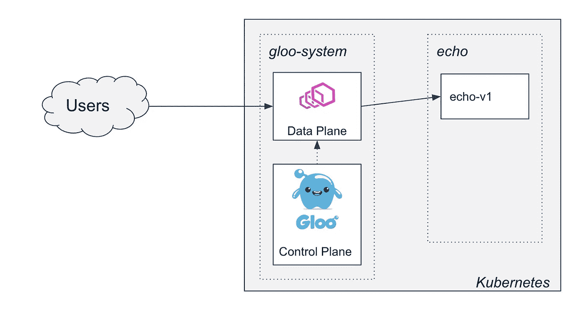
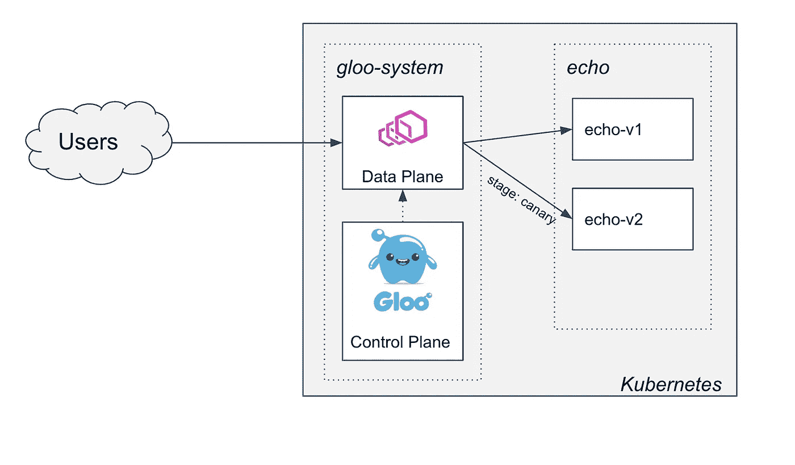
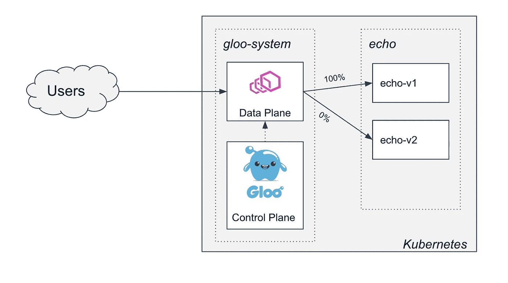
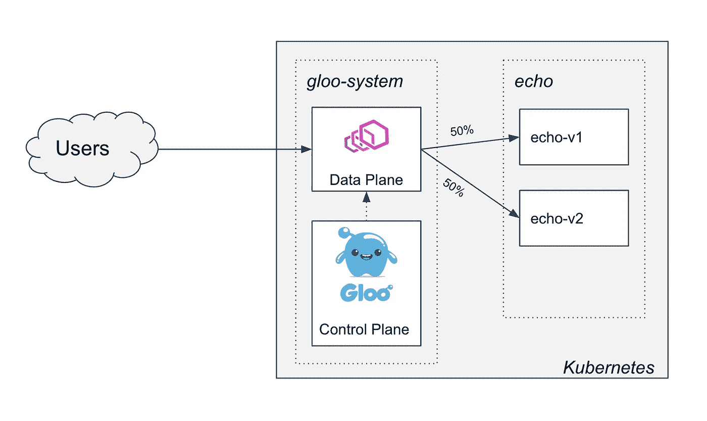
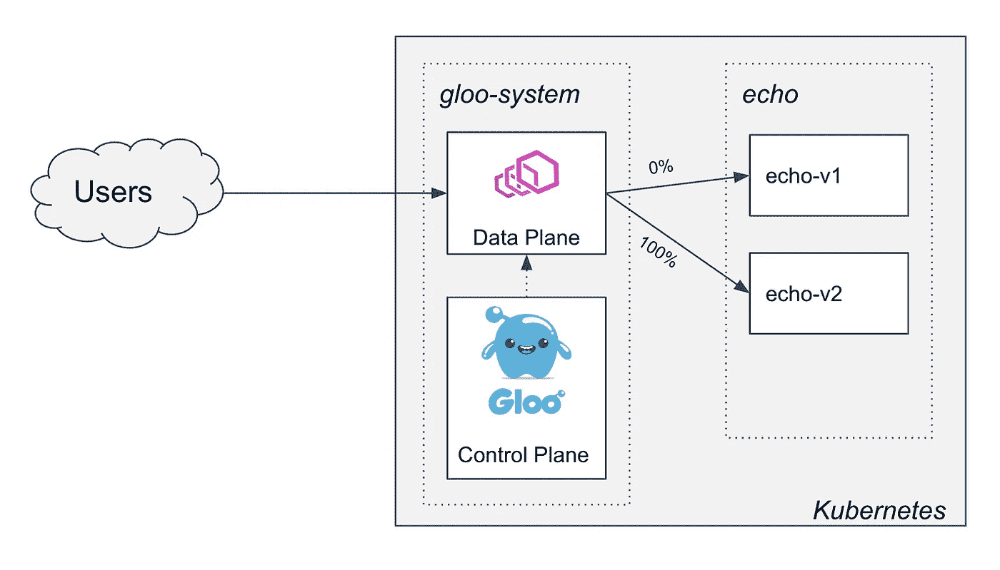

# Gloo 的两阶段金丝雀展示，第 1 部分

> 原文：<https://itnext.io/two-phased-canary-rollout-with-gloo-part-1-ec5b267cdc9e?source=collection_archive---------5----------------------->

在 [Solo](https://www.solo.io/) 的每一天，我们都在与平台所有者、架构师和工程师交谈，他们使用 [Gloo](https://www.solo.io/products/gloo/) 作为 API 网关，向最终用户展示他们的应用。这些应用可能跨越传统的 monoliths、微服务、托管云服务和 Kubernetes 集群。幸运的是， **Gloo 可以轻松设置路由来管理、保护和观察应用流量，同时支持灵活的部署架构，以满足客户不断变化的生产需求**。

除了初始设置之外，平台所有者经常要求我们帮助设计他们组织内的运营工作流:我们如何将新的应用程序上线？我们如何升级应用程序？我们如何在平台、运营和开发团队之间划分职责？

在本文中，**我们将使用 Gloo 为应用升级设计一个两阶段 canary 部署工作流**:

*   在第一阶段，我们将通过将一小部分流量转移到新版本来进行金丝雀测试。这允许您安全地执行冒烟和正确性测试。
*   在第二阶段，我们将逐步将流量转移到新版本，允许我们在负载下监控新版本，并最终淘汰旧版本。

为了简单起见，我们将专注于使用 [Gloo](https://github.com/solo-io/gloo) 设计工作流，并将网关和应用程序部署到 Kubernetes。最后，我们将讨论一些扩展和高级主题，这些主题在后续的讨论中可能会很有意思。

# 初始设置

首先，我们需要一个 Kubernetes 集群。这个例子没有利用任何特定于云的特性，可以在本地测试集群上运行，比如 [minikube](https://kubernetes.io/docs/tasks/tools/install-minikube/) 。这篇文章假设读者对 Kubernetes 以及如何使用`kubectl`与它交互有一个基本的了解。

我们将最新的 [Gloo Enterprise](https://github.com/solo-io/gloo) 安装到`gloo-system`名称空间，并将示例应用程序的版本`v1`部署到`echo`名称空间。我们将通过在 Gloo 中创建一条路线，在集群外部公开该应用程序，最终得到如下图片:



# 部署 Gloo

我们将使用`glooctl`命令行工具安装 gloo，我们可以下载该工具，并使用以下命令将其添加到`PATH`:

```
curl -sL [https://run.solo.io/gloo/install](https://run.solo.io/gloo/install) | sh
export PATH=$HOME/.gloo/bin:$PATH
```

现在，您应该能够运行`glooctl version`来查看它是否被正确安装:

```
➜ glooctl version
Client: {"version":"1.3.17"}
Server: version undefined, could not find any version of gloo running
```

现在，我们可以用一个简单的命令将网关安装到集群中:

```
glooctl install gateway enterprise --license-key=$LICENSE_KEY
```

控制台应指示安装成功完成:

```
Creating namespace gloo-system... Done.
Starting Gloo installation...Gloo was successfully installed!
```

不久，我们可以看到所有 Gloo pods 在`gloo-system`名称空间中运行:

```
➜ kubectl get pod -n gloo-system
NAME                             READY   STATUS    RESTARTS   AGE
discovery-58f8856bd7-4fftg       1/1     Running   0          13s
gateway-66f86bc8b4-n5crc         1/1     Running   0          13s
gateway-proxy-5ff99b8679-tbp65   1/1     Running   0          13s
gloo-66b8dc8868-z5c6r            1/1     Running   0          13s
```

# 部署应用程序

我们的`echo`应用程序是一个简单的容器(感谢我们在 HashiCorp 的朋友),它将响应应用程序版本，在我们开始测试并将流量转移到应用程序的`v2`版本时，帮助演示我们的 canary 工作流。

Kubernetes 在这个应用程序的建模方面给了我们很大的灵活性。我们将采用以下惯例:

*   我们将在部署名称中包含版本，这样我们可以并行运行应用程序的两个版本，并以不同的方式管理它们的生命周期。
*   我们将用一个应用标签(`app: echo`)和一个版本标签(`version: v1`)来标记 pod，以帮助我们的金丝雀展示。
*   我们将为应用程序部署一个 Kubernetes `Service`来建立网络。我们将使用 Gloo 配置来管理首次展示，而不是更新它或使用多个服务来管理到不同版本的路由。

下面是我们的`v1` echo 应用程序，包括名称空间、服务和 v1 部署定义:

```
apiVersion: v1
kind: Namespace
metadata:
  name: echo
---
apiVersion: apps/v1
kind: Deployment
metadata:
  name: echo-v1
  namespace: echo
spec:
  replicas: 1
  selector:
    matchLabels:
      app: echo
      version: v1
  template:
    metadata:
      labels:
        app: echo
        version: v1
    spec:
      containers:
        - image: hashicorp/http-echo
          args:
            - "-text=version:v1"
            - -listen=:8080
          imagePullPolicy: Always
          name: echo-v1
          ports:
            - containerPort: 8080
---
apiVersion: v1
kind: Service
metadata:
  name: echo
  namespace: echo
spec:
  ports:
    - port: 80
      targetPort: 8080
      protocol: TCP
  selector:
    app: echo
```

使用以下命令将该应用程序部署到您的集群中:

```
kubectl apply -f https://raw.githubusercontent.com/solo-io/gloo-ref-arch/blog-21-apr-20/two-phased-canary/part1/echo.yaml 
```

等待命名空间“echo”中的窗格准备就绪。使用`kubectl get pods -n echo`检查状态。

# 使用 Gloo 在群集外部公开

我们现在可以用 Gloo 在集群外部公开这个服务。首先，我们将应用程序建模为 Gloo [上游](https://docs.solo.io/gloo/latest/introduction/architecture/concepts/#upstreams)，这是 Gloo 对流量目的地的抽象:

```
apiVersion: gloo.solo.io/v1
kind: Upstream
metadata:
  name: echo
  namespace: gloo-system
spec:
  kube:
    selector:
      app: echo
    serviceName: echo
    serviceNamespace: echo
    servicePort: 8080
    subsetSpec:
      selectors:
        - keys:
            - version
```

使用以下命令将其应用到您的集群:

```
kubectl apply -f https://raw.githubusercontent.com/solo-io/gloo-ref-arch/blog-21-apr-20/two-phased-canary/part1/upstream.yaml
```

这里，我们基于`version`标签设置子集。我们不必在我们的路线中使用它，但是稍后我们将开始使用它来支持我们的 canary 工作流。

我们现在可以通过定义一个[虚拟服务](https://docs.solo.io/gloo/latest/introduction/architecture/concepts/#virtual-services)在 Gloo 中创建一个到这个上游的路由:

```
apiVersion: gateway.solo.io/v1
kind: VirtualService
metadata:
  name: echo
  namespace: gloo-system
spec:
  virtualHost:
    domains:
      # We'll allow any domain to avoid needing to set up DNS or provide a host header
      - '*'
    routes:
      - matchers:
          - prefix: /
        routeAction:
          single:
            upstream:
              name: echo
              namespace: gloo-system
```

使用以下命令将其应用到您的集群:

```
kubectl apply -f https://raw.githubusercontent.com/solo-io/gloo-ref-arch/blog-21-apr-20/two-phased-canary/part1/vs-1.yaml
```

一旦我们应用了这两个资源，我们就可以开始通过 Gloo:

```
➜ curl $(glooctl proxy url)/
version:v1
```

我们的设置已经完成，我们的集群现在如下所示:


# 两阶段推广战略

现在我们有了一个新版本的 echo 应用程序`v2`,我们希望推出它。我们知道，当
展示完成时，我们会以这张图片结束:


然而，为了达到这个目标，我们可能需要执行几轮测试，以确保新版本的应用程序满足某些正确性和/或性能验收标准。在这篇文章中，我们将介绍一个两阶段的方法来使用 Gloo 进行金丝雀展示，这可以用来满足绝大多数验收测试。

在第一阶段，我们将通过将一小部分流量路由到新版本的应用程序来执行冒烟和正确性测试。在这个演示中，我们将使用一个 header `stage: canary`来触发到新服务的路由，尽管实际上可能希望根据请求的另一部分来做出这个决定，比如一个经过验证的 JWT 中的声明。

在第二阶段，我们已经建立了正确性，所以我们准备将所有的流量转移到应用程序的新版本。我们将配置加权目的地，并在监控某些业务指标的同时转移流量，以确保服务质量保持在可接受的水平。一旦 100%的流量转移到新版本，旧版本就可以退役。

实际上，可能希望只使用其中一个阶段进行测试，在这种情况下，可以跳过另一个阶段。

# 阶段 1:v2 的初始 canary 部署

在这个阶段，我们将部署`v2`，然后使用报头`stage: canary`开始将少量特定流量路由到新版本。我们将使用这个标题来执行一些基本的冒烟测试，并确保`v2`按照我们预期的方式工作:



# 设置子集路由

在部署我们的`v2`服务之前，我们将使用一个名为[子集路由](https://docs.solo.io/gloo/latest/guides/traffic_management/destination_types/subsets/)的 Gloo 特性，更新我们的虚拟服务，以便只路由到具有子集标签`version: v1`的 pod。

```
apiVersion: gateway.solo.io/v1
kind: VirtualService
metadata:
  name: echo
  namespace: gloo-system
spec:
  virtualHost:
    domains:
      - '*'
    routes:
      - matchers:
          - prefix: /
        routeAction:
          single:
            upstream:
              name: echo
              namespace: gloo-system
            subset:
              values:
                version: v1
```

使用以下命令将其应用到您的集群:

```
kubectl apply -f https://raw.githubusercontent.com/solo-io/gloo-ref-arch/blog-21-apr-20/two-phased-canary/part1/vs-2.yaml
```

应用程序应该像以前一样继续运行:

```
➜ curl $(glooctl proxy url)/
version:v1
```

# 部署 echo v2

现在我们可以安全地部署 echo 应用程序的`v2`:

```
apiVersion: apps/v1
kind: Deployment
metadata:
  name: echo-v2
  namespace: echo
spec:
  replicas: 1
  selector:
    matchLabels:
      app: echo
      version: v2
  template:
    metadata:
      labels:
        app: echo
        version: v2
    spec:
      containers:
        - image: hashicorp/http-echo
          args:
            - "-text=version:v2"
            - -listen=:8080
          imagePullPolicy: Always
          name: echo-v2
          ports:
            - containerPort: 8080
```

使用以下命令将其应用到您的集群:

```
kubectl apply -f https://raw.githubusercontent.com/solo-io/gloo-ref-arch/blog-21-apr-20/two-phased-canary/part1/echo-v2.yaml
```

由于我们的网关被配置为专门路由到`v1`子集，这应该没有影响。然而，如果为路由配置了`v2`子集，它确实使`v2`能够从网关路由。

继续前进之前，确保`v2`正在运行:

```
➜ kubectl get pod -n echo
NAME                       READY   STATUS    RESTARTS   AGE
echo-v1-66dbfffb79-2qw86   1/1     Running   0          5m25s
echo-v2-86584fbbdb-slp44   1/1     Running   0          93s
```

应用程序应该像以前一样继续运行:

```
➜ curl $(glooctl proxy url)/
version:v1
```

# 为 canary 测试添加到 v2 的路由

当请求中提供了`stage: canary`头时，我们将路由到`v2`子集。如果没有提供头，我们将像以前一样继续路由到`v1`子集。

```
apiVersion: gateway.solo.io/v1
kind: VirtualService
metadata:
  name: echo
  namespace: gloo-system
spec:
  virtualHost:
    domains:
      - '*'
    routes:
      - matchers:
          - headers:
              - name: stage
                value: canary
            prefix: /
        routeAction:
          single:
            upstream:
              name: echo
              namespace: gloo-system
            subset:
              values:
                version: v2
      - matchers:
          - prefix: /
        routeAction:
          single:
            upstream:
              name: echo
              namespace: gloo-system
            subset:
              values:
                version: v1
```

使用以下命令将其应用到您的集群:

```
kubectl apply -f https://raw.githubusercontent.com/solo-io/gloo-ref-arch/blog-21-apr-20/two-phased-canary/part1/vs-3.yaml
```

# 金丝雀测试

现在我们有了这条路线，我们可以做一些测试。首先，让我们确保现有路由按预期工作:

```
➜ curl $(glooctl proxy url)/
version:v1
```

现在我们可以开始金丝雀测试我们的新应用程序版本:

```
➜ curl $(glooctl proxy url)/ -H "stage: canary"
version:v2
```

# 子集路由的高级用例

我们可能会认为这种使用用户提供的请求头的方法过于开放。相反，我们可能希望将金丝雀测试限制在已知的授权用户范围内。

我们看到的一个常见实现是，金丝雀路线需要一个有效的 JWT，其中包含一个特定的声明，以表明受试者已被授权进行金丝雀测试。Enterprise Gloo 为验证 JWT、基于 JWT 声明更新请求头以及基于更新的头重新计算路由目的地提供了现成的支持。我们将在以后的文章中讨论金丝雀测试中更高级的用例。

# 第 2 阶段:将所有流量转移到 v2 并停用 v1

此时，我们已经部署了`v2`，并为金丝雀测试创建了一条路线。如果我们对测试结果满意，我们可以进入阶段 2，开始将负载从`v1`转移到`v2`。我们将使用 Gloo 中的[加权目的地](https://docs.solo.io/gloo/latest/guides/traffic_management/destination_types/multi_destination/)来管理迁移期间的负载。

# 设置加权目的地

我们可以将 Gloo 路由更改为通往这两个目的地的路由，并使用权重来决定有多少流量应该流向`v1`和`v2`子集。首先，我们将对其进行设置，以便 100%的流量继续被路由到`v1`子集，除非像以前一样提供了`stage: canary`报头。

```
apiVersion: gateway.solo.io/v1
kind: VirtualService
metadata:
  name: echo
  namespace: gloo-system
spec:
  virtualHost:
    domains:
      - '*'
    routes:
      - matchers:
          - headers:
              - name: stage
                value: canary
            prefix: /
        routeAction:
          single:
            upstream:
              name: echo
              namespace: gloo-system
            subset:
              values:
                version: v2
      - matchers:
          - prefix: /
        routeAction:
          multi:
            destinations:
              - destination:
                  upstream:
                    name: echo
                    namespace: gloo-system
                  subset:
                    values:
                      version: v1
                weight: 100
              - destination:
                  upstream:
                    name: echo
                    namespace: gloo-system
                  subset:
                    values:
                      version: v2
                weight: 0
```

使用以下命令将其应用到您的集群:

```
kubectl apply -f https://raw.githubusercontent.com/solo-io/gloo-ref-arch/blog-21-apr-20/two-phased-canary/part1/vs-4.yaml
```

现在，对于任何没有`stage: canary`头的请求，集群看起来像这样:



使用初始权重，我们应该看到网关继续为所有流量提供`v1`服务。

```
➜ curl $(glooctl proxy url)/
version:v1
```

# 开始展示

为了模拟负载测试，让我们将一半的流量转移到`v2`:



这可以通过调整权重在我们的虚拟服务中体现出来:

```
apiVersion: gateway.solo.io/v1
kind: VirtualService
metadata:
  name: echo
  namespace: gloo-system
spec:
  virtualHost:
    domains:
      - '*'
    routes:
      - matchers:
          - headers:
              - name: stage
                value: canary
            prefix: /
        routeAction:
          single:
            upstream:
              name: echo
              namespace: gloo-system
            subset:
              values:
                version: v2
      - matchers:
          - prefix: /
        routeAction:
          multi:
            destinations:
              - destination:
                  upstream:
                    name: echo
                    namespace: gloo-system
                  subset:
                    values:
                      version: v1
                weight: 50
              - destination:
                  upstream:
                    name: echo
                    namespace: gloo-system
                  subset:
                    values:
                      version: v2
                weight: 50
```

使用以下命令将其应用到您的集群:

```
kubectl apply -f https://raw.githubusercontent.com/solo-io/gloo-ref-arch/blog-21-apr-20/two-phased-canary/part1/vs-5.yaml
```

现在，当我们向网关发送流量时，我们应该看到一半的请求返回`version:v1`，另一半返回`version:v2`。

```
➜ curl $(glooctl proxy url)/
version:v1
➜ curl $(glooctl proxy url)/
version:v2
➜ curl $(glooctl proxy url)/
version:v1
```

实际上，在此过程中，您可能会监控一些性能和业务指标，以确保流量转移不会导致整体服务质量下降。我们甚至可以利用像 [Flagger](https://github.com/weaveworks/flagger) 这样的操作符来帮助自动化这个 Gloo 工作流。Gloo Enterprise 与您的 metrics 后端集成，并提供现成的、动态的、基于上游的仪表板，可用于监控部署的健康状况。我们将把这些话题留到以后关于 Gloo 的高级金丝雀测试用例的文章中。

# 完成展示

我们将继续调整权重，直到最终所有的流量都被路由到`v2`:



我们的虚拟服务将如下所示:

```
apiVersion: gateway.solo.io/v1
kind: VirtualService
metadata:
  name: echo
  namespace: gloo-system
spec:
  virtualHost:
    domains:
      - '*'
    routes:
      - matchers:
          - headers:
              - name: stage
                value: canary
            prefix: /
        routeAction:
          single:
            upstream:
              name: echo
              namespace: gloo-system
            subset:
              values:
                version: v2
      - matchers:
          - prefix: /
        routeAction:
          multi:
            destinations:
              - destination:
                  upstream:
                    name: echo
                    namespace: gloo-system
                  subset:
                    values:
                      version: v1
                weight: 0
              - destination:
                  upstream:
                    name: echo
                    namespace: gloo-system
                  subset:
                    values:
                      version: v2
                weight: 100
```

使用以下命令将其应用到您的集群:

```
kubectl apply -f https://raw.githubusercontent.com/solo-io/gloo-ref-arch/blog-21-apr-20/two-phased-canary/part1/vs-6.yaml
```

现在，当我们向网关发送流量时，我们应该看到所有的请求都返回`version:v2`。

```
➜ curl $(glooctl proxy url)/
version:v2
➜ curl $(glooctl proxy url)/
version:v2
➜ curl $(glooctl proxy url)/
version:v2
```

# 退役 v1

此时，我们已经部署了新版本的应用程序，使用子集路由进行了正确性测试，通过逐步将流量转移到新版本进行了负载和性能测试，并完成了部署。唯一剩下的任务是清理我们的`v1`资源。

首先，我们将清理我们的路线。我们将保留路线上指定的子集，以便为将来的升级做好准备。

```
apiVersion: gateway.solo.io/v1
kind: VirtualService
metadata:
  name: echo
  namespace: gloo-system
spec:
  virtualHost:
    domains:
      - '*'
    routes:
      - matchers:
          - prefix: /
        routeAction:
          single:
            upstream:
              name: echo
              namespace: gloo-system
            subset:
              values:
                version: v2
```

使用以下命令将其应用到您的集群:

```
kubectl apply -f https://raw.githubusercontent.com/solo-io/gloo-ref-arch/blog-21-apr-20/two-phased-canary/part1/vs-7.yaml
```

我们可以删除`v1`部署，它不再为任何流量提供服务。

```
kubectl delete -f https://raw.githubusercontent.com/solo-io/gloo-ref-arch/blog-21-apr-20/two-phased-canary/part1/echo-v1.yaml
```

现在我们的集群看起来像这样:


对网关的请求返回:

```
➜ curl $(glooctl proxy url)/
version:v2
```

我们现在已经使用 Gloo 完成了应用程序更新的两阶段 canary 部署！

# 其他高级主题

在这篇文章的过程中，我们收集了一些可以作为高级探索的良好起点的主题:

*   使用 JWT 过滤器来验证 jwt，将声明提取到头部，并根据声明值路由到 canary 版本。
*   查看由 Gloo 创建的 Prometheus metrics 和 Grafana 仪表板，以监控部署的健康状况。
*   通过集成 Flagger 和 Gloo 实现自动化部署

值得进一步探讨的几个其他主题:

*   通过给予团队对其上游和路线配置的所有权来支持自助升级
*   利用 Gloo 的委托功能和 Kubernetes RBAC 安全地分散配置管理
*   通过应用 GitOps 原则和使用 Flux 等工具将配置推送到集群，实现连续交付流程的完全自动化
*   通过用不同的部署模式设置 Gloo 来支持混合或非 Kubernetes 应用程序用例
*   在将生产流量转移到新版本之前，利用流量阴影开始用真实数据测试新版本

# 加入 Gloo 社区

除了企业客户群之外，Gloo 还有一个庞大且不断增长的开源用户社区。要了解更多关于 Gloo 的信息:

*   查看 [repo](https://github.com/solo-io/gloo) ，在这里您可以看到代码和文件问题
*   查看[文档](https://docs.solo.io/gloo/latest)，其中有大量的指南和例子
*   加入 [slack 频道](http://slack.solo.io/)，开始与 Solo 工程团队和用户社区聊天

如果你想与我联系(反馈总是被感激！)，你可以在 Slack 上找到我或者发邮件给我 [rick.ducott@solo.io](mailto:rick.ducott@solo.io) 。