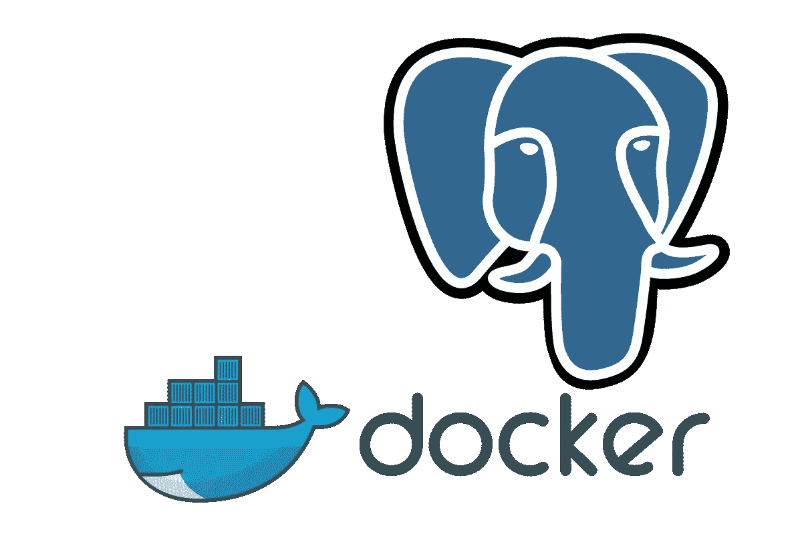
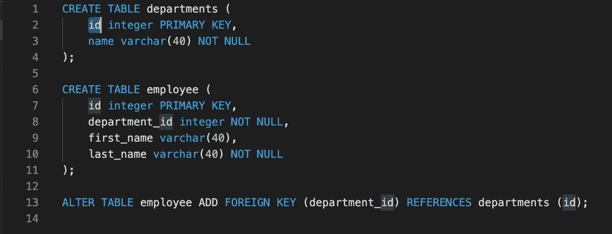
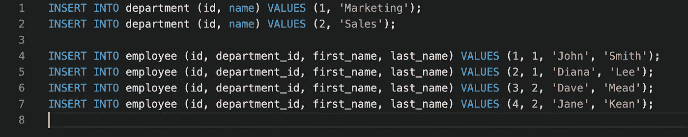
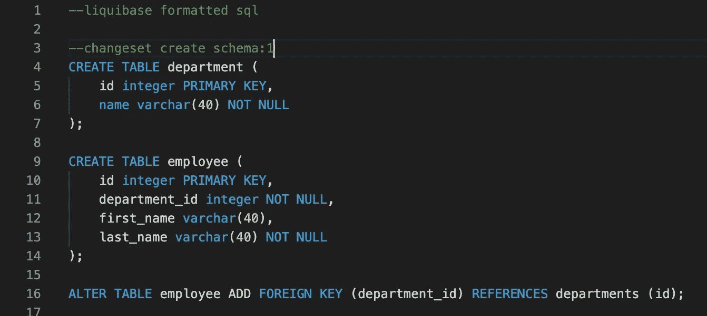
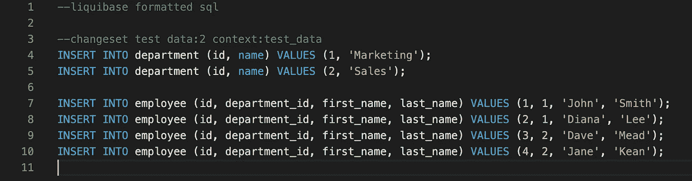
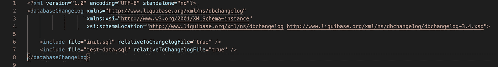

# 让您的数据库在各种环境中保持最新的两个经验证的技巧

> 原文：<https://itnext.io/two-proven-tricks-to-keep-your-database-up-to-date-across-the-environments-a9b82fc3017d?source=collection_archive---------0----------------------->

想象一下你在一家繁忙的 IT 公司开发软件系统。在很多情况下，这样的系统会在后端使用某种形式的数据库。

这意味着您可能会在开发、测试和后续生产使用中面临一个主要问题:如何在各种环境中保持数据库的统一和最新？

上面提到的另一个大问题是，如何为开发人员提供预先加载了一些测试数据的数据库的一次性副本。

如果你正在努力解决上述任何一个问题，那你就来对地方了。我解释了如何结合使用 Liquibase 和 Docker 这两个不太可能的工具来处理这两个问题。

[Liquibase](https://www.liquibase.org/) 允许您以特定的顺序将 DDL 和 DML 语句应用于数据库实例，并确保它们只应用一次。这意味着这些脚本的组合会将目标数据库带到特定的最终状态。如果同一套脚本已经应用于许多环境，它保证这些环境将是完全相同的。

Liquibase 还允许您有选择地将特定的上下文相关脚本应用于某些环境，而不将它们应用于其他环境。这将允许我们轻松地用测试数据预加载开发数据库。因此，开发人员和测试人员可以立即使用它，而不需要自己创建测试数据。

让我们用下面的简单例子来看看这种方法。

我们的测试数据库具有以下结构:

出于测试目的，我们还想将以下数据插入数据库:

为了将这两个脚本打包到 Liquibase 术语中称为变更集的文件中，您需要做的就是在每个文件中添加以下标题:

我们需要确保变更集名称和 id 的组合在整个项目中是唯一的。

在我们希望某些脚本只应用于特定场景的情况下，liquibase 使用所谓的上下文，本质上是标记变更集的另一个标识符，然后在我们调用 liquibase 在目标数据库中进行更改时用作参数。

为了使特定的变更集只适用于特定的上下文，我们必须修改头的第二行，在它的末尾添加`context: <context_id>`。

因此，在我们的示例中，我们修改了上面的文件，使它们看起来像这样:

本质上，将始终应用第一个脚本，因为它没有指定上下文。当在 liquibase 更新期间指定了`test_data`上下文时，将应用第二个脚本。

最后一步是创建引用上述变更集的 Liquibase changelog 文件。changelog 是一个 XML 文件，在我们的示例中，它将如下所示:

请注意，变更集将按照它们在变更日志文件中列出的顺序应用。

最后，还需要两个文件:`liquibase.properties`文件和 JDBC 驱动程序。假设我们想将它应用到 PostgreSQL 数据库，那么我们需要可以从这里下载的驱动程序:[https://jdbc.postgresql.org/.](https://jdbc.postgresql.org/.)

然后，我们需要创建包含以下内容的`liquibase.properties`文件:

这假设 postgres JDBC 驱动程序在同一个目录中。请记住，在使用 liquibase 应用更改之前，必须先创建数据库和用户。还要注意，属性文件中指定的默认上下文是`init`。然而，我们定义的唯一上下文是`test_data`。这是特意做的，所以在这种情况下，liquibase 将只应用那些在头文件中指定了`init`上下文或者根本没有指定上下文的变更集。

要应用 changelog，只需在命令提示符下运行以下命令:

`/<path_to_liquibase>/liquibase update`

现在让我们把它打包到码头集装箱里。我们将使用多阶段构建，这样我们可以从一组文件中创建两个不同的映像:一个为开发人员的数据库提供测试数据，另一个用作其他环境的数据库更新容器。

此设置的 docker 文件将有三个阶段:

第一阶段`deploy`将所有必要的文件复制到映像，然后在容器中运行`liquibase update`。用作该容器默认入口点的辅助脚本将使用环境变量来设置`liquibase.properties`文件，以指向正确的环境。

第二阶段`build`使用`deploy`创建的映像，启动数据库服务器，初始化数据库和用户，并将 liquibase 变更集应用于容器中的数据库。在这种情况下，它使用`test_data`上下文来预加载数据。然后使用 pg_dumpall 工具备份数据库并停止服务器。

第三阶段使用第二阶段的普通 postgres 映像和备份文件。然后，它再次启动服务器，并从备份中恢复数据。

> **重要的是，当在构建期间调用所有阶段时，在启用 DOCKER_BUILDKIT 的情况下，** `**docker build**` **命令正在运行！！否则，数据不会被恢复(无论什么原因)**

我们将使用上面的 Dockerfile 文件在这里构建两个映像:

*   我们可以用它将数据库更改应用到其他环境中
*   另一个是测试数据库，我们可以立即开始使用

为此，首先运行 docker 构建，在`deploy`阶段停止:

`docker build -t test-db-deployment --target deploy .`

然后使用所有三个阶段构建映像:

`docker build -t test-db .`

要将数据库更改应用到特定环境，请运行`test-db-deployment`映像。它需要设置三个环境变量:

**URL** —目标数据库 URL
**用户名**和**密码** —目标数据库凭证

请记住，这两个变量都没有默认值，因此，如果不设置它们，容器将会失败。

例如，您可以使用以下 docker 命令运行数据库更新(假设数据库主机是 db，数据库是 testdb:

`docker run --name database-update -e URL=jdbc:postgresql://db/testdb -e USERNAME=test -e PASSWORD=password test-db-deployment`

容器启动，运行 liquibase 更新并退出。您可以检查日志以确认更新成功。然后把容器拿走。

测试数据库可以直接启动，您只需遵循供应商的说明并提供必要的环境变量(如果需要的话)。例如，要运行 postgres，需要设置`POSTGRES_PASSWORD`变量来设置`postgres`用户的密码。

要启动测试数据库，请运行以下命令:

`docker run --name test-database -e POSTGRES_PASSWORD=password -d test-db-deployment`

# 下一步是什么？

上面的例子展示了一种使用一次性容器将数据库服务器置于特定状态的简便技术。它们可以使用 scheduler 手动启动，或者如果您使用 Kubernetes，则可以使用上面的图像来创建一个作业 pod，该作业 pod 将变更集应用到数据库服务器的特定实例。

这里的诀窍是知道在什么环境下使用什么图像？这可以使用各种工具来实现。例如，使用 GitHub 动作中的工作流工件或类似于 [artifactz.io](https://artifactz.io) 的工具。我们将在另一个时间讨论各种选择。

完整的源代码可以在 [GitHub 库](https://github.com/ikolomiyets/test-database)中找到。