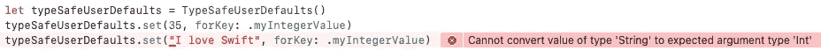

# 键入强制用户默认值

> 原文：<https://itnext.io/type-enforced-userdefaults-5535f3f7076a?source=collection_archive---------3----------------------->

在 iOS 上， [UserDefaults](https://developer.apple.com/documentation/foundation/userdefaults) 是一个由 iOS 存储和管理的持久性字典，在应用程序运行时仍然有效。它可以用来在应用程序的用户会话之间存储和检索不同数据类型的键值对。

在本文中，我们将介绍如何定义一个新的类和特定于类型的枚举，以确保每个键只能由特定的数据类型读取/写入。

由[蒙瑟蒙莫](https://unsplash.com/@monmo?utm_source=medium&utm_medium=referral)在 [Unsplash](https://unsplash.com?utm_source=medium&utm_medium=referral) 上拍摄的照片

# 问题定义

给定 UserDefaults 的一个键，您可以存储和检索任何类型。例如:

在上面的例子中，我们最初为键“MyValue”设置了一个整数类型的值，但是我们用一个字符串覆盖了这个值。如果读回的值预期是一个整数，我们可能得不到预期的结果:

UserDefaults 将为同一个键静默存储不同的类型。它还会自动返回给定键的最后存储类型和您试图检索的类型之间的转换值。

虽然这种灵活性可能很有用，但开发人员必须手动确保他们使用与每个键相关联的正确数据类型。下面是一个方法，通过它我们可以在编译时保证任何给定的键只能使用期望的类型来访问。

# 在 UserDefaults 中强制类型

让我们从创建一个新的类开始，它将管理对两种类型的 UserDefaults 的读/写操作:Integer 和 String。

到目前为止，没有什么可以阻止我们遇到与用户默认值相同的问题。我们可以很容易地为任何给定的键设置整数或字符串。让我们来解决这个问题:

成功！我们的 TypeSafeUserDefaults 现在阻止我们将一个字符串存储在一个预期用于存储整数的键中。更好的是，我们直接在 Xcode 中获得即时反馈，如果我们试图使用错误的类型，我们的项目将无法编译。

# 确保所有键都是唯一的

虽然 TypeSafeUserDefaults 防止存储错误类型的值，但是如果两个枚举定义相同的键，我们仍然会遇到相同的问题。考虑:

不幸的是，我还没有找到一种方法来获得编译时错误。幸运的是，Xcode 支持单元测试，所以我们可以通过使我们的 enum CaseIterable 和使用一些单元测试来确认我们的键是唯一的。让我们用重复的键生成一些枚举:

现在让我们实现一个单元测试来确认所有的键都是惟一的:

当单元测试运行时，我们现在将得到这个失败:

*xctassertflast 失败— StringKey myOtherValue 与已经定义的键*冲突

我希望这能为您节省数小时的故障排除时间。尽情享受吧！