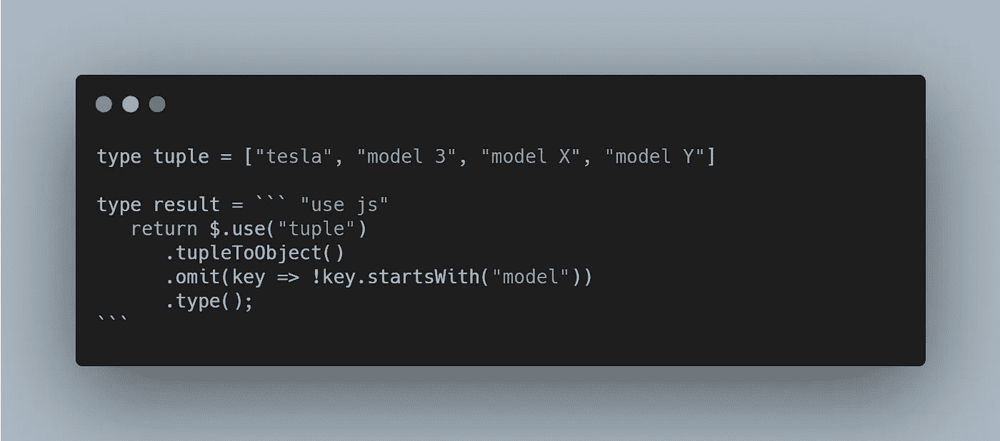
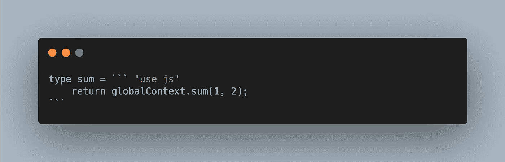
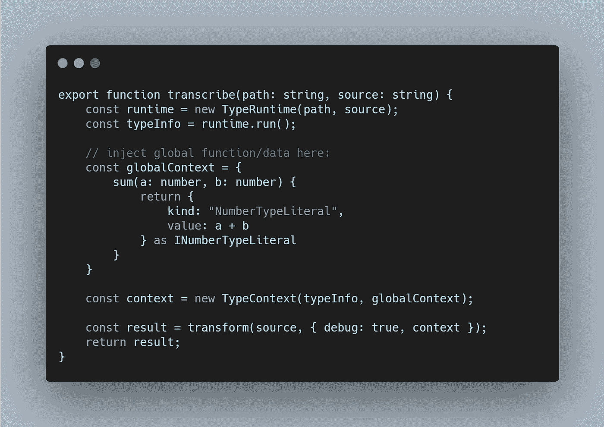
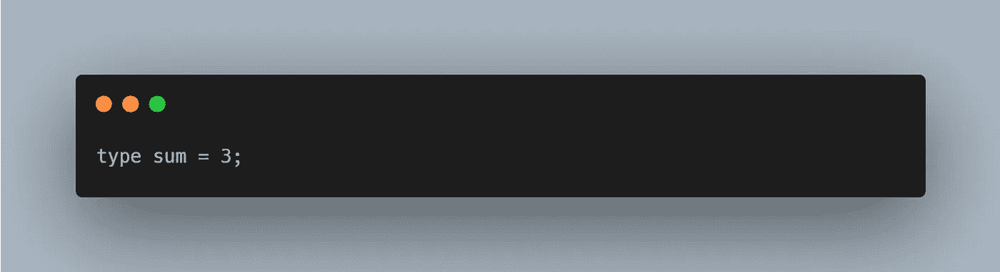
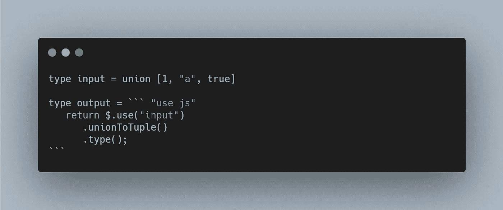
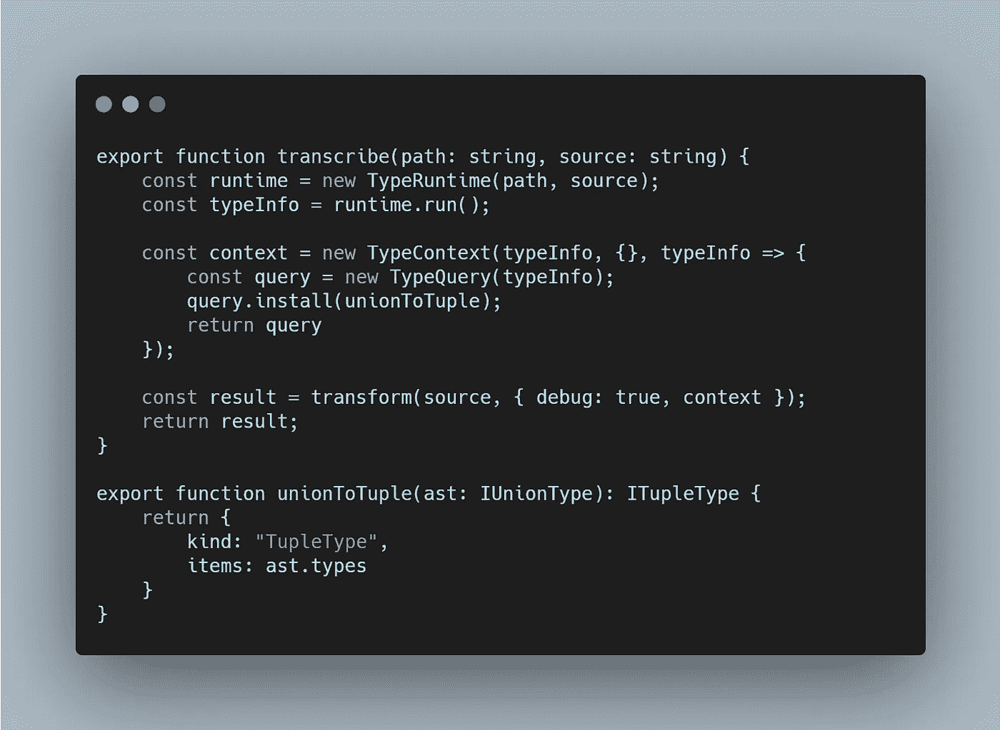
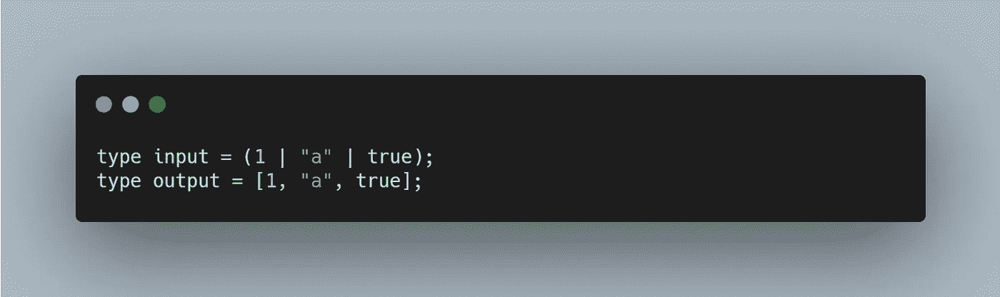
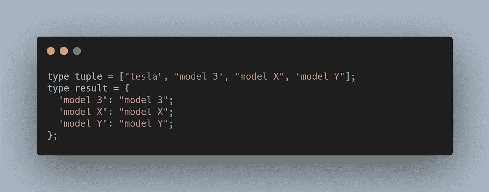
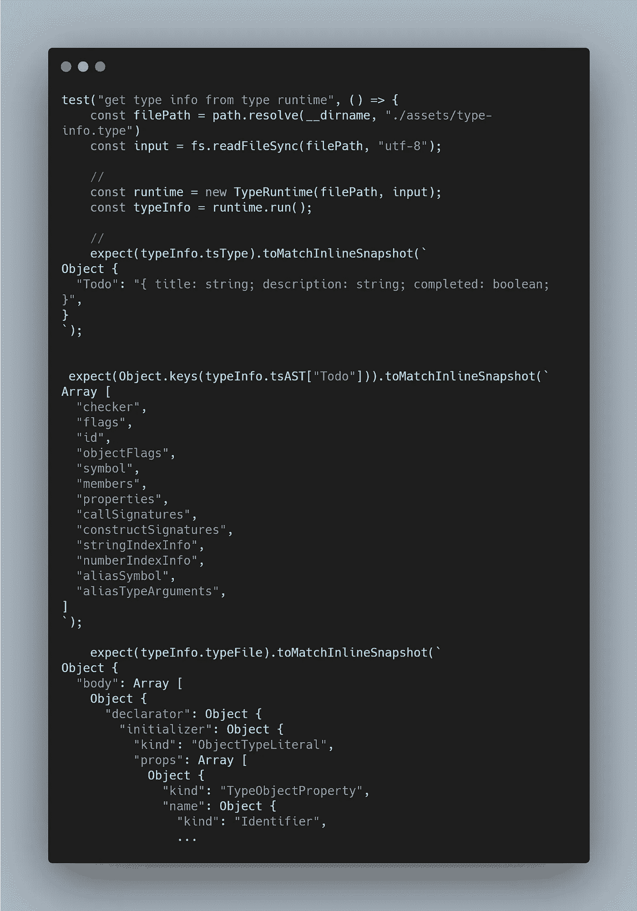

# 类型查询:jQuery 样式类型操作

> 原文：<https://itnext.io/type-query-jquery-style-type-manipulation-497ce26d93f?source=collection_archive---------0----------------------->

将元组转换为对象

在本文中，我们介绍了一种创建在 TypeScript 中使用的类型的新方法，它允许我们使用 JavaScript **inline** 轻松生成复杂类型。

我们使用的语言是 [TypeType](https://github.com/mistlog/typetype) ( [类型编程的艺术](/the-art-of-type-programming-cfd933bdfff7))。

# 介绍

在 TypeType v0.0.30 中，我们有了一个新的类型:ContextType，例如:

类型中的和

这里我们使用语法“` ` …` `”来插入 JavaScript 代码，并以这种方式实现 globalContext.sum:

类型上下文

“sum”接收 TypeType 中的值并返回 AST，结果是:

ts 中的总和

这个例子可以在[https://github . com/mistlog/type type-template/blob/main/src/type-context . ts](https://github.com/mistlog/typetype-template/blob/main/src/type-context.ts)中找到。

# 类型查询

一旦我们可以执行外部 JavaScript 代码，我们就可以实现 libs 来制作类似魔术的东西。

正如我们所知，很难[将 union 类型转换为 tuple 类型](https://stackoverflow.com/questions/55127004/how-to-transform-union-type-to-tuple-type)，但是，在 ContextType 中这是微不足道的:

typetype 中元组的联合

这里我们用“$。使用"访问类型变量" input "的 AST，并在 JavaScript 中将其转换为 TupleType:

类型查询扩展

我们使用“query.install”将这个扩展添加到 TypeQuery 对象，这是受 jQuery 的启发。

输出是:

ts 中元组的联合

顺序保持不变，实际上，你可以随意重新排序。

TypeQuery 伸缩性很好，您可以这样做:

并得到结果:

以上示例可见于:

*   [https://github . com/mistlog/type type-template/blob/main/src/type-query-extension . ts](https://github.com/mistlog/typetype-template/blob/main/src/type-query-extension.ts)
*   [https://github . com/mistlog/type type-template/blob/main/src/type-query-basic . ts](https://github.com/mistlog/typetype-template/blob/main/src/type-query-basic.ts)

# 类型测试

我们可以从类型运行时获得 AST 和 Type-in-string，因此我们可以使用简单的 jest 来测试类型:

ref:[https://github . com/mistlog/type type-template/blob/main/test/type-runtime . test . ts](https://github.com/mistlog/typetype-template/blob/main/test/type-runtime.test.ts)

# 履行

代码可以在这里找到:[https://github.com/mistlog/type-query](https://github.com/mistlog/type-query)

快速启动:[https://github.com/mistlog/typetype-template](https://github.com/mistlog/typetype-template)