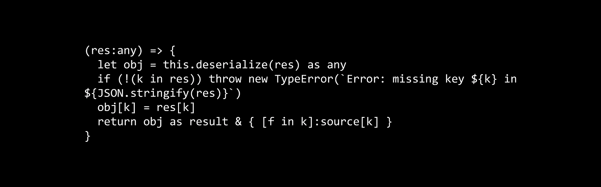

# TypeScript 中的类型安全客户端查询

> 原文：<https://itnext.io/type-safe-client-side-queries-in-typescript-3906eb14250e?source=collection_archive---------1----------------------->



用于客户端编程的静态类型语言(如 TypeScript)的引入极大地提高了大型客户端应用程序的创建质量，如在构建现代 SPA 时常见的。

这种安全性的提高只延伸到 API 调用的边界。远程调用的结果总是作为非结构化的 JSON 返回，或者在 TypeScript 中称为`any`。因此，反序列化是手动完成的，这是一个繁琐且容易出错的过程。此外，去序列化例程遭受各种形式的比特腐烂:随着底层模型的发展，它的验证可能变得过时，甚至更糟，稍微关闭。这会导致假阴性(数据是正确的，但是反序列化器认为有错误)，或者假阳性(错误的数据只是简单地将*转换为*正确的模型类型，对应用程序的其余部分造成严重破坏)。

*简而言之，委婉地说，客户端去个性化并不好玩。*

越来越多地采用丰富的协议，如 OData(或其最新的、时髦的 GraphQL 变体)，使得从客户端进行查询更加有效:客户端可以减少接收到的属性(`$select`)、行(`$filter`)，甚至通过请求连接的数据(`$expand`)来减少查询的总数。不幸的是，这使得接收到的数据解析起来更加复杂，给问题增加了一个动态的维度，这实际上是没有帮助的。

在本文中，我们将研究 TypeScript 的高级类型化机制，这些机制使得基于作为对象构造的查询数据的声明性描述来自动生成类型安全的反序列化程序成为可能。

# 高级类型

TypeScript 支持非常丰富的类型语言，允许在编译时创建类型。通过使用类似于 sum 和 product 的运算符，将两个(或更多)现有类型组合在一起，可以创建结果类型。这个过程是从其他数字创建数字的抽象的、类型级的等价过程(`5+3`实际上可以被看作是通过组合两个数字:`5`和`3`来创建一个数字`8`)。

使用`|`和`&`操作符可以从两个现有类型中创建一个新类型。`a & b`将用`a`的所有字段和`b`的所有字段创建一个类型。`a | b`将创建一个多态类型，包含`a`的字段或`b`的字段。因此，例如:

```
{ name:string, surname:string } & { age:number }
```

与类型相同:

```
{ name:string, surname:string, age:number }
```

鉴于:

```
type Car = { kind:"electric", num_batteries:number }
         | { kind:"petrol", engine_size:number }
```

将接受与两种形状完全匹配的值，因此永远不会容忍带有`num_batteries`的`petrol`汽车。

而且 TypeScript 还支持更多的特殊类型:`keyof t`是类型`t`的所有字段名的类型。因此:

```
keyof { kind:"petrol", engine_size:number }
```

将会是:

```
"kind" | "engine_size"
```

TypeScript 支持的最后一个特殊类型是`t[k]`，前提是`k extends keyof t`。`t[k]`是类型`t`中字段`k`的类型。例如:

```
{ id:number, name:string, surname:string, age:number }["age"]
```

简单来说就是`string`。

在 TypeScript 中还有其他相关的类型和类型操作符，但是出于本文的目的，我们并不需要它们全部。

# 查询界面

通过使用这些高级类型，我们可以构建一个简单的查询定义接口。由于本文范围有限，我们将只支持一种查询定义语言，这种语言只允许我们指定从给定数据源中需要哪些字段，以及一些基本的过滤。引用和连接的管理也可以作为一个相对简单的扩展添加到我们在本文中设置的基础上，但是我们在这里不会看到它。

查询类在两种类型上是通用的:数据源的类型，以及我们期望从运行查询中得到的数据的类型。查询定义还将包含一个`deserialize`函数，该函数将一个非结构化的`any`转换成一个`result`:

```
export class Query<result,source> {
  deserialize : (res:any) => result ... constructor(deserialize : (res:any) => result) {
    this.deserialize = deserialize
  }
}
```

任何查询的起点都可以方便地封装在一个 helper 函数中，该函数假设我们查询的任何实体至少都有一个`id`字段:

```
export let entity_query = <t extends { id:number }>() =>
  new Query<{ id:t["id"] }, t>(
    res => "id" in res && typeof res["id"] === "number" ?
        ({ id:res["id"] as number })
      : fail(`Error: expected id in ${JSON.stringify(res)}`)
  )
```

注意，`entity_query`需要一个通用参数`t`，它应该从`{ id:number }`扩展而来(这意味着`t`必须有一个类型为`number`的字段`id`，而不是说`t`必须显式继承扩展类型)。生成的查询将产生类型为`{ id:t[“id”] }`的结果。在这种情况下，反序列化将简单地检查接收到的 blob 是否具有类型为`number`的预期字段`id`。如果是这种情况，那么我们就可以生成所需的对象，否则我们肯定会因异常而失败(或者类型安全的替代方法，如`Option`)。

让我们给我们的`Query`类添加一些方法。因为我们希望我们的查询支持从远程数据源查找字段，所以我们可以添加一个`with_field`方法。该方法将接受字段作为通用参数，该参数必须是任何一个`source`类型的键:查找一个不在源中的字段是没有意义的！

```
readonly with_field = <k extends keyof source>(k:k) : ...
```

`with_field`将返回一个与原始查询结果完全相同的新查询，包括出现在`source`中的字段`k`。当然，创建的查询仍然基于原始的`source`。它的类型是这样的:

```
Query<result & { [f in k]:source[k] }, source>
```

类型`result & { [f in k]:source[k] }`包括我们在`result`中找到的所有字段，加上一个新字段`[f in k]`，其类型为`source`中`k`的`source[k]`。

新查询中的反序列化基于先前查询的反序列化，然后将新字段`k`添加到反序列化的结果中:

```
(res:any) => {
  let obj = this.deserialize(res) as any
  if (!(k in res)) throw new TypeError(`Error: missing key ${k} in ${JSON.stringify(res)}`)
  obj[k] = res[k]
  return obj as result & { [f in k]:source[k] }
}
```

由于这种方法，我们现在可以创建只包含给定类型的所需字段的查询:

```
interface Person { 
  id:number, 
  name:string, 
  surname:string, 
  nationality:string,
  age:number }
let name_age_query = entity_query<Person>()
  .with_field("name")
  .with_field("age")let res = name_age_query.deserialize({ "id":1, "name":"John", "age":23 })
```

反序列化的结果将采用以下类型:

```
let res: {
    id: number;
} & {
    name: string;
} & {
    age: number;
}
```

这意味着尝试类似于`res.surname`的事情将导致编译器错误，而不是在运行时的某个地方被捕获。此外，如果我们试图创建一个包含一个不存在的字段的查询，例如通过将`.with_field(“favorite_food”)`添加到我们的查询中，我们也会马上得到一个编译器错误，因为`favorite_food`不是`Person`的有效字段。这有可能大大减少与序列化相关的错误！

我们可以扩展我们的查询系统来支持比较查询。例如，我们可以包含一个类型安全的筛选方法，该方法指定我们要基于属性和给定值的相等性进行筛选，从而验证该值总是与它所比较的属性具有相同的类型:

```
readonly filter_eq = <k extends keyof result>(k:k, v:result[k]) : Query<result, source> => {
  return new Query(this.deserialize)
}
```

注意，这里唯一真正的约束是`k`必须是`result`的有效属性，并且比较值`v`必须具有相同类型的属性。例如，现在我们可以写:

```
let q = entity_query<Person>()
  .with_field("name")
  .with_field("age")
  .filter_eq("name", "Johnny")
```

尝试`.filter_eq(“name”, 3)`或`.filter_eq(“City”, “Rotterdam”)`都会产生编译器错误:`3`与`string`不兼容，而`City`不是`Person`的字段。同样，这将确保我们的查询是格式良好的，甚至不需要运行代码。

# 扩展ˌ扩张

到目前为止，我们看到的代码相对简单，只涉及查询的规范和基于查询的反序列化函数的生成。可以进一步扩展这个框架，以包含更复杂的查询操作，如排序、分页，但更重要的是关系查找(尤其是*一对多*)。此外，我们甚至可以将这个框架向前推进一步，从查询规范中生成查询本身(无论是 OData、GraphQL 还是其他什么)。这可能会成为这篇文章的有趣续篇:)

# 嘶！

你是一个雄心勃勃的开发者吗？你喜欢这篇文章吗？您是否正在寻找一家其他软件工程师在高水平上工作的公司，通过应用函数式编程和类型理论概念来构建美观可靠的在线软件？那就别再找了:在令人敬畏的鹿特丹市，我们有多个空缺职位！我们接受各个层次的候选人:从老兵到渴望学习的年轻人。

# 代码转储—供参考

```
export class Query<result,source> {
  deserialize : (res:any) => result
  readonly with_field = <k extends keyof source>(k:k) : Query<result & { [f in k]:source[k] }, source> => {
    return new Query(
      (res:any) => {
        let obj = this.deserialize(res) as any
        if (!(k in res)) throw new TypeError(`Error: missing key ${k} in ${JSON.stringify(res)}`)
        obj[k] = res[k]
        return obj as result & { [f in k]:source[k] }
      }
    )
  }
  readonly filter_eq = <k extends keyof result>(k:k, v:result[k]) : Query<result, source> => {
    return new Query(this.deserialize)
  }
  readonly cast = <t1>() : Query<result, source | t1> => {
    return new Query(this.deserialize)
  }
  constructor(deserialize : (res:any) => result) {
    this.deserialize = deserialize
  }
}
export let entity_query = <t extends { id:number }>() =>
  new Query<{ id:t["id"] }, t>(
    res => "id" in res && typeof res["id"] === "number" ?
        ({ id:res["id"] as number })
      : fail(`Error: expected id in ${JSON.stringify(res)}`)
  )interface Person { id:number, name:string, surname:string, age:number }
let q = entity_query<Person>()
  .with_field("name")
  .with_field("age")
  .filter_eq("name", "Johnny")let res = q.deserialize({ "id":1, "name":"John", "age":23 })
```