# 不带类型脚本的 Vuex 类型

> 原文：<https://itnext.io/type-vuex-without-typescript-4f183b83a907?source=collection_archive---------0----------------------->

> 这是没有 TypeScript 的 [Type Vue 的续篇，如果你还没有读过，我建议你先读一下。](https://medium.com/@znck/type-vue-without-typescript-b2b49210f0b)

## Vuex 确实支持类型！

Vue 的官方状态管理库支持 TypeScript。它提供了`MutationTree`和`ActionTree`类型的帮助器，以在突变和动作中获得自动完成和智能感知。

用**类型脚本**编写的 Vuex 存储实现

我们也可以用 JSDoc `@type`注释在 JavaScript 中获取类型。

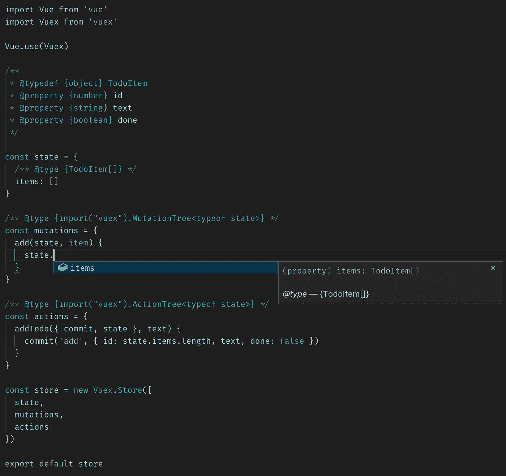

用 **JavaScript** 编写的 Vuex 商店实现

如果我们使用 options 语法来创建一个商店，大多数样板注释都是不必要的。

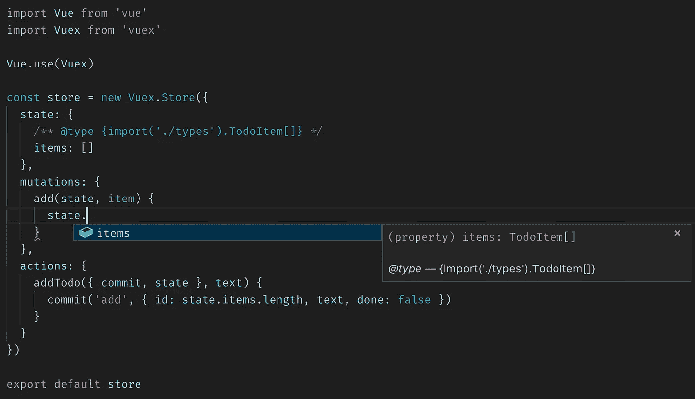

使用 options 语法用 **JavaScript** 编写的 Vuex 商店实现

然而，Vuex 的类型脚本 API 是有限的。`commit`和`dispatch`中的类型检查和智能感知非常原始。

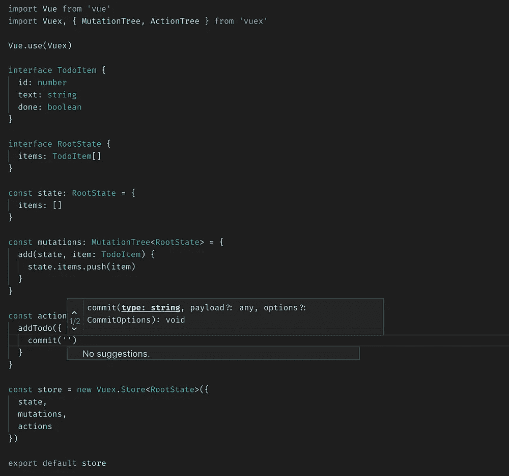

Vuex 存储的提交(左)和分派(右)方法中的智能感知

正如你在上面看到的，我们得到 intellisense 让我们知道`commit`和`dispatch`把字符串作为第一个参数，但是我们没有得到注册的动作和突变的列表。不管有没有打字稿，我们在这里都无能为力。然而，有许多第三方软件包试图在 Vuex 商店和模块中获得正确的类型。

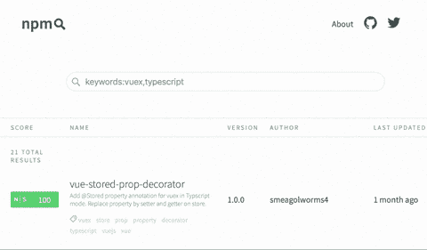

[用于类型脚本的 Vuex 助手包](https://npmsearch.com/?q=keywords:vuex,typescript)

我们不会仅仅为了得到正确的类型而引入新的依赖项，因为大多数人只使用 Vuex。不过 [vuex-class](https://github.com/ktsn/vuex-class) 、 [vuex-typescript](https://github.com/istrib/vuex-typescript) 和 [vuex-module-decorators](https://github.com/championswimmer/vuex-module-decorators) 值得一提的是辅助 vuex 店铺的第三方包。

Vuex 的下一个版本将使用一个与 TypeScript 兼容的 API 来构建。

由于 Vuex 的 TypeScript API 的限制，我们在提交突变和分派动作方面做不了什么。尽管有了命名空间模块，我们可以限制存储的范围，并保持单个存储模块的可理解性。然而，Vuex 的另一个领域可以使用类型和智能感知。

## 在 Vue 组件中使用 Vuex 存储

Vuex 提供了`mapState`、`mapGetters`、`mapActions`和`mapMutations`助手来简化 Vue 组件中的绑定存储状态。然而，API 是基于字符串文字的，不可能提供类型和智能感知。

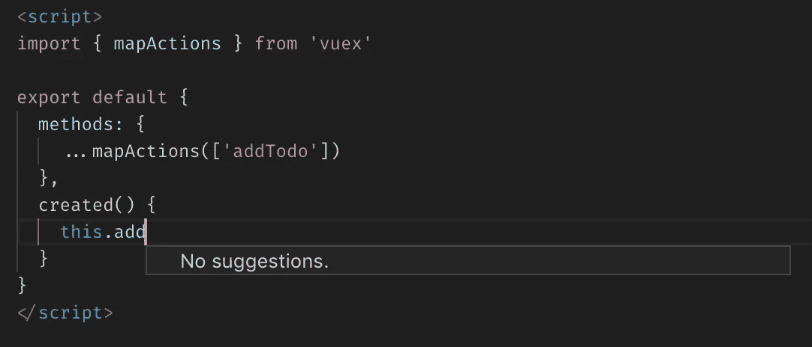

在 Vue 组件中使用 Vuex 存储

这个问题在 TypeScript 世界里还没有解决，在 JavaScript 世界里我们也没什么可做的。然而，存在一种模式，据我所知，Chris Fritz 的企业样板文件可以得到改进。

## Vuex 中的助手模式

根据 Chris 的 helper 模式，我们创建一个 store helper 文件，Vuex store 用法的所有`mapXxx`方法调用都收集在这里。我们可以创建`computed`和`methods`属性的上下文组，这些属性可以直接添加到组件中。

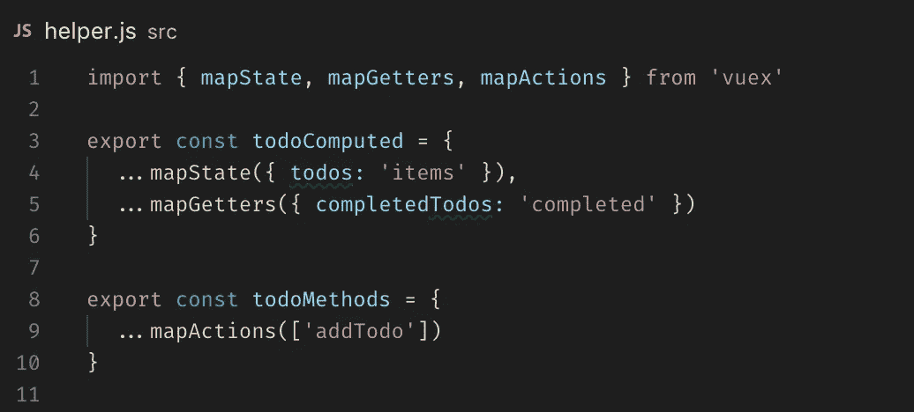

Vuex 助手模式示例

除了提供智能感知增强的可能性之外，这种模式还减少了应用程序中受 Vuex 影响的外围应用。比方说，如果 Vuex 引入了重大变更，那么我们只需更新`helpers.js`文件。此外，它还减少了代码占用，增加了`mapXxx`在不同包之间的重用。

## 用助手模式编写的 Vuex 商店智能感知

我们可以用这样一种方式注释助手的导出，以便在组件中使用时获得更好的智能感知。

例如，在下面的代码片段中，`addTodo`方法接受类型为`string`的`text`参数。

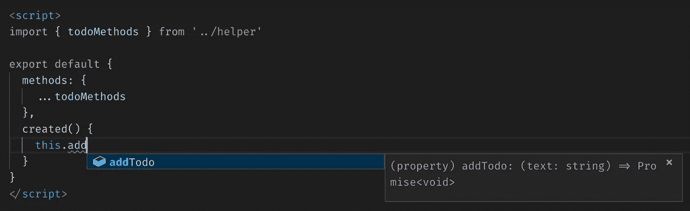

Vuex 映射方法中的智能感知

上面代码段中的 Intellisense 不是自动的；它需要使用 JSDocs 进行一些类型转换。例如，helpers 模块导出的`todosMethods`对象的类型上应该有`addTodo`方法。因此，通过使用`@typedef`的类型定义，我们可以将该类型命名为`TodoMethods`。

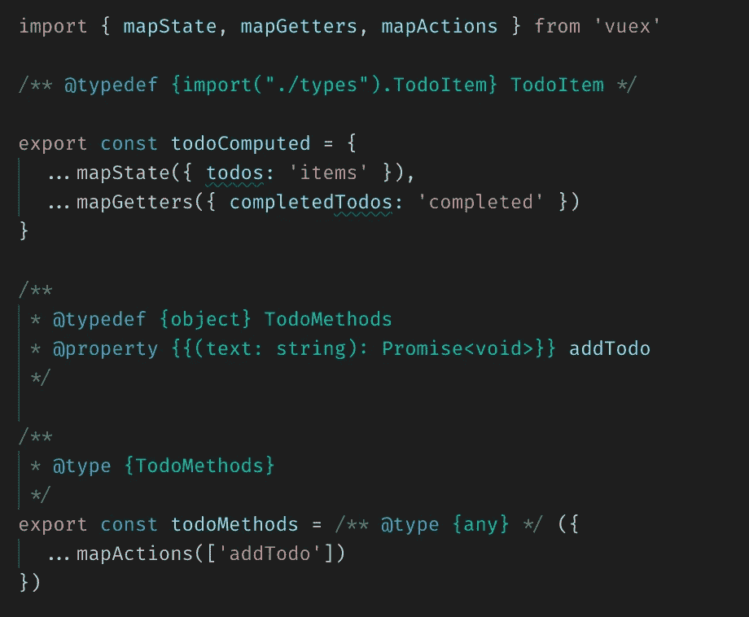

带有 JSDoc 类型注释的 Vuex 助手

在上面的类型定义中，`TodoMethods`有一个类型函数的属性`addTodo`。为了定义一个函数类型，我们可以使用一个双花括号，类似于 Vue 的小胡子语法(`{{ ... }}`)。在双花括号中，我们以格式`(param: type): return-type`添加类型，因此对于接受一个字符串参数的函数，我们有`{{ (text: string): void }}`。因为我们知道一个动作总是返回一个承诺，我们可以将`addTodo`方法类型扩充为`{{ (text: string): Promise<void> }}`。类似地，我们可以给计算属性添加一个类型，但是按照 API 的要求，这些应该是函数。

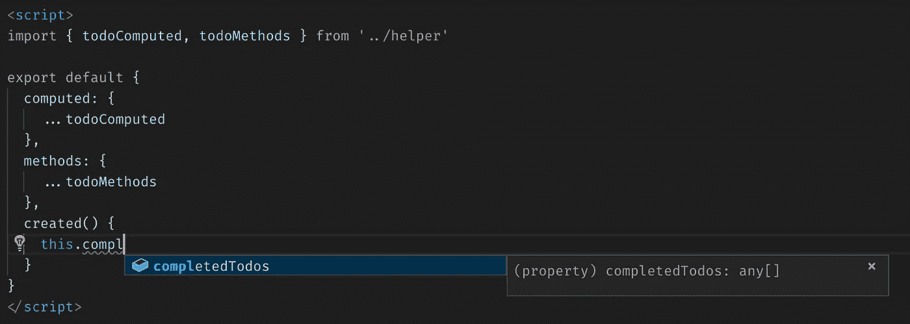

这种方法有点脆弱，因为`mapXxx`中使用的属性的任何变化都可能影响 JSDoc 类型定义。此外，任何添加到`mapXxx`函数的新属性都需要将类型定义添加到相应的 typedef 中。

此外，如果您注意到上面代码片段中的`completedTodos`类型，它表示`any[]`。这是由于 VS 代码中的一个错误，不能正确显示导入的类型。

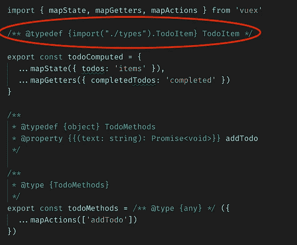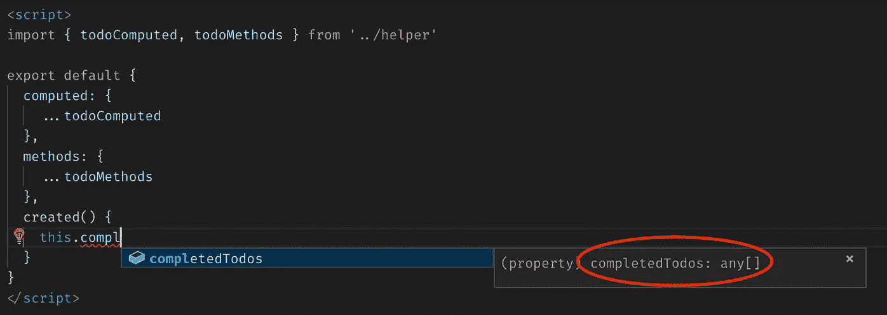

VS 代码中的错误，无法显示导入的文件

这就是 Vuex 和没有 TypeScript 的类型的所有人。如果你有任何问题，你可以在推特上联系我。