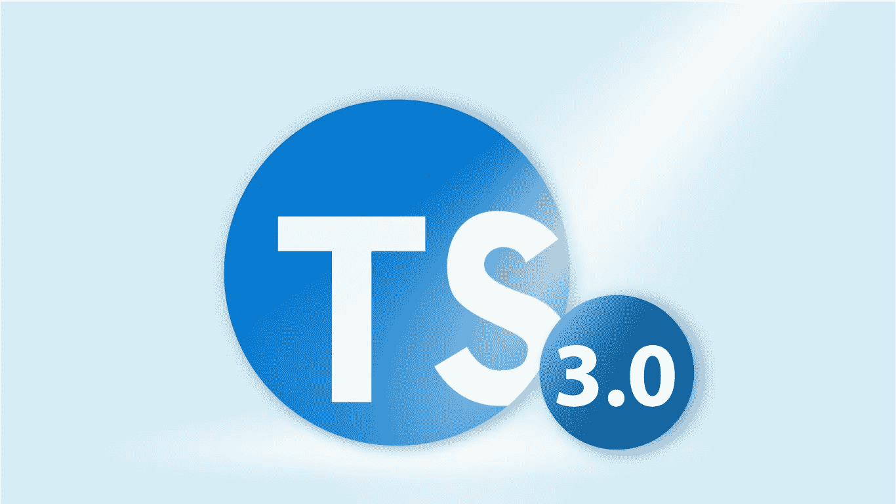
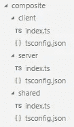
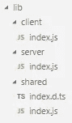

# TypeScript 3.0 —带来了什么？

> 原文：<https://itnext.io/typescript-3-0-what-has-come-19f81d1fac60?source=collection_archive---------1----------------------->

在 TypeScript 2.0 发布近两年、最新版本 2.9 发布两个月后，微软发布了最新版本的 TypeScript。让我们看看发生了哪些变化，以及这些变化对我们的日常工作有何影响。

在 TypeScript 3.0 中，我们可以识别出影响语言使用方式的五个变化。其中只有一个被标记为重大变更。不过介绍够了，来看看有什么新的吧！

# 更丰富的元组类型

TypeScript 中的元组实际上是具有恒定长度的 JavaScript 强类型数组(在单个元素级别)。至少，过去是这样的，您可以在清单 1 中看到一个例子。

在 TypeScript 中列出 1 个元组

从 TypeScript 3.0 开始，我们可以用未定义的最大元素数定义元组，只需要最小元素数。清单 2 给出了一个例子。

清单 2 中的元组具有未定义的最大元素数

第一个元素有一个 string 类型，这是强制的，但是其余的只是数字，可以省略。更有甚者，我们甚至可以定义没有下限的元组(其实只是一个数组)或者空元组。请参见清单 3。

清单 3 空元组和没有下限的元组

这样的元组有实际用途。例如，我们可以强制一个数组在类型级别上至少有一个元素。本文的下一部分将展示在更复杂的环境中的另一种用法。

# 用元组类型提取和传播函数参数

如你所知，在 JavaScript 中，我们可以通过使用 *arguments* 变量来使用提供给函数的参数，即使我们在代码中没有命名任何参数。当然，这在 TypeScript(默认配置)中是不允许的，在这里我们必须告诉编译器一切。区别如清单 4 所示。

清单 4 使用未在函数定义中定义的参数的例子

这对编译器来说没问题，但是当我们使用 TypeScript 时，我们不想使用*任何*类型。假设我们希望只提供字符串和数字。然后，我们当然可以将*的任意*改为*(字符串|数字)*。但是，这样我们就告诉编译器“我想要一个包含字符串或数字的数组”。我们不限制哪个元素是字符串，哪个是数字，应该有多少个。假设我们知道第一个参数是一个字符串，后面两个是数字，剩下的是字符串。在 TypeScript 3.0 中，我们可以使用清单 5 所示的元组类型来定义它。

清单 5 隐式定义了 arguments 数组中每个参数的类型

一个不同的用例怎么样？让我们看看清单 6。

清单 6 组合两个给定函数的函数及其用法

TypeScript 3.0 允许我们做一个泛型类型 *T1 扩展 any[]* ，这实际上创建了一个元组类型。这里我们告诉编译器 *T1* 是第一个函数的所有参数的类型。它可以是任何东西，但是我们将它强类型化。正如您在清单 6 的最后一行中看到的，严格的类型检查起作用，并告诉我们，我们不能用字符串代替数字。这个例子表明，我们将能够在函数式编程中使用这种类型。也许将来我们会为像 Ramda 这样的图书馆做更好的打字？

# "未知"

如你所知，TypeScript 有一个 *any* 类型，可以处理几乎所有的事情——它恢复了 JavaScript 对特定变量的弱类型。过度使用它是一种不好的做法，但是由于 JavaScript 的本性，有时我们需要它。一种情况是，当我们不知道类型时，我们想使用 *any* ，但是我们会检查它是什么，然后使用强类型。有了 *any* ，我们甚至不需要检查类型——我们可以像那样使用一个变量，而不会出现编译错误。在 TypeScript 3.0 中，我们可以使用未知的类型。它告诉编译器“我们不知道这里有什么，所以在我们知道它是什么之前，我们不能使用它”。区别如清单 7 所示。

清单 7 任意和未知之间的区别

值得注意的是，这是一个突破性的改变，因为从 3.0 版本开始 *unknown* 变成了一个语言的关键字，所以不能再作为名字使用了。

# 支持 defaultProps

TypeScript 3.0 的另一个新颖之处是对 React 的 *defaultProps* 的语言级支持。没听说过 *defaultProps* 的，我简单描述一下。通常，在 JavaScript (ECMAScript 6)中，如果我们想要提供默认的 React 组件的参数，我们将使用静态对象 *defaultProps* 来完成，如清单 8 所示。

清单 8 在 JavaScript 中使用 defaultProps

正如我们所看到的，由于 defaultProps 的使用，我们不需要对 title 执行空检查，因为我们确信它总是有一些值。在过去，TypeScript 不能理解这一点，我们必须进行空检查。在清单 9 和清单 10 中，我展示了我们如何在 TypeScript 2.x 中处理这个问题，以及我们现在可以如何做。

清单 9 TypeScript 2.x 使用 defaultProps 的方式

清单 10 TypeScript 3.0 使用 defaultProps 的方式

正如你所看到的，来自最新 TypeScript 版本的代码不需要 null 检查，因为编译器可以看到在 *defaultProps* 中定义的参数值。

# 项目参考

可能是 TypeScript 3.0 最大的新特性。从现在开始，我们将能够定义跨项目引用。由于这一变化，我们将能够使用一些新的项目架构场景，如:

为客户端和服务器项目使用共享代码。编译后的输出也将共享代码，而不是拥有每个共享代码文件的单独副本。

不包含主项目文件副本的单元测试。

Monorepos(许多项目相互依赖)，以及使用经过战斗考验的解决方案，如 Lerna 和 Yarn Workspaces

这都要归功于 tsconfig 中的新条目:编译器选项的*复合*标志和*引用*。此外，我们为 tsc (TypeScript 的编译器)提供了一个新参数:build，它可以根据给定的 tsconfig 构建整个 TypeScript 项目。

例如，让我们考虑以下项目结构:

清单 11 提供了客户的项目 *tsconfig.json* 。可以使用命令: *tsc -b composite/client* 来构建它。要使用一个共享项目，我们只需从其中导入我们需要的东西，而无需在代码中添加任何额外的结构。

清单 11 带有复合标志的 tsconfig.json 和对共享项目的引用

编译客户端和服务器后，我们得到以下结构:

正如您所看到的，“共享”目录实际上是在客户机和服务器之间共享的。在旧版本中，我们将“共享”目录复制到客户机和服务器，从而创建不同于源结构的输出结构。

关于如何在 Lerna 中使用项目引用的信息，我推荐这个 GitHub 资源库:[https://github.com/RyanCavanaugh/learn-a](https://github.com/RyanCavanaugh/learn-a)。

# 结束…

正如我们所看到的，没有太多的变化。他们主要关注的是为更多的 JavaScript 情况提供静态类型的类型系统。最大的变化当然是项目引用。然而，就目前而言，我们无法判断它的应用范围有多广。我渴望看到它将为我的新项目和现有项目提供多少价值，以及它将如何影响其他项目。

帖子也发表在 [Synergy Codes 的博客](http://www.synergycodes.com/blog/typescript-3-what-has-come)上。

您对创建数据可视化应用程序感兴趣吗？[点击这里了解 GoJS 库](https://synergycodes.com/gojs-ebook/)！