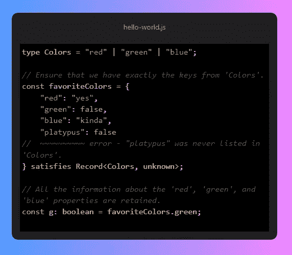
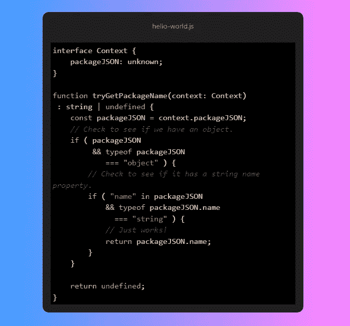
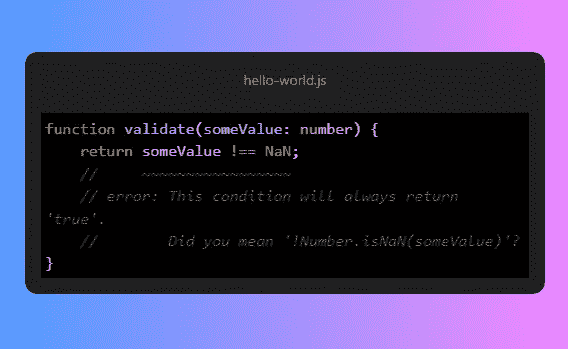
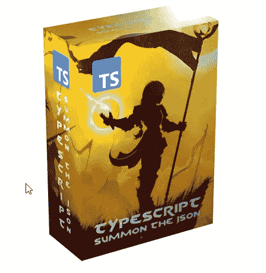

# TypeScript 4.9 是游戏规则的改变者

> 原文：<https://itnext.io/typescript-4-9-is-a-game-changer-f9540e659324?source=collection_archive---------1----------------------->

最新的 4.9 TypeScript 版本指日可待，新特性令人兴奋不已。您将从这篇文章中了解它们。

# Hodor 类型

new 关键字 satisfies 是一种确保变量符合类型定义的方法。与转换相比，满足不会将变量转换为特定类型。

它在很多情况下都很有用，肯定会成为一种默认的类型验证方式。例如:

# 更好的类型缩小

有时候，当我们试图缩小数据范围时，例如从 API 中缩小数据范围，TypeScript 会发疯。现在更容易了，因为“in”操作员更好地认识到了我们想要实现的目标:

# 改进的 NaN 面试体验

关于 NaN 的琐事变得如此受欢迎，TypeScript 开发人员决定向热切的面试官扔一些剑。众所周知，我们不应该用 NaN 来比较任何东西，因为 NaN 不是一个数字，而且真的——它根本不是什么具体的东西。现在，如果您无意中尝试与 NaN 进行比较，TypeScript 会显示一个错误。

这个特性令人兴奋的地方在于，TypeScript 实际上会提出一个合适的方法来修复它！真正的游戏规则改变者:

# 超快速文件更改检测

TypeScript 的开发人员多年来一直致力于性能改进，这将使每个人感到失望。与基本上一次一次地检查文件的轮询相比，文件监视是一个游戏改变者。如果项目中的文件发生更改，系统将通知 TypeScript。再也不用爆那个 CPU 了！在 TypeScript 4.9 中，文件监视机制已经足够成熟，可以成为监视更改的默认方式。这将提高构建时间！

你对新的 TypeScript 特性感到兴奋吗？我迫不及待地想安装它，并亲自尝试所有这些好东西。TypeScript 太神奇了！

如果你想学习[打字](https://summonthejson.com/products/typescript-flashcards)看看我制作的梦幻卡片。您可以订购它们，全球免费送货！

[更多信息](https://devblogs.microsoft.com/typescript/announcing-typescript-4-9-beta/)

*你想了解最新的软件工程吗？已经有超过 1500 人订阅了汤姆·斯米考斯基的文章。现在你也可以加入他们了。每月只需 5 美元，你不仅可以看到他的文章，还可以看到 Medium 上的所有文章，让汤姆·斯米考斯基写更多有趣的故事！* [*成为会员现在*](https://medium.com/membership/@tomaszs2) *！*