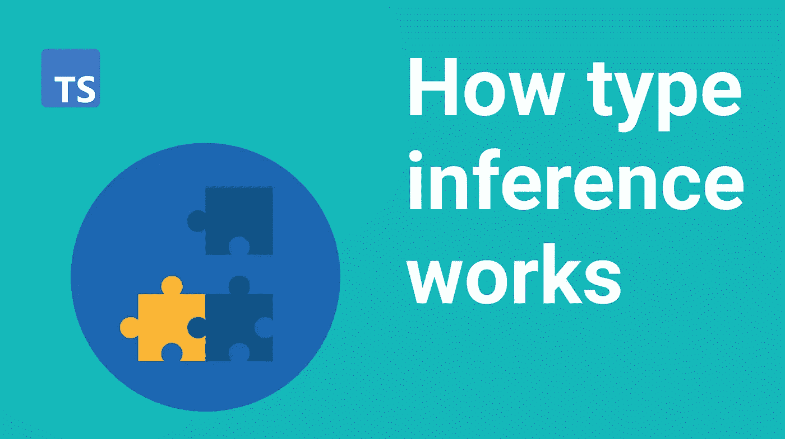

# TypeScript 基础:了解如何确定变量类型

> 原文：<https://itnext.io/typescript-basics-understanding-how-variable-types-are-determined-c109a629dd8d?source=collection_archive---------0----------------------->



当您在 TypeScript 中声明一个变量时，编译器需要确定将什么类型赋给该变量。在本帖中，我们将介绍 TypeScript 如何推断变量的类型。了解这一点对于建立对语言的牢固理解是很重要的。

TypeScript 有三种不同的方式确定类型:类型注释、推断类型和 duck 类型。

让我们更详细地介绍一下它们。

# 类型注释

类型批注是告诉 TypeScript 变量应该是什么类型的最明确的方式。在此方法中，在类型名称后使用冒号来指定变量的类型。例如:

```
const myNumber: number = 123;
```

这里我们告诉 TypeScript】变量应该有一个`number`类型。换句话说，它只能存储数字，不能存储字符串或任何其他数据类型。

如果我们试图给我的号码分配一个字符串会发生什么？TypeScript 会给我们以下错误，因为我们不允许在一个数字变量中存储字符串:
`Type 'string' is not assignable to type 'number'`

# 推断分型

推断类型是 TypeScript 确定变量类型的默认方式。使用这种方法，TypeScript 将根据您赋予变量的初始值，尽力找出最适合该变量的类型。

```
const myString = "Hello world!"
```

在上面的例子中，我们有一个名为`myString`的变量，我们试图给它赋值“Hello world！”在这种情况下，TypeScript 将推断 myString 应该是 String 类型，因为字符串文字“Hello world！”被赋给了 myString。我们不需要使用类型注释将类型显式地分配给这个变量。

推断类型很灵活，允许 TypeScript 适应基本代码。当使用推断类型时，TypeScript 会尽可能地提供帮助，并减少需要使用的类型批注的数量。

但是，需要注意的是，如果 TypeScript 不能确定适当的类型，推断类型有时会导致错误。在这些情况下，您总是可以通过手动注释变量类型来帮助 TypeScript。

# 鸭子打字

TypeScript 对除基元以外的值(如对象和数组)使用鸭类型或结构子类型。Duck typing 是一种方法，TypeScript 通过查看对象的形状来判断其类型。

Duck typing 遵循以下原则:如果一个对象“看起来”与另一个对象具有相同的属性和方法，那么 TypeScript 会将它们视为同一类型。如果它看起来像一只鸭子，叫起来也像一只鸭子，那么它可能就是一只鸭子。

举以下例子:

```
let lion = { name: "Lion", sound: "roar" };
let dog = { name: "Dog", sound: "bark" };
let bird = { name: "Bird", sound: "chirps", fly: () => console.log("flying") };
lion = dog;
dog = bird;
bird = lion; // Error: Property 'fly' is missing in type...
```

在上面的例子中，我们能够将`dog`分配给`lion`，因为它们都有相同的属性集:`name`和`sound`。然而，我们不能将`lion`赋给`bird`，因为`lion`缺少`bird`对象拥有的`fly`属性。也是一件好事；飞狮会是一个可怕的景象。

Duck 类型比类型注释具有更大的灵活性。即使`lion`和`dog`没有被明确地分配相同的类型，TypeScript 仍然认为它们是相同的类型，我们可以互换使用它们。

如您所见，TypeScript 有多种方法来确定变量的类型。默认情况下使用推断类型或鸭类型，但是如果 TypeScript 卡住了，您总是可以依靠类型注释。

# 结论

这个帖子到此为止！我们讨论了 TypeScript 如何推断变量的类型。我们研究了 TypeScript 确定类型的三种不同方式:类型注释、推断类型和 duck 类型。

推断类型是 TypeScript 确定类型的最常见方式。但是，如果 TypeScript 不能自动推断出适当的类型，您总是可以通过使用类型批注来帮助它。

Duck typing 是一种 TypeScript 查看对象的形状以确定其类型的方法，它通常在处理数组或对象时使用。感谢阅读！

如果你想获得更多的网络开发、反馈和打字技巧，可以考虑[在 Twitter 上关注我，](https://twitter.com/IskanderSamatov)在那里我分享我学到的东西。
快乐编码！

*原载于 2022 年 1 月 20 日 https://isamatov.com*[](https://isamatov.com/typescript-type-inference/)**。**