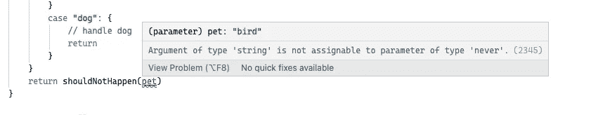

# TypeScript 基础:了解“从不”类型

> 原文：<https://itnext.io/typescript-basics-understanding-the-never-type-3b4bdaa7859c?source=collection_archive---------5----------------------->


TypeScript `never`关键字对许多开发人员来说有点神秘。它有什么作用，什么时候应该使用它？今天我们将深入讨论`never`关键字，并涵盖您可能遇到它的情况。

# “从不”的特征

TypeScript 使用`never`关键字来表示逻辑上不应该发生的情况和控制流。

实际上，您在工作中不会经常遇到使用`never`的需要，但是了解它如何有助于 TypeScript 中的类型安全仍然是很好的。

我们来看看文档是怎么描述的:`"The never type is a subtype of, and assignable to, every type; however, no type is a subtype of, or assignable to, never (except never itself)."`

TLDR；你可以将类型为`never`的变量赋给任何其他变量，但是你不能将其他变量赋给`never`。让我们来看一个代码示例:

```
const throwErrorFunc = () => { throw new Error(“LOL”) };let neverVar: never = throwErrorFunc()
const myString = “”
const myInt: number = neverVar;
neverVar = myString // Type ‘string’ is not assignable to type ‘never’
```

暂时可以忽略`throwErrorFunc`。只需知道这是一个用 never 类型初始化变量的变通方法。

从上面的代码中可以看出，我们可以将类型为`never`的变量`neverVar`赋给类型为`number`的变量`myInt`。但是，我们不能将类型为`string`的`myString`变量赋给`neverVar`。这将导致 TypeScript 错误。

您不能将任何其他类型的变量赋值给`never`，甚至是类型`any`的变量。

# 函数中的“从不”

TypeScript 使用`never`作为不会到达其返回端点的函数的返回类型。

这主要有两个原因:

*   该函数抛出错误异常。
*   该函数包含一个无限循环。

在我们之前的代码中，您已经看到了“throwErrorFunc”。这是一个抛出异常的函数示例:

```
const throwErrorFunc = () => {
  throw new Error("LOL")
}; // typescript infers the return type of this function to be 'never'
```

另一种情况是，如果有一个无限循环，其中的真值表达式没有任何中断或返回语句:

```
const output = () => {
  while (true) {
    console.log("This will get annoying quickly");
  }
} // typescript infers the return type of this function to be 'never'
```

在这两种情况下，TypeScript 都会推断这些函数的返回类型是`never`。

# “从不”和“无效”的区别

那么`void`型呢？如果我们有`void`，为什么我们还需要`never`？

never 和 void 的主要区别在于，`void`类型可以有`undefined`或`null`作为值。

TypeScript 将`void`用于不返回任何内容的函数。当你没有为你的函数指定返回类型，并且它没有在任何代码路径中返回任何东西时，TypeScript 将推断它的返回类型是`void`。

在 TypeScript 中，`void`不返回任何东西的函数实际上是在返回`undefined`。

```
const functionWithVoidReturnType = () => {}; // typescript infers the return type of this function to be 'void'
console.log(functionWithVoidReturnType()); // undefined
```

然而，我们通常会忽略`void`函数的返回值。

这里需要注意的另一件事是:根据我们前面提到的`never`类型的特征，你不能将 void 赋值给 never:

```
const myVoidFunction = () => {}
neverVar = myVoidFunction() // ERROR: Type 'never' is not assignable to type 'void'
```

# “从不”作为可变警卫

如果变量被一个永远不可能为真的类型保护所限制，它们就可能成为`never`类型。通常，这表明您的条件逻辑有缺陷。

让我们来看一个例子:

```
const unExpectedResult = (myParam: "this" | "that") => {
    if (myParam === "this") {
    } else if (myParam === "that") {
    } else {
      console.log({ myParam })
    }
  }
```

在上面的例子中，当函数执行到第 `console.log({ myParam })`行时，`myParam`的类型将会是`never`。

这是因为我们将`myParam`的类型设置为“This”或“that”。因为 TypeScript 假定这两个是这种情况下唯一可能的选择，所以从逻辑上来说，第三个 else 语句不应该出现。所以 TypeScript 将参数类型设置为`never`。

# 彻底的检查

在实践中，您可能会看到`never`的一个地方是彻底的检查。详尽的检查对于确保您已经处理了代码中的每一个边缘情况非常有用。

让我们来看看如何使用穷举检查为 switch 语句添加更好的类型安全:

```
type Animal = "cat" | "dog" | "bird"const shouldNotHappen = (animal: never) => {
    throw new Error("Didn't expect to get here")
  }const myPicker = (pet: Animal) => {
    switch(pet) {
      case "cat": {
        // handle cat
        return
      }
      case "dog": {
      // handle dog
        return
      }
    }
    return shouldNotHappen(pet)
  }
```

当您添加`return shouldNotHappen(pet)`时，您应该会立即看到一个错误:



错误消息通知您忘记在 switch 语句中包含的情况。这是一种获得编译时安全性并确保在 switch 语句中处理所有情况的聪明模式。

# 结论

如您所见，`never`类型对于特定的事情很有用。大多数时候，这表明您的代码中存在缺陷。但是在某些情况下，比如详尽的检查，它可以是一个很好的工具来帮助你编写更安全的类型脚本代码。

如果你想获得更多的网络开发、反馈和打字技巧，可以考虑[在 Twitter 上关注我，](https://twitter.com/IskanderSamatov)在那里我分享我学到的东西。
编码快乐！

*原载于 2022 年 2 月 6 日 https://isamatov.com**的* [*。*](https://isamatov.com/typescript-understanding-never-type/)