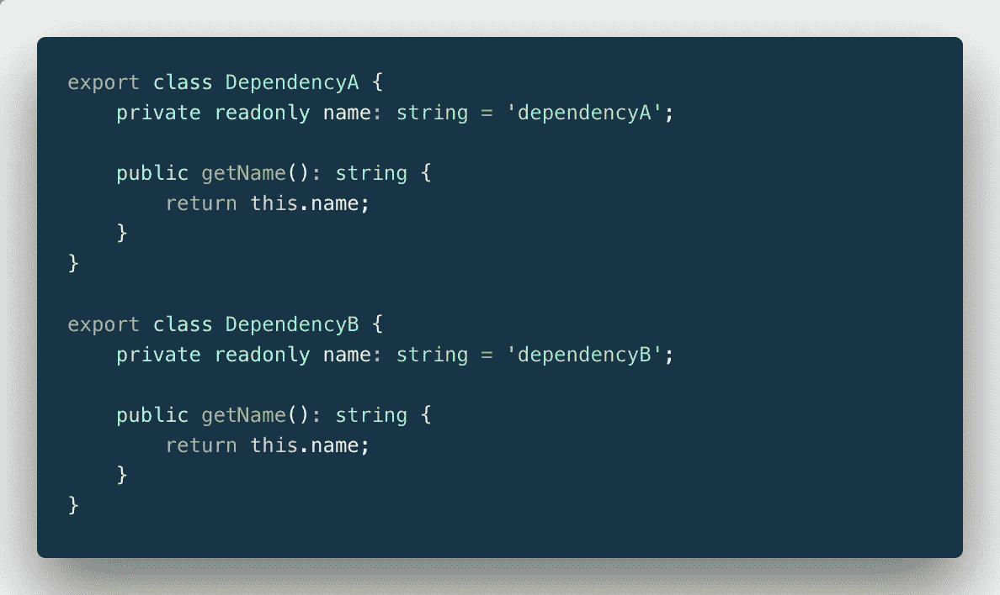
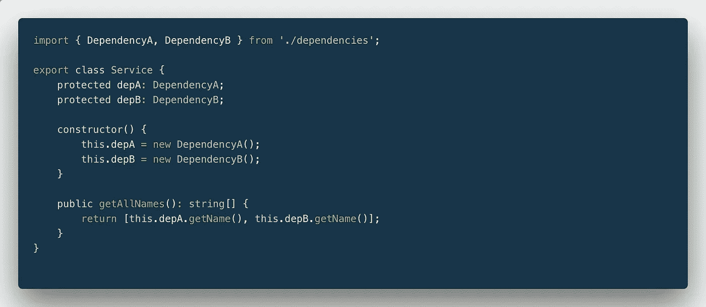
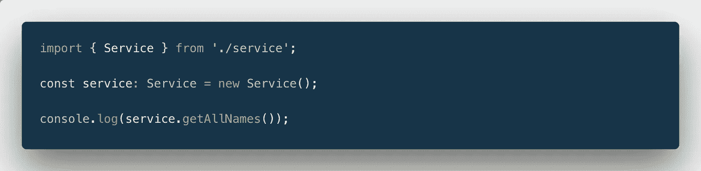
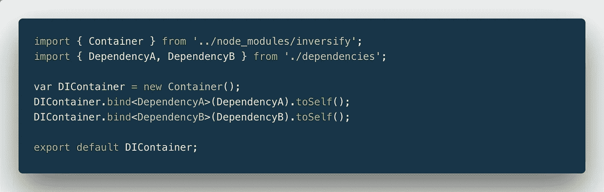
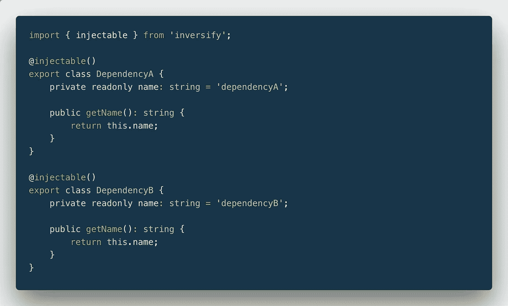
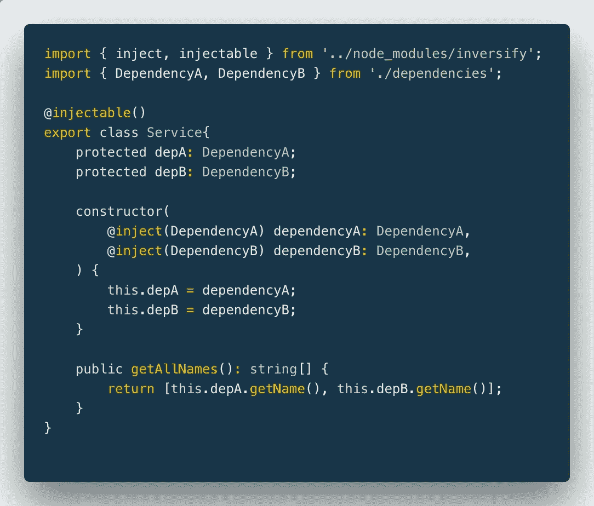
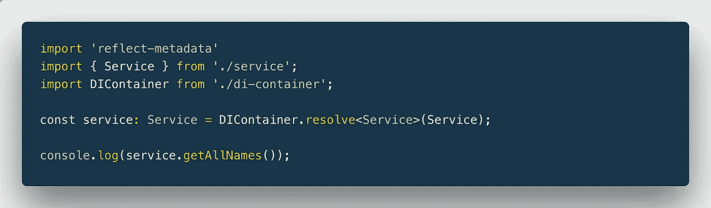

# Typescript 依赖项注入:为 TS 项目设置 InversifyJS IoC

> 原文：<https://itnext.io/typescript-dependency-injection-setting-up-inversifyjs-ioc-for-a-ts-project-f25d48799d70?source=collection_archive---------1----------------------->


约翰·卡莱尔在 [Unsplash](https://unsplash.com?utm_source=medium&utm_medium=referral) 上拍摄的照片

而不是每次我们想要使用一个特定的类时都要处理手工创建的类依赖关系。我们可以建立一种机制来为我们创建它们，并自动向类提供依赖关系。这种机制被称为控制反转(IoC)容器，在本文中，我将展示如何通过使用 InversifyJS 设置依赖容器来改进您的类型脚本代码。

# 使用依赖注入(DI)之前的项目设置

我将向您展示一个基于节点演示项目的示例，该项目包含一个依赖于其他两个类的服务类，以及使用该服务的主 TypeScript 文件。项目的结构是这样的

```
src/
 dependencies.ts
 service.ts
 main.ts
```

你也可以在 GitHub[https://github.com/AndrejsAbrickis/ts-inversify-blog](https://github.com/AndrejsAbrickis/ts-inversify-blog)上看到

## dependencies.ts

这个 TypeScript 文件导出两个行为相同的类。它们都有一个私有字段`name`来表示类名。两者都有返回类名的私有方法`getName()`。



## 服务. ts

服务类所做的只是返回它正在使用的依赖项名称的数组。由于我们不能直接访问类的只读名称字段，我们必须使用实例方法`getName`。为了使用该方法，我们必须使用`new`关键字实例化这些类



## 主页面

当执行时，主文件“新建”(手动创建一个类的新实例)服务类，调用它的`getAllNames`方法并记录该方法的结果



如你所见，在开发过程中，我们使用了几次`new`关键字。这只是一个服务和两个依赖关系的简单例子。想象一下，在有几十个甚至几百个类的真实项目中这样做。

# 将 inversify 添加到项目中

为了在项目中实现 DI，我将使用 InversifyJS 作为 IoC(控制反转)容器。

首先，我们需要将`inversify`和`reflect-metadata`添加到项目中

```
yarn add -D inversify reflect-metadata
```

第二:通过向`compilerOptions`部分添加额外设置来更新`tsconfig.json`


# 使用依赖注入(DI)后的项目设置

在安装了 InversifyJS 并且 TypeScript 编译器被配置为支持 InversifyJS 之后，我们可以更新我们的应用程序的代码。

## di-容器. ts

在享受依赖注入的甜蜜果实之前，我们必须配置 IoC 容器，以便类可以从集中式容器中解析它们自己的依赖。

我们通过创建一个新的 inversify 容器并为其提供类的绑定来实现这一点。绑定允许容器将请求的依赖项映射到它的一个实例。

在这个例子中，我对类`DependencyA`和`DependencyB`使用了`toSelf()`绑定。它指示容器在请求(注入)特定类时返回类的实例。



## dependencies.ts

在容器设置好之后，可以通过从 inversify 导入`injectable` decorator 并用`@injectable`decorator 装饰类来使依赖项成为可注入的。这个装饰器将在 TypeScript 编译期间使用`reflect-metadata`包进行处理并应用于 JavaScript 输出。



## 服务. ts

现在可以从服务类中删除关键字`new`。并且可以通过使用`@inject` decorator 将依赖关系直接注入到类的构造函数中。



以下示例将从 IoC 容器中检索`DependencyA`类的实例，并将其作为参数`dependencyA`传递给构造函数

```
[@inject](http://twitter.com/inject)(DependencyA) dependencyA: DependencyA
```

## 主页面

首先通过 addin `import 'reflect-metadata';`更新导入。inversify 要求将`@inject()`和`@injectable`decorator 应用于应用程序的编译输出。

之后，我们可以导入应用程序的容器，并且可以通过将`service`声明更改为

```
const service: Service = DIContainer.resolve<Service>(Service);
```

现在我们不再需要手动创建`Service`类依赖关系，因为每当容器被要求解析`Service`类时，它就会为我们做这件事。



# 结论

依赖注入是一种模式，它消除了每次我们想要使用一个特定的类时手动创建类依赖的责任。相反，我们配置控制反转(IoC)容器来为我们做这件事。

我认为这种模式的主要好处是我们可以模仿和替换依赖的具体实例。因此，我们可以更容易地为我们的类行为编写测试，而不需要手动创建所有的依赖关系。通过利用接口和 IoC 容器，我们可以使我们的代码更具可扩展性。

你可以在 Github[https://github.com/AndrejsAbrickis/ts-inversify-blog](https://github.com/AndrejsAbrickis/ts-inversify-blog)上看到这两个实现`befora DI`和`after DI`。要查看编译后的类型脚本，克隆 repo，运行

```
yarn && yarn build
```

或者

```
npm install && npm build
```

并查看输出的`./dist`目录。

干杯！

如果你觉得这篇文章很有用，并且想阅读更多关于随机网络开发的话题，请为这篇文章鼓掌或者在这里发表评论。和往常一样，你可以在 Twitter@andrejsabrickis 上找到我

在我离开之前，简单说一下我们正在招聘。目前，我们公司正在寻找有创造力和思想开放的软件工程师来帮助我们发展领先的点对点投资市场。如果你有兴趣或者你知道有谁会感兴趣的话，不要犹豫，可以在 Twitter 上亲自联系我[*@ andrejsabrickis*](https://twitter.com/andrejsabrickis)*。另外，在*[*Mintos*](https://www.mintos.com/en/about-us/careers/#all-roles)*查看我们目前的工作机会。*

*干杯！
/Andrejs/*