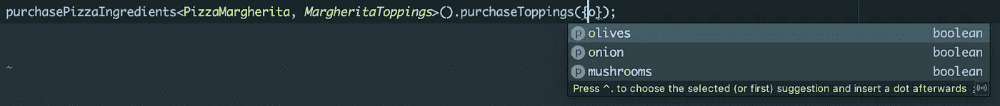
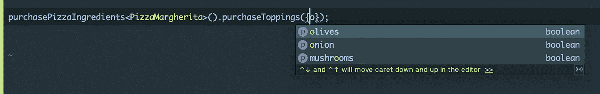
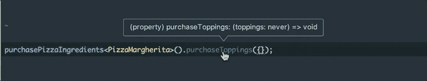

# TypeScript —从泛型中提取/解包类型

> 原文：<https://itnext.io/typescript-extract-unpack-a-type-from-a-generic-baca7af14e51?source=collection_archive---------0----------------------->


照片由 [Unsplash](https://unsplash.com?utm_source=medium&utm_medium=referral) 上的 [Stijn Swinnen](https://unsplash.com/@stijnswinnen?utm_source=medium&utm_medium=referral) 拍摄

你有没有想过如何从复合类型中得到一个类型？

```
type Puppy = Animal<BigEyes, SmallNose, SmallEars>;
...
type PuppyEyes = ExtractEyes<Puppy>;
```

这是什么`ExtractEyes`？它是如何工作的？

先来点背景。

# 条件类型

TypeScript 2.8 引入了一个名为[条件类型](https://www.typescriptlang.org/docs/handbook/release-notes/typescript-2-8.html)的新特性。
这可以让你更好地控制那些相当流畅/动态的类型。

```
T extends U ? X : Y
```

我不想尝试解释这是什么以及如何应用，有许多资源比官方文档更好地解释了这个想法。

我发现的关于条件类型的最好的文章是 David Sheldrick 的[。](http://artsy.github.io/blog/2018/11/21/conditional-types-in-typescript/)

我鼓励您在继续之前阅读这篇文章，因为它将为您组织这个概念，并帮助您了解我们所取得的成就。

# 让我们做比萨饼吧！

嗯，我们要用的例子不是小狗，而是披萨。写这篇文章的时候，我想我是饿了..

让我们定义一个可以添加配料的比萨饼。

我们有一个普通的披萨类，几个浇头选项和一个预设的 Margherita 披萨。

接下来，我们将创建一个接收浇头类型的函数，并公开一些函数来帮助我们购买浇头，这样我们就可以做比萨饼了。

所以，现在如果我们尝试购买 pizza margherita，我们将有类型完成！



不错！

但是你不觉得在`PizzaMargherita`已经包含了浇头的情况下再传递浇头是多余的吗？

如果我们能利用它们呢？

## 提取配料

这就是你应该了解[条件类型](https://www.typescriptlang.org/docs/handbook/release-notes/typescript-2-8.html)的地方，因为我们将使用它从比萨饼中“提取”浇头

我们在这里做的是“捕捉”浇头类型，并在`P`是`Pizza`类型的情况下返回它。

所以现在让我们去掉多余的浇头类型，试试我们的运气:



还有打字完成~ :D

太神奇了。

# 陷阱

发这个帖子的真正原因是想和你分享一些我处理过的事情。

让我们加一些奶酪放在比萨饼上

请注意，奶酪是可选的，我们有一个默认的奶酪类型。



什么？现在`toppings`的型号是`never`！

问题在于`ExtractToppings`类型:

注意，我们使用`Pizza<infer T>`，这意味着这里的奶酪将默认为`BaseCheeses`。

并且由于`BaseCheeses`有`MargheritaCheeses`没有的`feta`→`MargheritaCheeses`不延伸`BaseCheeses`！

`**PizzaMargherita**` **不延伸** `**Pizza<infer T, BaseCheeses>**` **！**

所以我们得到了不需要的`never`类型..

## 修复它

这是一个简单的修复，现在我们知道问题是什么了。

我们所做的只是给出一个更容易接受的类型。在这种情况下，我们选择了`any`。通过这种方式，我们声明我们并不真正关心比萨饼中的奶酪类型，我们只关心上面的配料。

现在我们又回到了以前的类型完成:)


# 结论

通常，当您开始使用 TypeScript 的这些高级功能时，这意味着您可能会构建一个框架或类似的东西。

如果您真的需要使用这样的东西，那么了解 TypeScript 的功能还是不错的。