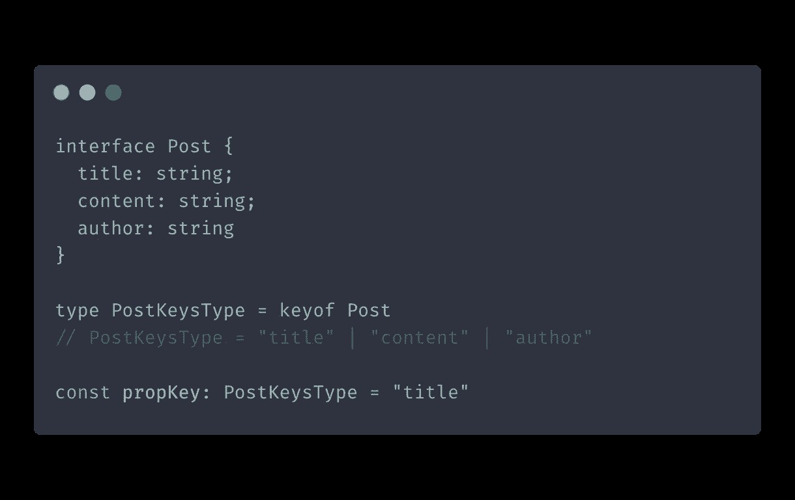
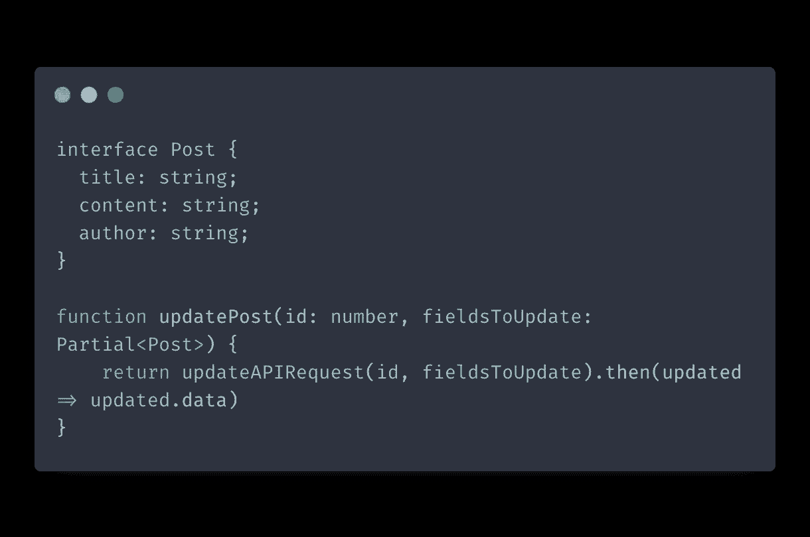
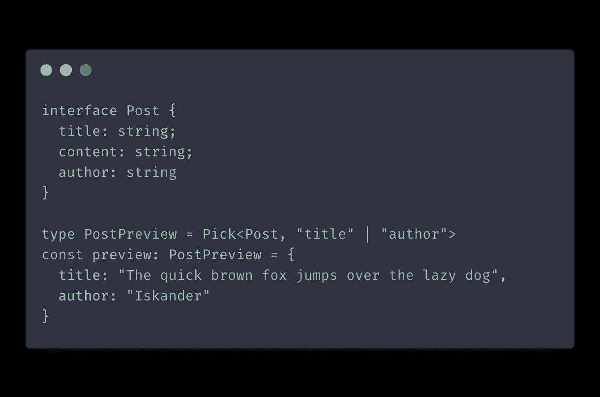
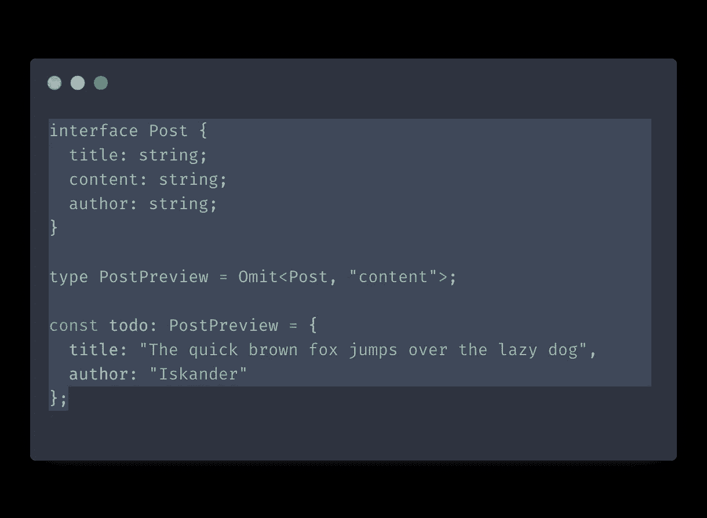
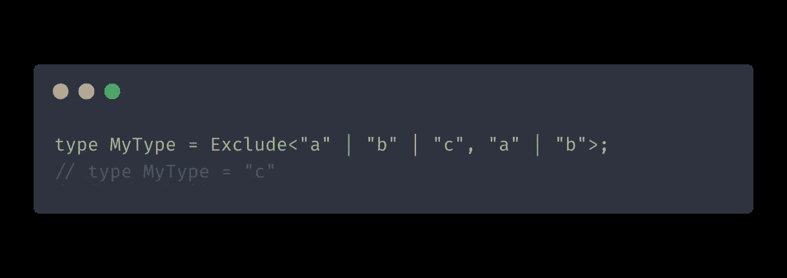

# typescript:React 最有用的五种实用工具类型

> 原文：<https://itnext.io/typescript-five-most-useful-utility-types-for-react-65c849ebad0b?source=collection_archive---------4----------------------->

在本文中，我将介绍 React 应用程序中五种实用的 TypeScript 实用程序类型。

# 什么是实用程序类型？

使用 TypeScript 时，您通常需要在现有类型的基础上构造新类型。以这种方式创建新类型有几个优点:

*   坚持干的原则。重用您已经拥有的类型来构建新的类型意味着减少代码中的冗余和重复。
*   在更改时保持您的类型同步。当您需要更改某个基础类型的属性时，从它派生的类型也将采用这种更改。

您可能知道，TypeScript 有人们经常用来构造新类型的[联合和交集类型](https://www.typescriptlang.org/docs/handbook/unions-and-intersections.html)。但是 TypeScript 也提供了许多强大的实用程序类型，它们是处理更微妙的边缘情况的更好选择。

# React 的实用程序类型

## keyof

严格地说，`keyof`是一个操作符，而不是一个实用程序类型，但是它的用法类似。`keyof`创建由您传递的类型的属性名组成的联合类型。`keyof`非常适合使用对象的现有键:

keyof

当您将`PostKeysType`赋值给一个变量时，该变量只能有一个值`author`、`title`或`content`。

## 部分的

将返回一个新类型，所有的属性都设置为可选。这对于传递一组动态道具非常有用，因为您事先不知道您可能会收到的所有道具:

部分的

我们将`fieldsToUpdate`类型设置为`Partial<Post>`。这允许传递带有动态字段的对象，只要它们是`Post`类型的一部分。

## 挑选

您可以使用`Pick`通过指定想要复制的属性来创建一个新类型。要选择属性，您需要传递一个联合类型:

挑选

以这种方式创建类型的好处是可以保持类型的同步。对父类型属性的更改会被派生类型自动采用。

## 省略

把`Omit`想成`Pick`的反义词。不是选择您想要复制的一组属性，而是提供一组您想要从类型中省略的属性。`Omit`会复制所有道具，除了你传过去的:

省略

## 排除

`Exclude`的工作方式与`Omit`相似，但有一个很大的不同——它使用联合类型。当您将`Exclude`应用到一个联合类型时，它会删除该联合的一个成员。

排除

# 结论

在本文中，我们介绍了在 React 项目中最有可能使用的 TypeScript 实用工具类型。然而，我们仅仅触及了实用程序类型的表面。TypeScript 提供了更多的实用程序类型，您可以在这里查看详尽的列表。

编码快乐！

*原载于 2021 年 7 月 18 日***。**