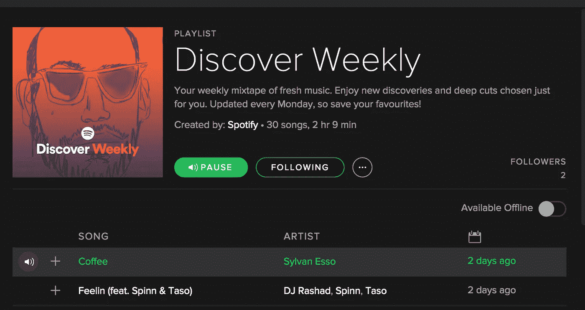
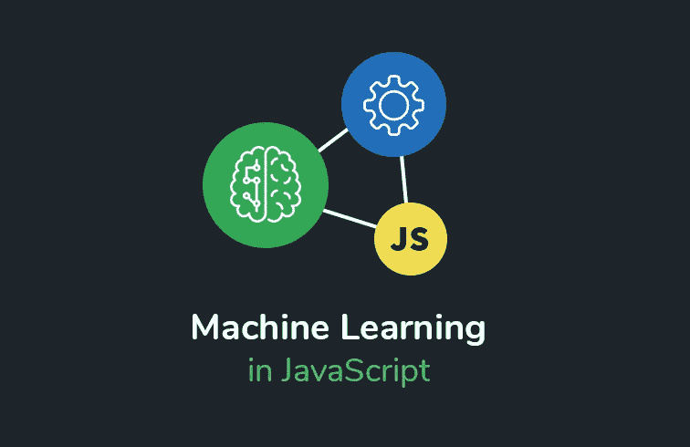

# Typescript +机器学习+简单性= Kalimdor.js

> 原文：<https://itnext.io/typescript-machine-learning-simplicity-kalimdor-js-bb1ccadf0ad3?source=collection_archive---------0----------------------->

*通用机器学习的 NPM 包*


Kalimdor.js 徽标

我很兴奋地宣布 [Kalimdor.js](https://github.com/jasonshin/kalimdorjs) ，这是一个基于 Typescript 的机器学习库，与 ScikitLearn 非常相似，可以直接在浏览器和 Node.js 环境中运行。事实上，很多 API 都是从 ScikitLearn 直接翻译过来，改写成 Typescript。

使用该库，Javascript 开发人员可以像 Python 开发人员一样平等地参与 Kaggle 竞赛！

# 为什么要在 Typescript 和浏览器中进行机器学习？



Spotify 音乐推荐系统离线运行，[来源](https://www.theverge.com/2015/9/30/9416579/spotify-discover-weekly-online-music-curation-interview)

Kalimdor.js 主要是用 Typescript 编写的，这是一种强类型编程语言，通过提供编译级别的类型检查，可以极大地改善您的开发体验。

基于浏览器的机器学习在许多不同的场景中都很有用。假设您的 React 原生应用程序上有一个音乐推荐系统。你正在处理一个场景，当用户完全失去互联网连接时，无论 wifi 状态如何，推荐系统都必须继续工作，然后 Kalimdor 仍然可以向你推荐新的音乐，而不需要与服务器交谈，无论你是在家里，在办公室，还是在没有互联网，汗流浃背的火车上。

# 为什么是另一个机器学习库？



Javascript 中的机器学习，[来源](https://www.techleer.com/articles/361-deeplearnjs-providing-magnetic-features-to-your-browser-through-machine-learning/)

Kalimdor 具有监督和非监督模型，包括决策树、随机森林、PCA、KMeans 和 SVM。NPM 生态系统中有许多单独编写的机器学习算法，但没有一个将它们打包成一个。

在 Javascript 领域，很明显，深度学习是机器学习的卓越用途，尽管不是每个问题都需要它！

> TensorFlow 是一个强大的库，主要用于深度学习，尽管它基于有向图的计算模型当然允许更广泛的用例。深度学习是机器学习的主要领域，而 scikit-learn 实际上并没有那么有用。
> 
> 对于大多数实际的机器学习任务来说，TensorFlow 是大材小用。Scikit-learn 是一个更加用户友好的库，在大多数情况下已经足够了。

不管我上面提到了什么，该库可以成为任何 JS 深度学习库的好伙伴，如 [Tensorflow.js](https://js.tensorflow.org/) 或 [Brain.js](https://github.com/BrainJS/brain.js) ，因为它支持包括 [train_test_split](https://www.kalimdor.io/api/model_selection.train_test_split.html) 、 [confusion_matrix](https://www.kalimdor.io/api/metrics.confusion_matrix.html) 和 [KFold](https://www.kalimdor.io/api/model_selection.KFold.html) 在内的实用程序。

本文将向您展示如何在您的浏览器上安装该库并解决来自 [Kaggle](https://www.kaggle.com/) 的一个流行的机器学习问题。

# 为什么是卡里姆多？

名字来源于[魔兽世界](https://worldofwarcraft.com/en-us/)，一个我一直在玩的游戏。魔兽世界中有一个叫卡利姆多的地区，那里有很多以森林为特色的自然环境。因为树是我在机器学习中最喜欢的算法，我选择了卡利姆多这个名字，森林之地。

# 装置

设置 Node.js 环境并安装 Kalimdor.js

```
# using Yarn
$ yarn add kalimdor -save
# using NPM
$ npm install kalimdor -save-dev
```

# 泰坦尼克号:机器从灾难中学习

## 描述

皇家邮轮泰坦尼克号的沉没是历史上最悲惨的海难之一，它在 1912 年 4 月 15 日夺走了 2224 名乘客中的 1502 人的生命。

事故导致如此多生命损失的原因之一是缺乏可用的救生艇，生存能力取决于他们的运气。

文章的这一部分将训练一个 RandomForest 模型来预测每个乘客是否幸存。

解决这个问题将有助于你练习以下技能

*   二元分类
*   RandomForestClassifier 基础知识

## 不错的介绍，让我们编码吧

1.  *导入包*

您可以从以下链接下载 JSON 文件:

*   `[train.json](https://gist.github.com/JasonShin/42c0d9b420b37d94f4d3018603026fed#file-train-json)`
*   `[test.json](https://gist.github.com/JasonShin/075b37b103e90aa27bc285c8bf070c40#file-test-json)`
*   `[ytrue.json](https://gist.github.com/JasonShin/e18b9c4432dd0a8ed41c3eab9962e683#file-ytrue-json)`

2.预处理数据(特征工程)

数据集不直接适合训练，除非我们对它进行预处理。在这一步中，我们将取任何一个值过大的字符串、布尔或数字，并将其转化为对机器学习模型有意义的值；)

用于处理标题、年龄、费用和上船的工具

放心重构吧；)

用 Kalimdor 的 [RandomForestClassifier](https://www.kalimdor.io/api/ensemble.RandomForestClassifier.html) 模型训练模型

简单直白；您可以使用 cls.toJSON()保存训练状态

有许多方法可以提高准确率，也许可以使用不同的模型，比如 [XGBoost](https://xgboost.readthedocs.io/en/latest/) ，一种增强算法，或者改进特征工程代码。

总之， [Kalimdor.js](https://www.kalimdor.io/) 仍然是一个不断发展的图书馆，建造这个图书馆是一种巨大的快乐，因为我可以为世界提供一个令人惊叹的图书馆，同时巩固我的机器学习知识。如果你想和我一起加入这个旅程，请前往[项目 Github 库](https://github.com/jasonshin/kalimdorjs)并查看[文档站点](https://www.kalimdor.io/)。后续文章将使用 Kalimdor.js 探索更多 Kaggle 挑战。