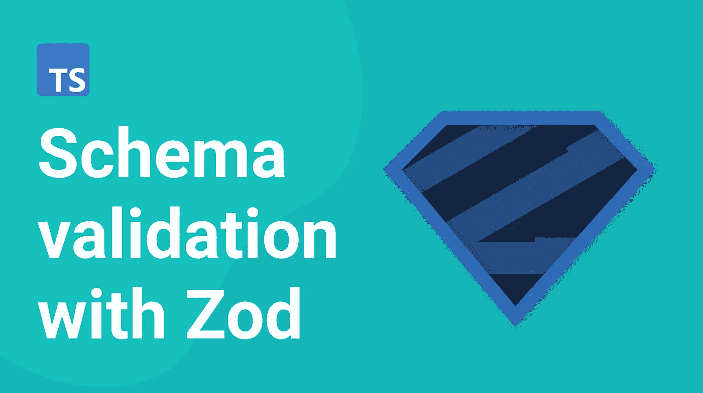

# 使用 Zod 进行 TypeScript 模式验证

> 原文：<https://itnext.io/typescript-schema-validation-with-zod-220734559284?source=collection_archive---------2----------------------->

这篇文章将描述使用 [Zod](https://github.com/colinhacks/zod) 为你的项目设置模式验证。

Zod 是一个用于模式声明和验证的开源类型脚本库。我们将研究为什么使用 Zod 进行模式验证，提供如何使用它的示例，并将其与其他库进行比较。

# 什么是模式验证，为什么需要它？

模式验证是验证数据结构符合特定模式的过程。您可以使用它来确保输入数据的有效性，以及记录和实施您的应用程序的数据结构。

使用模式验证有两个主要好处:

*   运行时的数据完整性:确保数据以正确的格式输入到系统中有助于避免错误并保持数据的一致性。虽然 TypeScript 可以帮助您确保编译时的类型安全，但当您处理来自未知(如服务器或用户输入)的数据时，模式验证在运行时会大放异彩。
*   文档:一个好的模式验证库将为您使用的数据结构提供准确的类型定义。类型定义可用于为项目生成静态文档。

# 为什么要用佐德？

虽然有许多类型脚本模式验证库，但 Zod 是最好的一个。在为您的项目选择库时，除了它的特性集之外，您还应该考虑它的实现细节。

Zod 没有依赖性，这意味着您可以安装和使用 Zod，而不需要任何其他库，这将有助于您保持较小的软件包大小。

Zod 可以在 Node.js 和所有主流浏览器(包括 IE 11)中运行。这对于需要支持广泛平台的项目来说是一个很好的选择。

Zod 被设计成是类型脚本优先的，这意味着库将自动为您的数据结构推断静态类型脚本类型。这消除了两次声明类型的需要——一次在 Zod 中，另一次在 TypeScript 中。这将为您节省大量的输入时间，并帮助您保持代码变更的同步。

Zod 的 API 简洁且可链接。这使得创建复杂的数据模式变得容易。您还可以轻松地将简单的模式组合成更复杂的数据模式。

# 使用 Zod 进行模式验证的示例

## 基元

让我们从最简单的例子开始——原语。Zod 使得创建简单的模式来验证原语变得极其容易。

让我们看看如何验证一个字符串。假设我们想要验证用户输入的密码。我们希望密码为非空字符串，长度至少为 8 个字符，最多为 32 个字符:

当您运行上面的代码时，您会看到 parse 方法抛出了一个异常。该异常将包含一个包含错误详细描述的`ZodError`对象数组:

当您试图解析一个有效的字符串时，zorse 将简单地返回它的值。

## 目标

现在让我们来看看物体。Zod 对验证嵌套对象结构有强大的支持。

让我们创建一个模式来验证用户对象。它将包含以下字段:

为了声明模式，我们使用了`z.object`()方法:

让我们尝试根据刚刚创建的模式验证一个示例对象:

`parse`方法将返回一个包含解析结果的对象。由于我们忘记在示例中提供`phoneNumber`字段，Zod 将抛出一个异常，包含以下一系列错误:

## 类型推理

我们还可以从模式对象中推断出类型。在这一部分，您可以免费获得模式的类型定义，并在您的应用程序中使用它们:

`type UserType = z.infer<typeof User>;`

## 构成模式

Zod 使得在一个模式的基础上构建复杂的模式变得容易，就像构建乐高积木一样。

为了演示这一点，让我们使用上面的`User`模式，构建一个更详细的用户对象，它有一个爱好:

通过合并我们的两个模式，我们创建了一个新的模式，您可以用它来验证用户对象是否有合适的爱好字段。

Zod 还有许多其他有用的方法，可以在这里找到。

在现有模式的基础上构建新模式是一个很好的方法，因为它可以帮助您保持数据结构中的所有变化同步。

## 警告

在使用 Zod 进行验证时，有几件事情需要记住。

**安全解析**

如果不想让 Zod 抛出异常，解析失败时，可以用`safeParse`方法代替。这将返回一个包含解析结果的对象:

**未识别的密钥被剥离**

默认情况下，Zod 模式在解析过程中去掉无法识别的键。这意味着任何未知的键都将被忽略。

如果想传递未识别的键而不丢失它们，可以使用`.passthrough()`方法。

**订单事项**

的。array()方法返回一个新的 ZodArray 实例，这意味着调用方法的顺序很重要。通过改变链中调用的顺序，您可以获得完全不同的模式结果:

# Zod 与其他库的比较

其他广泛使用的模式验证库也是不错的选择，比如 yup 和 io-ts。

以下是 Zod 可能是您的项目的更好选择的一些原因:

*   TypeScript 优先支持。Zod 是在考虑到 TypeScript 的情况下构建的，并且拥有一流的支持。这意味着您可以获得自动补全和出色的 VsCode 支持。
*   免费的类型推断—无需额外工作即可获得模式的类型。
*   易于组合的模式—通过组合不同的模式来构建复杂的验证规则。
*   强大的错误处理。Zod 内置了出色的错误处理功能，提供了丰富的 API 来配置您的错误处理流程。
*   支持承诺和函数模式。如果你需要验证一个功能或承诺，Zod 可以满足你。

# 结论

在这篇文章中，我们介绍了如何使用 Zod 库进行 TypeScript 模式验证。我们研究了如何创建模式并使用模式来验证数据结构。我们还看到了使用 Zod 时需要注意的一些事情，以及它相对于其他库的优势。

要了解关于 Zod 的更多信息，请务必查看 Github 页面上的[优秀文档](https://github.com/colinhacks/zod)。在那里，您可以找到如何使用 Zod 提供的所有功能的详细示例。

如果你想获得更多的网络开发、反馈和打字技巧，可以考虑[在 Twitter](https://twitter.com/IskanderSamatov) 上关注我，在那里我分享我学到的东西。

*原载于 2022 年 1 月 17 日 https://isamatov.com***。**