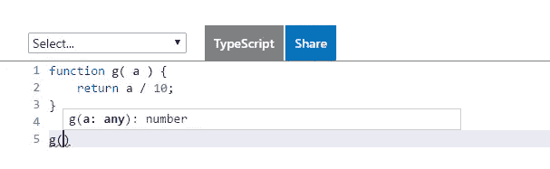

# TypeScript:静态还是动态？战争结束了。

> 原文：<https://itnext.io/typescript-static-or-dynamic-64bceb50b93e?source=collection_archive---------0----------------------->

TypeScript 越来越受欢迎，这让一场古老的静态和动态语言之战死灰复燃。当你参与其中时，你希望自己做好准备。使用 TypeScript 并不像许多人认为的那么简单，所以我们将简短地探讨一下编程语言理论的基础。让我们从看起来显而易见的事情开始。

> **动态类型化** —类型与运行时检查的**值、**和**相关联。**

```
function g( a ) {
    return a / 10;
}
```

> **静态类型化** —类型与**变量**或 ***文本表达式、*** *和* ***关联，在编译时检查*** 。

```
function g( a : number ) : number{
    return a / 10;
}
```

这太简单了，有人会奇怪我们为什么要讨论它。每个孩子都知道这个，真的。但是等等。在我们开始血腥的静态与动态之争之前，我们将更深入地探讨这个话题。因为在表象背后同时存在着有趣和困惑。

## 静态类型、类型注释和类型推断

所以，静态类型的问题是这些类型注释。你把它们添加到你的程序中…正因为如此，它变成了静态类型。像这样:

```
function g( a : number ) : number{
    return a / 10;
}
```

对吗？

不，当然不是:)。比那诡异多了。:)

如果你仔细观察上面的程序，你会注意到在这种情况下类型[可以从上下文](https://en.wikipedia.org/wiki/Type_inference)中确定。 *g()* 只能返回*号*，为了正确操作，必须将*号*作为参数。

> "[类型推断](https://en.wikipedia.org/wiki/Type_inference) " —可以从上下文中确定类型，使类型注释可选。

因此，具有*类型推断*能力的智能*静态类型系统*将允许您省略本例中的类型注释，并且仍然执行完整的静态类型检查。您的代码将如下所示，并且仍然是静态类型的*代码:*

```
function g( a ) {
    return a / 10;
}
```

> 什么？但是…它看起来和动态的一模一样！

是啊，没错。:)为了给你一些现实世界中具有这种语义的静态类型语言的例子，我可以提到 [ML 族编程语言](https://en.wikipedia.org/wiki/Category:ML_programming_language_family)和 [Haskell](https://en.wikipedia.org/wiki/Haskell_%28programming_language%29) 。它们基于 [Hindley-Milner 类型系统](https://en.wikipedia.org/wiki/Hindley%E2%80%93Milner_type_system)，该系统*保证*将从上下文中提取类型并进行静态检查。这意味着…

> 没有单一类型注释，你可以编写整个程序，它将是静态类型的程序。

那么，到底是什么让语言成为静态的或动态的呢？键入注释？不。差远了。

## 软类型系统和渐进类型

你还不够困惑吗？因为我忘了补充一点，动态语言也有类型注释功能。仅仅注意到它们中很少能够进行静态类型检查——对于 Erlang/Elixir 来说是[透析器工具](http://learnyousomeerlang.com/dialyzer),对于 JavaScript 来说是 [Google Closure 编译器](https://en.wikipedia.org/wiki/Google_Closure_Tools)。

为了弄清楚关于打字稿的事情并获得一些安心，让我们打开[打字稿语言游乐场](https://www.typescriptlang.org/play/index.html)，并在那里尝试我们的示例:



当您开始键入 *g()* 函数调用时，您将看到由 TypeScript 编译器从上下文中推断出的函数签名(*类型推断！*)。有趣的细节是*“a”的类型不是一个数字。*推断为 ***任何*** *。发生这种情况的原因非常重要。*

不，不是因为 TypeScript 的类型推断没有能力。事情是这样的，尽管既有*类型注释*又有*类型推理*，它仍然是*动态语言*。它还是假设你可以用**任意**参数类型调用 g()，以及它返回 *NaN* 时的有效情况。酷吧。

最后，到底是什么让*动态*？这不仅仅是做可选类型注释的机会；许多静态类型语言提供了同样的东西。这是**任何**类型的存在和*类型推理*工作方式的主要区别。与“数字”相比，它更喜欢“任意”类型，因此默认情况下它是动态的，就像普通的 JavaScript 一样。当你希望它更严格时，你必须添加类型注释。反之亦然。

> **这种类型注释与“** any”类型**的混合称为** [**渐进键入**](https://en.wikipedia.org/wiki/Gradual_typing) **。**默认选择“任意”时，称为“[软类型系统](http://courses.cs.ut.ee/2006/types/uploads/Main/cartwright91soft.pdf)”。与动态类型和静态类型并不完全相反，而是取二者之长。

关于 JavaScript 的动态特性，你能说的每一件好事(如果有的话，这取决于你来自哪个阵营)也适用于类型脚本。这不是“静态对动态”战争的主题。没有任何“对立面”，也不是强迫你做你讨厌或不喜欢做的事情。这是关于新的机会。

现在，假设您有动态语言背景，让我们简要概述一下类型注释和静态类型检查给您带来的机会，以及一些常见的误解。例如，你可能听说…

## 静态类型检查减少了代码中的缺陷数量？

如果你从字面上理解(正如许多人所做的)，这是错误的说法。稍微想一想。你的代码中的大量缺陷在最后完全取决于你的质量保证程序。无论你使用哪种编程语言，它都会找到所有重要的错误。你可以用汇编语言写。尽管如此，你的缺陷不会通过 QA。

事实是，开发人员*注入了或多或少相同数量的缺陷，*和静态类型检查允许他*更早地注意并修复这些缺陷的一部分*，因此花费的精力更少。

虽然很好，但这件事本身完全不是重点。至少不是很重要。大多数语言中的静态类型检查(TypeScript 也不例外)都太弱，无法与其他 QA 程序竞争。没什么好谈的。

那么，还有什么意义呢？为什么人们说 TypeScript 是大型系统开发人员期待已久的工具？因为…

## 有类型检查辅助的类型注释有助于您进行系统分解

当你处理复杂的事情时，你会怎么做？您可能会尝试将它拆分成一组具有清晰接口的独立部分。因此，你可以把注意力集中在单个部分，而不用费心去记住其他部分的实现细节，*，只要你知道它们的接口*。

> 类型注释为您提供了描述各部分之间接口的正式语言

当然，你可以用简单的英语描述这些界面。这个想法本身并不坏，但有一个问题。当你对系统进行修改时(这是我们工作的本质)，你应该保持你的文档同步。

你猜怎么着？人们通常不会这样做。结果，你就是*不能相信简单的英语规范*，不管它们乍一看有多好。

> 我总是制作漂亮的文档，并且总是让它们保持同步！

即使假设你真的属于那 1%(毫无疑问你是)。尽管如此，我还是不信任你。不是针对你，只是因为你是个人。而且人类是如此的不可靠……(你怎么能*真的保证*你的文档确实符合代码？你总是有心情吗？你*总是*有时间*没有借口*吗？你没有犯任何错误吗？你是一个人在努力，还是有一整队超级英雄在负责？)


软件开发团队准备每日文档更新。

> 类型注释是由编译器对照自身和代码检查的文档；保证*是正确的和最新的。*

类型注释是一种可以信任的技术文档。告诉你不符合规格的文件。不需要超级英雄。句号。

作为一种正式语言，类型注释实际上允许你以非常有效的方式表达和交流设计。当你处理大而乱的时，这是一个无价的工具，尤其是在团队中。

毕竟，正如肯尼斯·艾弗森在他的图灵讲座中指出的，符号不仅仅是符号。

> 符号是思维的工具。

如果有一种语言给你词语来表达设计，它给你机会有效地思考关于设计的问题。事实上，这是最重要的一点。

综上所述，TypeScript 不仅是前端开发人员工具链中有价值的补充，也是服务器端 NodeJS 开发的重要工具。这是*渐进打字*允许你在对你正在创建的东西的设计没有丝毫想法的时候，立刻从一个原型开始，并且在你想出它们的时候添加类型。

如果你问我，我讨厌被迫用静态语言做前期设计，我更讨厌当你的程序变得很大，你不知道你刚刚写了什么，你害怕接触它时，用动态语言的那种虚弱感。TypeScript 不强迫我选择，它反而适应我的自然开发风格，在每一步都提供协助。

静态语言和动态语言之间的冷战似乎终于结束了，我们开发人员可能只会欢迎它。