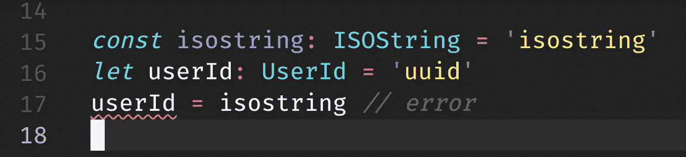

# 用 Typescript 键入基本类型

> 原文：<https://itnext.io/typing-basic-types-with-typescript-84288aa38b7c?source=collection_archive---------4----------------------->



所以这里有一个问题。我们有`string`和`ISOStrings`以及`ids`。

1.  我们不想将任何`string`分配给有`ISOString`的字段，但是`ISOString`应该可以分配给`string`
2.  我们不希望将一种数据类型的`id`赋给另一种数据类型的 id。

# 1:模板文字类型

自 4.1 版本以来，模板文本类型一直是 Typescript 的一部分。现在我们可以指定一个满足模板的`string`。

```
type Hello<Greeted extends string> = `Hello, ${Greeted}!`
type HelloWorld = Hello<'World'>
const hello1: HelloWorld = 'Hello, World!'
const hello2: HelloWorld = 'Hello, Oli!' // error
```

这样我们就可以用`${number}`来定义一个等值串。但是要小心，因为如果你“正确地”处理，结果类型将是一个有太多字段的`Union`类型。下面是我们如何为`ISOString` s 创建一个类型:

```
type PaddedNumber = `${'0' | ''}${number}`
type ISODate = `${number}-${PaddedNumber}-${PaddedNumber}`
type ISOTime = `${PaddedNumber}:${PaddedNumber}:${PaddedNumber}`
export type ISOString = `${ISODate}T${ISOTime}Z`
```

# 2:品牌

## 传统品牌

到目前为止，人们已经使用了某种“品牌化”的方法来使一个`id`不能分配给另一个`id`。例如:

```
interface UserBrand { type: 'User' }
type UserId = string & UserBrandinterface ArticleBrand { type: 'Article' }
type ArticleId = string & ArticleBrand
```

现在当我们…

```
const userId: UserId = user.id // ok
const articleId: ArticleId = userId // error
```

…这对我们的类型检查有很大的好处。但是，当我们这样做时，这种方法确实会引起问题。

```
const userId: UserId = 'user-id' // error
const userId2: UserId = 'user-id' as UserId // casting is ok
```

## 备选方案 1:允许分配基本类型的品牌

这里有一个来自[德鲁·科尔索普关于不透明类型的文章](https://spin.atomicobject.com/2018/01/15/typescript-flexible-nominal-typing/)的解决方案(在他的文章“调味”中)，通过使用这个接口，我们创建了一个带有`string`的联合类型，而不是不可相互赋值的类型

```
interface OpaqueType<OpaqueT> {
  _type?: OpaqueT;
}
export type Opaque<T, OpaqueT> = T & OpaqueType<OpaqueT>;
```

现在，如果我们将 id 类型更改为…

```
type UserId = Opaque<string, "User”>
type ArticleId = Opaque<number, "Article">
```

我们现在得到这样的效果:

```
const userId: UserId = 'user-id' // ok
const articleId: ArticleId = 'article-id // ok
const userId2: UserId = articleId // error
```

## 使用“唯一符号”

使用`unique symbol`可以保护品牌的单一真实来源，并确保两个品牌永远不会相同。例如，我们可以创建两个 ISOString 品牌，如下所示:

```
type ISOString = string & {readonly ISOString: unique symbol}
type ISOString2 = string & {readonly ISOString: unique symbol}
let isoString1: ISOString = 'isostring' as ISOString // ok
let isoString2: ISOString2 = 'isostring2' as ISOString2 // ok
isoString1 = isoString2 // error
```

同样，你可以用一个独特的符号来代替不透明的文字。

```
type ISOString = Opaque<string, { readonly T: unique symbol }>
type ISOString2 = Opaque<string, { readonly T: unique symbol }>
const isostring: ISOString = 'isostring'
let alsoIsostring: ISOString2 = 'isostring'
alsoIsostring = isostring // error
```

差别是微妙的。假设两个人用相同的签名创造了相同的品牌，那么用`unique symbol`他们将不可互换。代码库越大，你就越需要知道你正在导入正确的`CommentId`或类型。

## 什么时候应该使用哪个？

当然，这取决于你的需要。

*   如果你想要一个内置的字符串验证，那么使用一个模板文字
*   如果你想确保人们不会混淆不同格式的 id 或字符串，那么就使用某种品牌。
*   如果你两个都需要，那就两个都用。

到此为止，快乐编码！

## 附录:图书推荐

这些书让我跨越了几年的经验，对你也一样。罗伯特·马丁的
* [干净的代码
*](https://amzn.to/3z083SU) [罗伯特·马丁的](https://amzn.to/2UyrEdS)干净的架构