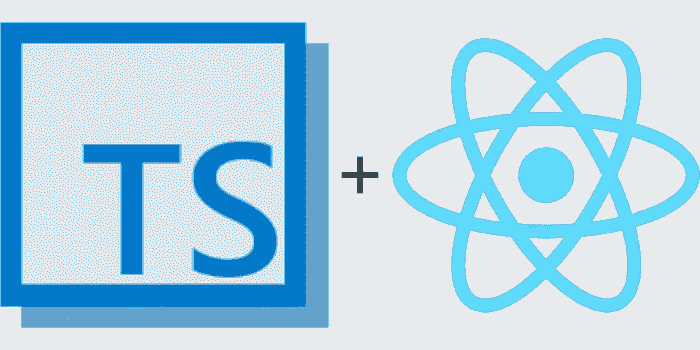

# 键入 React (1) —基本

> 原文：<https://itnext.io/typing-react-1-basic-488f661149f6?source=collection_archive---------4----------------------->



TypeScript 越来越受欢迎。键入系统有助于在编译时消除大多数编码错误。一般来说，TypeScript 花费你大量的时间在编码和打字上，但是稍后我会为你节省更多的调试时间。

本系列文章试图简化打字的痛苦工作，尤其是当您不太熟悉 TypeScript 时。因此，我们将把重点放在类型上，而不是其他——任何与 TypeScript 无关的东西，比如 redux 的使用，都将被忽略。

这个系列的演示项目可以在我的 GitHub 下载:[https://github.com/charlee/todolist](https://github.com/charlee/todolist)。

# 创建项目

流行的`create-react-app`工具现在支持直接用 TypeScript 创建应用程序。

```
$ create-react-app todolist --typescript
$ cd todolist
```

打开项目文件夹，你会看到`index.tsx`和`App.tsx`文件。命名约定是，最初使用 JSX 的文件以`.tsx`结尾，纯类型脚本文件以`.ts`结尾。

您可能注意到 TypeScript 抱怨 React 的导出有一个隐式的`any`类型。这是因为最初的 React 不包含任何类型定义。通过安装`@types/react`来解决这个问题:

```
$ npm install --save @types/react
```

我还会推荐在项目根目录中添加一个`.prettierrc.yaml`，内容如下。如果您使用的是 Visual Studio 代码，可以按 Cmd+Shift+F (Mac)或 Ctrl+Shift+I (Windows/Linux)来自动格式化文件:

```
printWidth: 90
tabWidth: 2
singleQuote: true
trailingComma: all
```

# 成分

在一个地方定义所有的数据模型也是有用的，即`src/models/types.d.ts`:

```
declare module 'Models' {
  export interface Todo {
    id: number;
    text: string;
    done: boolean;
  };

  export type TodoList = Todo[];
}
```

创建组件时，需要为道具创建一个接口类型:

```
import React, { useState } from 'react';
import { Todo } from 'Models';

export interface IProps {
  todo: Todo;
}

const Todo: React.FC<Todo> = props => {
  const { todo } = props;
  const [expanded, setExpanded] = useState<boolean>(false);
  return <div>{todo.text}</div>;
};

export default Todo;
```

或者，如果您需要用类定义旧样式组件，您可以这样做:

```
import React from 'react';
import { Todo } from 'Models';

export interface IProps {
  todo: Todo;
}

export interface IState {
  expanded: boolean;
}

class Todo extends React.Component<IProps, IState> {
  state: IState = {
    expanded: false,
  };

  render() {
    const { todo } = this.props;
    return <div>{todo.text}</div>;
  }
}

export default Todo;
```

注意，在类定义中，我们需要显式定义`state`属性的类型。这是因为 TypeScript 无法从类(即`React.Component<IProps, IState>`)中推断其类型。省略类似`state = { expanded: false }`的类型适用于这种简单的情况，但是如果状态包含任何类型化的列表，TypeScript 将抱怨空列表不符合列表的类型:

```
// State type definition
export interface IState {
  todos: Todo[];
}

class TodoList extends React.Component<IProps, IState> {
  state = { todos: [] };  // WRONG: [] does not match Todo[]
}
```

# 通用组件

TypeScript 的一个优点是通用性。它允许我们从代码中提取算法。类似地，我们也可以创建通用组件来处理一些常见的 UI 行为。

下面的例子展示了一个名为`FilteredList`的通用组件。它接受任意类型的对象列表和一个过滤函数，并用过滤函数过滤对象列表，然后将过滤后的列表传递给其子对象。

```
import React from 'react';

export interface IProps<T> {
  objects: T[];
  filter: (o: T) => boolean;
  children: (objects: T[]) => JSX.Element;
}

const FilteredList = <T extends {}>(props: IProps<T>) => {
  const { children, objects, filter } = props;
  const filtered = objects.filter(o => filter(o));
  return <React.Fragment>{children(filtered)}</React.Fragment>;
};

export default FilteredList;
```

在上面的代码中，我们使用了一个技巧`<T extends {}>`而不是`<T>`。尽管`<T>`在 TypeScript 中是合法的，但在 JSX 中它会被识别为一个标签，并产生一个编译错误。

请注意，尽管`FilteredList`是泛型，但在某些情况下它可以直接使用，因为 TypeScript 可以从其属性中推断出其类型参数:

```
export interface Todo {
  id: number;
  name: string;
}

export interface IProps {
  todos: Todo[];
}

const TodoList: React.FC<IProps> = props => {
  const { todos } = props;
  return (
    <FilteredList objects={todos} filter={o => o.name.startsWith('[URGENT]')}>
      {todos => (
        <React.Fragment>
          {todos.map(todo => (
            <TodoItem todo={todo} />
          ))}
        </React.Fragment>
      )}
    </FilteredList>
  );
};
```

这里我们没有指定使用`<FilteredList>`时`T`是什么。完全是从它的`objects`属性推断出来的。

这个帖子到此为止。我知道我没有涵盖关于打字的所有内容，所以欢迎您在这里评论任何您认为值得一提的内容。感谢阅读！

*原载于 2019 年 5 月 26 日*[*charlee . Li*](https://charlee.li/typeing-react-1-basic/)*。*