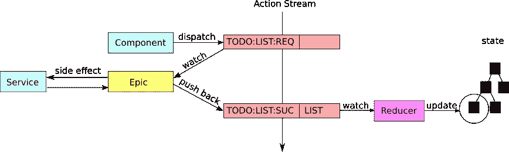

# 键入 React (3) Redux

> 原文：<https://itnext.io/typing-react-3-redux-84e73e41db7f?source=collection_archive---------3----------------------->


在以前的文章中，我们已经解释了如何在常规 React 和 Material-UI 中使用 TypeScript。在这篇文章中，我将展示最重要和最困难的部分:redux。

以前的文章可以在这里找到:

*   [打字反应(1) —基本](/typing-react-1-basic-488f661149f6)
*   [键入 React(2) — Material-UI](/typing-react-2-material-ui-9e95a4aec6bc)

本文中使用的包是:

```
$ npm install --save redux react-redux typesafe-actions \
              rxjs redux-observable lodash reselect \
              @types/react-redux
```

使用 redux 最常见和推荐的方式是用`redux` + `typesafe-actions` + `redux-observable`的组合。配置有点复杂，所以我将一部分一部分地解释。

# 基本概念

在本教程中，我将使用以下目录结构:

```
src/
  |- store
  |    |- actions
  |    |- reducers
  |    |- epics
  |    `- selectors
  `- services
```

目录名应该非常简单明了。

下图是`redux` + `typesafe-action` + `redux-observable`的整体概念。



Redux 商店的概念

*   redux 存储的核心部分是一个动作流。一个动作只是一段带有两个字段的数据:`{ type: string; payload: any }`。由于是流，所以可以用`rxjs` `Observable`来表示。
*   动作以两种方式生成:由组件调度，或者由 Epic 生成。
*   一个组件可以在任何时候调度一个动作。通常这是由一个事件触发的，比如在页面加载后调度一个`LIST`事件，或者在用户点击一个按钮后调度一个`SAVE`事件。
*   史诗是观看动作流的对象。当一个特定的动作出现在流中时，epic 会做一些事情(通常是副作用)，然后将零个或多个动作(通常是一个)推回到流中。这里的“副作用”一词只是指依赖于存储之外的东西，例如 API 调用、DOM 操作，甚至打印日志消息。
*   缩减器监视动作流，并在必要时转换状态。

这看起来很复杂，所以举例说明会有好处。假设我们想从 API 中检索所有的待办事项:

*   组件调度一个类型为`TODO:LIST:REQUEST`的动作。
*   Epic 看到这个动作并触发一个 API 调用。API 调用返回后，它从响应中提取 Todo 列表，用 Todo 列表数据组装一个`TODO:LIST:SUCCESS`动作，然后将这个动作推回到流中。
*   缩减器接收`TODO:LIST:SUCCESS`动作并从中提取待办事项列表数据，然后用待办事项列表更新全局状态。

# 行动

让我们从动作开始。有两个类别:

*   标准动作，单纯的一个动作；
*   异步动作，由三个动作组成:`REQUEST`、`SUCCESS`、`FAILURE`，用于异步调用。

```
import { createAsyncAction, createStandardAction } from 'typesafe-actions';
import { Todo } from 'Models';// Standard action
export const setNote = createStandardAction('NOTE:SET_NOTE')<string>();// Asynchronized actions
export const listTodo = createAsyncAction(
  'TODO:LIST:REQUEST',
  'TODO:LIST:SUCCESS',
  'TODO:LIST:FAILURE',
)<void, Todo[], Error>();
```

函数调用后的类型参数(如`<string>`、`<void, Todo[], Error>`)是动作的有效载荷类型。

# 还原剂

下面的代码示例显示了一个由两个主要字段组成的[规范化存储](https://redux.js.org/recipes/structuring-reducers/normalizing-state-shape):`byId`和`allIds`。该准则涵盖的几个要点是:

*   您需要声明一个状态类型`TodoState`来定义状态的形状。注意所有的对象都应该被标记为`Readonly`以表明状态是不可变的。特别是，嵌套对象也应该标记为`Readonly`。
*   使用`TodoState['byId']`访问属性类型。
*   `RootAction`是一个聚合类型，我们将在后面解释。现在你只需要知道它代表了所有可能的行为。

```
import _ from 'lodash';
import { getType } from 'typesafe-actions';
import { combineReducers } from 'redux';
import { Todo } from 'Models';
import { listTodo } from '../actions/todo';
import { RootAction } from 'StoreTypes';

export type TodoState = Readonly<{
  byId: Readonly<{ [key: number]: Todo }>;
  allIds: number[];
  loading: boolean;
}>;

const initialState: TodoState = {
  byId: {},
  allIds: [],
  loading: false,
};

const byId = (state: TodoState['byId'] = initialState.byId, action: RootAction) => {
  switch (action.type) {
    case getType(listTodo.success):
      return _.keyBy(action.payload, 'id');
    default:
      return state;
  }
};

const allIds = (state: TodoState['allIds'] = initialState.allIds, action: RootAction) => {
  switch (action.type) {
    case getType(listTodo.success):
      return _.map(action.payload, 'id');
    default:
      return state;
  }
};

const loading = (
  state: TodoState['loading'] = initialState.loading,
  action: RootAction,
) => {
  switch (action.type) {
    case getType(listTodo.request):
      return true;
    case getType(listTodo.success):
    case getType(listTodo.failure):
      return false;
    default:
      return state;
  }
};

export default combineReducers({ byId, allIds, loading });
```

# 史诗

Epics 是监视动作流并在特殊动作出现时做一些事情的函数。通常，它是一个带有一系列操作符的`actions$.pipe()`调用。第一个操作符通常是一个`filter(isOfType(getType(action)))`来过滤掉我们感兴趣的动作。并且操作符序列最终应该返回零个或多个动作，这些动作将被推回到动作流。

```
export const ListTodoEpic: RootEpic = (actions$, store, { todos }) =>
  actions$.pipe(
    filter(isOfType(getType(listTodo.request))),
    mergeMap(action =>
      todos.listTodos$().pipe(map(listTodo.success)),
    catchError(err => of(listTodo.failure(err))),
  );
```

注意，史诗不应该返回它感兴趣的动作！这将创建一个无限循环。例如:

```
// DON'T DO THIS!
export const InfinityLoopEpic: RootEpic = (actions$, store, { todos }) =>
  actions$.pipe(
    filter(isOfType(getType(listTodo.request))),
    mergeMap(action => action),
  );
```

# 类型

为了使输入更容易，我们可以声明一些全局类型。这是通过向`reducers`、`actions`和`epics`目录添加一个`index.ts`和一个`types.d.ts`来声明类型来实现的。

```
// =================================
// actions/index.ts
import * as TodoActions from './todo';export default {
  todos: TodoActions,
}; // =================================
// reducers/index.ts
import todos from './todo';
import { combineReducers } from 'redux';
export default combineReducers({
  todos,
});// =================================
// epics/index.ts
import { combineEpics } from 'redux-observable';
import * as todoEpic from './todo';
export default combineEpics(
  ...Object.values(todoEpic),
);
```

注意`combineEpics`和`combineReducers`采用不同的参数。`combineEpics`采用单个史诗的列表(这就是为什么我们需要销毁导入的对象值)，而`combineReducers`采用树形结构。

下面的代码显示了如何定义根类型。

```
// store/types.d.ts
declare module 'StoreTypes' {
  import { StateType, ActionType } from 'typesafe-actions';
  import { Services } from 'ServiceTypes';
  import { Epic } from 'redux-observable';
  export type Store = StateType<typeof import('./index').default>;
  export type RootAction = ActionType<typeof import('./actions').default>;
  export type RootState = StateType<ReturnType<typeof import('./reducers').default>>;
  export type RootEpic = Epic<RootAction, RootAction, RootState, Services>;
}
```

# 创建商店

现在，reducers 和 epics 已经准备好了，我们可以编写代码来创建存储:

```
import { applyMiddleware, createStore, compose } from 'redux';
import { createEpicMiddleware } from 'redux-observable';import { RootAction, RootState } from 'StoreTypes';
import { Services } from 'ServiceTypes';import rootReducer from './reducers';
import rootEpic from './epics';
import services from '../services';export const epicMiddleware = createEpicMiddleware<
  RootAction,
  RootAction,
  RootState,
  Services
>({ dependencies: services });export const composeEnhancers =
  (window as any).__REDUX_DEVTOOLS_EXTENSION_COMPOSE__ || compose;// configure middlewares
const middlewares = [epicMiddleware];
// compose enhancers
const enhancer = composeEnhancers(applyMiddleware(...middlewares));// rehydrate state on app start
const initialState = {};// create store
const store = createStore(rootReducer, initialState, enhancer);epicMiddleware.run(rootEpic);// export store singleton instance
export default store;
```

# 选择器

选择器的类型非常简单。

```
import { createSelector } from 'reselect';
import { RootState } from 'StoreTypes';export const selectTodoEntities = (state: RootState) => state.todos.byId;
export const selectTodoAllIds = (state: RootState) => state.todos.allIds;
export const selectTodoLoading = (state: RootState) => state.todos.loading;export const selectTodoList = createSelector(
  [selectTodoEntities, selectTodoAllIds],
  (entities, allIds) => allIds.map(id => entities[id]),
);
```

# 成分

最后一部分是将商店映射到组件。因为我们需要访问由`mapStateToProps`和`mapDispatchToProps`映射的属性，所以我们需要在`IProps`类型中定义这些属性。所以我们可以这样定义`IProps`:

```
import React, { useEffect } from 'react';
import { connect } from 'react-redux';
import { RootState } from 'StoreTypes';
import { selectTodoList } from '../store/selectors/todo';
import { Dispatch } from 'redux';
import { listTodo } from '../store/actions/todo';
import TodoItem from './TodoItem';const mapStateToProps = (state: RootState) => ({
  todos: selectTodoList(state),
});const mapDispatchToProps = (dispatch: Dispatch) => ({
  listTodo: () => dispatch(listTodo.request()),
});export interface IProps
  extends ReturnType<typeof mapStateToProps>,
    ReturnType<typeof mapDispatchToProps> {}const TodoList = (props: IProps) => {
  const { todos, listTodo } = props; useEffect(() => {
    listTodo();
  }, []); return (
    <div>
      {todos.map(todo => (
        <TodoItem todo={todo} />
      ))}
    </div>
  );
};export default connect(mapStateToProps, mapDispatchToProps)(TodoList);
```

打 redux 就这么多。感谢阅读！