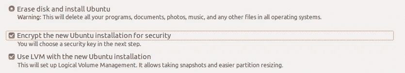

# Ubuntu —如何使用英特尔 Optane 内存进行固态硬盘缓存

> 原文：<https://itnext.io/ubuntu-how-to-use-intel-optane-memory-for-ssd-caching-42839b9ab3b9?source=collection_archive---------7----------------------->

# 如何使用英特尔 Optane 内存进行固态硬盘缓存

最近，Opvizor 的 Michael 订购了一台新的笔记本电脑——HP ProBook 650 G5。下面是他使用 Ubuntu 启用英特尔 Optane 的故事。

沉迷于 Linux，很明显决定清除 Windows 并安装 Ubuntu，目前是 18.04 LTS。
但是且慢:

**该机器配备了“带固态存储的英特尔 OPTANE 内存 H10”。**

**那是什么？** 问谷歌帮:

它是一个带有额外的非易失性高速缓存的固态磁盘。该缓存由 Optane 内存构成，比 DRAM 慢，但比闪存快，而且是非易失性的。
对 Windows 用户来说很容易——有预装的英特尔 RST 驱动程序，它将 Optane 内存设置为固态硬盘的缓存。但是在 Linux 中呢？英特尔对此不提供驱动程序支持。

然而，使用 Optane 内存并不难。网上很多人建议把它作为一个独立的，快速的，但也很小的磁盘来使用。

但我的工作负载各不相同，我不想浪费时间来决定在 Optane 上放什么，在 flash 上放什么。所以我也想使用 Optane 内存作为缓存，就像 Windows 用户所做的那样。

# Linux 中的 Optane 内存

在物理层，设备分为两个独立的 nvme 设备:

```
lspci | grep "Non-Volatile"
02:00.0 Non-Volatile memory controller: Intel Corporation Device 0975 (rev 03)
03:00.0 Non-Volatile memory controller: Intel Corporation Device 0975
```

这些设备被映射为/dev/nvme0 和/dev/nvme1，由于 nvme 技术，可用的块设备是/dev/nvme0n1 和/dev/nvme1n1(也称为 nvme 命名空间)。

所以第一步是禁用 BIOS 选项“高级/系统选项/为英特尔 Optane 配置存储控制器”。查看控制器的可选 ROM，确保不再有组合设备。

这些选项旨在让 RST 驱动程序识别由这两个组件构成的设备。但是在 Linux 中，我们将在没有 RST 的情况下这样做，所以不需要那个选项。

请注意:由于在 Linux 中不支持使用 Optane 内存的 RST 缓存，所以您不能在配置了 RST 缓存的情况下双启动 Windows 和 Linux。要么关闭 Windows 中的 Optane，要么将 Windows 放入 Linux 操作系统中的 VM。为了让事情不复杂，下面就不考虑双开机了。

# 装置

# 第一步

从常规安装开始，使用带有 LVM 和 LUKS 加密的完整 SSD (/dev/nvme0n1)。对于后面的步骤，LVM 是强制性的，加密是可选的，但假设已启用。因此，在安装程序中，这些是选项:



安装后，最终的磁盘布局非常简单:

```
Device           Start        End   Sectors   Size Type
/dev/nvme0n1p1    2048    1050623   1048576   512M EFI System
/dev/nvme0n1p2 1050624    2549759   1499136   732M Linux filesystem
/dev/nvme0n1p3 2549760 1000214527 997664768 475.7G Linux filesystem
```

nvme0n1p1 持有 */boot/efi* ， *nvme0n1p2* 持有 */boot* ， *nvme0n1p3* 持有一个 LUKS 容器，该容器被 LVM 用作卷组 *ubuntu-vg* 的物理设备。LVM 为交换和根提供逻辑卷。

# 配置 LUKS

成功引导到新系统后，下一步是配置 LUKS 加密层:

```
# Setup the LUKS container holding the crypted Optane Memory:
sudo cryptsetup luksFormat /dev/nvme1n1

# Open the LUKS device:
sudo cryptsetup luksOpen /dev/nvme1n1 nvme1n1_crypt

# Add the LUKS device to the existing volume group:
sudo vgextend ubuntu-vg /dev/mapper/nvme1n1_crypt

# Get the UUID of the LUKS container:
sudo blkid /dev/nvme1n1

# Copy the blkid to you clipboard. Now edit the file /etc/crypttab, e.g. with the command 
sudo pico /etc/crypttab
```

*/etc/crypttab* 的目的是保存加密设备的列表。这些信息对于引导系统至关重要。设备 *nvme0n1p3_crypt* 应该已经有一行了。现在添加 nvme1n1_crypt 行，使用上一步中的 UUID。

```
nvme0n1p3_crypt UUID=a4850a5a-3f97-4bf4-a965-63b162c0f88d none luks,discard
nvme1n1_crypt   UUID=f338d02f-de8d-478f-80ec-175d0d88db58 none luks
```

当然，你的 UUIDs 会有所不同。丢弃选项不适用于基于 Optane 的设备，因为 Optane 内存的工作方式与闪存不同，因此不需要丢弃。

# lvmcache

缓存是用 [lvmcache](https://wiki.archlinux.org/index.php/LVM#LVM_cache) 构建的，给出了一个简洁的解释。使用命令:

```
sudo lvcreate --type cache --cachemode writeback -l100%FREE -n root_cachepool ubuntu-vg/root /dev/mapper/nvme1n1_crypt
```

给出这个命令后，您使用完整的 optane 内存创建了一个缓存池。由于精简资源调配功能，该池为内核驱动程序 dm-cache 所需的缓存和元数据设备提供服务。

缓存是为逻辑卷根(保存根文件系统)创建的。缓存模式设置为写回，这非常好，因为您使用的是非易失性内存！

# 不要重启！

现在:不要重启，因为机器不会再次启动！你必须做一些额外的工作。启用 universe-repositories 并安装精简配置工具。

这些将需要在启动时检查缓存设备的一致性。

```
sudo apt update 
sudo apt install thin-provisioning-tools
```

# 编写精简资源调配工具脚本

下载脚本 thin-provisioning-tools 并将其安装到目录/usr/share/initramfs-tools/hooks:

下载[精简配置工具](https://storage.googleapis.com/opvizor/thin-provisioning-tools)

```
sudo chown root:root ~/Downloads/thin-provisioning-tools
sudo chmod 0755 ~/Downloads/thin-provisioning-tools
sudo mv ~/Downloads/thin-provisioning-tools /usr/share/initramfs-tools/hooks/
```

该脚本基于这篇[文章](https://bugs.launchpad.net/ubuntu/+source/lvm2/+bug/1634697)，添加了对 lvmcache 的支持。这个脚本的目的是将精简配置工具的二进制文件放到初始 ramdisk 上，并加载所需的内核模块进行缓存。

# 结束

```
sudo update-initramfs -k all -u
```

这些初始 ramdisk 支持:

*   基于 Optane 存储器的第二 LUKS 器件
*   运行缓存所需的内核驱动程序
*   启动缓存卷所需的用于检查缓存卷的工具

现在，您将被保存以重新启动。当被问两次 LUKS 密码时不要害怕:一次是 nvme0n1p3_crypt，一次是 nvme1n1_crypt。

# 结果

要快速了解缓存的使用情况，可以发出以下命令

```
sudo lvdisplay /dev/ubuntu-vg/root
```

您可以随着时间的推移重复该命令。您将看到缓存中充满了数据，当查看命中/未命中比率时，您将看到效率在提高。例如

```
--- Logical volume ---
  LV Path                /dev/ubuntu-vg/root
  LV Name                root
  VG Name                ubuntu-vg
  LV UUID                xrD6tK-Ovfn-pweo-EuR2-bvid-xBsg-36GZ5b
  LV Write Access        read/write
  LV Creation host, time ubuntu, 2020-03-18 11:09:25 +0100
  LV Cache pool name     root_cachepool
  LV Cache origin name   root_corig
  LV Status              available
  # open                 1
  LV Size                464,00 GiB
  Cache used blocks      39,17%
  Cache metadata blocks  11,07%
  Cache dirty blocks     0,01%
  Cache read hits/misses 625340 / 443779
  Cache wrt hits/misses  985117 / 2027530
  Cache demotions        0
  Cache promotions       172267
  Current LE             118784
  Segments               1
  Allocation             inherit
  Read ahead sectors     auto
  - currently set to     256
  Block device           253:5
```

# 附加注释

如果您决定从配置中删除缓存，请运行

```
sudo lvconvert --uncache ubuntu-vg/root
```

通常，Ubuntu 18.04 会为交换创建一个逻辑卷。考虑用根文件系统中的交换文件来替换它。逻辑卷交换不使用 Optane 内存进行缓存，但是逻辑卷根目录可以。

*原载于 2020 年 3 月 25 日 https://www.opvizor.com*[](https://www.opvizor.com/ubuntu-how-to-use-intel-optane-memory-for-ssd-caching)**。**