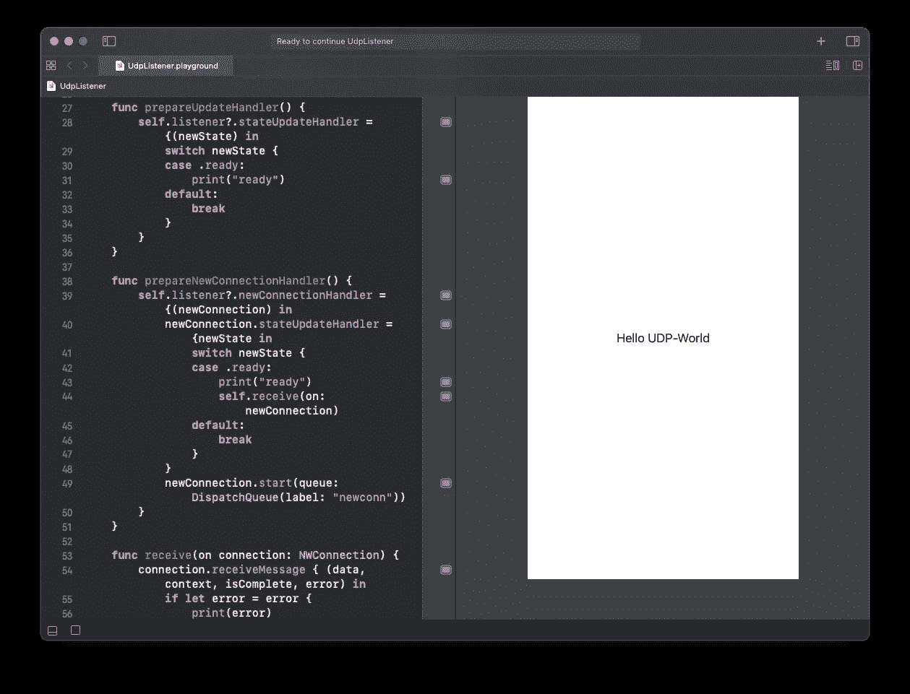

# Swift 中的 UDP 监听器

> 原文：<https://itnext.io/udp-listener-in-swift-1e4a0c0aa461?source=collection_archive---------1----------------------->

## 关于如何用 Swift 实现 UDP 监听器的教程。



在这篇文章中，我将展示使用[苹果网络框架](https://developer.apple.com/documentation/network)实现 UDP 监听器的必要步骤。SwiftUI-View 将显示所有传入的 UDP 消息。所有代码都可以在一个方便的 XCode-Playground 中找到。

“另一边”是一个 UDP 发送者，我在之前的帖子中已经解释过了:

[](https://twissmueller.medium.com/network-framework-swiftui-and-ryze-tello-7b844b8d1225) [## 使用 Swift 发送和接收 UDP 报文

### 苹果网络框架的一个实例

twissmueller.medium.com](https://twissmueller.medium.com/network-framework-swiftui-and-ryze-tello-7b844b8d1225) 

本文分为以下几个部分:

*   创建监听器
*   接受新连接
*   接收消息
*   启动监听器
*   测试监听器

我创建了一个 XCode-Playground，在 SwitUI-View 中显示所有收到的消息。这里有一个小视频展示了它的作用。

**完整的 Xcode 游乐场可以从这里下载:**[**Swift 中的 UDP 监听器**](https://www.buymeacoffee.com/twissmueller/e/28132)

## 创建监听器

一切都基于`[NWListener](https://developer.apple.com/documentation/network/nwlistener)`，它被描述为

> "用来监听传入网络连接的对象."

让我们从实例化一个开始。

```
var listener: NWListener?

do {
    listener = try NWListener(using: .udp, on: port)
} catch {
    print("exception upon creating listener")
}
```

接下来，需要定义`[stateUpdateHandler](https://developer.apple.com/documentation/network/nwlistener/2998670-stateupdatehandler)`的行为。其描述如下:

> "接收侦听器状态更新的处理程序."

```
listener?.stateUpdateHandler = {(newState) in
    switch newState {
    case .ready:
        print("ready")
    default:
        break
    }
}
```

## 接受新连接

现在，侦听器可以处理状态更新，但是当一个新的连接被创建时，乐趣就开始了。

需要实现另一个处理程序。它就是`[newConnectionHandler](https://developer.apple.com/documentation/network/nwlistener/ 2998663-newconnectionhandler)`，在文档中解释为

> "接收入站连接的处理程序."

让我们不要忽略连接实际上是“开始”的最后一行。

```
listener?.newConnectionHandler = {(newConnection) in
    newConnection.stateUpdateHandler = {newState in
        switch newState {
        case .ready:
            print("ready")
        default:
            break
        }
    }
    newConnection.start(queue: DispatchQueue(label: "newconn"))
}
```

## 接收消息

当连接就绪时，需要为 [**接收消息**](https://developer.apple.com/documentation/network/nwconnection/3020638-receivemessage) 分配一个处理程序:

"为完整的消息安排单个接收完成处理程序，而不是一个字节范围. "

这让生活变得简单多了！

```
connection.receiveMessage { (data, context, isComplete, error) in
    // Decode and continue processing data
}
```

## 启动监听器

用`[start](https://developer.apple.com/documentation/network/nwlistener/2998669-start)`启动监听器的一切都准备好了，描述如下:

> "注册侦听，并设置传递所有侦听器事件的队列."

```
listener?.start(queue: .main)
```

## 测试监听器

一切就绪并开始运行后，是时候测试代码了。最简单的方法是启动终端应用程序，并键入以下内容:

```
echo -n "Hello UDP-World" | nc -4u -w1 -localhost 1024
```

对于那些不太熟悉命令行的人，我已经从所用工具的手册页中提供了一些解释。

首先，消息是用`echo`创建的。

什么是`echo`？

> " echo 实用程序将任何指定的操作数写入标准输出，用单个空格(`') characters and followed by a newline (`\ n’)字符分隔。

鉴于`-n`参数被记录为

> "不要打印尾随换行符。这也可以通过在由 Cor 修订的 IEEE Std 1003.1-2001(‘POSIX . 1’)中附加`\c' to the end of the string, as is done by iBCS2 compatible systems. Note that this option as well as the effect of`\ c’are 实现定义来实现。1-2002.强烈建议以最大的可移植性为目标的应用程序使用 printf(1)来取消换行符。"

通过管道命令`|`，该消息被送入另一个工具，该工具通过网络发送该消息:`netcat`或简称`nc`:

> nc(或 netcat)实用程序几乎用于世界上任何涉及 TCP 或 UDP 的事情。它可以打开 TCP 连接，发送 UDP 数据包，监听任意 TCP 和 UDP 端口，进行端口扫描，并处理 IPv4 和 IPv6。与 telnet(1)不同，nc 很好地编写了脚本，并将错误消息分离到标准错误中，而不是像 telnet(1)那样发送到标准输出中

正在使用以下参数:

`-4`:强制 nc 仅使用 IPv4 地址。

`-u`:使用 UDP 代替 TCP 的默认选项。

`-w timeout`:如果连接和 stdin 空闲时间超过超时秒，则连接会自动关闭。-w 标志对-l 选项没有影响，也就是说，不管有没有-w 标志，nc 都会永远监听连接。默认情况下没有超时。

## 结论

有了这段代码，你现在应该能够接收来自任何发送者的 UDP 消息，并处理你的应用程序应该做的任何事情的传入消息。

**完整的 Xcode 游乐场可以从这里下载:** [**雨燕中的 UDP 监听器**](https://www.buymeacoffee.com/twissmueller/e/28132)

感谢您的阅读！

*   如果你喜欢这个，请[在 Medium](https://twissmueller.medium.com/) 上跟随我
*   给我买杯咖啡让我继续前进
*   通过[在这里注册](https://twissmueller.medium.com/membership)来支持我和其他媒体作者

[https://twissmueller.medium.com/membership](https://twissmueller.medium.com/membership)

## 资源

*   [NWListener](https://developer.apple.com/documentation/network/nwlistener)
*   [NW 连接](https://developer.apple.com/documentation/network/nwconnection)
*   [使用 SwiftUI 进行裸联网](https://marklucking.medium.com/naked-networking-with-swiftui-3f20b809d7f4)