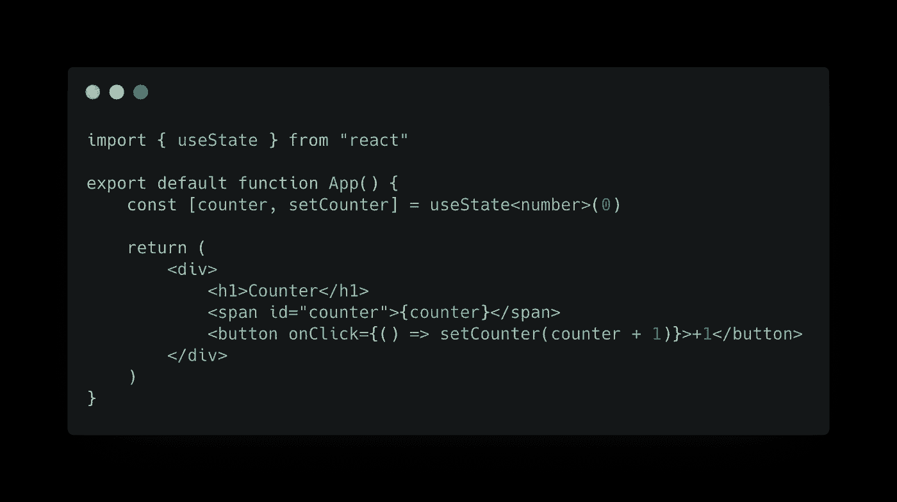
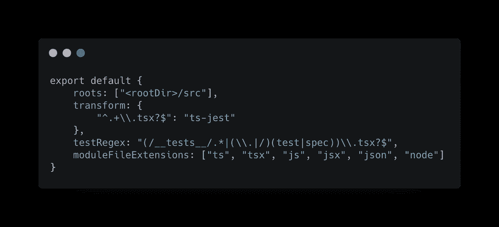
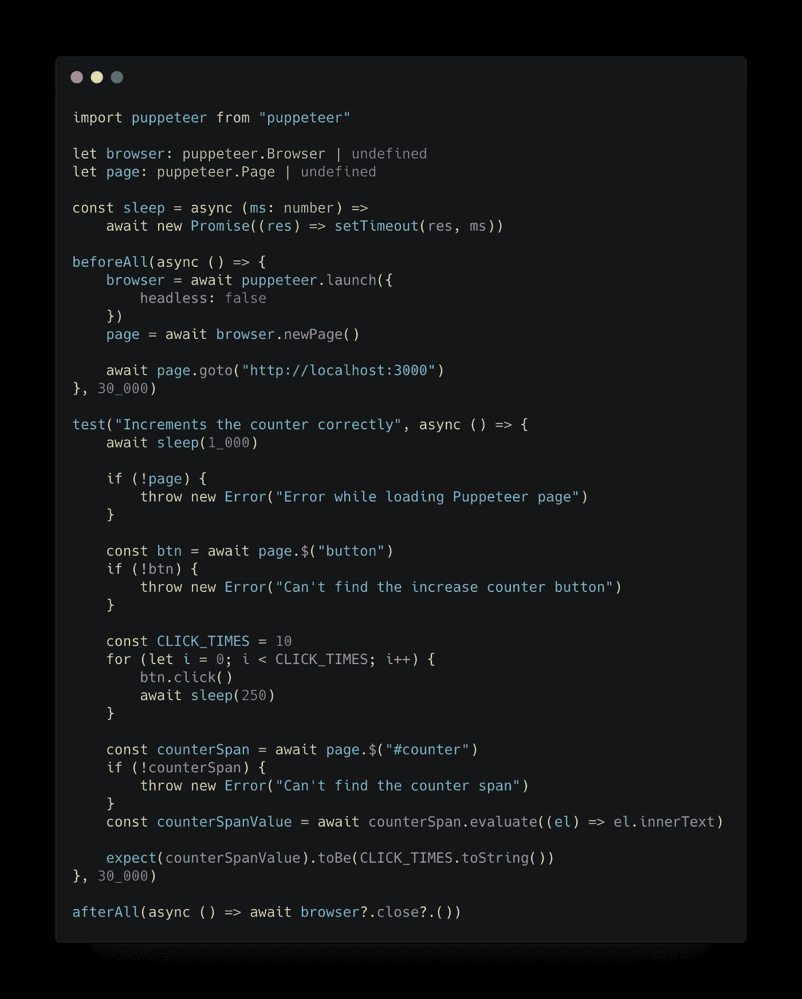
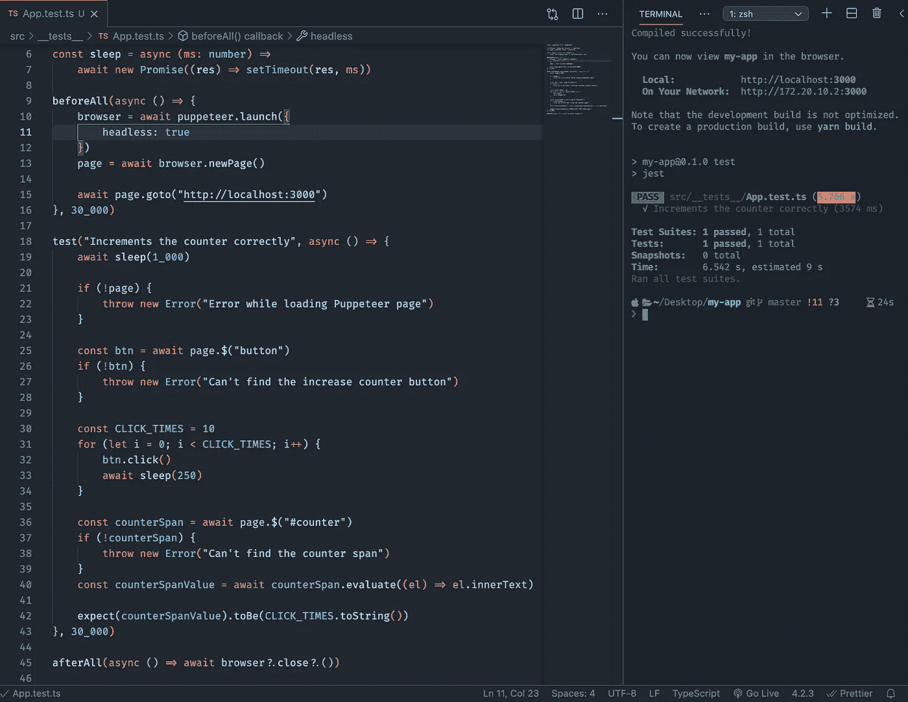

# 使用 Puppeteer 和 Jest 测试 TypeScript React 应用程序的用户界面

> 原文：<https://itnext.io/ui-testing-typescript-react-apps-with-puppeteer-and-jest-a48684f5d8dc?source=collection_archive---------4----------------------->

在本文中，我将向您展示如何在 React 项目中正确配置木偶师。

Puppeteer 是 Google 开发的一个库，它帮助我们简化 UI 测试。

首先，让我们通过运行`create-react-app`包来创建一个简单的新 app。

`$ npx create-react-app my-app --template typescript`

这是我们简单的应用程序:

App.tsx

当然，我们需要安装一些开发依赖项:

`$ npm i -D jest puppeteer start-server-and-test ts-jest ts-node @types/jest @types/puppeteer`

现在，我们可以设置 Jest。
在项目的根路径下创建一个名为“jest.config.ts”的新文件:

jest.config.ts

在“src”文件夹中创建一个名为“__tests__”的新文件夹:这是我们所有测试的位置。
在这个文件夹中，让我们创建第一个名为“App.test.ts”的测试文件:

应用测试

该脚本将:

1.  在 headless(“不可见”)模式下启动一个新的 Chromium 实例(内置于木偶师包中)
2.  创建一个指向本地开发服务器的新选项卡
3.  点击“增加计数器”按钮 10 次
4.  检查我们计数器的值是否是 10
5.  关闭浏览器实例

在启动测试之前，我们需要等待本地服务器启动并运行。

这就是`start-server-and-test`图书馆来救援的地方。

打开“package.json”:

1.  用`"test": "jest”`替换旧的`"test": "react-scripts test”`
2.  添加`"ci": "BROWSER=none PORT=3000 start-server-and-test start [http://localhost:3000](http://localhost:3000) test"`

注意,`BROWSER`属性被设置为 none，这样我们在启动 development React 服务器时就不会打开浏览器。

我们终于准备好测试我们的应用了:

`$ npm run ci`

如果我们想有更多的视觉反馈，我们可以关闭无头模式。

你可以在 GitHub [这里](https://gist.github.com/matteolobello/a6a9d29bccca4438b0b3b80730da5576)找到代码。