# UICollectionView+uicvdata source+UICVDelegateFlowLayout 直接来自文档。雨燕 4.2 Xcode 10。

> 原文：<https://itnext.io/uicollectionview-uicvdatasource-uicvdelegateflowlayout-straight-from-the-docs-8201a3f12bf5?source=collection_archive---------2----------------------->

直接从[苹果开发者文档中了解 UICollectionView 和更多内容。](https://developer.apple.com/documentation/uikit/uicollectionview)

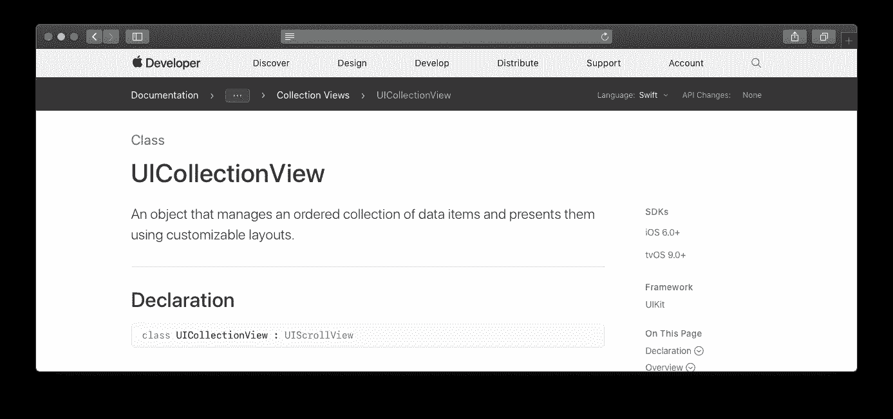

# UICollectionView —直接来自文档。

今天我将向大家展示如何在 Swift 4.2 和 Xcode 10 中构建 UICollectionView。我们将在查看[苹果开发者文档的同时一步一步地编写代码。](https://developer.apple.com/documentation/uikit/uicollectionview)

直接来自文档(SFTD)是一系列直接来自文档的开发教程，由我 Maxwell 通过 Medium 和 YouTube 提供给你。

SFTD 方法将帮助您快速学习语言、框架和库，同时确保最佳实践，因为我们直接学习文档，而不是通过简单的 udemy 课程。你也将开始掌握如何阅读文档，这对你作为一名开发人员的职业生涯有很大的帮助。

# **我们来建吧。**

向下滚动到文档中的主题。我将解释每个加粗的主题和每个主题中列出的大多数方法。首先，我们就主题编写代码，然后我解释每一行重要的内容。

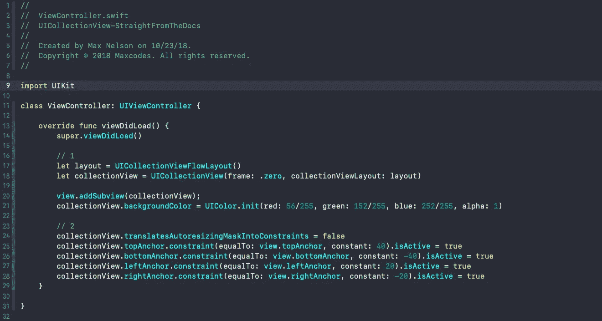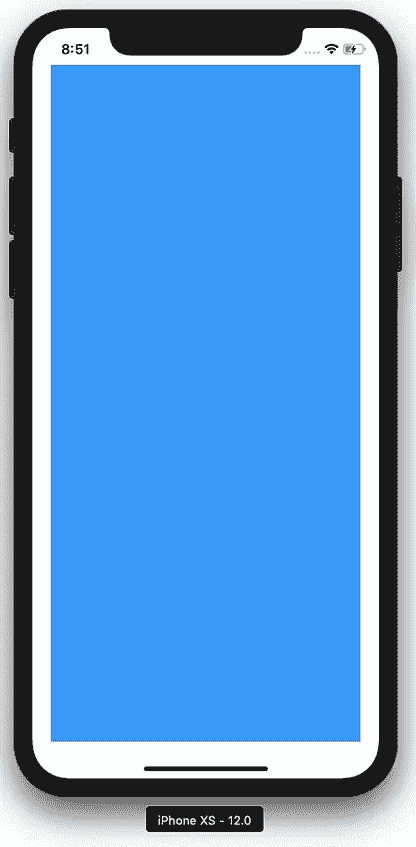

代码+结果

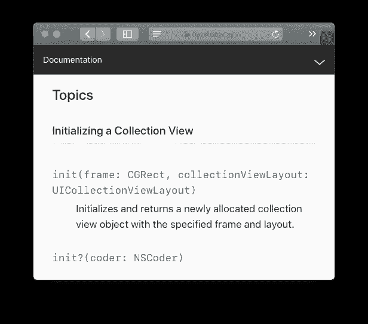

文件（documents 的简写）

## 初始化集合视图

让我们初始化我们的集合视图，并用编程设置的约束将它显示在屏幕上。

1.  使用普通的 UICollectionViewFlowLayout 创建 UICollectionView 的实例
2.  用自动布局约束和 40 40 20 20 的良好插图将垃圾放在屏幕上

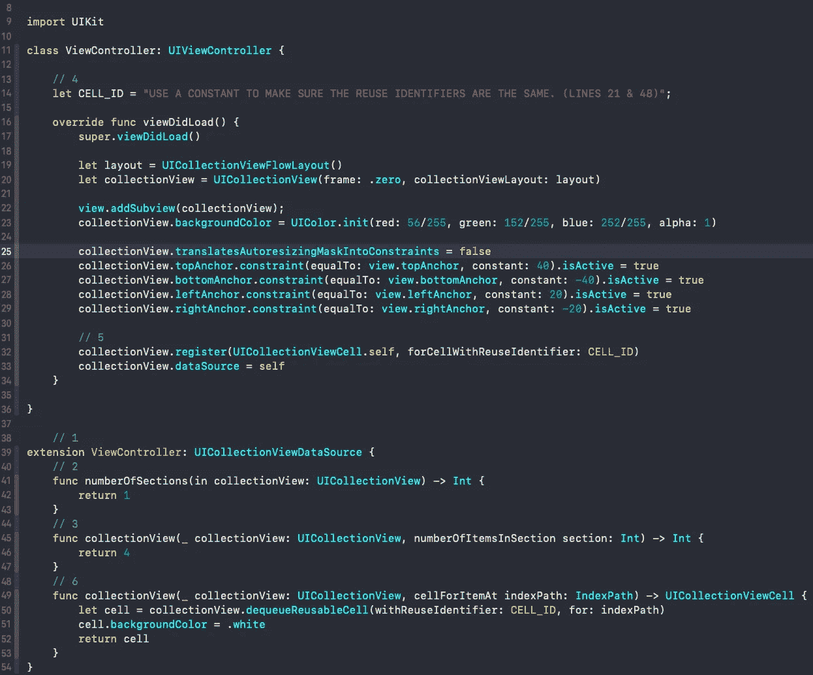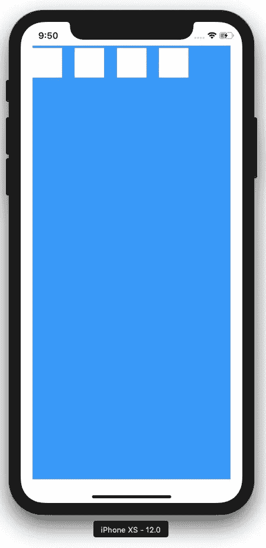

代码+结果

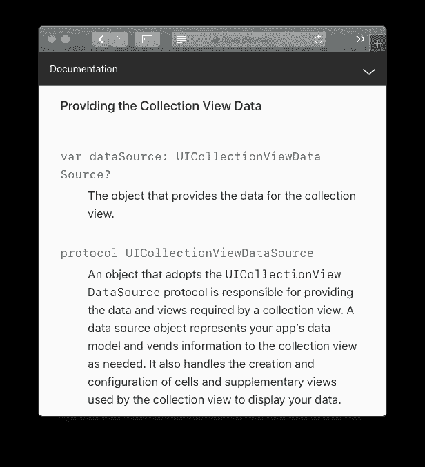

UICollectionView 主题文档—提供数据

## 提供集合视图数据并创建集合视图单元格

我们的屏幕上有一个 UICollectionView。让我们按照 [UICollectionViewDataSource 协议用数据填充它。](https://developer.apple.com/documentation/uikit/uicollectionviewdatasource)

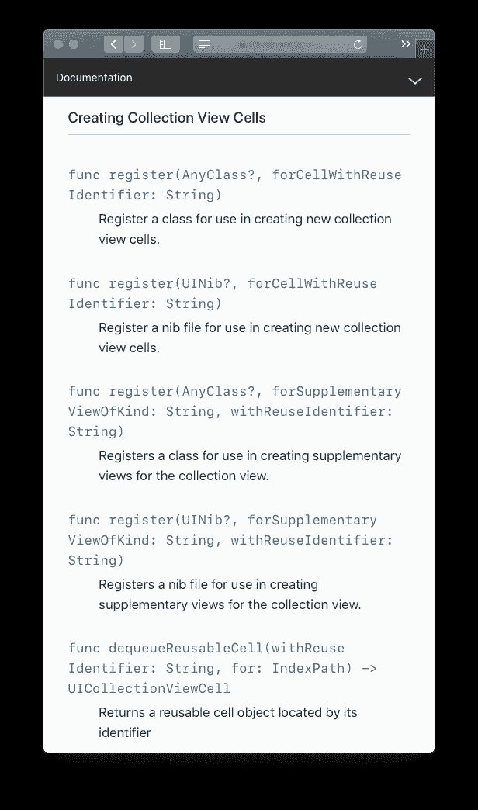

1.  创建一个扩展并符合 cv 数据源协议。
2.  在 [numberOfItemsInSection 方法中返回我们想要的项目数。](https://developer.apple.com/documentation/uikit/uicollectionviewdatasource/1618058-collectionview)
3.  在 [numberOfSections 方法中返回我们想要的节数。](https://developer.apple.com/documentation/uikit/uicollectionviewdatasource/1618023-numberofsections)
4.  创建一个 UICollectionView 可以用来标识单元格的常量。我使用一个常量，就像你在 React Redux 中使用动作类型一样。所有这些都是为了确保重用标识符总是相同的。如果我们打错了，这有助于我们克服歧义，也就是说，我们会在编译器之前很久就发现错误。
5.  在 viewDidLoad 中将默认的 UICollectionViewCell 注册到我们的 cv 中。使用我们刚刚声明的 CELL_ID 重用标识符。
6.  在我们的扩展中， [cellForItemAt indexPath](https://developer.apple.com/documentation/uikit/uicollectionviewdatasource/1618029-collectionview) 将允许我们为每个单元格提供视图。让单元格出队，使用 CELL_ID 标识符，给它一个背景颜色，然后返回单元格。

## 更改布局

通过[UICollectionViewFlowLayout](https://developer.apple.com/documentation/uikit/uicollectionviewflowlayout)和[UICollectionViewDelegateFlowLayout](https://developer.apple.com/documentation/uikit/uicollectionviewdelegateflowlayout)，我们可以修改集合视图的布局，并赋予它不同的大小、插入等。

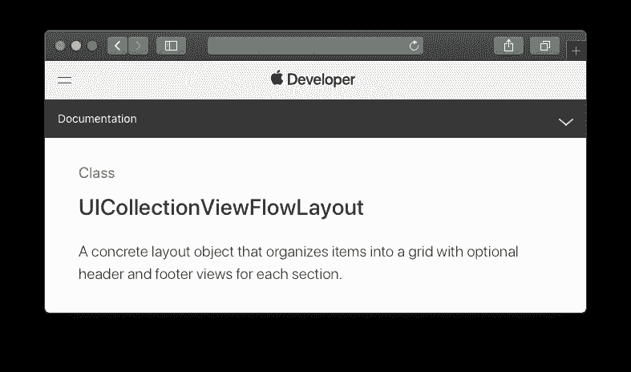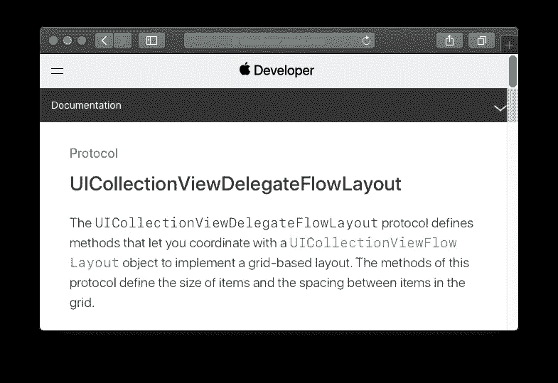

UICollectionViewDelegateFlowLayout 为我们提供了一些很好的方法来覆盖初始流布局的属性。

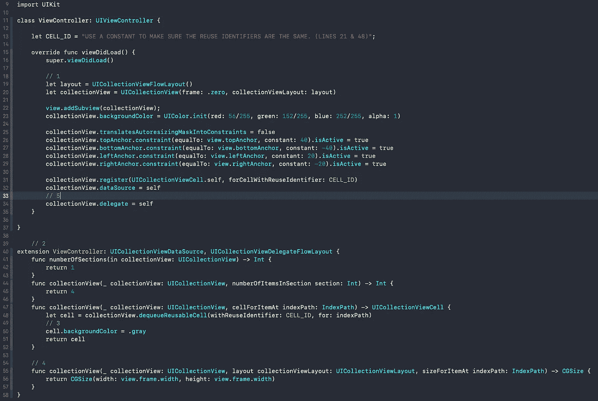

1.  我们已经定义了我们的 UICollectionViewFlowLayout，但是希望确保您在这里注意到它。

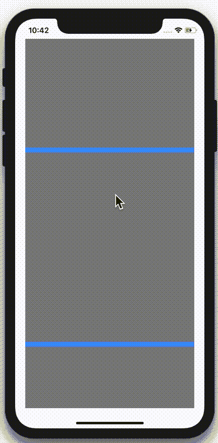

干净利落。但是为什么是蓝条呢？🤔

1.  在我们的扩展中，或者如果您愿意的话，在一个单独的扩展中，遵循 UICollectionViewDelegateFlowLayout 协议。
2.  让我们把背景颜色改成灰色，这样我们可以更快更好地看到我们的细胞-🤔。白细胞会使其与我们将要使用的细胞大小相混淆。想用白细胞试试就看哈哈。
3.  在 sizeForItemAt indexPath 中，返回一个 CGSize 实例，为我们的 cv 单元格指定一个大小。在这种情况下，instagram 风格的外观布局。
4.  将 cv 代理设定为“自己”。

好的，你可以看到我们用细胞得到了这个很酷的滚动视图。然而，这也产生了一些问题。比如，为什么我们会有蓝色的条，为什么我们会在控制台上得到讨厌的警告？

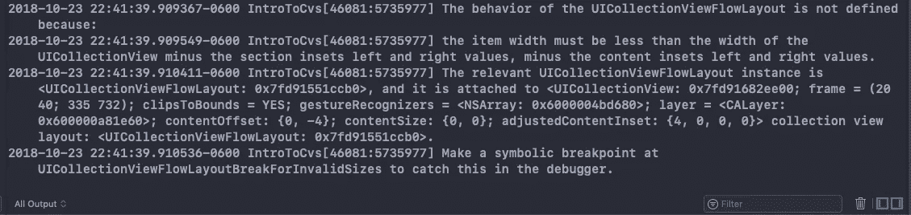

这个 boi 是哪里来的？🤔

## 更改布局—没有代理

您还可以直接修改流布局，而不使用委托方法。所以要回答上面的问题，请看这段代码或者实现我没有包括的相应方法。

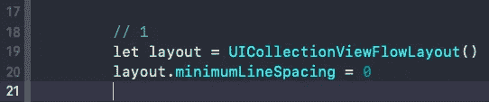

1.  去掉间隔:这将使条形消失。这些条实际上只是您看到的视图。背景颜色。如果没有间隔，我们的细胞会因为每个细胞的灰色而看起来混合在一起。
2.  去掉控制台中那个讨厌的警告:记得我们用常量把插入内容拉进来吗？这连同 sizeForItemAt indexPath 一起导致了我们的警告。简单地说，因为我们试图给我们的单元格一个屏幕大小的宽度，但是它的容器，collectionView，在每个尺寸上插入了大约 20px。如果一个东西比容器本身大，我们怎么能把它装进容器呢？我们不能，所以 Xcode 在它认为最好的地方调整大小，然后警告我们。

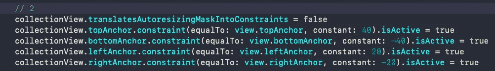

所以改变单元格宽度，我们就可以开始了。没有警告。

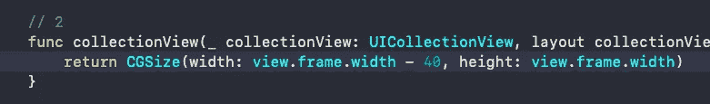

# 结论

好了，我们已经成功地学习了 UICollectionView、UICollectionViewDelegateFlowLayout 和 UICollectionViewDataSource 类的一些关键部分和方法，以及协议。直接来自苹果开发者文档。

我计划再写几篇关于 UICollectionView 的文章，特别是我们在这篇文章中没有涉及的内容，比如单元格预取、拖动单元格、动画单元格、自定义单元格等等。如果你让我知道你想要的话，我会尽快写出来。

# SFTD

SFTD 方法将帮助您快速学习语言、框架和库，同时确保最佳实践，因为我们直接学习文档，而不是通过简单的 udemy 课程。 你也将开始掌握如何阅读文档，这将极大地帮助你作为一名开发人员的整个职业生涯。

总而言之，我认为这是学习如何编码的一个疯狂而可靠的方法。我希望在我刚开始的时候，我可以这样学习，因为我总是对文档感到困惑。如果你同意，请在这里和[我的 youtube 频道](https://www.youtube.com/MAXNELSON)上告诉我，我会继续发布 SFTD 的内容供你学习。

# 更多东西

如果你想第一个听说有限的免费课程优惠券(每月 10 张)，请随时订阅我的 [**每周开发内容电子邮件列表。**](https://www.maxcodes.io)