# 如何正确使用 UIImageView 和 UIStackView！分布、轴、间距以及边界和内容模式的剪辑。

> 原文：<https://itnext.io/uistackview-uiimageview-distribution-axis-spacing-and-clips-to-bounds-and-content-mode-cc993298e0b1?source=collection_archive---------0----------------------->

利用并**理解** UIStackView、UIImageView 和 NSLayoutConstraint(程序化自动布局)创建一个清晰的堆栈视图

[我拍摄我自己，在这篇文章中建造我们所建造的东西。](https://youtu.be/zpb4-VnaaqQ)

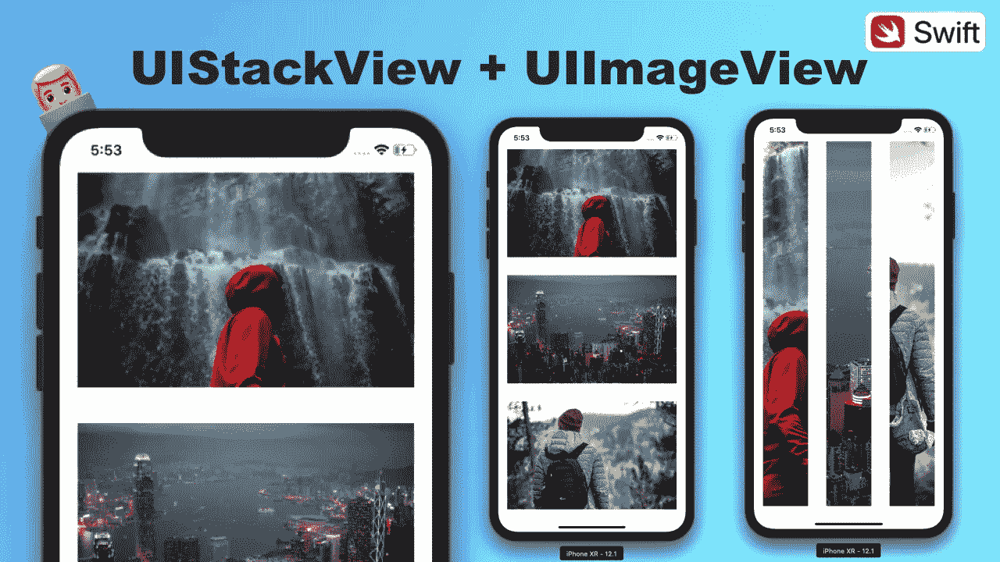

[本文视频版的 YouTube 封面](https://youtu.be/zpb4-VnaaqQ)

作为一名 iOS 开发人员，了解 UIStackView & UIImageView 等类的属性**至关重要**。理解如何**结合**两者来创造难以置信的用户体验同样重要。

# 好吧，但是我们在建造什么呢，兄弟？

今天，我们将构建一个包含三个图像视图的堆栈视图。通过这样做，我们将学习如何使用 UIStackView 的属性和 UIImageView 的属性。你将学会如何轻松地使用它们！

# **步骤 1 —设置堆栈视图。** ✅

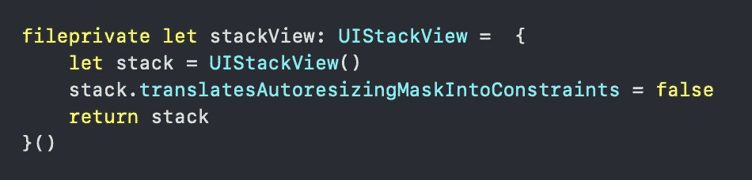

在 ViewController 中声明一个堆栈视图

创建一个单一视图应用程序，并将此代码放在 ViewController.swift 文件中的 viewDidLoad 方法之上。

设置将自动调整大小掩码转换为约束允许我们以编程方式应用 NSLayoutConstraints。

# s**step 2—用 NSLayoutConstraint 约束新分配的堆栈视图。** ✅

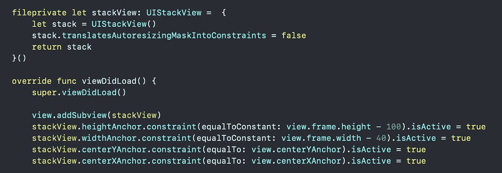

跳转到 viewDidLoad，在添加任何内容之前，立即将堆栈视图添加为子视图。你写完那四个约束后我会告诉你为什么。

给堆栈视图一个宽度和高度约束，使其等于图中所示的值。我们希望堆栈的大小接近视图控制器的大小。

最后，使用 centerXAnchor 和 centerYAnchor 将堆栈视图限制在屏幕的中心。(如果你现在编译，你什么也看不到。如果你想看看我们如何在子视图层次中看到它，请查看视频。).

## **为什么首先将 stackView 添加到视图的子视图层次结构中？**

如果您在添加您试图约束的视图之前尝试并激活约束，在这种情况下，我们的 UIStackView 实例，您的应用程序将崩溃。如果一个视图甚至还没有出现在屏幕上，你就不能将它约束到另一个视图上。有道理吗？([查看这篇文章，在第二步](/pure-code-programmatic-auto-layout-with-nslayoutconstraint-uicollectionview-uistackview-763009c7c14c?source=your_stories_page---------------------------)中，我给出了一个解释这一点的比喻)

# 步骤 3-声明三个 ImageViews，并将它们作为排列好的子视图添加到堆栈中。✅

在编译这段代码之前，您需要做的第一件事是将图像添加到 assets.xcassets 文件夹中。Unsplash 有很多很棒的免费图片。完成后，您可以随意检索这些图像。我在这里做的是使用图像文字。UIImage(名为:“imageName”)也可以工作。

**把这个写在你的栈视图约束的正下方！**

编译它，你的应用程序应该看起来像这样，最后添加的 imageView 可见。

## 发生什么事了？

我们的图像视图都是一个叠一个的。这可以通过同时使用正确的 UIImageView 和 UIStackView 属性来解决。

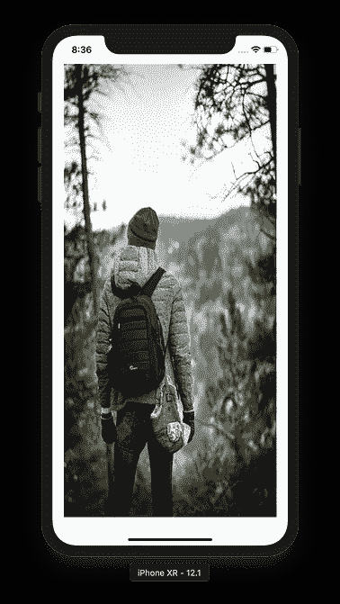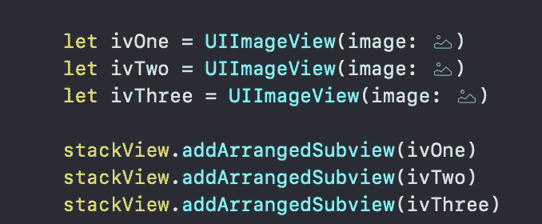

包含在我们写的 stackView 约束下的 viewDidLoad 中。

# **第四步——ui stack view 分发。** ✅

## 最后，一个堆栈视图属性。🔥

分布属性允许我们以几种不同的方式排列子视图。

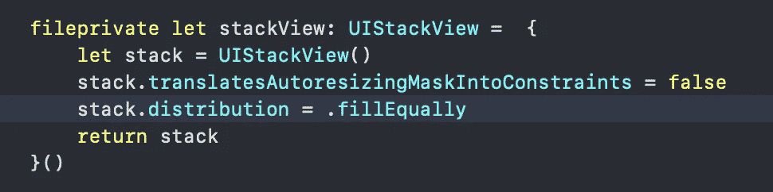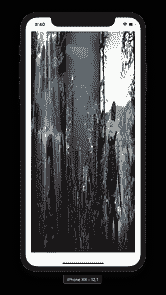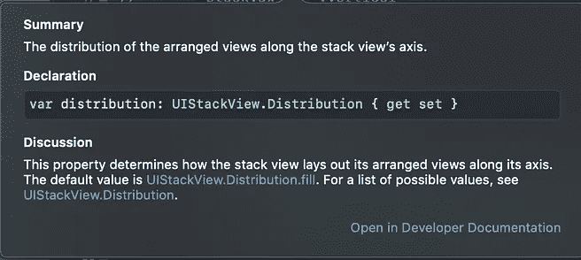

put stack.distribution =。在堆栈视图声明中填充。

## **设置堆栈视图分布为均匀填充。**

如果我们将堆栈的分布设置为**。我们的问题将会大大减少，所以继续把它放在堆栈声明中。**

你的应用看起来就像中间那个小小的 iPhone 图片。继续点击那个图像来放大它。

# 步骤 5-ui stack view 轴和间距。✅

间距这么简单，我就用 Axis 包含了。将这段代码放到堆栈视图中，编译时会看到如下内容。轴有两个值，水平和垂直。间距，就是，嗯，间距。摆弄一下这两个东西，感受一下它们是如何工作的。

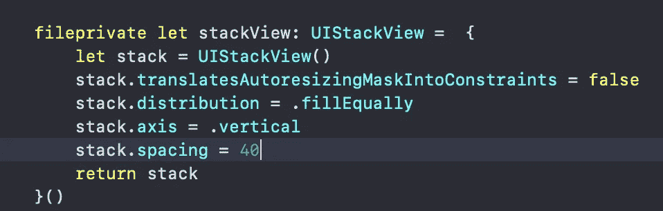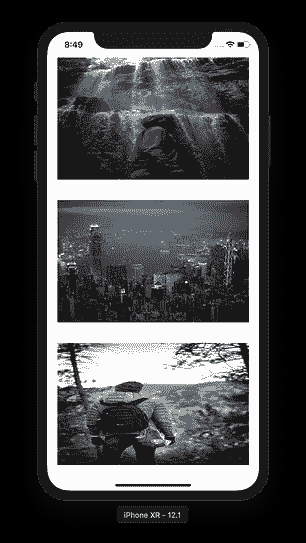

干预

# 步骤 6— UIView 内容模式。✅

将此代码直接放在 stackView addArrangedSubview 调用的下面。

内容模式允许我们指定我们想要以一种特定的方式缩放 UIView 的内容，无论是否有失真；如苹果开发者文档中所述，在左边的截图中。

输入这三行代码，编译您的应用程序，您将会看到屏幕截图中的内容，就在这段代码的右边。

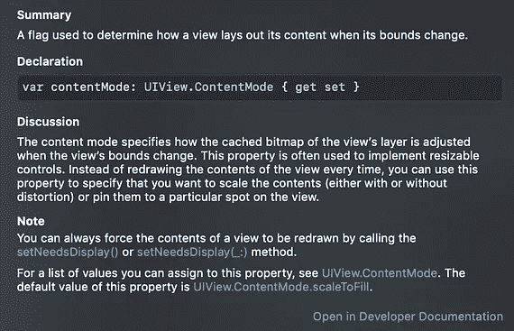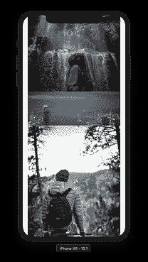

我只是在这里试着提供价值。

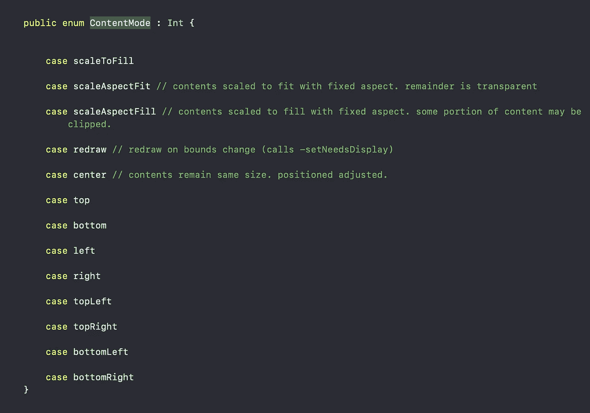

## k，有什么选择吗，兄弟？

UIView。ContentMode 是一个具有多个值的枚举，您可以通过简化命令单击进入 contentMode，然后进入 ContentMode 来了解它。

如果这没有意义，这里有一个截图，你会发现，如果你的命令-点击足够的哈哈。

# 步骤 7-ui view clips tobounds。✅

我们的图像比例看起来不错！然而，它似乎破坏了我们以前的工作，它没有。

我们的图像仍然被完美地放置，但是它们太大了。因此，我们只需裁剪图像视图的边界，移除多余的照片。我们必须删除照片的一部分，以消除这个缺陷，同时填充整个图像视图。

添加下面的代码，你的应用看起来就像左边的屏幕截图一样。

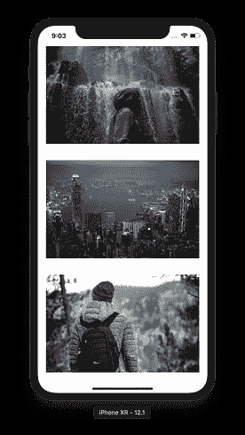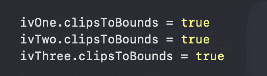

夹住边界。

# 应用程序完成✅

你现在知道如何；

*   使用 UIStackView 及其关键属性。
*   **使用 UIImageView 和 key UIView 属性来操作内容。**
*   **使用 NSLayoutConstraint 以编程方式约束视图。**

# 更多资源—高级指南。✅

如果你想第一个听说有限的免费课程优惠券(每月 10 张)，请随时订阅我的 [**每周开发内容电子邮件列表。**](https://www.maxcodes.io)

如果这对你有帮助，看看我的 YouTube 视频[来体验一下我是如何在视频上做事的。](http://youtube.com/maxcodes)

如果你喜欢我的视频，也许你会喜欢我的 iOS 开发课程。

# 非常感谢您的阅读！

如果你喜欢这篇文章，请留下掌声，在我的社交账户上关注我。每条推文、youtube 订阅、medium clap 和 Instagram 评论都有助于我进一步帮助你完成这些文章和视频。

## [YouTube](http://youtube.com/maxcodes)

## [推特](http://twitter.com/maxcodes1)