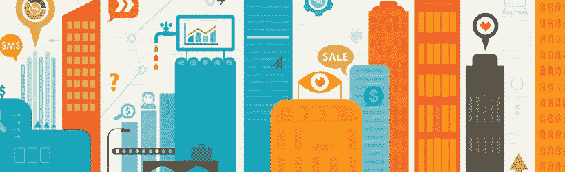

# 物联网发展面临的挑战和障碍

> 原文：<https://itnext.io/uitdagingen-en-obstakels-voor-de-ontwikkeling-van-iot-a7c8c592533f?source=collection_archive---------0----------------------->

*一个局外人以为物联网的世界是没有边界的。因为科技的进步是以说唱的速度进行的。但内部人士却有不同的看法，认为这是重大障碍，例如缺乏标准、知识共享、安全和隐私方面的挑战。[TechCrunch](http://techcrunch.com/2016/02/25/the-politics-of-the-internet-of-things/)发表的一篇文章中详细讨论了这些挑战。我将在本文中分享主要的发现。*

## *缺乏标准化*

*开发物联网解决方案的主要障碍之一是缺乏技术标准。太多了，请参阅各种网路技术，例如 ZigBee、Z-Wave、enon、Bluetooth Le 和 sig 狐。同样在移动技术中，随着 5G 的发展，低功率无线区域网络(LPWAN)也出现了这种趋势。都有自己的生态系统，商业利益和利弊。历史重演 90 年代 Betamax 和 VHS 的战争。*

## *安全和消费者信心*

*除了基本的标准化问题之外，安全也是另一个主要障碍。实现良好的安全性对消费者信心至关重要。问题是，移动行业主要是由价格驱动的，导致在安全技术方面的投资滞后。与安全性相关的隐私问题是:消费者对(自己的)数据有哪些控制，以及提供这些数据的后果是什么？目前尚未回答的问题。*

## *这种改变*

*物联网行业将需要转变为一个开放的社区，需要更多的知识共享。当前的协作连接(如下一个移动网络联盟、GSM 和 W3C)是朝着正确的方向迈出的第一步。*

*国际电联背后的政策将由多米尼克·吉纳尔 T6 进一步详细讨论(联合创始人和欧洲联盟的 CTO)。他的明确解释提供了对当前物联网问题的客观和更新的看法。必须阅读，才能在 IoT 领域完全保持“最新”。*