# 激活功能终极指南

> 原文：<https://itnext.io/ultimate-guide-to-activation-functions-37740be5942?source=collection_archive---------1----------------------->

寻找和学习激活功能的一个好地方是[维基百科](https://en.wikipedia.org/wiki/Activation_function)；然而，这些年来，激活函数的表波动很大，函数被一次又一次地添加和删除。你可以在这里查看这个特殊的维基百科页面[的历史变化列表](https://en.wikipedia.org/w/index.php?title=Activation_function&offset=20220309014907%7C1076034609&limit=9999&action=history)。用户[laughing the stocks](https://en.wikipedia.org/wiki/User:Laughsinthestocks)于 2015 年 11 月在[首次介绍了“激活功能表”。从那以后，在我写这篇文章的时候，维基百科页面已经有了 391 处修改。在这篇文章中，我写了一个算法，从这个维基百科页面截至 2022 年 4 月 22 日的历史中挖掘出每一个唯一的激活函数，这样我就可以在这里的一个综合文档中列出它们。我还提供了额外的链接，链接到没有激活功能的相关研究论文，或者在没有具体研究论文的情况下，在适当的位置提供感兴趣的相关论文。](https://en.wikipedia.org/w/index.php?title=Activation_function&oldid=689235273)

一般来说，人们会用 tanh 来代表 [FNN](https://en.wikipedia.org/wiki/Feedforward_neural_network) ，用 ReLU 来代表 [CNN](https://en.wikipedia.org/wiki/Convolutional_neural_network) 。

*如果我们包括身份激活函数，这个列表将包含 42 个激活函数，尽管你可以说如果包括双极性 sigmoid，它确实是 42 个。我没有读过《银河系漫游指南》。说真的。*

如果可能，衍生产品由 f(𝑥提供，但在某些情况下可能不是这样。那就是𝑥.了

## [二进制步骤](https://en.wikipedia.org/wiki/Heaviside_step_function)

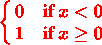

二元阶跃激活

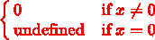

二元阶跃导数

## [后勤](https://en.wikipedia.org/wiki/Logistic_function)，[乙状结肠](https://en.wikipedia.org/wiki/Sigmoid_function)，或者[软步](https://arxiv.org/pdf/1607.01691.pdf)

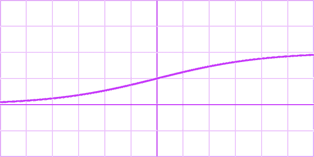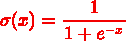

乙状结肠激活

Sigmoid 导数

还有双极性的 sigmoid `(1.f-expf(-x)) / (1.f + expf(-x))`也许 [Wolfram 可以帮助你推导出](https://www.wolframalpha.com/input?i=%281.f-expf%28-x%29%29+%2F+%281.f+%2B+expf%28-x%29%29+derivative)。

## [ElliotSig](http://citeseerx.ist.psu.edu/viewdoc/download;jsessionid=603A43F0BC096B83BC7C42D605EBED99?doi=10.1.1.46.7204&rep=rep1&type=pdf) 或[软标记](https://arxiv.org/pdf/2003.00547.pdf)

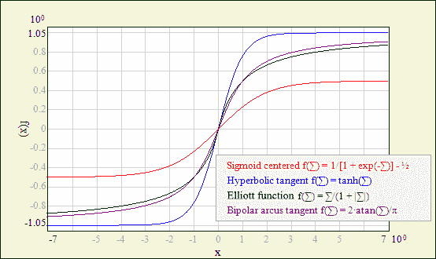

ref[https://www.ire.pw.edu.pl/~rsulej/NetMaker/index.php?pg=n01](https://www.ire.pw.edu.pl/~rsulej/NetMaker/index.php?pg=n01)

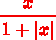

ElliotSig 激活

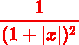

ElliotSig 衍生物

## 双曲正切([正切](https://en.wikipedia.org/wiki/Hyperbolic_functions#Hyperbolic_tangent))

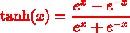

tanh 激活

双曲正切导数

## [反正切](https://en.wikipedia.org/wiki/Arctangent) /反正切/反正切

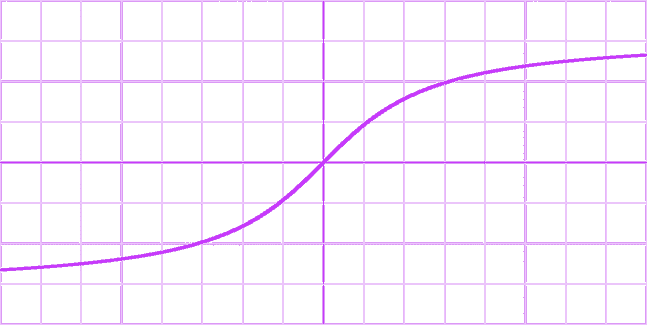

Arctan 激活

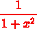

反正切导数

## [Softplus](https://arxiv.org/pdf/2009.03863.pdf)

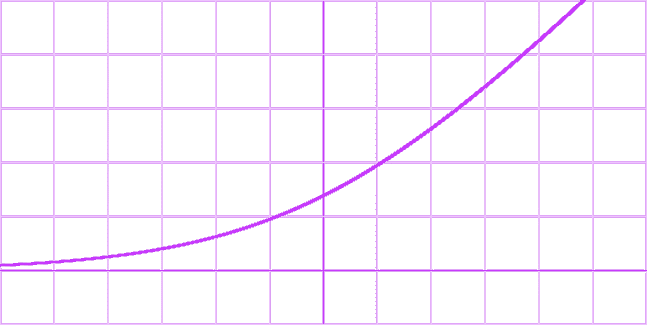

Softplus 激活

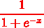

软加衍生工具

## [整流线性单元](https://en.wikipedia.org/wiki/Rectifier_(neural_networks)) (ReLU) ( [ReLU6](http://www.cs.utoronto.ca/~kriz/conv-cifar10-aug2010.pdf) )

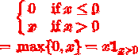

ReLU 激活

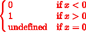

ReLU 衍生物

## [指数线性单位(ELU)](https://arxiv.org/pdf/1511.07289.pdf)

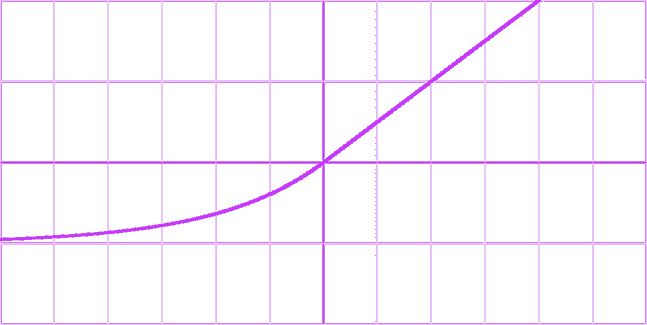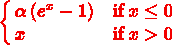

ELU 激活

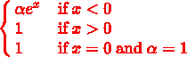

ELU 导数

## [高斯误差线性单元(GELU)](https://arxiv.org/pdf/1606.08415.pdf)

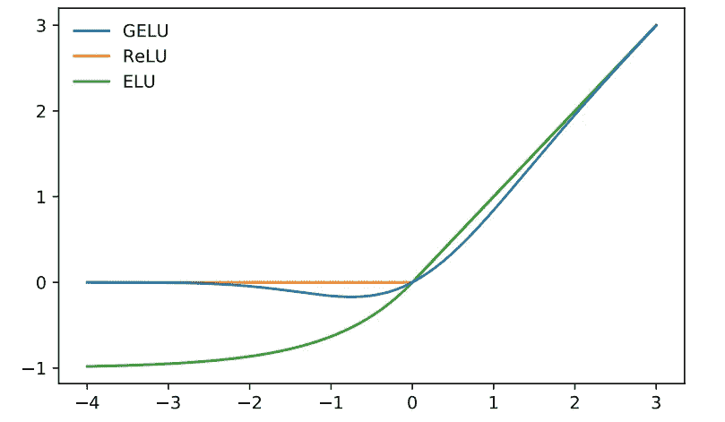

ref[https://medium . com/synced review/Gaussian-error-linear-unit-activates-neural-networks-beyond-relu-121d 1938 a1f 7](https://medium.com/syncedreview/gaussian-error-linear-unit-activates-neural-networks-beyond-relu-121d1938a1f7)

GELU 激活

格鲁衍生物

## [比例指数线性单位(SELU)](https://arxiv.org/pdf/1706.02515.pdf)

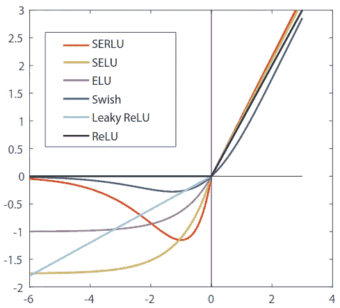

ref[https://arxiv.org/pdf/1807.10117.pdf](https://arxiv.org/pdf/1807.10117.pdf)

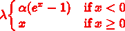

SELU 激活

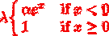

SELU 导数

## [米什](https://arxiv.org/pdf/1908.08681.pdf)

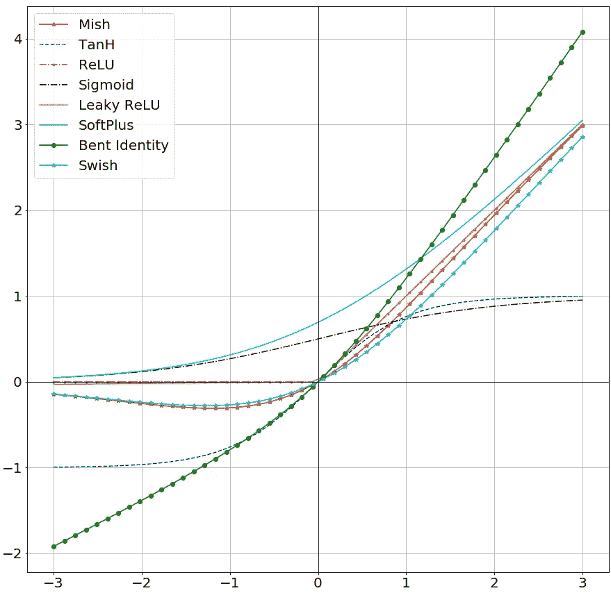

ref【https://github.com/digantamisra98/Mish 

Mish 激活

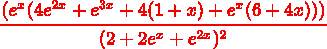

Mish 导数

## [漏泄整流线性单元(漏泄 ReLU)](https://arxiv.org/pdf/1505.00853.pdf)

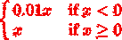

LReLU 激活

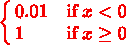

LReLU 衍生物

## [参数整流线性单元(PReLU)](https://arxiv.org/pdf/1502.01852.pdf)

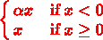

预激活

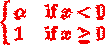

预衍生

## [参数指数线性单元(PELU)](https://arxiv.org/pdf/1605.09332.pdf)

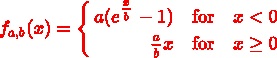

PELU 激活

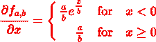

PELU 导数

## [S 形整流线性激活单元(SReLU)](https://arxiv.org/pdf/1512.07030.pdf)

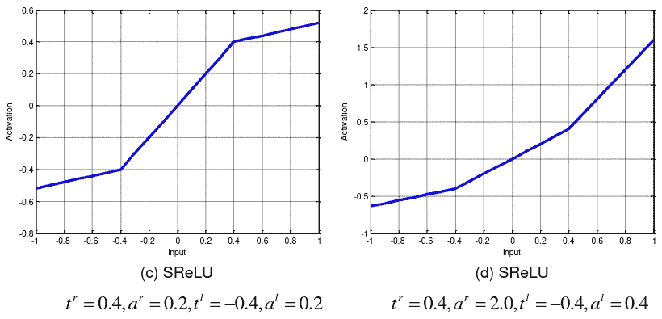

ref[https://arxiv.org/pdf/1512.07030.pdf](https://arxiv.org/pdf/1512.07030.pdf)

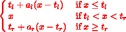

SReLU 激活

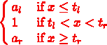

斯雷卢衍生物

## [双极整流线性单元(BReLU)](https://arxiv.org/pdf/1709.04054.pdf)

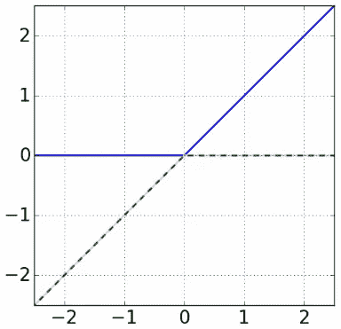

ref[https://arxiv.org/pdf/1709.04054.pdf](https://arxiv.org/pdf/1709.04054.pdf)

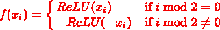

布雷卢激活

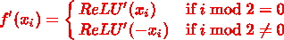

布雷卢衍生物

## [随机漏整流线性单元](http://www.gabormelli.com/RKB/Randomized_Leaky_Rectified_Linear_Activation_(RLReLU)_Function)

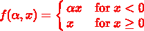

RReLU 激活

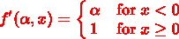

RReLU 衍生物

## [乙状结肠线性单元(路斯)](https://arxiv.org/pdf/1702.03118.pdf)或[唰](https://arxiv.org/pdf/1710.05941v1.pdf)

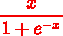

嗖嗖激活

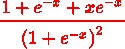

Swish 导数

## [高斯](https://en.wikipedia.org/wiki/Gaussian_function)

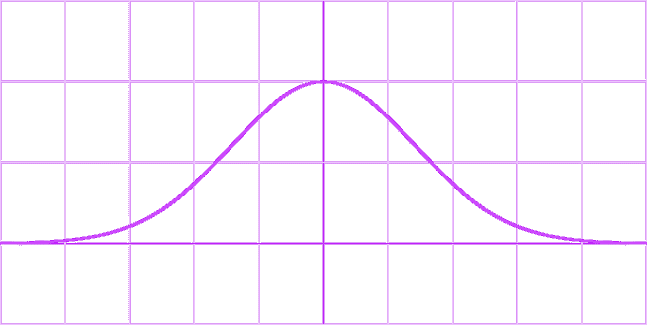

高斯激活

高斯导数

## [增长余弦单位(GCU)](https://arxiv.org/pdf/2108.12943.pdf)

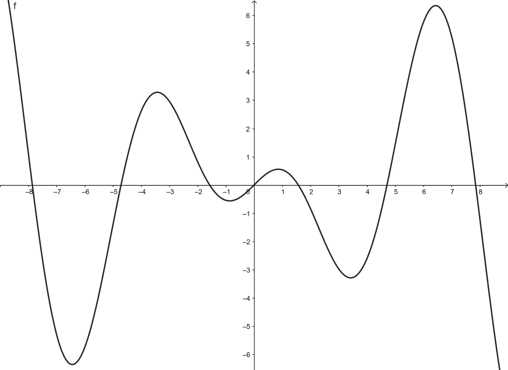

GCU 激活

GCU 导数

## [移位二次单位(SQU)](https://arxiv.org/pdf/2111.04020.pdf)

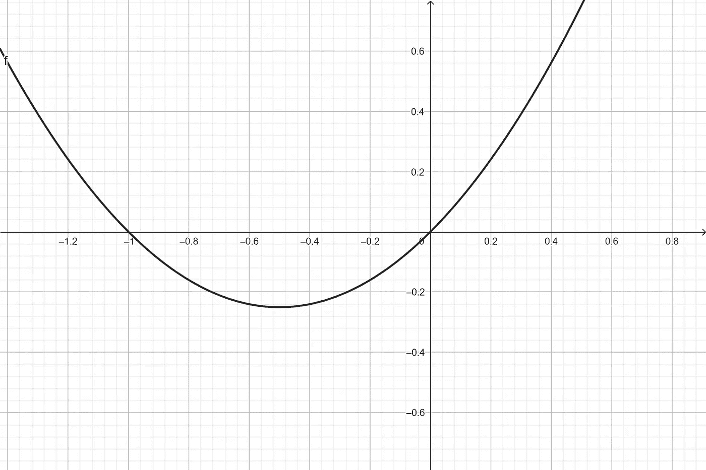

SQU 激活

SQU 导数

## [非单调立方单位(NCU)](https://arxiv.org/pdf/2111.04020.pdf)

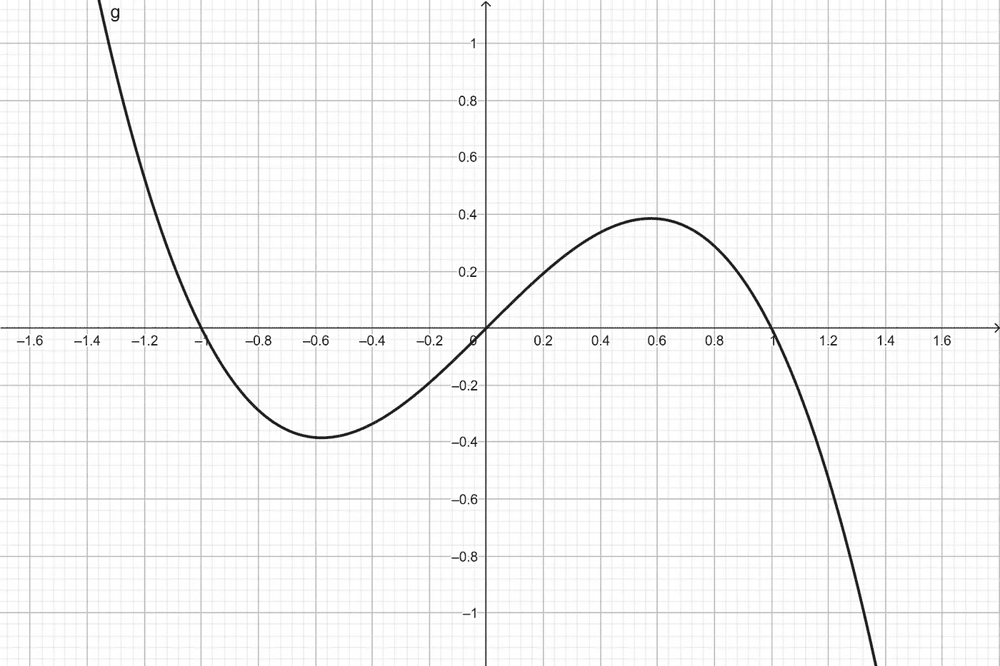

NCU 激活

NCU 衍生物

## [移位正弦单位(SSU)](https://arxiv.org/pdf/2111.04020.pdf)

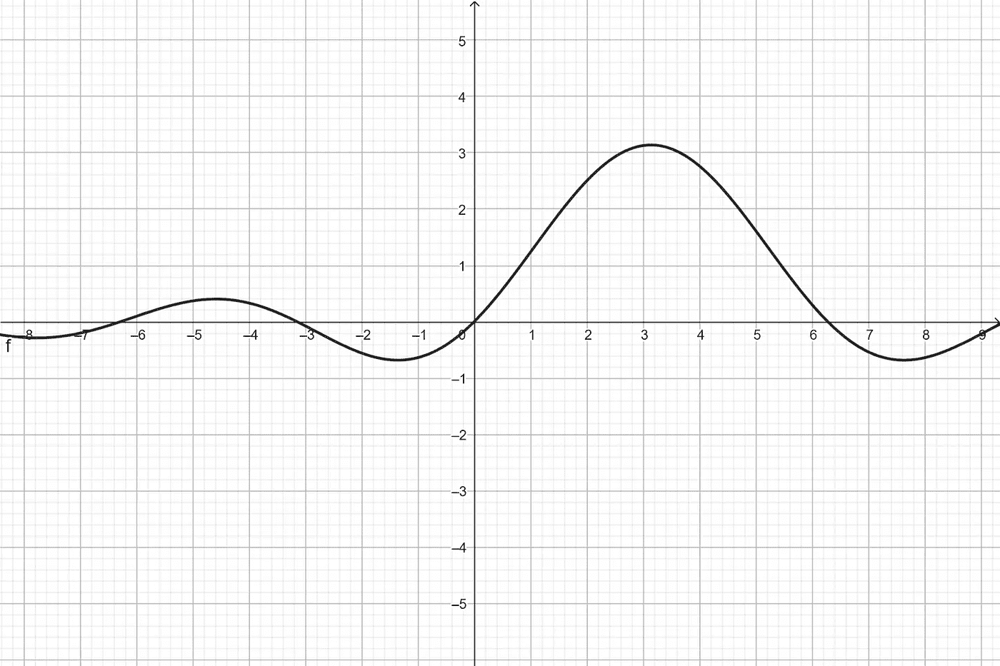

SSU 激活

*没有提供导数，参考* [*Wolfram*](https://www.wolframalpha.com/input?i=pi*sinc%28x-pi%29+derivative) *或* [*论文*](https://arxiv.org/pdf/2111.04020.pdf) *。*

## [衰减正弦单位(DSU)](https://arxiv.org/pdf/2111.04020.pdf)

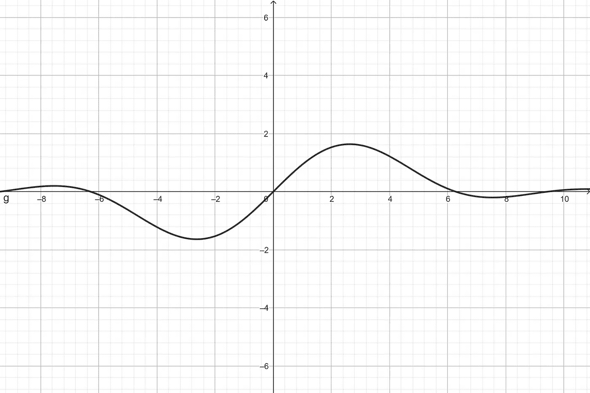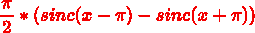

DSU 激活

*未提供导数，参考*[*Wolfram*](https://www.wolframalpha.com/input?i=pi%2F2+*+%28sinc%28x-pi%29+-+sinc%28x%2Bpi%29%29++derivative)*或* [*论文*](https://arxiv.org/pdf/2111.04020.pdf) *。*

## [费西合唱团](https://www.techrxiv.org/articles/preprint/Phish_A_Novel_Hyper-Optimizable_Activation_Function/17283824#:~:text=Phish%20is%20a%20novel%20non,constructed%20using%20different%20activation%20functions.)

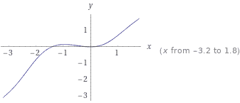

费西合唱团激活

*未提供导数，参考*[*Wolfram*](https://www.wolframalpha.com/input?i=x+*+tanh%28+1%2F2*x*%281+%2B+%28x%2Fsqrt%282%29%29%29+%29+derivative)*或* [*论文*](https://www.techrxiv.org/ndownloader/files/33227273/2) *。*

## [SQ-RBF](https://en.wikipedia.org/wiki/Radial_basis_function)

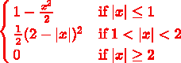

SQ-RBF 激活

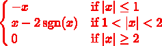

SQ-RBF 导数

## [平方根倒数单位(ISRU)](https://arxiv.org/pdf/1710.09967.pdf)

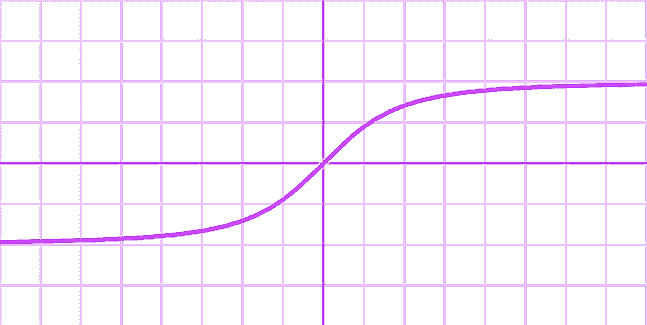

ISRU 激活

ISRU 导数

## [反平方根线性单元(ISRLU)](https://arxiv.org/pdf/1710.09967.pdf)

ISRLU 激活

ISRLU 衍生物

## [平方非线性(SQNL)](https://raw.githubusercontent.com/awur978/SQNL_Paper/master/slides.pdf)

SQNL 激活

SQNL 导数

## [乙状结肠收缩](https://hal.archives-ouvertes.fr/hal-02136546/document)

激活

导数

## [“挤压功能”](https://reader.elsevier.com/reader/sd/pii/S0950705120302896?token=65179BE047942C07C29012A1ECC13F16A7053F324AF9135822974715558837C2EAF447061E19518F8673EE9DA34ECBA2&originRegion=eu-west-1&originCreation=20220423000237) ( [基准](https://arxiv.org/pdf/2010.08760.pdf))

激活

w.r.t 激活

导数

## [Maxout](https://arxiv.org/pdf/1302.4389.pdf)

最大激活

“衍生产品”

## [弯曲的身份](https://arxiv.org/pdf/1611.05827.pdf)

弯曲激活

弯曲导数

## [正弦曲线](https://en.wikipedia.org/wiki/Sine_wave)

正弦激活

正弦导数

## [Sinc](https://en.wikipedia.org/wiki/Sinc_function) ( [驯服海浪](https://openreview.net/pdf?id=Sks3zF9eg))

Sinc 激活

正弦导数

## [阿尔辛赫](https://en.wikipedia.org/wiki/Inverse_hyperbolic_functions#Inverse_hyperbolic_sine)

ref[https://en.wikipedia.org/wiki/Inverse_hyperbolic_functions](https://en.wikipedia.org/wiki/Inverse_hyperbolic_functions)

ArSinH 激活

阿辛衍生物

## [软剪裁](https://arxiv.org/pdf/1810.11509.pdf) ( [金发女郎](https://arxiv.org/pdf/2002.05059.pdf))

激活

导数

## [分段线性单元(PLU)](https://arxiv.org/pdf/1809.09534.pdf)

ref[https://arxiv.org/pdf/1809.09534v1.pdf](https://arxiv.org/pdf/1809.09534v1.pdf)

PLU 激活

PLU 导数

## [自适应分段线性(APL)](https://arxiv.org/pdf/2108.00700.pdf)

ref[https://arxiv.org/pdf/1512.07030.pdf](https://arxiv.org/pdf/1512.07030.pdf)

APL 激活

APL 衍生物

## [逆立方](https://en.wikipedia.org/w/index.php?title=Activation_function&oldid=760259047#Comparison_of_activation_functions)

激活

导数

## [软指数](https://arxiv.org/pdf/1602.01321.pdf)

激活

导数

## [(42？)LeCun 双曲正切](http://yann.lecun.com/exdb/publis/pdf/lecun-98b.pdf)

ref【https://datascience.stackexchange.com/a/107616 号

## 进一步阅读

[预测金融时间序列的神经网络中新激活函数的比较](https://www.cin.ufpe.br/~tbl/artigos/NeuralComput&Applic-gecy-Final.pdf) ( [Logit & Probit](https://tutorials.methodsconsultants.com/posts/what-is-the-difference-between-logit-and-probit-models/)

[比例指数正则线性单元(SERLUs)的有效性](https://arxiv.org/pdf/1807.10117v2.pdf)

 [## 金融预测神经网络中新激活函数的比较

### 表 1 激活函数及其导数标签激活函数对应的导数函数…

www.semanticscholar.org](https://www.semanticscholar.org/paper/Comparison-of-new-activation-functions-in-neural-Gomes-Ludermir/9b37079041bdaca4248ab4f62f1a63013a50f067/figure/1)  [## 表 1 来自广义学习矢量量化的激活函数-性能…

### 表 1。根据[11]的 MLP 及其衍生物的成功活化函数。-“激活…

www.semanticscholar.org](https://www.semanticscholar.org/paper/Activation-Functions-for-Generalized-Learning-A-Villmann-Ravichandran/04d54996bcbe44b3547da889d7eab8aab3660990/figure/0)  [## 表 1 来自 LSTM 网络中不同激活函数的比较性能分析…

### 表 1 每个激活函数的标签、定义、相应导数和范围-“比较性能…

www.semanticscholar.org](https://www.semanticscholar.org/paper/A-comparative-performance-analysis-of-different-in-Farzad-Mashayekhi/bcfdfe54796c501a90c3b353661a19e9c161d2c8/figure/0)  [## 表 2 来自搜索激活功能|语义学者

### 表 2: CIFAR-100 精度。-“搜索激活功能”

www.semanticscholar.org](https://www.semanticscholar.org/paper/Searching-for-Activation-Functions-Ramachandran-Zoph/c8c4ab59ac29973a00df4e5c8df3773a3c59995a/figure/2)  [## 图 1 来自 Flatten-T Swish:一个用于深度学习的阈值 ReLU-Swish 样激活函数…

### 图一。FTS (T = 0.00)与 ReLU - "Flatten-T Swish:一个阈值化的类似 ReLU-Swish 的激活函数，用于深度…

www.semanticscholar.org](https://www.semanticscholar.org/paper/Flatten-T-Swish%3A-a-thresholded-ReLU-Swish-like-for-Chieng-Wahid/126e6a2f6d3e1cf1f793b9567a3c06509f01d329/figure/0)