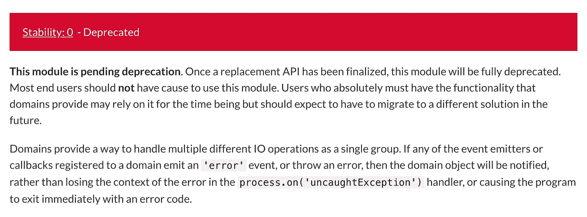

# Node.js 并发登录终极指南

> 原文：<https://itnext.io/ultimate-guide-to-concurrent-logging-in-node-js-4e47bd2eae37?source=collection_archive---------0----------------------->

这里有一个每个人都会认识到的问题:由并发任务产生的日志没有它们的启动上下文是没有用的。


罗尔。Node.js 最强大的日志记录器

如果你需要一个例子，考虑一个程序，它在接收到一个事件后执行一些产生日志的代码。它可能是传入的 HTTP 请求、作业队列等。，例如

```
process.on('task', (task) => {
  executeTask(task);
});const executeTask = async (task) => {
  try {
    // [..] console.log('task completed');
  } catch (error) {
    console.log('task failed');
  }
};
```

实际上，该程序将生成如下所示的日志:

```
task completed
task completed
task failed
task completed
task failed
```

关键是，如果我们想要生成有意义的日志，那么我们必须以某种方式将`task`与每个日志消息关联起来。

```
const executeTask = async (task) => {
  try {
    await download(task.url); console.log({task}, 'task completed');
  } catch (error) {
    console.log({task}, 'task failed');
  }
};
```

问题是，为了实现这一点，您必须将`task`对象传递给每个生成日志的函数。在我们的例子中，将`task`添加到`console.log`很容易，但是通常产生代码的函数是深度嵌套的，或者它们是第三方模块，没有办法将额外的上下文传递给记录器。

```
const download = (url) => {
  if ([..]) {
    return console.error('invalid url');
  } if ([..]) {
    return console.error('unsupported protocol');
  } // [..]
};
```

由于没有传递日志记录器上下文的约定，您将最终得到一个列出随机事件的日志记录，而没有提供将这些事件与其所属的异步任务相关联所需的上下文。

```
invalid url
task completed {id:6, url: [..]}
task completed {id:4, url: [..]}
unsupported protocol
task completed {id:5, url: [..]}
task completed {id:3, url: [..]}
task failed {id:2, url: [..]}
task completed
task failed {id:1, url: [..]}
```

上述日志不足以确定哪个任务由于什么原因而失败。幸运的是，有一个解决方案。

## 使用 Node.js 域

使用 Node.js [Domain](https://nodejs.org/api/domain.html) ，我们可以将上下文添加到一系列异步调用中，而不用显式地将它们传递下去(可以把它想象成一个闭包或者 React 中的[上下文](https://reactjs.org/docs/context.html))，例如

```
import domain from 'domain';process.on('task', (task) => {
  domain
    .create()
    .run(() => {
      process.domain.context = {
        task,
      }; executeTask(task);
    });
});const download = (url) => {
  if ([..]) {
    return console.error(process.domain.context, 'invalid url');
  } if ([..]) {
    return console.error(process.domain.context, 'unsupported protocol');
  } // [..]
};const executeTask = async (task) => {
  try {
    await download(task.url); console.log({task}, 'task completed');
  } catch (error) {
    console.log({task}, 'task failed');
  }
};
```

这样，每个日志消息都与启动异步调用链的异步上下文相关联。

```
invalid url {id:1, url: [..]}
task completed {id:6, url: [..]}
task completed {id:4, url: [..]}
unsupported protocol {id:2, url: [..]}
task completed {id:5, url: [..]}
task completed {id:3, url: [..]}
task failed {id:2, url: [..]}
task completed {id:2, url: [..]}
task failed {id:1, url: [..]}
```

理论上，域甚至可以是嵌套的，即知道父域的域可以用于将日志消息与导致日志消息的整个异步调用链相关联。Node.js 没有提供现成的这种功能。然而，Node.js 可以被猴子打补丁以显式地将父域绑定到活动域，例如

```
const domain = require('domain');const originalCreate = domain.create;domain.create = (...args) => {
  const parentDomain = process.domain || null; const nextDomain = originalCreate(...args); nextDomain.parentDomain = parentDomain; return nextDomain;
};
```

此后`parentDomain`成为对父域的引用:

```
const d0 = domain.create();d0.run(() => {
  const d1 = domain.create(); d1.run(() => {
    d1.parentDomain === d0;
  });
});
```

为了使用我将要介绍的记录器，您需要使用`[domain-parent](https://github.com/gajus/domain-parent)`来修补 Node.js。

## 域弃用

一些人评论说域模块已经过时，不应该使用。



弃用通知。

尽管红色大横幅声明该模块已被弃用，但`domain`模块并未被弃用。如果你读了标题后面的段落，它声明一旦替换的**API 完成，模块**将被**废弃。很可能`[async_hooks](https://nodejs.org/api/async_hooks.html)`最终会提供`domain`模块提供的所有功能，并取代它。在幕后`[domain](https://github.com/nodejs/node/blob/master/lib/domain.js)` [模块已经使用](https://github.com/nodejs/node/blob/master/lib/domain.js) `[async_hooks](https://github.com/nodejs/node/blob/master/lib/domain.js)`实现。然而，这不会很快发生(因为流行的 NPM 模块和 Node.js 内部的加载依赖于`domain`模块),在那之前使用`domain`模块是安全的。**

最后，所有这些加起来介绍了一个约定驱动的、上下文感知的日志记录器，它已经被开发出来并准备好了: [Roarr](https://github.com/gajus/roarr) 。

## 使用 Roarr

Roarr `[adopt](https://github.com/gajus/roarr#roarr-api-adopt)`方法创建了一个域，该域有效地将用户定义的上下文绑定到异步调用过程中产生的所有日志消息。为了将上下文与异步代码相关联，只需使用 Roarr `[adopt](https://github.com/gajus/roarr#roarr-api-adopt)`方法执行您的例程，例如

```
import Logger from 'roarr';process.on('task', (task) => {
  Logger
    .adopt(
      () => {
        return executeTask(task);
      },
      // Here we define the context that we want to associate with
      // all the Roarr loggers that will be called when executing
      // `executeTask` with the current `task` value. 
      {
        task,
      }
    );
});const download = (url) => {
  if ([..]) {
    return log.error('invalid url');
  } if ([..]) {
    return log.error('unsupported protocol');
  } // [..]
};const executeTask = async (task) => {
  try {
    await download(task.url); log.info('task completed');
  } catch (error) {
    log.info('task failed');
  }
};
```

上面将生成相当于以下内容的日志:

```
invalid url {id:1, url: [..]}
task completed {id:6, url: [..]}
task completed {id:4, url: [..]}
unsupported protocol {id:2, url: [..]}
task completed {id:5, url: [..]}
task completed {id:3, url: [..]}
task failed {id:2, url: [..]}
task completed {id:2, url: [..]}
task failed {id:1, url: [..]}
```

当然，为了让*所有的*日志都包含它们的异步上下文，所有的依赖项都需要使用 Roarr logger(或者它们必须从`process.domain.roarr.context`中读取 logger 上下文)。然而，与其他记录器不同，Roarr 没有配置，可以在可分发的包和顶级程序中使用。因此，已经有数以千计的包裹在使用 Roarr。

为了让您开始使用 Roarr，请阅读 Node.js 中的《是什么让 [Roarr 成为完美的记录器》，并查看实现记录器的示例库(](https://medium.com/free-code-camp/roarr-the-perfect-json-logger-node-js-and-browser-935180bda529) [Slonik](https://github.com/gajus/slonik) 是一个好的开始)。

概括一下:

1.  在并发执行环境中没有上下文的日志是没有意义的。
2.  域可用于将上下文与异步调用链相关联。
3.  [Roarr](https://github.com/gajus/roarr) 利用域来继承描述导致日志消息的异步调用链的上下文。这允许 Roarr 生成描述完整执行上下文的日志，即使在多个任务并发执行时也是如此。

试试[roar](https://github.com/gajus/roarr)吧。它甚至有一个简洁的 CLI 程序，内置了漂亮的打印和过滤功能。