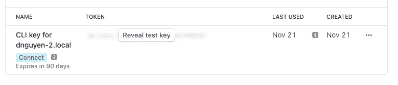

# 具有角形、火基和条纹的终极本地开发设置

> 原文：<https://itnext.io/ultimate-local-development-setup-with-angular-firebase-stripe-fcc6fca3543c?source=collection_archive---------6----------------------->


建立一个电子商务网站是一项复杂的任务。尤其是当您有不同的服务需要相互通信时。这是一个场景，您没有在本地为开发做好一切准备。

如题，用来创建一个电子商务网站的栈是

*   [棱角分明的](https://angular.io/) —前端
*   [Firebase](https://firebase.google.com/) —认证+数据库+存储+ API
*   [条纹](https://stripe.com/en-ca) —支付处理

**没有本地开发能力**

你应该设置本地开发的大部分原因是**节省时间**，而**时间**是$$$。

*   直接对 firebase 项目进行身份验证
*   如果你正在使用 Webhook，云功能的部署需要时间和金钱——尤其是对于初学者
*   数据库活动正在吞噬你的免费轮胎——你不应该处理生产数据

**没有本地开发能力**

在当地发生的事情，留在当地——而不是用于开发的条纹支付记录。

## 角度和火焰模拟器设置

我不打算详细介绍如何创建一个新的角度项目。假设您的 package.json 中已经有了一个带有`@angular/fire`的 Angular 项目

```
// app.module.tsimport { AngularFireAuthModule, USE_EMULATOR as USE_AUTH_EMULATOR } from '@angular/fire/auth'import { AngularFirestoreModule, USE_EMULATOR as USE_FIRESTORE_EMULATOR } from '@angular/fire/firestore'import { AngularFireFunctionsModule, USE_EMULATOR as USE_FUNCTIONS_EMULATOR } from '@angular/fire/functions'....providers: [
    AuthService,
    {
      provide: USE_AUTH_EMULATOR,
      useValue: environment.useEmulators ? ['localhost', 9099] : undefined,
    },
    {
      provide: USE_FIRESTORE_EMULATOR,
      useValue: environment.useEmulators ? ['localhost', 8080] : undefined,
    },
    {
      provide: USE_FUNCTIONS_EMULATOR,
      useValue: environment.useEmulators ? ['localhost', 5001] : undefined,
    },
  ],
```

确保检查`firebase.json`文件中的[仿真器](https://firebase.google.com/docs/emulator-suite)端口。

```
// firebase.json"emulators": {
    "firestore": {
      "port": "8080"
    },
    "ui": {
      "enabled": true,
      "host": "localhost",
      "port": 4001
    },
    "functions": {
      "port": "5001"
    },
    "database": {
      "port": "9000"
    },
    "pubsub": {
      "port": "8085"
    },
    "auth": {
      "port": 9099
    },
    "hosting": {
      "port": 5000
    }
  }
```

然后，当您为 firebase 函数运行模拟器时，Angular 项目将使用本地模拟器来处理身份验证、数据库、函数…

```
firebase emulators:start
```

## 条带设置

首先，您需要安装 [Stripe CLI](https://stripe.com/docs/stripe-cli) 并使用`stripe login`进行认证。



将事件转发到本地服务器

```
dalenguyen$ stripe listen --forward-to localhost:5000/api-stripeA newer version of the Stripe CLI is available, please update to: v1.7.8
> Ready! Your webhook signing secret is whsec_gD8ixxxnxxxg1tv (^C to quit)
```

然后，您可以通过本地触发器触发事件

```
dalenguyen$ stripe trigger payment_intent.createdA newer version of the Stripe CLI is available, please update to: v1.7.8
Setting up fixture for: payment_intent
Trigger succeeded! Check dashboard for event details.----> on another terminal2021-11-21 10:34:54   --> payment_intent.created [evt_3JyI49ESKh0WH3011opuksXb]
2021-11-21 10:34:54  <--  [200] POST [http://localhost:5000/api-stripe](http://localhost:5000/api-stripe) [evt_3JyI49ESKh0WH3011opuksXb]----> on firebase functions logi  functions: Beginning execution of "us-central1-api-stripe"
>  stripeObjectid pi_3JyI49ESKh0WH3011Hl3lDrr
i  functions: Finished "us-central1-api-stripe" in ~1s
```

现在，一切准备发展。一切都发生在你的机器上。

## 测试条纹网钩

当您将事件转发到本地计算机时。所有的 webhooks 事件都将被转发给 Firebase 模拟器函数。

例如，您创建了一个条带结帐会话，他们为该会话付费。然后，将从条带仪表板触发 webhooks。然后在您的本地机器上，该事件将在您的 Stripe 终端和 firebase 模拟器函数上被触发。

```
---> stripe terminal2021-11-21 11:25:52   --> customer.created [evt_1JyIrUESKh0WH301SrYeIZkg]
2021-11-21 11:25:52   --> payment_intent.succeeded [evt_3JyIpzESKh0WH3011OWfb84B]
2021-11-21 11:25:53   --> charge.succeeded [evt_3JyIpzESKh0WH30115gKa8GM]
2021-11-21 11:25:53   --> checkout.session.completed [evt_1JyIrVESKh0WH301osTVBhQI]
2021-11-21 11:25:54  <--  [200] POST [http://localhost:5000/api-stripe](http://localhost:5000/api-stripe) [evt_1JyIrUESKh0WH301SrYeIZkg]
2021-11-21 11:25:54  <--  [200] POST [http://localhost:5000/api-stripe](http://localhost:5000/api-stripe) [evt_3JyIpzESKh0WH30115gKa8GM]
2021-11-21 11:25:54  <--  [200] POST [http://localhost:5000/api-stripe](http://localhost:5000/api-stripe) [evt_3JyIpzESKh0WH3011OWfb84B]
2021-11-21 11:25:54  <--  [200] POST [http://localhost:5000/api-stripe](http://localhost:5000/api-stripe) [evt_1JyIrVESKh0WH301osTVBhQI]
```

[**在 Twitter 上关注我**](https://twitter.com/dale_nguyen) 获取 Angular、JavaScript & WebDevelopment 的最新内容👐