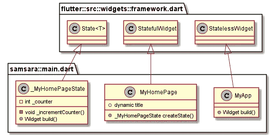

# UML 在颤动中的清凉

> 原文：<https://itnext.io/uml-coolness-in-flutter-6bb14217b5f2?source=collection_archive---------3----------------------->


dev-ops 的部分小细节是为您的 Flutter 项目生成一个 UML 图。UML 图帮助开发人员理解你的代码是如何面向对象地组合在一起的。

如果您的 flutter 项目有一组 UML 图，这也是开发人员专业性的一个很好的标志。让我向您展示为您的 flutter 项目生成一些 UML 图的简单方法。

# **UML 插件**

George Lesica 创建了 dcdg 插件来为 dart 和 flutter 项目生成 UML 图。

**镖 DCDG 插件作者简介**

George Lesica 不仅开发了 dcdg dart 插件，还开发了其他一些 dart 插件，如 Lisp 解释器 Disp。查看他的 github 个人资料(【https://github.com/glesica】T4)

# **前置要求**

注意，flutter-SDK 在 Flutter-SDK 中安装 dart，设置 env 变量和路径的正确方法是:

ENVS

```
FLUTTER_SDK_ROOT   your-path-to-the-flutter-sdk-folder
```

而且，需要设置的是这些路径:

路径设置

```
FLUTTER_SDK_ROOT\bin
FLUTTER_SDK_ROOT\.pub-cache
```

**注意:**在 MS Windows 上，当我在我的 power-shell 命令中引用 env 变量时，我必须在路径设置中用开始和结束%来分隔 env 变量。在 Mac 和 Linux 上，一旦设置了 env，就需要使用前面的$。还要注意，pub-cache 设置在 flutter sdk 文件夹中，而不是 Google Docs 在 Mac、Linux 和 MS Windows 上仍然显示的位置，否则我们将无法正确地跨 MacOSX、Linux 和 MS Windows 进行跨平台操作。当他们从 flutter 1.1 过渡到 flutter 1.2 时，pub-cache 的位置被移动了。

# **DCDG 插件**

dcdg 插件使用 PlantUML 来生成 puml 文本文件。只需将 plantuml jar 放在一个文件夹中，并将 env 变量设置为指向 plantuml.jar 文件。这样，当您使用 java -jar 命令将 puml 文件作为输入来输出 png 文件时，您可以引用 env 名称。

要安装 dart dcdg 插件，请记住，您需要在 pub 命令前面加上 flutter，如下所示:

```
pub global dcdg activate
```

在 dcdg 插件页面上。但是，当您一起安装 flutter 和 dart sdks 时，实际上是这样的:

```
flutter pub global dcdg activate
```

因为在同一个 sdk 中有 dart sdk。如果你不相信，试着输入另一种方式，你应该得到一个找不到发布错误。

在我们开始实际的 UML 图生成之前，确保您已经为您的 IDE 安装了 PlantUML 插件:

Android Studio[https://plugins . jetbrains . com/plugin/7017-plant UML-integration](https://plugins.jetbrains.com/plugin/7017-plantuml-integration)

vs code[https://marketplace.visualstudio.com/items?itemName=jebbs.plantuml](https://marketplace.visualstudio.com/items?itemName=jebbs.plantuml)

现在，让我们得到一些 UML 图！



# **生成 UML 图**

在您的 flutter 项目位置的终端中，您将键入:

```
dcdg -o uml\samsara.puml
```

假设您首先在您的 Flutter 项目中创建了一个子文件夹 uml，那么命令行设置应该在 uml 子文件夹中产生一个 samsara.puml 文件。而且，您将能够在您 IDE 中使用您安装的 PlantUML 插件来查看它。

要获得 png 文件，在您的终端中还是这样:

```
java -jar %PLANTUML% uml\samsara.puml
```

请记住，这是 MS Windows ps 的方式，如果您在 MacOSX 或 Linux 上，您需要获取 PLANTUML env 名称，去掉 beg 和 end %,只需在 env 名称前添加一个$前缀。你会得到一个图像:


简而言之，统一建模语言(我们称之为 UML)是一种表达编程代码 OOP 结构的方法。这些框代表由 big-C 表示的类，变量在顶部的子框中，下面的框显示函数。正方形表示声明为私有的变量和函数，圆圈表示非私有的函数和变量。

# **结论**

你现在可以为你的 Flutter 项目生成一个 UML 图，这本身听起来并不太像。但是，我必须向您展示所有单独的开发运营部分，以及如何在您的 flutter 项目中将它们组合在一起以实现开发运营自动化。

通过将各个部分放在一起并实现自动化，你会明白你可以在创建 flutter 项目的时候就开始开发，而不是等待。是的，即使你刚开始学扑镖。

**商标公告**

谷歌拥有以下商标:飞镖，颤振，机器人，机器人，诺托。苹果拥有 iOS、MacOSX、Swift 和 ObjectiveC 等商标。尽我所能，我遵守上述商标的品牌和使用指南。

**资源**

https://pub.dev/packages/dcdg
plant UML[https://plantuml.com/](https://plantuml.com/)
Android Studio plant UML 插件[https://plugins . jetbrains . com/Plugin/7017-plant UML-integration](https://plugins.jetbrains.com/plugin/7017-plantuml-integration)
Visual Studio code plant UML 插件[https://marketplace.visualstudio.com/items?itemName=jebbs.plantuml](https://marketplace.visualstudio.com/items?itemName=jebbs.plantuml)

# **关于弗雷德·格罗特**

我是一个疯狂的 SOB，作为一名前 android 移动开发者，我开始写关于 flutter 移动应用程序开发、设计和生活的文章(见 Eff COVID 和 GOP[https://Fred grott . medium . com/Eff-COVID-and-the-GOP-e 912 db 0548 b 8](https://fredgrott.medium.com/eff-covid-and-the-gop-e912db0548b8))。我会达到关键的每月 100 万观众大关吗？静观其变。在这些社交平台上找到我:

[](https://www.xing.com/profile/Fred_Grott/cv) [## 弗雷德·格罗特-安卓软件工程师-弗雷德·格罗特

### 信息、投资组合和价值:或者弗雷德·格罗特先生。

www.xing.com](https://www.xing.com/profile/Fred_Grott/cv)  [## 弗雷德·格罗特-首席执行官-首席采购官-设计师-格罗特| LinkedIn

### 查看弗雷德·格罗特在全球最大的职业社区 LinkedIn 上的个人资料。弗雷德有 3 份工作列在他们的…

www.linkedin.com](https://www.linkedin.com/in/fredgrottstartupfluttermobileappdesigner/) [](https://keybase.io/fredgrott) [## 弗雷德·格罗特(弗雷德·格罗特)

### Keybase 是什么鬼东西？Keybase 为您提供了管理身份、创建安全聊天和…

keybase.io](https://keybase.io/fredgrott) 

https://twitter.com/fredgrott