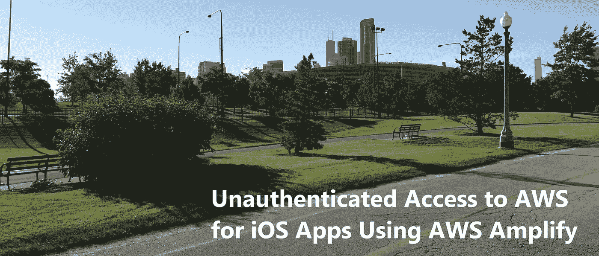
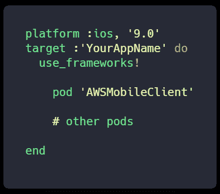

# 使用 AWS Amplify 对 iOS 应用程序的 AWS 进行未经验证的访问

> 原文：<https://itnext.io/unauthenticated-access-to-aws-for-ios-apps-using-aws-amplify-cb87222eb5d?source=collection_archive---------2----------------------->

这是一个关于 iOS 应用程序访问 AWS 资源的认证和授权的故事。这个故事将在一系列主题中讲述，从第一个主题**使用 AWS Amplify** 对 iOS 应用程序的 AWS 进行未经身份验证的访问，到基本身份验证(用户名/密码)、脸书和谷歌联盟、无密码身份验证，我们甚至将实现 TOTP 和一些生物特征身份验证，以便从移动设备访问 AWS 资源。

让我们从讨论从移动应用程序对 AWS 资源的未经身份验证的访问开始我们的旅程。

**iOS 应用场景**

假设您创建了一个访问 AWS 资源的移动应用程序，例如一个在亚马逊 S3 存储用户照片的照片共享应用程序。用户拍一张照片，保存下来，应用程序将照片上传到指定的 S3 文件夹。如果你不担心这些用户照片的安全或隐私，这很简单，也很常见。在这种情况下，用户没有通过身份提供者(IdP)的身份验证。

**签署 AWS 请求**

为了从移动设备访问任何 AWS 资源，每个请求都必须使用 [AWS 访问密钥](https://docs.aws.amazon.com/general/latest/gr/aws-sec-cred-types.html#access-keys-and-secret-access-keys)进行[签名](https://docs.aws.amazon.com/general/latest/gr/signing_aws_api_requests.html)(通常使用 AWS Mobile SDK)。访问密钥由两部分组成:一个*访问密钥 ID* 和一个*秘密访问*密钥。签名过程通过以下方式帮助保护请求:

验证请求者的身份

保护传输中的数据

防范潜在的重播攻击

**AWS 身份和访问管理**

创建 IAM 身份是为了向您的 AWS 帐户中的应用程序用户提供身份验证。身份代表用户，可以进行身份验证，然后授权在 AWS 中执行操作。这些身份中的每一个都可以与一个或多个[策略](https://docs.aws.amazon.com/IAM/latest/UserGuide/access.html)相关联，以确定用户或组成员可以对 AWS 资源执行什么操作。身份可以是 AWS 帐户 root 用户、IAM 用户、IAM 组或 IAM 角色的形式。

在第一篇文章中，我们将讨论**未认证身份**方法，该方法允许应用程序用户安全地访问我们的 AWS 资源，而无需强制用户向身份提供商(IdP)进行认证，如 Cognito 用户池(通过基本认证:用户名/密码)、脸书、谷歌或任何 OpenID Connect (OIDC)提供商。使用 Amazon Cognito 身份池可以匿名或未经身份验证地访问 AWS 资源。身份池支持经过身份验证和未经身份验证的身份。对于匿名用户、访客用户或任何您想称呼的未通过身份提供商(IdP)认证的用户，Amazon Cognito 身份池为这些应用程序用户提供了唯一的标识符和 AWS 凭据。

**未经认证的身份访问**

如果您不要求(或不需要)让每个用户通过身份提供商进行身份验证，您可以构建您的应用程序，以便 AWS Mobile SDK 使用 Amazon Cognito 身份池为每个应用程序用户请求临时 AWS 凭据。因此，Amazon Cognito(通过 web identity federation)并没有为应用程序的所有用户嵌入一组证书，而是提供了映射到 AWS IAM(未认证)角色的临时证书，该角色只拥有在 S3 存储照片所需的权限。使用 Amazon Cognito 身份提供者可以帮助您保护 AWS 帐户的安全，因为您不必在应用程序中嵌入和分发安全凭证。

**设置未授权访问**

当创建向任何 AWS 服务发出请求的移动应用程序时，请始终创建一个具有关联访问策略的 IAM 角色和一个身份提供者(如 Amazon Cognito(联合身份提供者))来验证用户(或设备)并将用户/设备映射到该 IAM 角色。我们将使用 AWS Amplify CLI 创建一个未经身份验证的 IAM 角色和相关策略，该角色和策略对 AWS 资源的访问受到限制。

在开始之前，我们将使用 [AWS Amplify 工具链](https://aws-amplify.github.io/media/toolchain?utm_source=da&utm_medium=blog&utm_campaign=denhills&utm_term=ios_native)来实现这一目的:

> $ NPM install-g @ AWS-amplify/CLI
> $ amplify configure

这是一次性安装。您需要配置 AWS CLI 或创建访问密钥和秘密密钥以供使用。查看[入门教程](https://aws-amplify.github.io/media/get_started?utm_source=da&utm_medium=blog&utm_campaign=denhills&utm_term=iOS_native)了解更多细节(有一个视频带你完成这个过程)。

接下来，让我们初始化一个项目。挑选任何 iOS 项目。为此，我使用了单视图 Xcode 10 (Swift 4)项目，但是您可以使用任何您想要的项目。

> $放大初始化

将指导您完成设置项目的过程。确保在适当的时候选择 iOS。接下来，让我们添加未经身份验证的访问:

这里的诀窍是，如果我们运行 *$ amplify add auth*

它将提供未经身份验证和经过身份验证的 IAM 角色以及一个认知用户池。出于演示的目的，我只想显示未经验证的。为此，我将启用分析，这将创建 Cognito 身份池和关联的未经身份验证的 IAM 角色，而不创建用户池。

> $ amplify 添加分析

输入应用程序名称的默认值，当提示“… *您是否希望允许来宾和未经验证的用户发送分析事件*？…" **Y**

**客户端配置**

您为安装 AWS Mobile SDK 而配置的`Podfile`必须包含:

继续之前运行`pod install --repo-update`。

将以下导入语句添加到 AppDelegate 或 ViewController 中

> *导入 AWSMobileClient*

将 return 语句替换为下面的代码，放入应用程序的`AppDelegate.swift`的`application(_:didFinishLaunchingWithOptions:)`方法的底部。

**构建并启动应用**

一旦您启动应用程序，用户将从 Cognito 身份池获得一个临时身份 Id，任何 AWS 请求都将承担 AWS Amplify CLI 代表我们创建的未经验证的 IAM 角色。如果您启动 IAM 控制台并选择未经身份验证的 IAM 角色，您将看到关联的策略。您可以更新现有策略来添加或删除访问权限。这是所有未经认证的应用程序用户将承担的角色。一旦用户通过身份提供者进行了身份验证，他们就开始承担经过身份验证的身份 IAM 角色。在下一个主题中，当我们使用 Amazon Cognito 用户池实现基本身份验证时，我们将看到这一点。