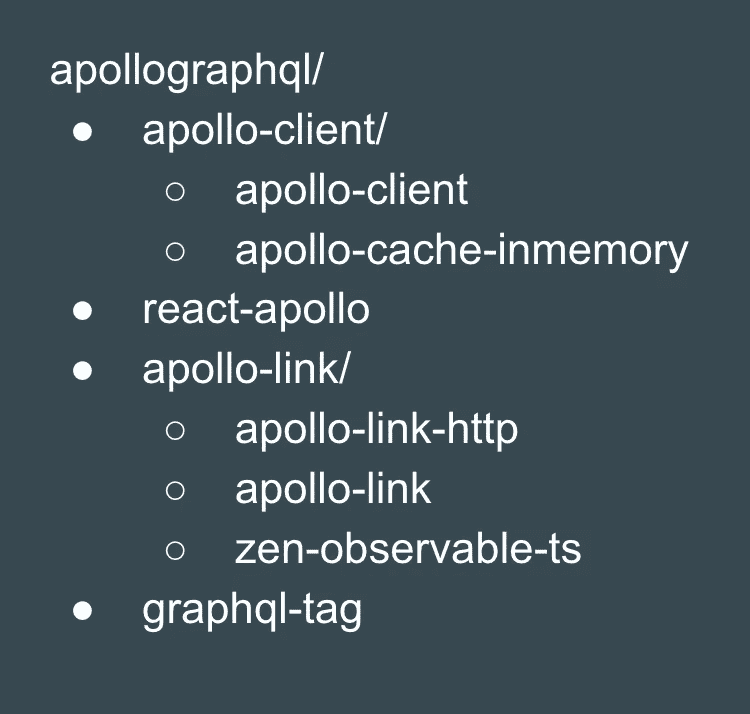
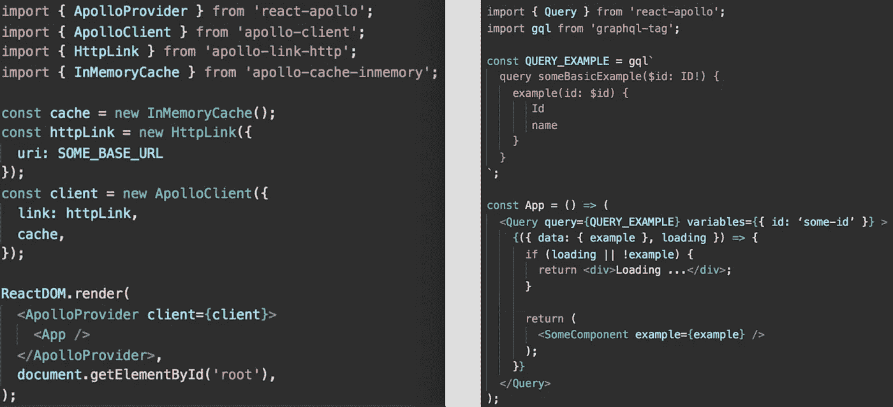
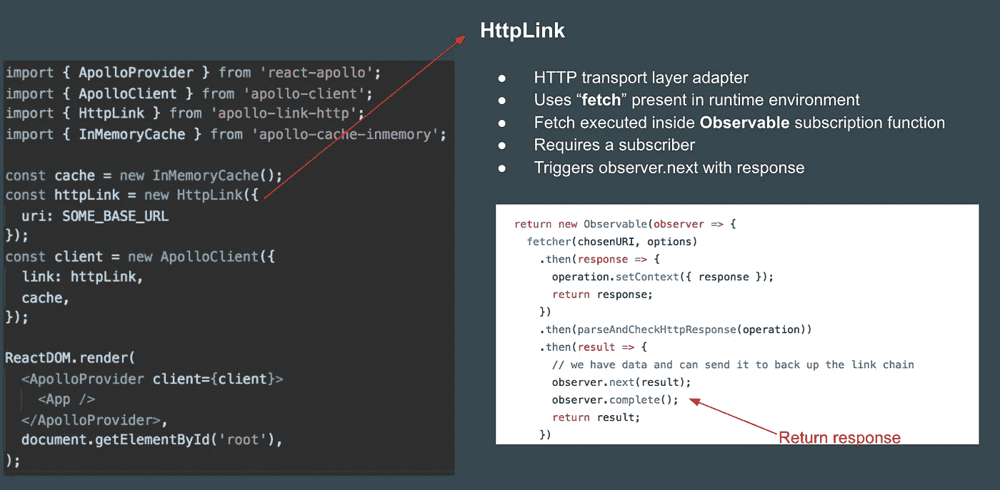
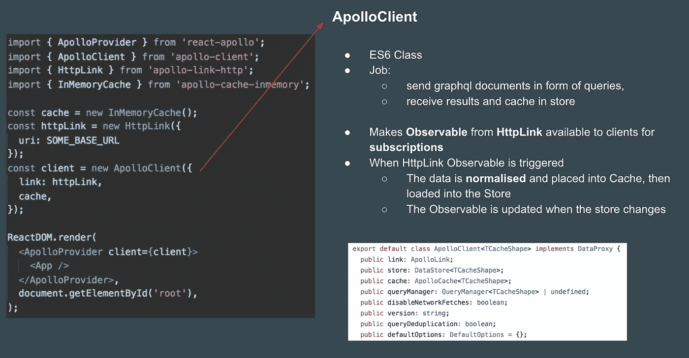
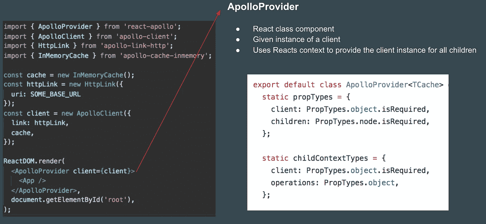
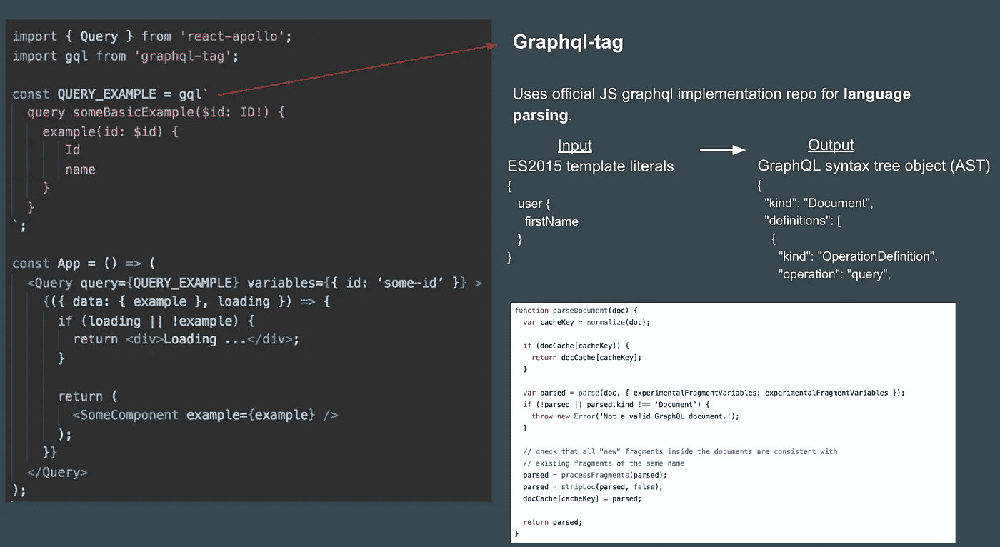
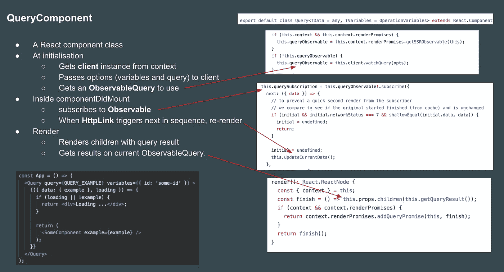
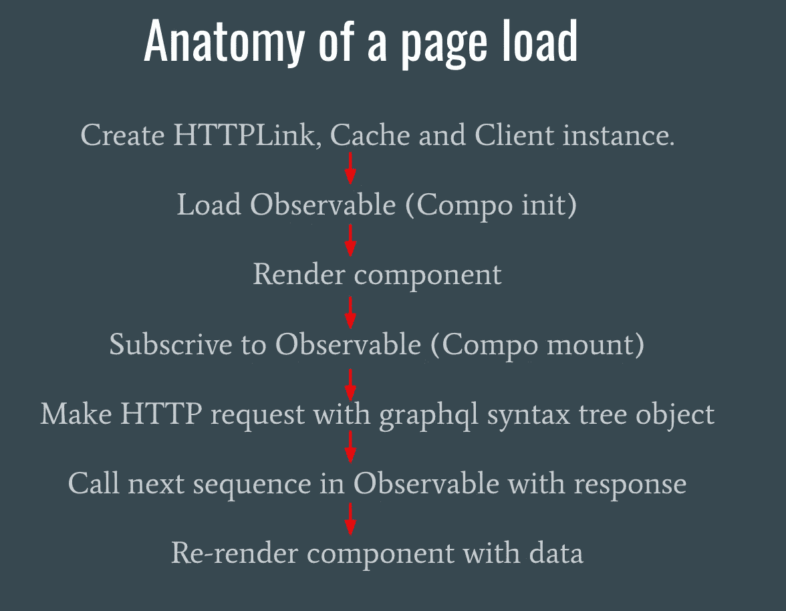
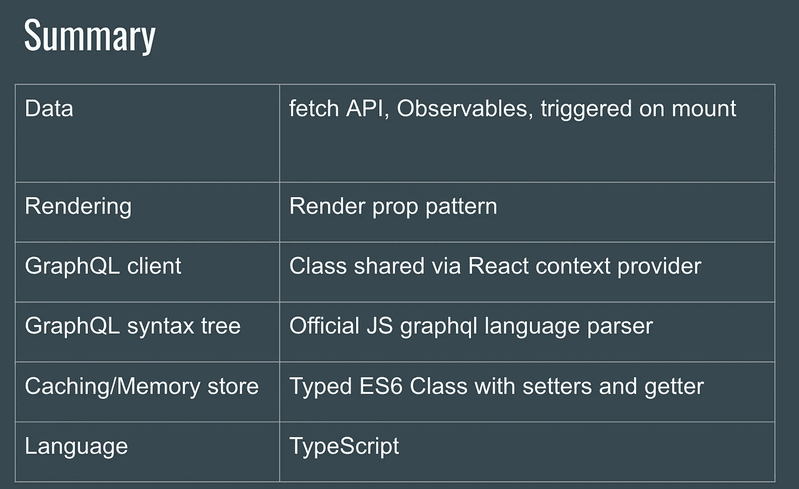

# 在阿波罗的引擎盖下

> 原文：<https://itnext.io/under-the-hood-of-apollo-6d8642066b28?source=collection_archive---------2----------------------->

这篇文章来自我最近做的一个关于 Apollo 客户端内部的演讲。看[视频这里](https://www.youtube.com/watch?v=zO_ZuWERUy8)。我很沮丧，因为我不明白在我使用它的时候到底发生了什么，所以我花了一些时间来钻研代码。

这篇文章主要关注一个相对简单的用例，也就是说

*   100%反应 JS 和客户端
*   简单查询组件(无变异)
*   无订阅/批处理
*   没有复杂的缓存或内存策略

我计划做一个后续工作，看看更先进的功能。

这是我的“引擎盖下”系列的一部分:

*   [类型系统(如 TypeScript)](https://craigtaub.dev/under-the-hood-of-type-systems)
*   [来源图](https://craigtaub.dev/source-maps-from-top-to-bottom)
*   [反应钩](https://craigtaub.dev/under-the-hood-of-react-hooks)
*   [网络捆扎机(如网络包)](https://craigtaub.dev/under-the-hood-of-web-bundlers)

# 阿波罗组织架构

我认为在 Github 上概述 Apollo 组织很有趣。我们感兴趣的组件的设置如下图所示。



**要点**

*   分为存储库和单一存储库
*   总共 130 个储存库
*   大量的打字稿(所有我们感兴趣的)
*   包括设计原则和路线图(为社区和用户提供指导)

# 看得见的

可观测量是阿波罗工作的一个重要机制，所以我认为最好对它们做一个简单的提醒。

简而言之:

*   新的 ***异步原语*** (如承诺和流)
*   具有一些**强大的属性**(懒惰、多次运行序列、可取消、内置易于数据操作的操作符)。

示例用法:

1.  创建可观察对象

```
**subscriptionFunction** = (observer) => { // run some code... observer.next("call next in sequence"); observer.complete(); return () =>  console.log("unsubscribe has been called")}**observableObject** = new **Observable**(**subscriptionFunction**);
```

> 一个可观察对象只是一个函数，它接受一个观察者并返回一个函数

2.订阅 observable:

```
**subscription** = **observableObject**.**subscribe**({ next(x) { console.log(x) }, // "call next in sequence" error(err) { console.log("receives terminating error of the sequence.") }, complete() { console.log("Stream has completed successfully.") }});**subscription.unsubscribe();**
```

订阅观察者将触发订阅功能。它可用于同步或异步操作。

他们采用发布/订阅模式。

> 定义对象之间的一对多关系。当一个对象的状态发生变化时，会通知并更新从属对象。

现在我们将重点放在 Apollo 客户端代码本身。

# 给我看看代码！！

我们将关注阿波罗的基本“你好世界”是什么样子的。一些你可以在网上找到的东西。这包括两个部分。

**index.js(左下)**

这包括我们的设置和配置。

**app.js(右下方)**

这包括查询组件、查询细节和另一个组件中的响应呈现。



我们的示例应用程序

我们现在将分解使用的每个组件，包括一个关于它们如何工作的简短声明和一个帮助截图。


简单 JS 数据存储



返回一个可观察值。触发时运行 fetch，然后 fetch 按照观察到的响应顺序运行下一个。注意:获取必须已经可用。



HTTPLink 中的可观察对象、缓存和我们的查询组件之间的桥梁。对中间的数据进行处理(在以后的文章中会详细介绍)。



瘦包装器使 this.context.client 对所有呈现的子级可用



获取准备在 GraphQL 服务器上处理的查询



多肉的部分！



事件发生顺序的高级视图。



崩溃…

就这样，如果你发现任何错误或有任何问题，请让我知道。

就个人而言，我发现理解一些我在开发过程中会注意到的边缘情况是有帮助的。例如 *SSR 不能开箱即用，因为订阅/获取事件序列都在 DOM 挂载*中。

我希望你在这篇文章中发现了一些有趣或有用的东西。

下一步是查看更高级的特性，如突变、缓存、批处理等。我非常期待看到这一成果。

谢谢，克雷格:)