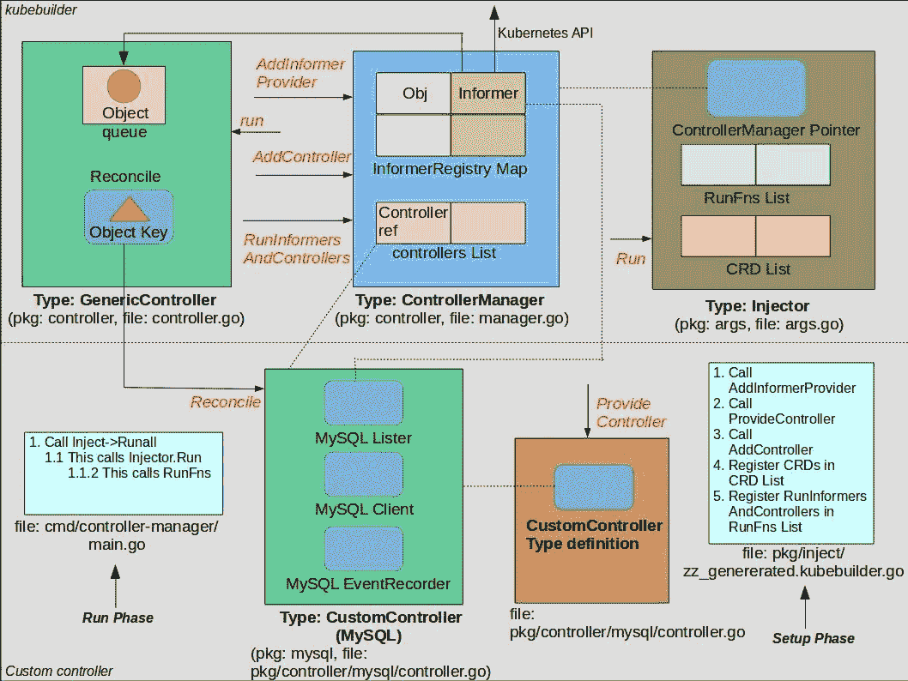

# 在 Kubebuilder 框架下

> 原文：<https://itnext.io/under-the-hood-of-kubebuilder-framework-ff6b38c10796?source=collection_archive---------4----------------------->

最近在 Kubernetes subreddit 上有一个关于应该用什么来创建定制控制器/操作器的问题。我们应该使用 Kubebuilder，还是运营商 SDK，还是更喜欢从头开始实现？我回答了这个问题，但想提供更详细的分析。

在本帖中，我们将看到 [Kubebuilder 框架](https://github.com/kubernetes-sigs/kubebuilder)的内幕，并将其与[从头开始的方法](https://medium.com/@cloudark/kubernetes-custom-controllers-b6c7d0668fdf)进行比较。在随后的文章中，我们将对运营商 SDK 做类似的练习。

Kubebuilder 是一个用于创建 Kubernetes 定制控制器的框架，这些控制器与定制资源定义(CRD)一起工作。它目前位于“kubernetes-sigs”Github 组织中，是“k8s-sig-api-machinery”特殊兴趣小组的一部分。

在我们深入 Kubebuilder 的细节之前，这里有一些你应该熟悉的 Kubernetes 术语:

1.  CRD:自定义资源定义。
2.  object:Kubernetes 基本类型/种类的实例或 CRD 的实例。
3.  对象关键字:代表对象的唯一字符串。
4.  Informer:定期查询 Kubernetes API 服务器以监控特定类型/种类的对象变化的机制。它检索已更改的对象，并将它们存储在本地索引和队列中。这里的“本地”是指自定义控制器运行的位置。
5.  队列:在对象被处理之前存储它们的数据结构。
6.  Lister:从本地索引中查询对象的机制。
7.  Client/ClientSet:直接从 Kubernetes API 服务器查询对象的机制。使用列表器从本地索引中查询对象比使用客户机查询 Kubernetes API 服务器更可取，因为它减少了 API 服务器上的负载。

下面是 kubebuilder 及其与自定义控制器的交互点的图形表示:

kubebuilder 和自定义控制器交互

我们将图片分为两部分:kubebuilder(顶部)和自定义控制器(底部)。我们将首先从解释 kubebuilder 组件开始。

**Kubebuilder 组件:**

1)通用控制器:kubebuilder 提供了一个通用控制器，作为我们定制控制器的包装器。它基于采样控制器的[。它定义了队列，在该队列中，对象由通知者使用事件处理程序(未示出)来传递。队列本身不向我们的定制控制器公开。通用控制器还定义了一个变量，该变量将保存对我们的自定义控制器将实现的协调函数的引用。通用控制器在调用我们的控制器中的协调函数时，将存储在队列中的对象的对象键作为参数传递。](https://github.com/kubernetes-sigs/kubebuilder/blob/master/pkg/controller/controller.go#L52)

2)控制器管理器:控制器管理器管理定制控制器。它维护两种数据结构:控制器引用列表和对象及其通知者的映射。它提供了以下函数来填充这两个数据结构:AddInformerProvider、AddController、RunInformersAndControllers。

3)注入器:注入器定义了两个数据结构:一个用于存储需要注册的 CRD 的列表，一个用于存储启动通知器和控制器时应该调用的函数的列表。CRD 列表将由我们的定制控制器将监控其对象的 CRD 填充。CRDs 的注册在设置阶段完成。功能列表也在设置阶段填充。

**定制控制器组件:**

1) controller.go:这是我们实现控制器代码的地方。kubebuilder 将生成一个基本控制器，其中包含我们控制器的类型定义。

2)自定义控制器:这是代表我们的控制器的类型。它是由 kubebuilder 生成的。它为 CRDs 的列表器和客户端定义了变量。还生成了存根协调函数。我们应该编写协调逻辑作为这个函数的一部分。它将被通用控制器调用，并被提供一个对象键。此外，还生成了一个名为“ProvideController”的函数。它将对协调函数的引用从我们的控制器添加到通用控制器，并将通用控制器实例作为返回值返回。

3) zz_generated.kubebuilder.go:这个文件包含在控制器管理器和注入器中设置各种数据结构的步骤。它是由 kubebuilder 生成的。

4) main.go:该文件包含启动通知程序和控制器的步骤。它也是由 kubebuilder 生成的。

**与从头开始方法的比较:**

以下是 Kubebuilder 方法与[从头开始](https://medium.com/@cloudark/kubernetes-custom-controllers-b6c7d0668fdf)方法的一些比较。

*相似之处:*

1.  这两种方法都生成基本的 go 文件(types.go、register.go 等)。).在 Kubebuilder 方法中，kubebuilder cli 采用命令行标志来控制文件和目录名及其位置。在从头开始的方法中，您必须使用“hack/update-codegen.sh”脚本来生成这些文件。
2.  这两种方法都要求你理解 Kubernetes 的 Lister 和 Client 的概念(如上所述)。

*使用 Kubebuilder 优于从头开始的方法:*

1.  基本目录结构由 kubebuilder 生成。对于从头开始的方法，您必须为“客户端”和“API”创建带有占位符子目录的“pkg”目录。hack/update-codegen.sh 脚本将在这些目录中生成文件。
2.  编写控制器时，不需要管理每个控制器队列。这是由 kubebuilder 提供的通用控制器抽象出来的。使用[从零开始的方法](https://medium.com/@cloudark/kubernetes-custom-controllers-b6c7d0668fdf)，您必须创建工作队列并创建通知器和事件处理函数。然后，您必须将它们连接起来，以便从 Kubernetes API 服务器接收更改后的对象。此外，如果您想使用本地索引，您还必须创建一个索引器。使用 kubebuilder 时，您不必担心这些问题。
3.  kubebuilder 为你的控制器定义了一个类型。它为您的 CRD 维护列表和客户端参考。这个类型定义提供了一个单一的位置，当您需要在代码中使用它们时，可以在这个位置查找列表器或客户端。在从头开始的方法中，您必须自己管理这样的引用。

*使用 Kubebuilder 超过从头开始方法的顾虑:*

与从头开始的方法相比，使用 Kubebuilder 的主要问题是 kubebuilder 引入的新抽象——generic controller、ControllerManager、Injector、InjectorArgs、Installer、Install_strategy 等。此外，还有 ProvideController、AddInformerProvider、RunInformersAndControllers 等新功能。您需要很好地掌握这些抽象和功能，以构建 kubebuilder 工作的心理模型，以及它如何与您的控制器交互。

**结论:**

虽然 Kubebuilder 肯定是有用的，但它提供足够抽象的方法是否对复杂场景中的开发人员有用，或者他们更喜欢遵循从头开始的方法从基本原则开始工作，还有待观察。

[www.cloudark.io](https://cloudark.io/)

注意:如果你喜欢这个帖子，你可能还想看看运营商 SDK 的封面下的。