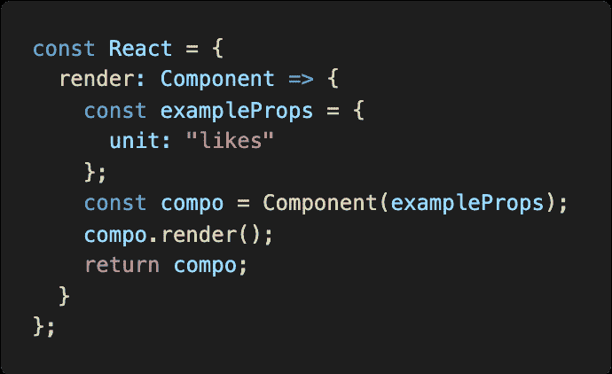
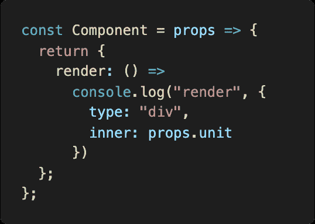
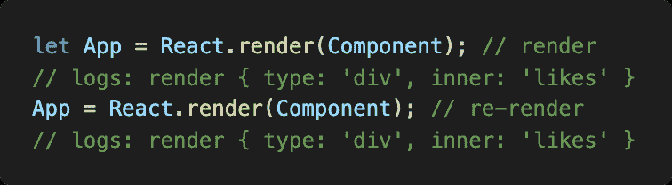
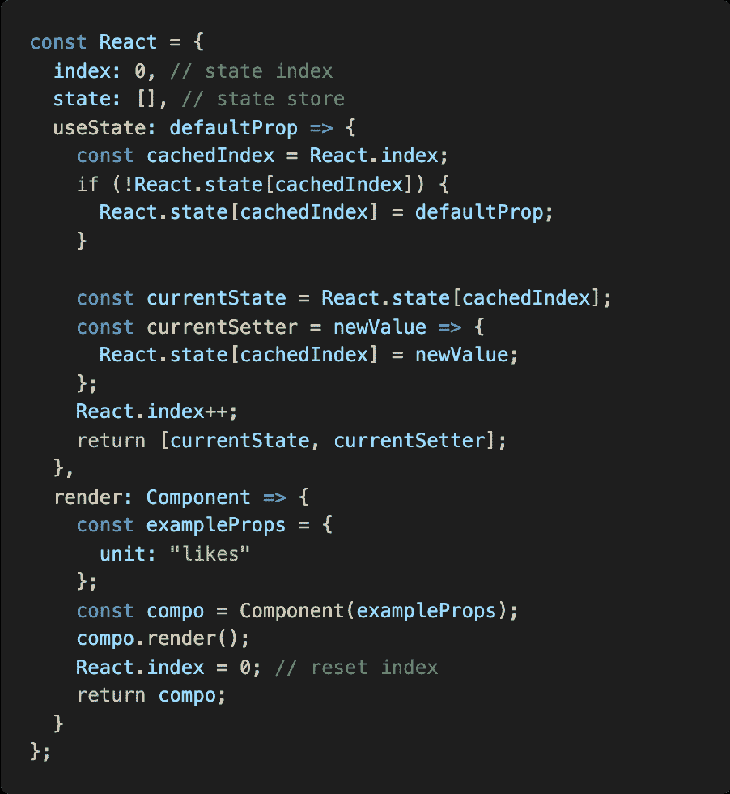
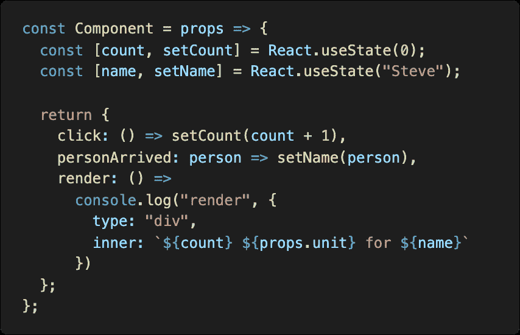
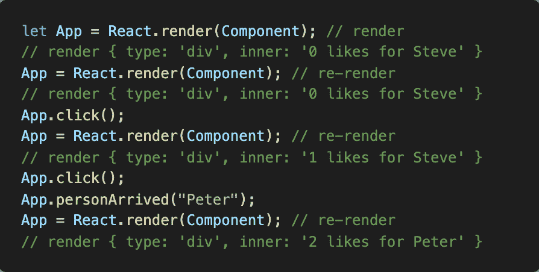
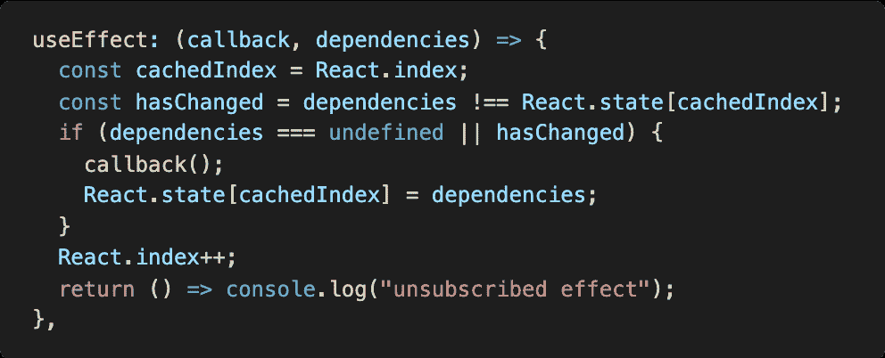
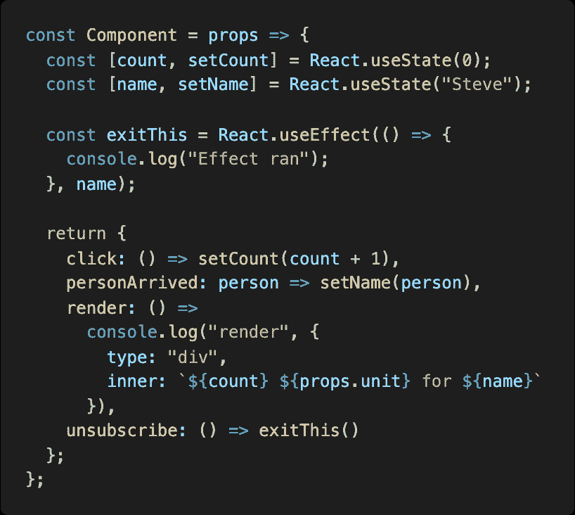
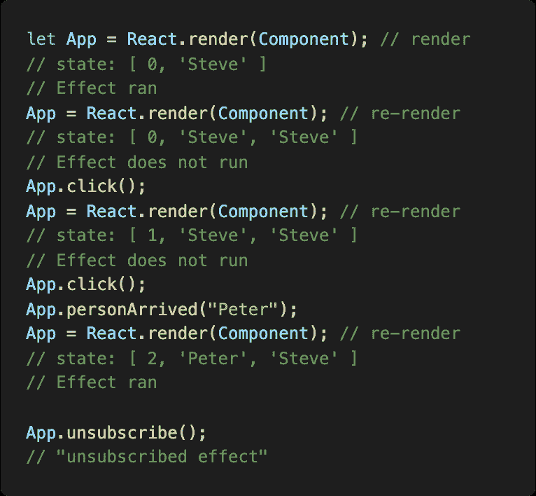

# 反应钩的引擎盖下

> 原文：<https://itnext.io/under-the-hood-of-react-hooks-805dc68581c3?source=collection_archive---------1----------------------->

React 充满了有趣的设计模式，当钩子被引入时，它清理了人们在更令人沮丧的特性上的许多问题，比如类和生命周期方法。今天我们将看看如何用钩子构建我们自己的 React 引擎，这样我们就能理解*使用状态*和*使用效果*的工作机制。

我们将**而不是**涵盖*光纤*、*协调*或变化检测机制。

这是我的[“引擎盖下”系列](https://craigtaub.dev/introducing-my-under-the-hood-of-series)的一部分:

*   [网络捆扎机(如网络包)](https://craigtaub.dev/under-the-hood-of-web-bundlers)
*   [类型系统(如 TypeScript)](https://craigtaub.dev/under-the-hood-of-type-systems)
*   [测试跑步者(如摩卡)](https://craigtaub.dev/under-the-hood-of-test-runners)
*   [VSCode 自动格式化程序(例如更漂亮)](https://craigtaub.dev/under-the-hood-of-vscode-auto-formatters)
*   [来源图](https://craigtaub.dev/source-maps-from-top-to-bottom)
*   [阿波罗](/under-the-hood-of-apollo-6d8642066b28)

这篇文章的完整视频可以在[这里](https://www.youtube.com/watch?v=mMTYRijTHEo)找到。我的“*”系列视频的一部分。*

# *反应概述*

*我们应该从 React 的基本基本版本开始。为此，我们需要触及 React 的一些核心设计概念，例如:*

***JSX***

*   *元素是 POJO 的(plain-old-javascript-objects)*
*   *组件是功能*

***纯渲染***

*   *一个渲染实例如下:*渲染=组件(数据)**

***状态机***

*   *单向数据流*
*   *数据更改检测强制所有需要的孩子进行更新*

*我们将构建我们自己的(超级简单的)React 版本，然后添加钩子，为此我们需要一个 React 引擎的基本版本，它应该使用一些道具来呈现一个组件并返回该组件(以便稍后进行交互)。*

**

*现在我们有了一个基本的引擎，我们需要一个伴随的组件来记录渲染过程中的数据:*

**

*我们现在可以一起使用 React 和 Component，并查看其输出(在每行代码下面):*

**

*现在我们有了一个由 React 引擎渲染的基本组件。*

# *反应钩*

*关于钩子的简单提醒。*

> **“钩子让你在一个纯组件中使用状态和其他 React 特性，而不用写类”**

*类经常会使人迷惑，增加代码的臃肿，但是使用钩子还有其他的优势，其中一些是:*

*   *更容易构建和重用有状态逻辑*
*   *更容易将组件拆分成可关联的部分*
*   *消除对许多生命周期方法的混淆(例如，什么与什么事件相关)*
*   *对你的反应知识没有根本性的改变，只是用一种更直接的方式来使用你已经知道的特性*
*   *易于添加类型，因为钩子只是函数(不像高阶组件和大多数渲染道具模式)*
*   *用*“react-DOM/test-utils”易于测试**

*所以很容易理解为什么钩子是如此强大的机制。因此，让我们来看看它们是如何工作的，并建立我们自己的。*

# ***T5【使用状态】T6【挂钩】***

*使用状态有几个核心概念:*

*   *在纯组件中使用状态。*
*   *使用任何原语(字符串/数组/对象等。)*

*根据他们经常返还的文件:*

1.  *还原状态*
2.  *行动调度员*

*然而，这可以简化为一个基本属性值和一个设置器。*

*有一个简单的规则对钩子非常重要。那就是**钩子被称为顶端。这意味着在任何条件或嵌套块之外。这对于钩子机制至关重要，我们将研究原因。***

*因此，让我们扩展 React engine 来包含 *useState* 钩子。我们将需要一个“*状态索引*计数器，以及“*状态存储*”值。*

**

*我们还添加了一个*使用状态*方法。它的工作原理是:*

*   *检查当前索引在状态中是否有值，如果没有则设置默认值*
*   *然后为当前状态索引值构建 setter*
*   *最后递增索引(为了下一个钩子)并返回 setter 和当前值。*

*现在我们将在组件中使用我们的*使用状态*。*

**

*参见上面的“*计数*”和“*名称*”用法。我们还利用了“*内部*”属性，这样我们就可以在终端监视它。此外，我们还添加了一些手动方法来更新状态值。它们是手动的，因为我们不担心这篇文章中的变化检测或协调。我们将手动触发返回的函数以及 *render* 方法(遵循我们之前在 React engine 部分中使用它的方式)。*

*因此，在运行下面的时，我们记录渲染输出。我们可以看到，通过每个“ *click()* ”我们正在更新计数，通过“ *personArrived()* ”我们正在更新 person(代码行下面的终端输出)。*

**

*在我们的使用中有一个主要问题。也就是说，这不会同时对许多组件起作用。它与我们的单个组件紧密耦合。状态应该保存在模块范围或组件的单个存储命名空间中。*

# ****使用效果*挂钩***

*文件中的简短引用:*

> **“在初始渲染后和每次更新后运行的功能”**

*与 *useState* 类似，关于顶层调用的规则也适用。我们的实施也需要它。*

*效果的几个概念:*

*   *渲染期间创建*
*   *按定义顺序运行(如*使用状态*)*
*   *在给定的生命周期事件后运行(第一次渲染和/或当依赖关系发生变化时)。即安装和更新)*
*   *返回一个函数(某些效果需要清除，例如取消订阅)*

*我们的*使用效果*挂钩机构如下:*

**

*代码的预演:*

*   *缓存存储索引*
*   *检查依赖关系的状态是否已经改变(这是我们的变量跟踪机制)*
*   *如果没有给定的依赖项或者它发生了变化，那么运行我们的效果并用我们的依赖项值更新存储索引值*
*   *然后递增存储索引，以便将来的挂钩使用它们自己的索引*
*   *最后返回一个函数*

*你可以看到我们的效果挂钩也依赖于“*状态索引*”。与 *useState* 类似，它依赖于状态数组中值的确定性顺序。*

> *所有的状态和效果挂钩必须以相同的顺序调用，这样它们的状态索引总是可以在状态数组中的相同位置找到。*

*现在让我们更新我们的组件来使用效果钩子*

**

*上面的钩子将寻找" *name* "属性的变化，我们也为我们的效果钩子公开了一个 *"unsubscribe"* 函数。*

*现在来看渲染过程中的运行顺序，我已经记录了每个渲染的状态数组，以帮助我们跟踪(详细解释见下面的截图)。*

**

*下面详细描述了上面发生的事情对我们的影响。*

***第一次渲染***

*在 2 状态运行后，现在" *cachedIndex* "在 *useEffect* 内。状态值为“*未定义*”，因为它对于该索引不存在(还不存在)。因此，我们将运行我们的回调并将一个新实体写入状态(在索引 2 下)，这是我们的依赖值(即当前的“S*teve】*)。*

*所以:state 现在有本地状态值和效果值。它是基于*“状态索引”*(即它在组件中被调用的位置)的确定顺序。这意味着它是可靠的，因为这个顺序不应该改变。记住**规则#1** 。*

***重新渲染***

*我们将检查状态数组中的第三个值，只有当它改变时，效果才会运行。看上面，当我们把名字改成*“Peter”*时，我们的钩子再次运行。最后，我们取消我们的挂钩。*

*以上有两个主要问题(除其他外):*

1.  *仅适用于 1 个依赖项，不适用于数组*

*很容易扩展我们的代码，所以我们可以使用数组。通过使用相同的存储索引并存储依赖于状态的数组，而不仅仅是单个值。然后迭代依赖数组来检查变化。*

*2.我们的是在渲染之前运行，而不是之后*

*这是一个更复杂的问题，需要对我们的 React 引擎进行根本性的改变。因为这是一个小的 POC 示例，所以不值得修复。*

*我希望这是有用的，或者至少有点意思。我非常喜欢学习钩子，并且对它们有了更深的理解，因为它们是一个帮助前端开发人员体验向前发展的特性。*

*你可以在这里找到代码的要点:[https://gist . github . com/craigtaub/a 131 EB 23 a9 aa 15540 a 84 DC 2266 E1 b 672](https://gist.github.com/craigtaub/a131eb23a9aa15540a84dc2266e1b672)*

*谢谢，克雷格😃*