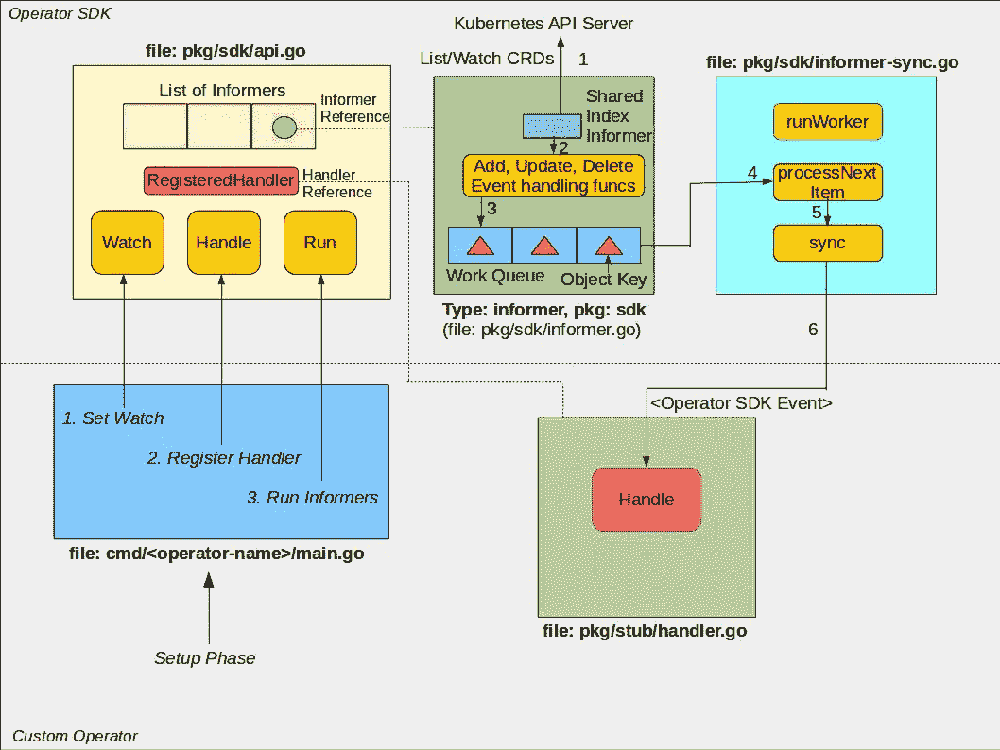

# 在运营商 SDK 的罩下

> 原文：<https://itnext.io/under-the-hood-of-the-operator-sdk-eebc8fdeebbf?source=collection_archive---------6----------------------->

在[之前的博客文章](https://medium.com/@cloudark/under-the-hood-of-kubebuilder-framework-ff6b38c10796)中，我们看到了 Kubebuilder 框架的内幕。在本帖中，我们将关注运营商 SDK。

[运营商 SDK](https://github.com/operator-framework/operator-sdk) 是最近宣布的运营商框架的一部分。Operator SDK 的目标是提供简化创建 Kubernetes 操作符的高级抽象。

在我们深入讨论 Operator SDK 的细节之前，这里有一些您应该熟悉的 Kubernetes 术语:

1.  CRD:自定义资源定义。
2.  object:Kubernetes 基本类型/种类的实例或 CRD 的实例。
3.  对象关键字:代表对象的唯一字符串。它是从对象中解析的。
4.  Informer:定期查询 Kubernetes API 服务器以监控特定类型/种类的对象变化的机制。它检索已更改的对象并将它们存储在本地索引中。这里的“本地”是指自定义操作符运行的位置。
5.  SharedIndexInformer:一种数据结构，用于管理存储对象的多个通知器之间的共享索引。
6.  工作队列:在对象键被处理之前存储它们的数据结构。
7.  Lister:从本地索引中查询对象的机制。
8.  Client/ClientSet:直接从 Kubernetes API 服务器查询对象的机制。使用 Lister 从本地索引查询对象比使用客户机查询 Kubernetes API 服务器更可取，这样可以减少 API 服务器上的负载。

这里是 Operator SDK 的图形表示，以及它如何与自定义操作员代码交互。

运营商 SDK 和自定义运营商交互

我们将图片分为两部分:Operator SDK(顶部)和 custom Operator(底部)。

**运营商 SDK 组件:**

1)informer:informer 类型保存 Operator SDK 使用的关键数据结构。它们是 SharedIndexInformer 和工作队列。SharedIndexInformer 使用 List 和 Watch 方法定期查询 Kubernetes API 服务器，以检索任何已更改的对象。事件处理函数被定义为对对象的添加、更新和删除事件做出反应。这些函数解析对象的键，并将其添加到工作队列中。

2) informer-sync.go:这个文件定义了处理来自工作队列的对象键的函数。processNextItem 函数检索密钥并调用 sync 函数。然后从键创建一个[事件对象](https://github.com/operator-framework/operator-sdk/blob/master/pkg/sdk/types.go)，并调用定制操作符代码的注册句柄函数。

3) api.go:这个文件提供了公共 api(入口点函数)。这些函数用于注册自定义操作符的句柄函数，为 CRD 和 Kubernetes(我们希望对其做出反应的本地类型)创建通知程序，以及启动通知程序。

**自定义操作员组件:**

1) handler.go:这个文件是我们编写自定义操作符的对帐代码的地方。它是由操作员 SDK 生成的。文件中提供了存根句柄函数。该函数由 informer-sync.go 文件中 sync 函数内的操作符 SDK 调用。从工作队列中捕获对象键的事件被传递给 Handle 函数。

2) main.go:该文件执行连接自定义操作符和操作符 SDK 的设置步骤。它是由操作员 SDK 生成的。该文件中使用的典型模式由以下动作组成:(a)设置对所需类型(CRD 或 Kubernetes-native 类型)的监视，(b)注册处理程序，(c)启动通知程序。api.go 中的各个函数用于执行这些操作。

**与从头开始方法的比较:**

下面是将运营商 SDK 方法与[从头开始](https://medium.com/@cloudark/kubernetes-custom-controllers-b6c7d0668fdf)方法进行比较后的一些收获。

*相似之处:*

这两种方法都提供了生成基本 go 文件的工具。在从头开始的方法中，为此提供了一个脚本( [hack/update-codegen.sh](https://github.com/kubernetes/sample-controller/blob/master/hack/update-codegen.sh) )。类似的，运营商 SDK 提供了命令行工具。

*差异:*

1.  与从头开始的方法相比，Operator SDK 生成的目录结构明显不同。
2.  在从头开始的方法中，CRD 的类型化客户端和列表器是由 update-codegen 脚本生成的。Operator SDK 不会生成这些。相反，它通过利用 [client-go 库](https://github.com/kubernetes/client-go)提供的发现和 REST 映射功能在内部创建资源客户端。

*与从头开始相比，使用运营商 SDK 的优势:*

编写操作符时，不需要管理工作队列或 SharedIndexInformer。这是由运营商 SDK 提供的 informer 类型抽象出来的。对于从头开始的方法，您必须创建工作队列，还必须创建通知器和事件处理函数。然后，您必须将它们连接起来，以便从 Kubernetes API 服务器接收更改后的对象。此外，如果您想使用本地索引，您还必须创建一个索引器。使用 Operator SDK 时，您不必担心这些。

*在从头开始方法上使用运营商 SDK 的顾虑:*

运营商 SDK *的主要担忧可能是它的性能。在[样本控制器](https://github.com/kubernetes/sample-controller)中，它被用作从头开始方法的起点，列表器被用来减少到 Kubernetes API 服务器的流量。在 Operator SDK 的设计中，我们没有发现任何 Lister 功能的使用。因此，这可能会导致 API 服务器上的更多负载(我们计划很快对此进行实验性评估)。目前，我们已经[在 Operator SDK 存储库上发布了一个问题](https://github.com/operator-framework/operator-sdk/issues/258)，以了解这一设计决策背后的基本原理。*

**结论:**

Operator SDK 是一个文档完备的代码库，易于理解。包的数量很少，将功能分解成不同的包是合理的。虽然[一些重构可以帮助](https://github.com/operator-framework/operator-sdk/issues/257)，但是当前的代码基础写得很好。作为用户，你将不必学习许多新的抽象概念。对运营商 SDK 定义的事件类型及其内部处理方式的基本理解应该就足够了。与从头开始的方法相比，您应该仔细考虑的主要问题是它对 Kubernetes API 服务器的性能影响。

注意:如果你喜欢这篇文章，你可能也想看看 Kubebuilder 框架下的[。](https://medium.com/@cloudark/under-the-hood-of-kubebuilder-framework-ff6b38c10796)