# 网络捆扎机的内部(例如网络包)

> 原文：<https://itnext.io/under-the-hood-of-web-bundlers-e-g-webpack-926e868f7f5e?source=collection_archive---------1----------------------->

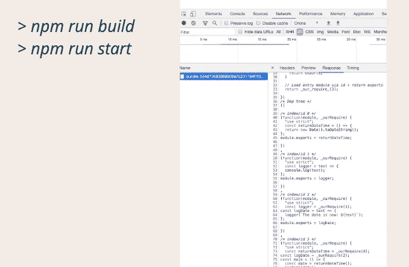

对于大多数开发人员来说，Webpack 有点像一个黑匣子。像“ [create-react-app](https://create-react-app.dev/docs/getting-started/) ”这样的工具抽象出了大部分的捆绑器功能。我对此做了一些研究，并开始构建我自己的轻量级 web bundler，以更多地了解它需要什么。

这是我的“引擎盖下”系列的一部分:

*   [类型系统(如 TypeScript)](https://craigtaub.dev/under-the-hood-of-type-systems)
*   [试跑者(如摩卡)](https://craigtaub.dev/under-the-hood-of-test-runners)
*   [VSCode 自动格式化程序(例如更漂亮)](https://craigtaub.dev/under-the-hood-of-vscode-auto-formatters)
*   [来源图](https://craigtaub.dev/source-maps-from-top-to-bottom)
*   [反应钩](https://craigtaub.dev/under-the-hood-of-react-hooks)
*   [阿波罗](/under-the-hood-of-apollo-6d8642066b28)

这篇文章的完整视频可以在[这里](https://www.youtube.com/watch?v=JAY10_75vFw)找到。我的“*”系列视频的一部分。*

*本文分为三个部分:*

1.  *什么是“网络捆绑器”*
2.  *为“网络捆绑器”构建编译器*
3.  *在应用程序中使用输出*

# *1.什么是“网络捆绑器”*

*我们应该首先问一个问题“现在是 2020 年，为什么要捆绑销售？”。这个问题有很多答案:*

*   *性能:第三方代码是昂贵的，我们可以使用静态代码分析来优化它(如樱桃采摘和摇树)。我们还可以通过将 100 个文件变成 1 个来简化发货，从而限制用户的数据和资源支出*
*   *支持:web 有如此多不同的环境，您希望您的代码在尽可能多的环境中运行，同时只编写一次(例如，在必要的地方添加 Polyfills)*
*   *用户体验:利用单独捆绑包的浏览器缓存(例如，所有库的供应商和应用本身的应用)*
*   *单独关注:管理你如何提供字体，css，图像以及 JS。*

*网络捆绑器的基本架构是:*

**

*基本上，我们将模块通过编译器生成资产。*

*编译器涉及到很多概念。这是我觉得这是一个如此有趣的话题的原因之一，因为在如此小的空间里却有如此多的东西。*

*这些概念是:*

*   *生活*
*   *通过引用传递*
*   *依赖图(当我们遍历应用程序文件时)*
*   *定义自定义导入/导出系统(可以在任何环境下运行)*
*   *递归函数*
*   *AST 解析和生成(将源代码转换成其标记化的形式)*
*   *散列法*
*   *本机 ESM(由于其编译时检查，ESM 可以很好地管理循环依赖关系)*

*我们将忽略编译器中的非 js 资产；所以没有字体，css 或图像。*

# *2.为“网络捆绑器”构建编译器*

*这将是对 Webpack 如何工作的一个巨大的简化，因为有许多不同的方法来解决这个问题，希望这种方法将提供一些有关机制的见解。*

*下面是编译器的概述，我们将分解每个阶段。*

**

*我们的应用:*

*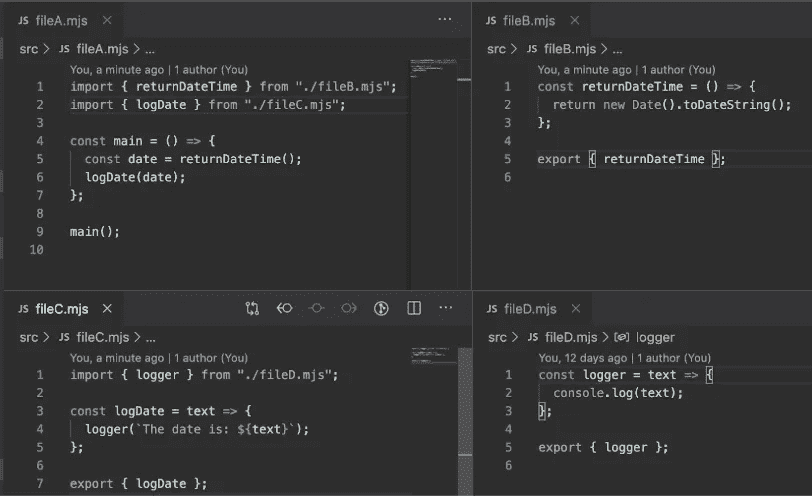*

*我们的应用程序由 4 个文件组成。它的工作是获取日期时间，然后将其传递给 logDate，后者的工作是向日期添加文本并将其发送给记录器。这很简单。*

*我们的应用程序树是这样的:*

*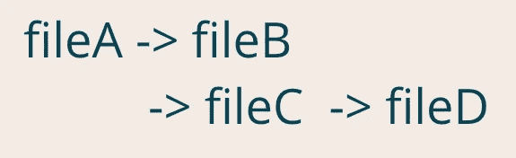*

## ***第一阶段***

*使用第三方工具进行 AST 解析我们(参见下面的代码):*

*   *确定文件的完整路径(这非常重要，所以如果我们再次处理同一个文件，就很清楚了)*
*   *抓取文件内容*
*   *解析成 AST*
*   *将内容和 AST 存储到一个“模块”对象上。*
*   *处理内容内部的依赖关系(使用 AST“import declaration”值)，用值递归调用此函数*
*   *最后，将该函数添加到 depsArray 中，这样我们就可以用最后出现的第一个文件来构建我们的树(这很重要)*

*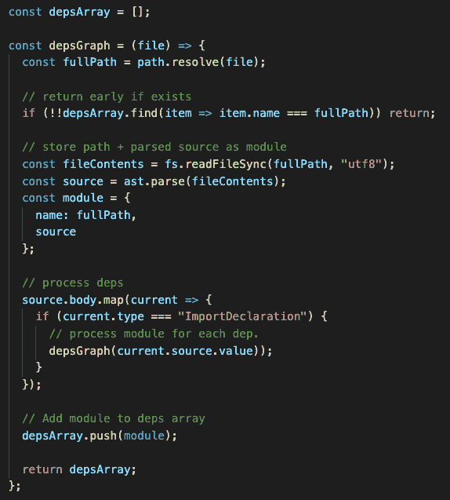*

*所以我们的树现在看起来像右下方的数组:*

*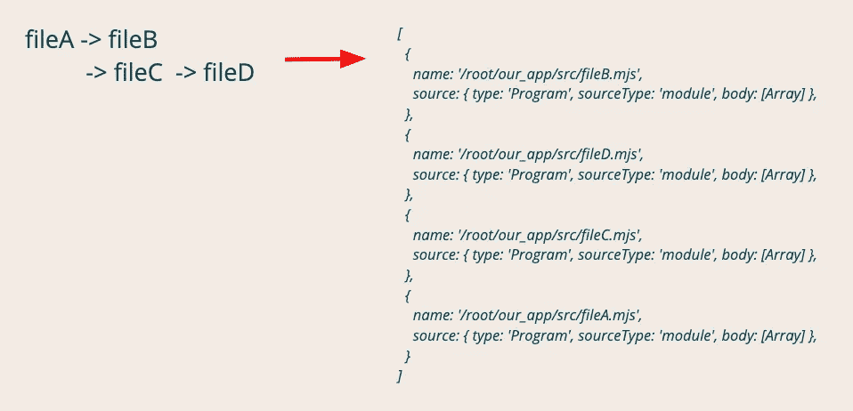*

## *第二相*

*编译器的工作是“*执行代码，从而产生可执行代码”。*这意味着我们将有两级代码，所以我们将一次审查一级。首先我们将回顾编译器构建了什么，然后回顾构建/输出的代码(由浏览器运行)。*

## *首先是构建的代码*

***模板:***

*模块模板:它的工作是将给定的模块转换成我们的编译器可以使用的模块。*

*我们交给它模块代码和一个索引(Webpack 也用索引来做这件事)。*

*我们希望代码在尽可能多的环境中兼容。ES6 模块本身支持严格模式，但是 ES5 模块不支持，所以我们在模块模板中明确定义了严格模式。*

*在 NodeJS 中，所有 ES 模块都在内部封装在一个附加运行时细节的函数中(即导出)，这里我们使用的是相同的。Webpack 也是这样做的。*

*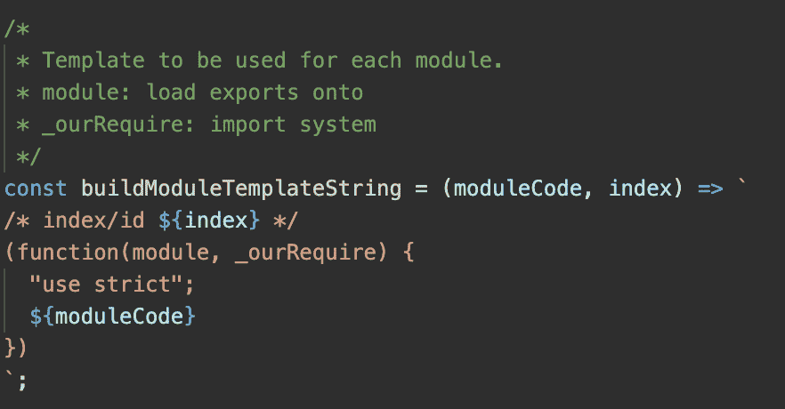*

*运行时模板:它的工作是加载我们的模块，并给出启动模块的 id。*

*一旦我们有了其中的模块代码，我们将在后面对此进行更多的回顾。*

*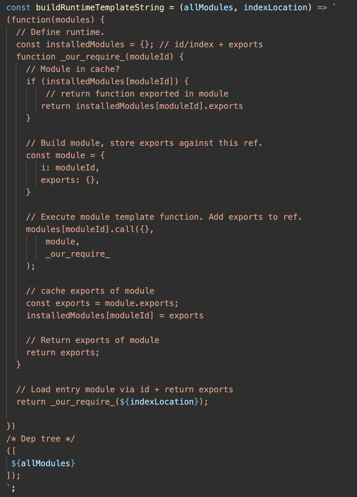*

***自定义导入/导出:***

*对于我们的 import 语句，我们将用自己的语句替换“importing”实例。它看起来像中间的注释。*

*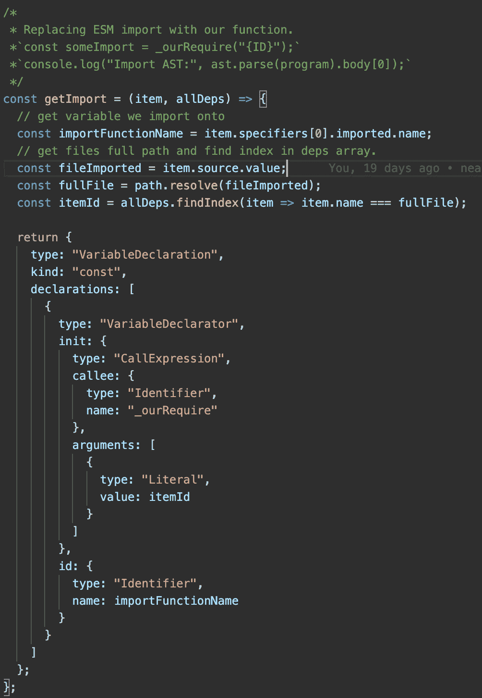*

*我们的导出将做一些类似于导入的事情，除了用我们自己的替换任何“导出”。参见底部注释。*

*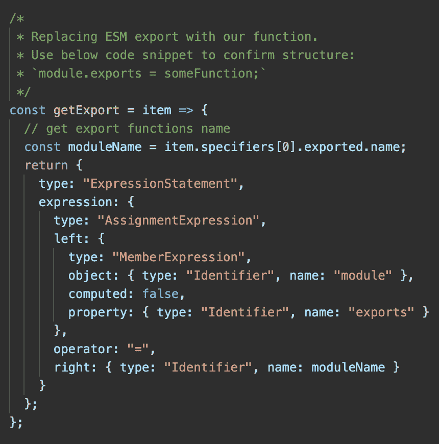*

*值得注意的是，Webpack 在前面存储了模块的依赖 id。它有自己的“依赖模板”，用自定义变量替换导入和导出的用法。我的交换只是进口本身(他们的交换整个系列和它的所有用法)。与真正的 Webpack 不完全相同的许多东西之一。*

***变换***

*我们的转换函数遍历依赖关系。用我们自己的替换它找到的每个导入和导出。然后将 AST 转换回源代码并构建一个模块字符串。最后，我们将所有的模块字符串连接在一起，并将它们传递给运行时模板，并给出依赖数组中最后一项的索引位置，因为这是我们的“**入口点**”。*

*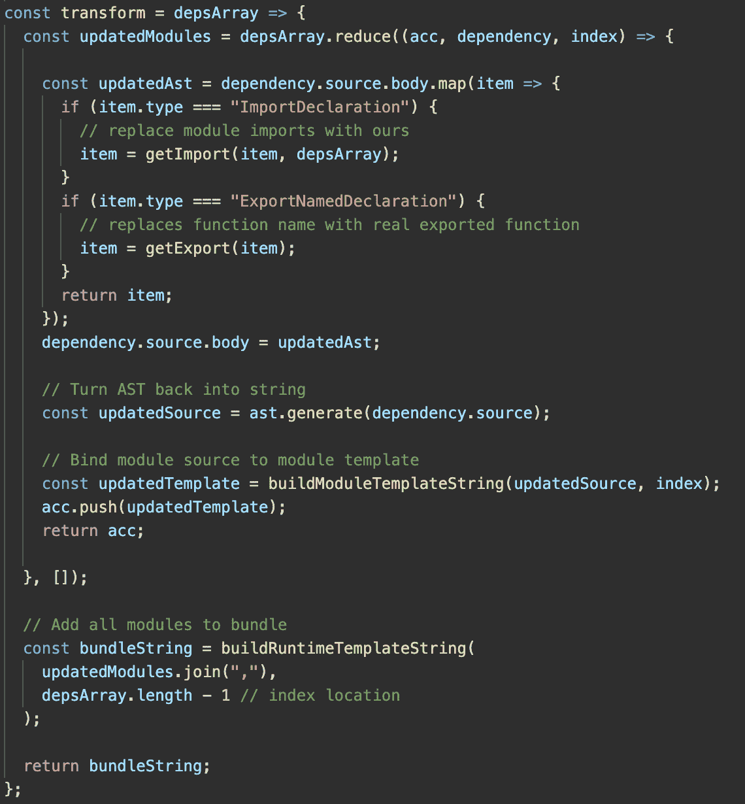*

## *现在编译器输出的代码是:*

*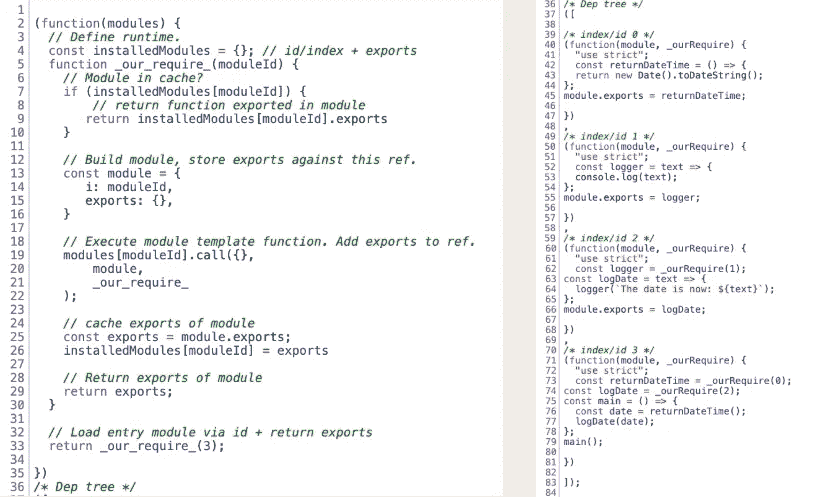*

*左手边是我们的运行时，右手边显示所有被加载的“模块”。你可以看到它们是我们开始时使用的模块。*

***到底是怎么回事？***

*运行时模板 IIFE 立即运行，将模块数组作为一个参数。我们定义一个缓存( *installedModules* )和我们的导入函数( *_our_require_* )。它的工作是执行模块运行时，并返回给定模块 ID(ID 与它在模块数组中的位置相关)的导出。利用传递引用在父模块上设置导出，然后将模块存储在缓存中以便于重用..最后，我们为入口点执行导入功能，这将启动应用程序，因为它不需要调用导出本身。我们模块中的所有导入都将使用我们的自定义方法。*

# *3.在应用程序中使用输出*

*现在我们有了一个更新的“vendorString”我们想用它(上面的代码)。所以我们:*

1.  *创建内容的散列，该散列将在包文件名中使用并存储在清单中*
2.  *将 vendorString 写入我们的新包*

*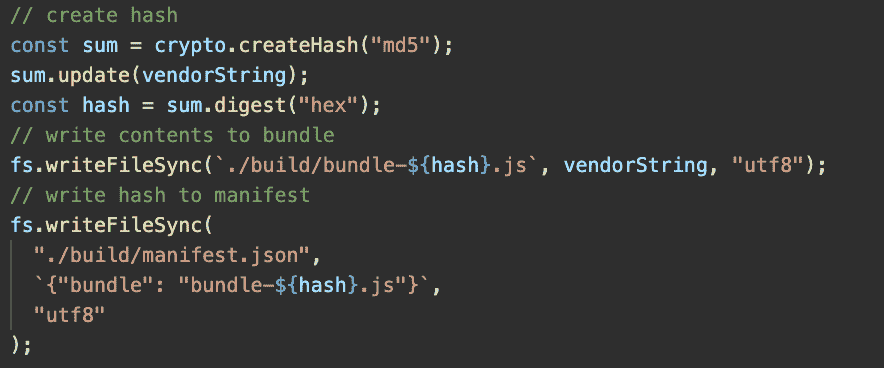*

*最后，我们运行一个小型的 express 服务器应用程序，它从清单中提取包名，并在/static 路径下公开构建的代码(/build)。*

*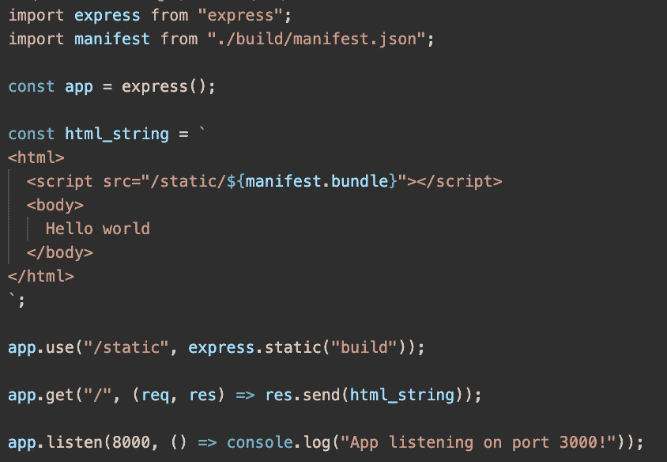*

*如果我们现在跑:*

**> npm 运行编译**

**> npm 运行开始**

*我们的应用程序将运行，我们可以在“network”选项卡中看到我们的包及其内容。*

*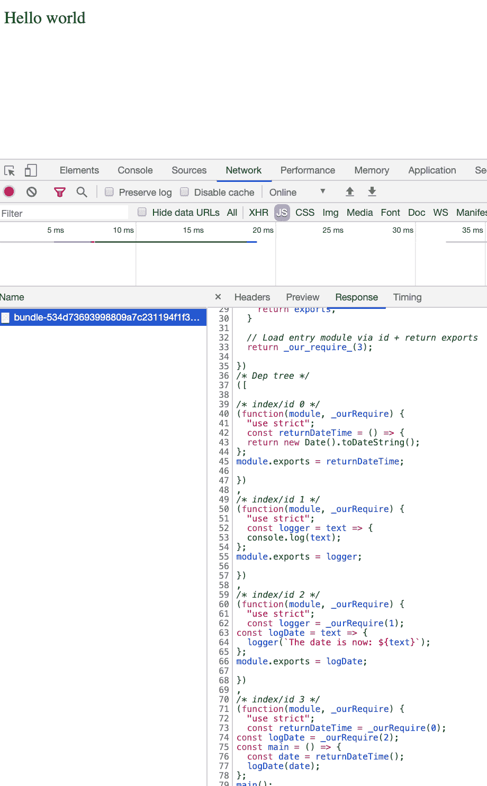*

*最后，我们可以通过检查“控制台”来确认它是否工作。好运👍*

**

# *未覆盖*

*你可能想知道“那么 Webpack 还有什么是我们没有的呢？”*

*   *处理非 js 资产(CSS/图像/字体)*
*   *戴夫和 HMR:这是内置在网络包*
*   *Chunks: Webpack 可以将不同的模块放入不同的 Chunks 中，如果需要的话，每个模块可以有稍微不同的运行时和 polyfills。即供应商、动态导入*
*   *多出口:我们的可以做到这一点，但需要对模块类型进行防御检查，所以不值得这么麻烦。*
*   *进一步优化(例如缩小/代码分割/摘樱桃/摇树/聚合填充)*
*   *源地图:Webpack 混合使用预处理器，它们都生成自己的地图。Webpack 设法将它们合并在一起。*
*   *使其可扩展或可配置(例如加载程序、插件或生命周期)。即使在内部，Webpack 也有 80%是插件，即编译器在生命周期事件(例如“预处理文件”)上触发钩子，加载器监听该事件并在适当的时候运行。此外，我们可以扩展我们的编译器来支持生命周期事件，也许可以使用 [NodeJS 事件发射器](https://nodejs.org/api/events.html)，但是同样不值得这么麻烦。*

# ***就是这样***

*我希望这对你有用，因为我从中学到了很多。有兴趣的人可以在 https://github.com/craigtaub/our-own-webpack 的[找到一个仓库](https://github.com/craigtaub/our-own-webpack)*

*谢谢，克雷格😃*