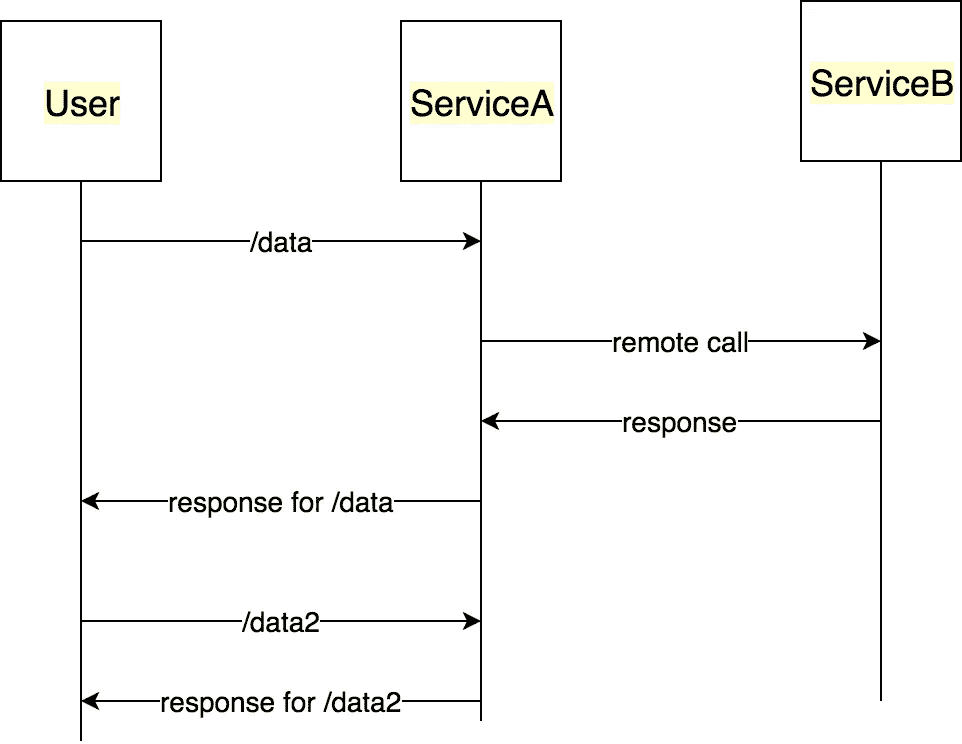
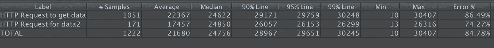
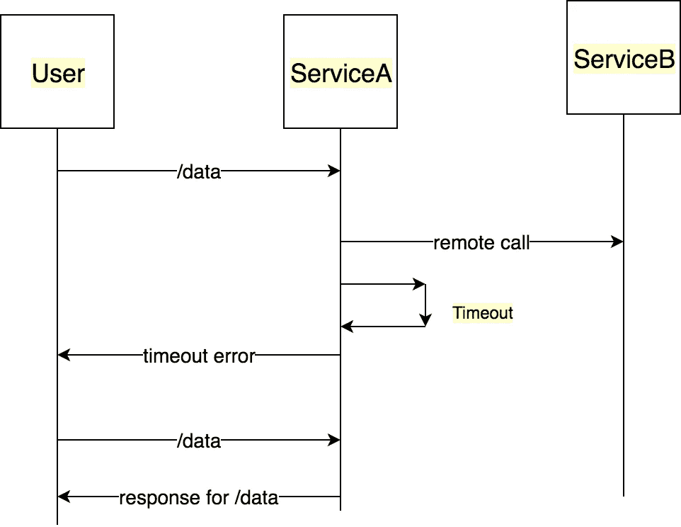
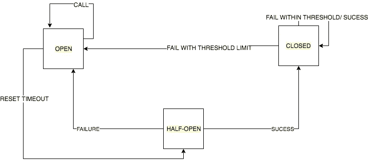

# 通过简单的实例理解断路器设计模式

> 原文：<https://itnext.io/understand-circuitbreaker-design-pattern-with-simple-practical-example-92a752615b42?source=collection_archive---------0----------------------->

**“当屎发生时”的设计模式**


# 问题陈述

我们有一个有两个 API 的`serviceA`

*   `/data`这取决于`serviceB`
*   `/data2`不依赖任何外部服务



应用断路器模式的用例

让我们试着实现这个场景，看看它如何影响我们的整个系统。完整的源代码可以在 [Github](https://github.com/abhinavdhasmana/circuitBreaker) 上找到。

# 不带断路器

`serviceB`实现下图。API 将对前 5 分钟的请求返回 5 秒的延迟响应。它运行在端口 8000 上。

服务 b:模拟延迟响应

`serviceA`将向`serviceB`发出 http 请求的实现

服务 a:调用受影响的服务 a

我们将使用`[jMeter](https://jmeter.apache.org/)`来模拟负载。几秒钟之内，`serviceA`就会资源匮乏。所有请求都在等待 http 请求完成。第一个 API 将开始抛出错误，最终会崩溃，因为它将达到其最大堆大小。



失败 API 的 jMeter 报告

```
<--- Last few GCs --->[90303:0x102801600]    90966 ms: Mark-sweep 1411.7 (1463.4) -> 1411.3 (1447.4) MB, 1388.3 / 0.0 ms  (+ 0.0 ms in 0 steps since start of marking, biggest step 0.0 ms, walltime since start of marking 1388 ms) last resort GC in old space requested
[90303:0x102801600]    92377 ms: Mark-sweep 1411.3 (1447.4) -> 1411.7 (1447.4) MB, 1410.9 / 0.0 ms  last resort GC in old space requested<--- JS stacktrace --->==== JS stack trace =========================================Security context: 0x2c271c925ee1 <JSObject>
    1: clone [/Users/abhinavdhasmana/Documents/Personal/sourcecode/circuitBreaker/client/node_modules/hoek/lib/index.js:~20] [pc=0x10ea64e3ebcb](this=0x2c2775156bd9 <Object map = 0x2c276089fe19>,obj=0x2c277be1e761 <WritableState map = 0x2c27608b1329>,seen=0x2c2791b76f41 <Map map = 0x2c272c2848d9>)
    2: clone [/Users/abhinavdhasmana//circuitBreaker/client/node_modul...
```

现在，不是一个，我们有两个服务不工作。这将在整个系统中升级，整个基础设施将会崩溃。

# 为什么我们需要断路器

如果`serviceB`停机，`serviceA`仍应尝试恢复，并尝试执行以下操作之一:

*   **自定义回退:**尝试从其他来源获取相同的数据。如果不可能，使用它自己的缓存值。
*   **快速失败:**如果`serviceA`知道`serviceB`宕机，等待超时消耗自身资源是没有意义的。它应该尽快返回“知道”`serviceB`已关闭
*   **不崩溃:**正如我们在这个案例中看到的，`serviceA`本不应该崩溃。
*   **自动修复:**定期检查`serviceB`是否再次工作。
*   其他 API 应该工作:所有其他 API 应该继续工作。

# 什么是断路器设计？

背后的想法很简单:

*   一旦`serviceA`“知道”`serviceB`停机，就不需要向`serviceB`提出请求。`serviceA` 应尽快返回缓存数据或超时错误。这是电路的**开路**状态
*   一旦`serviceA`知道`serviceB`到了，我们就可以**闭合**电路，以便再次向`serviceB`发出请求。
*   定期对`serviceB`进行新的调用，看看它是否成功返回结果。这种状态是**半开**。



断路器处于打开位置

这是我们电路状态图的样子



断路器状态图

# 用断路器实现

让我们实现一个`circuitBreaker`来进行 GET http 调用。我们的简单`circuitBreaker`需要三个参数

*   在我们打开电路之前应该发生多少次故障。
*   一旦电路处于打开状态，我们应该在多长时间后重试失败的服务？
*   在我们的例子中，API 请求的超时。

有了这些信息，我们就可以创建我们的`circuitBreaker`类了。

断路器类及其构造函数

接下来，让我们实现一个调用 API 到`serviceB`的函数。

断路器呼叫功能

让我们实现所有相关的功能。

具有所有关于状态、故障和复位的功能

下一步是修改我们的`serviceA`。我们将把我们的调用包装在我们刚刚创建的`circuitBreaker`中。

与之前的代码相比，此代码中需要注意的重要更改:

*   我们正在初始化断路器`const circuitBreaker = new CircuitBreaker(3000, 5, 2000);`
*   我们通过断路器调用 API`const response = await circuitBreaker.call(‘http://0.0.0.0:8000/flakycall');`

就是这样！现在让我们再次运行 jMeter 测试，我们可以看到我们的`serviceA`没有崩溃，我们的错误率已经显著下降。


# 进一步阅读

*   马丁·福勒谈[断路器](https://martinfowler.com/bliki/CircuitBreaker.html)
*   网飞:[让网飞 API 更有弹性](https://medium.com/netflix-techblog/making-the-netflix-api-more-resilient-a8ec62159c2d)
*   网飞:[大容量分布式系统中的容错](https://medium.com/netflix-techblog/fault-tolerance-in-a-high-volume-distributed-system-91ab4faae74a)