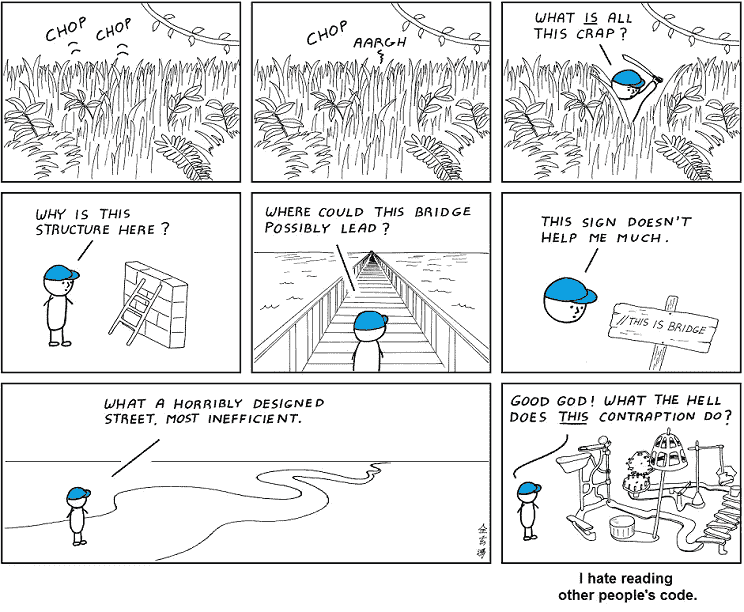

# 可理解的地形项目

> 原文：<https://itnext.io/understandable-terraform-projects-9c1cd9b4b21a?source=collection_archive---------0----------------------->



[https://abtrusegoose . com/strips/you _ down _ wit _ OPC-yeah _ you _ know _ me . png](https://abstrusegoose.com/strips/you_down_wit_OPC-yeah_you_know_me.png)

Terraform 代码是声明性的。我们用它来声明我们想从我们的云提供商那里得到什么。如果能把这段代码翻译成简单的英语，读起来就像一份精心制作的购物清单:

> 给我一个带数据库和 kubernetes 集群的私有虚拟网络。集群应该有一定数量的节点，并且它们都应该使用这种特定类型的 CPU。数据库应该位于世界的这一部分，它应该有能力存储一些千兆字节…

我们所描述的理想状态往往非常复杂；这就是为什么 Terraform 项目经常变得难以理解。

本文的目的是分享我们如何在 [Bulder Bank](https://bulderbank.no) 编写可理解的 Terraform 代码。

## YAML 风味输入值

大多数人在`.tfvars`文件中把他们的输入值写成 HCL。我更喜欢 YAML，因为它更容易阅读。当您使用 YAML 为 Terraform 根模块定义输入值时，所需的状态变得更容易解释:

```
# ./my-project/live/prod/config.yaml

networks:
  - name: network-a
    region: europe-west1
  - name: network-b
    region: europe-north1  

databases:
  - name: database-number1
    type: cloudsql
    network: network-a
    region: europe-west1-a
    disk_size: 20gb
  - name: database-number2
    type: postgresql
    network: network-b
    region: europe-north1-b
    disk_size: 40gb

clusters:
  - name: prod-blue
    region: europe-west1-a
    network: network-a
    min_nodes: 3
    max_nodes: 6
  - name: prod-green
    region: europe-west1-b
    network: network-a
    min_nodes: 3
    max_nodes: 6
```

HCL 中的等效物相当嘈杂:

```
networks = [
  {
    name = "network-a"
    location = "europe-west1"
  },
  {
    name = "network-b"
    location = "europe-west1"
  }
]

databases = [
  {
    name = "database-number1"
    type = "cloudsql"
    network = "network-a"
    location = "europe-west1-a"
    disk_size = "20gb"
  },
  {
    name = "database-number2"
    type = "postgresql"
    network = "network-b"
    region = "europe-west1-b"
    disk_size = "40gb"
  }
]

# etc..
```

YAML 和 HCL 支持相同的基本集合。这使得将 YAML 转化成 HCL 变得容易；Terraform 中甚至有一个内置函数来做这件事(`yamldecode()`)。

通过以下技巧，YAML 配置可用于 Terraform:

```
# ./live/*/locals.tflocals {
  config = yamldecode(file("./config.yaml"))
}
```

这使得来自`config.yaml`的所有内容都可以通过`local.config`对象在`.tf`文件中访问。

## 面向配置

编写可理解的 Terraform 代码的一个关键策略是面向配置。通过配置，我指的是将传递给 Terraform 模块的输入值。如上所述，这些值可以用一种几乎像文档一样的方式来组织。功能文档。说明执行 Terraform 代码时会发生什么的文档。

面向配置意味着您将最小化工程师可能长期与之交互的文件数量。工程师只重新访问旧的 Terraform 代码，因为他们想了解(或修改)所需的状态。如果您像上面说明的那样构造您的输入值，大多数代码访问可以被限制在`config.yaml`文件中。任何了解 YAML 的人都会直观地理解如何添加/删除数据库、集群和网络。像增加数据库大小这样的简单任务也变得非常直观。

## 目录结构

许多 Terraform 项目的一个常见缺陷是结构不良。我见过有几十个`.tf`文件的存储库，读者甚至不知道从哪里开始。

在 Bulder Bank，我们所有的 Terraform 项目都有一个固定的目录布局。假设我们想要在两个环境中部署资源(`dev`和`prod`):

```
└── my-project
    ├── live
    │   ├── dev
    │   │   ├── config.yaml
    │   │   ├── modules.tf
    │   │   ├── providers.tf
    │   │   ├── locals.tf
    │   │   └── terraform.tf
    │   └── prod
    │       ├── config.yaml
    │       ├── modules.tf
    │       ├── providers.tf
    │       ├── locals.tf
    │       └── terraform.tf
    └── modules
        ├── kubernetes
        │   └── main.tf
        ├── network
        │   └── main.tf
        └── database
            └── main.tf
```

我们 GitHub 组织中的每个 Terraform 项目都是这样构建的，使我们的工程师可以轻松导航。

## 使用模块

我们放在`modules/`目录中的 Terraform 模块并没有什么特别之处。它们是用 HCL 编写的，通常期望简单的输入值，如字符串、数字或列表。如果它们跨多个根模块使用，我们将它们存储在它们自己的 GitHub 存储库中，以实现可重用性。

我们遵循的一个固执的风格决定是，对于有多个环境的项目，我们不在根模块中使用`resource`块(例如`prod` / `dev` / `staging`)。换句话说，我们只在`modules.tf`中使用`module`和`data`块。这种方法有一些好处:

*   在`live/`下`modules.tf`文件在不同环境下总是相同的(易于复制粘贴)。
*   跨多个环境修改 Terraform 代码变得更加容易。
*   `terraform state`命令变得更容易处理。

对于单一环境项目，不需要这种风格限制。

我们的 YAML 配置示例的`modules.tf`文件如下所示:

```
# ./my-project/live/*/modules.tf

module "network" {
  for_each = { for x in local.config.networks : x.name => x }
  source   = "../../modules/network"

  name      = each.value.name
  region    = each.value.region
}

module "database" {
  for_each = { for x in local.config.databases : x.name => x }
  source   = "../../modules/database"

  name      = each.value.name
  type      = each.value.type
  region    = each.value.region
  disk_size = each.value.disk_size
  network   = module.network[each.value.network].name
}

module "kubernetes" {
  for_each = { for x in local.config.clusters : x.name => x }
  source   = "../../modules/kubernetes"

  name      = each.value.name
  region    = each.value.region
  min_nodes = each.value.min_nodes
  max_nodes = each.value.max_nodes
  network   = module.network[each.value.network].name
}
```

## 默认值

Terraform 模块通常包含大量输入值。在 YAML 配置文件中包含所有这些内容可能会对它们的可读性产生负面影响。当我们编写自己的模块时，我们可以在`modules/`目录中使用缺省值，将不必要的复杂性排除在 YAML 文件之外。YAML 风格方法遇到的一个问题是如何支持`config.yaml`中的可选值。从 Terraform `v1.1.0`开始，有一个[巧妙的技巧](https://www.terraform.io/language/values/variables#disallowing-null-input-values)来遵从模块的默认值。

让我们假设`kubernetes`模块中的`max_nodes`变量默认为`6`。我们希望能够在`config.yaml`中覆盖这个默认值，但是我们也希望 Terraform 在`config.yaml`中没有指定变量时使用`6`的默认值:

```
# ./my-project/live/prod/config.yaml

clusters:
  - name: prod-blue
    region: europe-west1-a
    network: network-a
    min_nodes: 3
  - name: prod-green
    region: europe-west1-b
    network: network-a
    min_nodes: 3
    max_nodes: 12# ./my-project/modules/kubernetes/main.tf

variable "max_nodes" {
  default = 6
  nullable = false
}# ./my-project/live/*/modules.tf

module "kubernetes" {
  for_each = { for x in local.config.clusters : x.name => x }
  source   = "../../modules/kubernetes"

  name      = each.value.name
  region    = each.value.region
  min_nodes = each.value.min_nodes
  max_nodes = lookup(each.value, "max_nodes", null)
  network   = module.network[each.value.network].name
}
```

`main.tf`中的`nullable = false`选项意味着如果模块从`modules.tf`接收到一个`null`值，它将回落到默认值`6`。上图中，`prod-blue`的`max_nodes`为`6`，而`prod-green`为`12`。

如果您无法控制在`modules.tf`中获得的 Terraform 模块，您可能无法选择定义`nullable`字段(默认为`true`)。如果你想让一个值在`config.yaml`中既是可配置的又是可选的，你可以简单地在`modules.tf`的`lookup()`命令中提供一个默认值，但是要小心，你做得越多，工程师就越难弄清楚一些模块是如何配置的。当模块没有合适的默认值时，我只倾向于将默认值放在`lookup()`函数中，并且我不太可能长期关心输入值。

## 结论

我在 Terraform 工作了几年，接触过多个组织的 Terraform 项目。我注意到的一件事是，实践差异很大；似乎没有一个标准化的方法来组织 Terraform 项目。Terraform 代码应该为长期而写；编写可理解的代码相当于帮了你的同事(和未来的自己)一个大忙。

我希望在创建/重构你自己的项目时，我们的 Terraform 方法对你有所帮助。