# 首次了解和使用 Vuex

> 原文：<https://itnext.io/understanding-and-using-vuex-for-the-first-time-85054c3f1b8f?source=collection_archive---------2----------------------->

# Vuex 的简短介绍

Vuex 是一个状态管理库，可以帮助我们管理应用程序的状态。我们可以让 Vuex 在一个位置为我们管理整个应用程序的状态，而不是多个组件在本地处理状态并将其传递给所需的组件。

它最好与 Vuejs 一起使用，但不限于此。例如，如果我们愿意，我们可以[将它与 Reactjs](https://github.com/dennybiasiolli/react-vuex) 一起使用。Vuex 相当强大。

这个简短的指南解释了在 Vuejs 应用程序中使用 Vuex 的基础知识。我假设你已经使用过 Vue 应用程序。

# 状态管理和商店

Vuex 在一个叫做*存储*的中心位置管理状态。也被称为 Vuex 存储，这个*存储*包含*状态*以及其他一些非常有用并使 Vuex 如此强大的东西。为了在我们的应用程序中使用 Vuex，我们需要创建一个 Vuex 存储，在我们的主 Vue 实例所在的入口文件中注册它，然后我们就可以自由地使用它了。

创建商店并注册只需几个步骤:

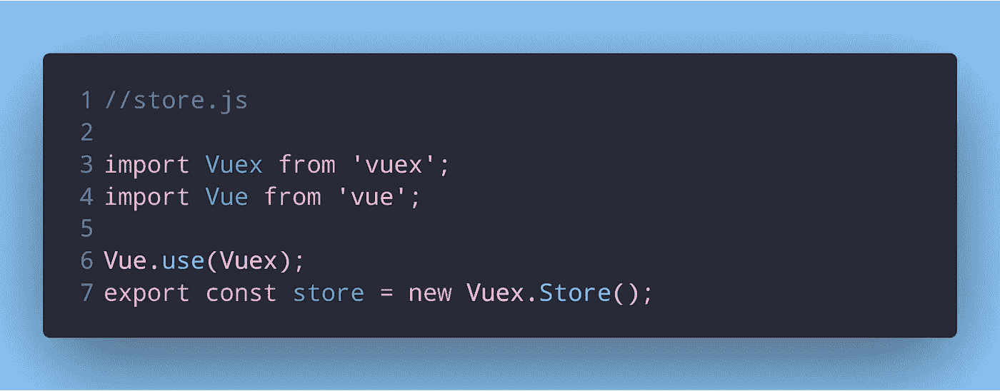

创建 Vuex 商店

我们在一个单独的`store.js`文件中创建了一个 Vuex 商店。

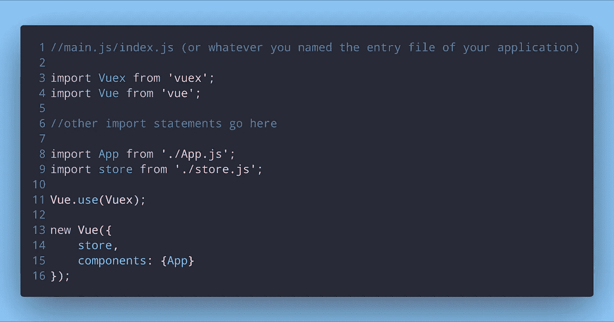

向我们的 Vue 实例注册商店

在这里，我们用我们的全局 Vue 实例注册了它。现在让我们在其中加入一些状态:

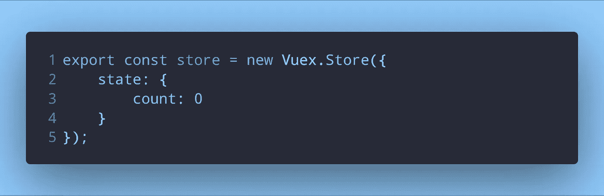

在我们的存储中添加状态

Vuex 存储接受一个对象作为参数。这个对象内部将是状态和其他方法。我们可以在 Vue 组件中使用命令:`this.$store.state`来检索状态。我们可以用`this.$store.state.count`检索我们的*计数*。这里，`this.$store`指的是 Vuex 店。

# 吸气剂

如果在使用状态之前我们需要对其执行任何计算，我们可以在计算属性中执行。

假设我们想在显示之前将状态中的`count`变量加倍。

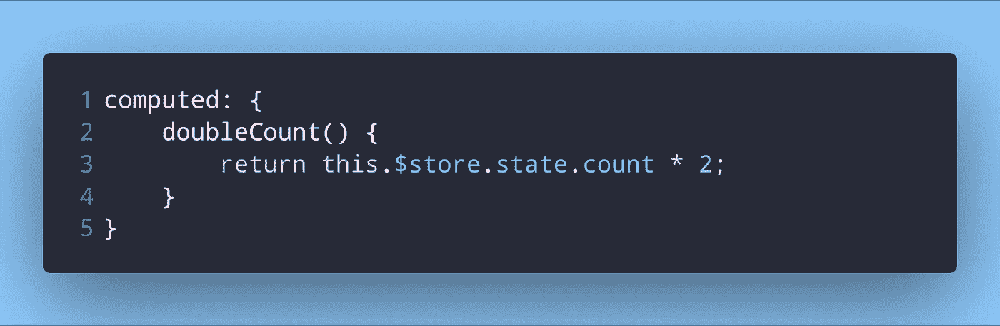

虽然在这种情况下这是可行的，但是如果有复杂的计算要执行和/或它们需要在多个组件中执行，那么它就变得低效了。我们将不得不为所有这些组件编写重复的函数，或者在一个单独的函数中提取计算结果，并在任何地方不断导入它。

Vuex 提供了更好的选择— `Getters`。

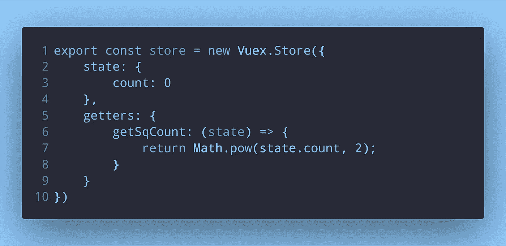

向存储区添加 getters

`getSqCount`是一个充当 getter 的箭头函数。所有 getters 从 Vuex 接收状态作为它们的第一个参数。当我们调用它们时，我们不需要显式地传递它。

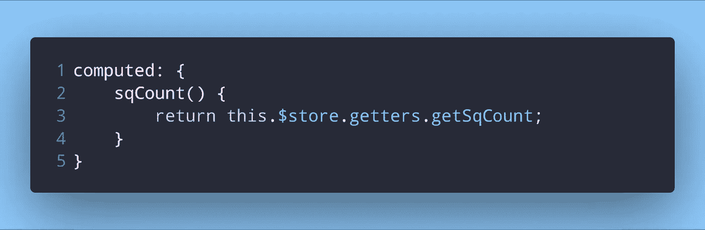

在 Vue 组件中使用 getters

> *注意* `*state*` *和* `*getters*` *是关键字，在 Vuex 商店中不能使用自己的名字。这也适用于接下来的突变和行动。*

# 突变

我们已经在存储中设置了状态，并且已经检索了它。为了改变我们的状态，我们需要使用一种叫做`Mutation`的东西。

变异类似于事件处理函数。改变(突变)状态的主要工作将在这个函数内部完成。

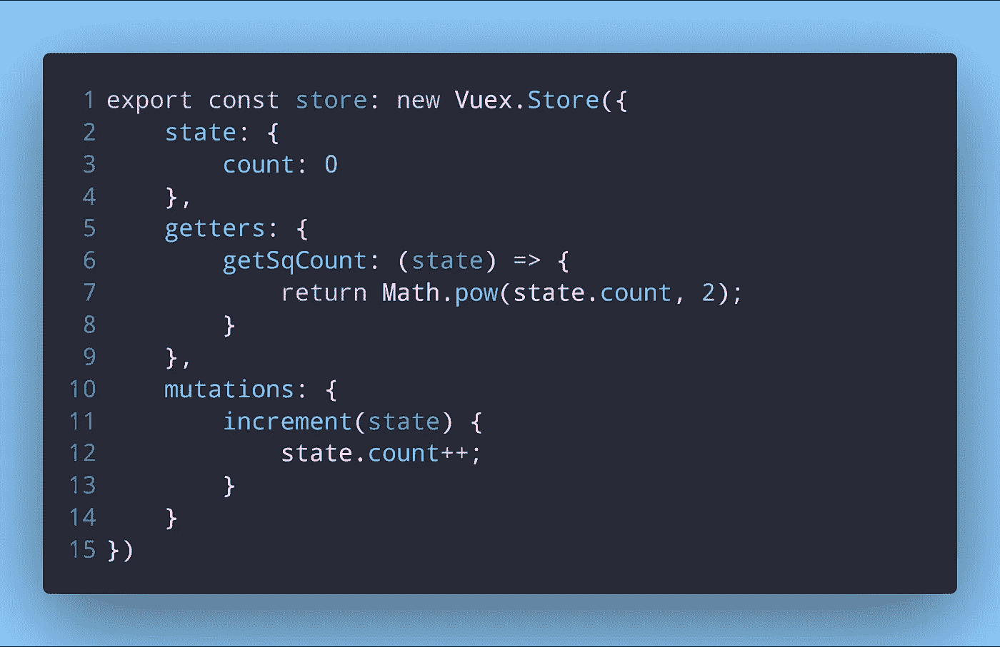

向存储中添加变异

变异处理函数也接收状态作为第一个参数。至于为什么我说它类似于事件处理程序，是因为这个突变是如何被调用的。

即使它看起来像一个常规函数，我们也不直接调用突变。更像是一个事件注册。如果我们想使用我们在存储中定义的`increment`变异，我们必须*提交*它。我们在 Vue 组件中这样做。

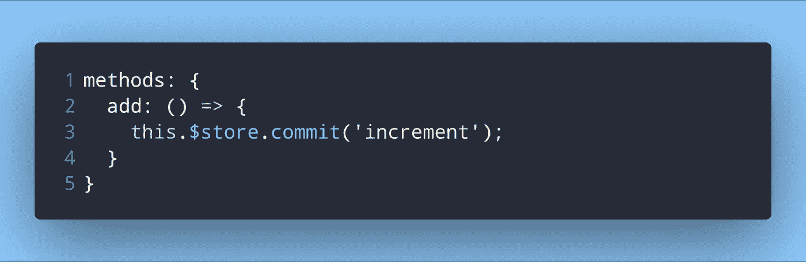

利用变异

当这个方法被执行时，它将*提交*一个叫做`increment`的变异。就像一个动作如何触发一个事件，然后执行事件处理函数一样，当我们的 Vue 组件上的`add()`方法被执行时，它提交被调用的`increment`变异。

您还可以在调用变异处理程序的同时传递一些数据。

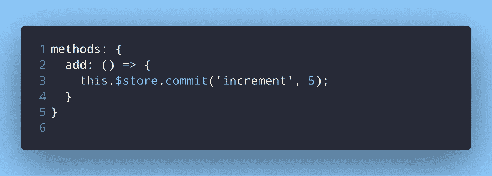

将数据/有效载荷传递给变异处理器

这个数据或*有效载荷*可以像任何其他函数参数一样被我们的变异处理器使用。

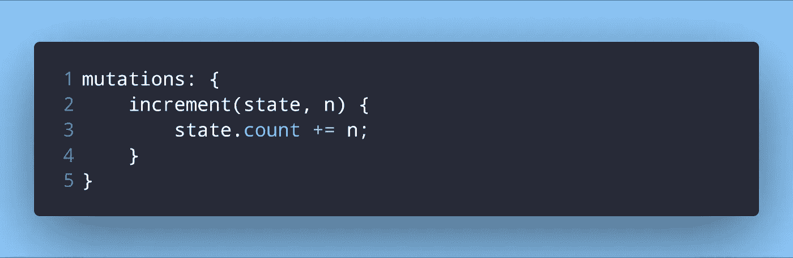

我们的变异使用我们传递的数据

突变允许我们更新状态。当此状态更新时，任何依赖于此状态的组件都将自动更新。

但是，突变只允许同步操作。但是在`Actions`的帮助下仍然可以进行异步操作。

# 行动

动作类似于突变，但它们不像突变那样直接改变状态。相反，它们执行异步操作，然后在这些操作完成时提交突变。

我们可以通过以下方式在我们的 Vuex 商店上注册操作:

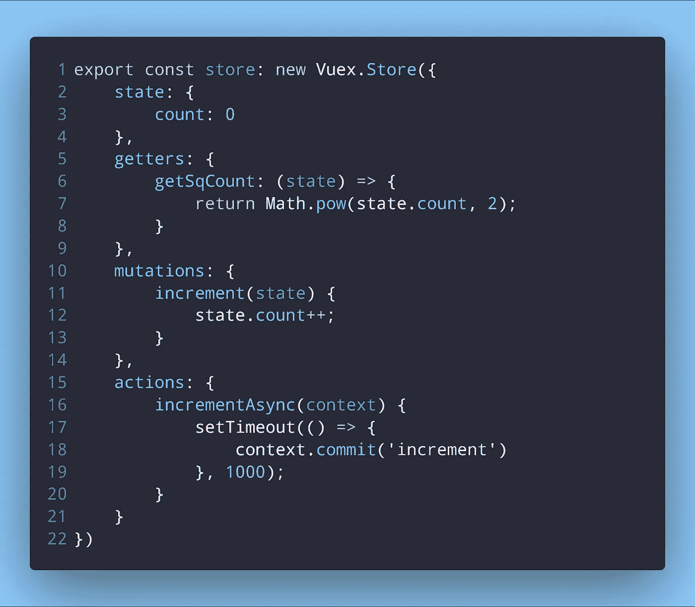

在我们的 Vuex 商店注册行动

这里我们在`setTimeout`的帮助下模拟一个异步操作。

注册一个动作让我们的动作处理程序(`incrementAsync`)可以访问一个`context`对象。

`context`对象公开了与 store 实例相同的一组方法和属性(这是我们之前使用的`this.$store`)。我们可以调用`context.commit`来进行变异，或者甚至使用`context.getters`来访问 getters。但是，使用上下文对象不同于使用 store 实例。

因为我们将最常用到`context.commit`方法，我们可以使用[参数析构](https://developer.mozilla.org/en-US/docs/Web/JavaScript/Reference/Operators/Destructuring_assignment)来解包它，这样我们就可以很容易地使用它。

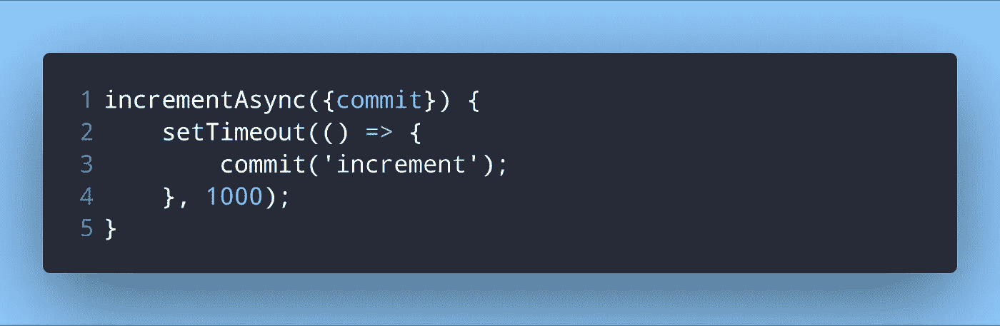

使用参数析构来解包提交方法

就像我们如何在 Vue 组件中*提交*突变一样，我们*分派*动作。

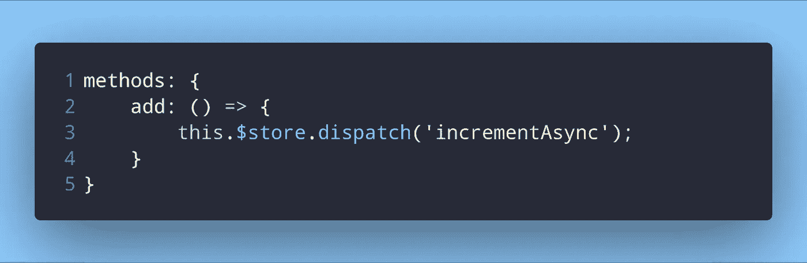

在 Vue 组件中使用动作

这与我们使用它来提交我们的变异时的工作方式是一样的，除了这一次，我们正在调度一个动作。

# 包扎

这对您创建第一个 Vuex 商店、定义状态、变化和动作应该足够了。如果您需要更多示例或更多信息，您可以阅读 [Vuex 文档](https://vuex.vuejs.org/guide/)。他们真的很好，不太复杂。我以前也写过一篇关于 Vuex 的文章，[如果你感兴趣的话，读一读](https://dev.to/napoleon039/when-why-and-how-to-use-vuex-9fl)。

在我的下一篇文章中，我将解释如何将 getters、mutations 和 actions 映射到计算属性。感谢您的阅读！

欢迎在评论中发表你的任何问题和建议😃

*最初发表于*[*dev . to*](https://dev.to/napoleon039/understanding-and-using-vuex-for-the-first-time-2ngi)*。*