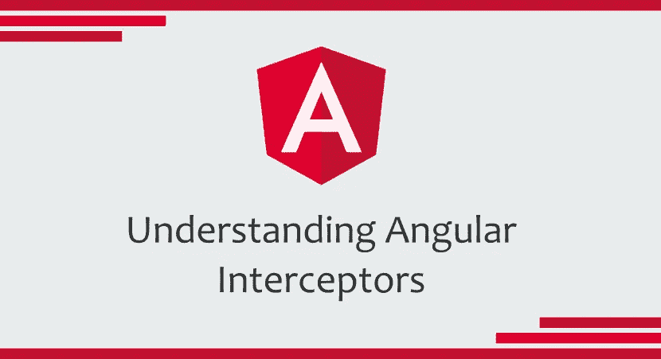

# 了解角度拦截器

> 原文：<https://itnext.io/understanding-angular-interceptors-405b84d7ad69?source=collection_archive---------2----------------------->

## 有了实际例子



顾名思义，Angular 中的拦截器是框架提供的一种简单方法，在应用程序的 http 请求被发送到服务器之前，**全局拦截和修改应用程序的 http 请求。这真的很方便，允许我们配置应用程序可能需要的*认证令牌*、**、**添加请求的*日志*、**、**添加自定义头*、*、**、**等等。**

> *"* 拦截器可以为每个 HTTP 请求/响应执行各种各样的*隐式*任务，从身份验证到日志记录，以一种常规、标准的方式进行。如果没有拦截，开发人员将不得不为每个 HttpClient 方法调用显式地实现这些任务

## 实现拦截器

为了实现拦截器，您需要创建一个类，让**实现 *HttpInterceptor* 接口的*拦截*方法。**

因此，让我们假设您希望**在控制台中记录应用程序发出的每个 http 请求**。下面，我创建了一个简单的拦截器，它将实现以下功能。

```
@Injectable()
export class RequestLogInterceptor implements HttpInterceptor { intercept(
    request: HttpRequest<any>, next: HttpHandler
  ) : Observable<HttpEvent<any>> { console.log(request.url);
    return next.handle(request); }
}
```

*intercept* 方法将每个请求转换为*Observables，*observable，稍后将通过调用 *next.handle()* 来解析 observable。因此，对于我们的实现来说非常简单:您接受请求，记录它的 *url* 并调用 *next.handle()* 将其发送到服务器，而不对其进行任何更改。

*next* 对象表示拦截器链中的下一个拦截器，因为**您的应用程序中可以有多个拦截器。**然后，链中的最后一个*下一个*实际上是 *HttpClient 后端处理程序，*实际上将请求发送到服务器。

## 提供拦截器

因为拦截器是 *HttpClient* 的依赖项，所以您必须将它们添加到提供 *HttpClient* 的同一个注入器(或父注入器)中的提供者。例如，假设您将 *HttpClientModule* 导入到 *AppModule 中，*您也必须将拦截器添加到*提供者*中。

```
...
import { [HTTP_INTERCEPTORS](https://angular.io/api/common/http/HTTP_INTERCEPTORS) } from '@angular/common/[http](https://angular.io/api/common/http)';
import { RequestLogInterceptor } from '...';@NgModule({
  ...
  imports: [
    HttpClientModule,
    ...
  ],
  providers: [
    {
      provide: HTTP_INTERCEPTORS,
      useClass: RequestLogInterceptor,
      multi: true
    },
   ...
  ],
  ...
})export class AppModule { }
```

提供的 *multi: true* 选项告诉 Angular，你正在提供**多个拦截器**，如果是这种情况，这是必需的。在我们的示例场景中，这是不必要的，因为我们只实现了一个拦截器，所以我应用它只是为了突出这一点信息。

记住 Angular **按照您在模块的提供者中提供给它们**的顺序来应用拦截器也很重要。

## 处理认证

好了，现在让我们深入了解拦截器最常见的用法之一，即处理应用程序的认证。这一次，我们将使用拦截器实际更改 http 请求，以便**向它添加授权头**。

假设我们的应用程序正在我们的*本地存储器*上设置登录的用户信息，我们将读取它以便检查是否有人登录。在现实世界的应用程序中，我们会有一个服务来处理所有的认证流，但是出于学习的目的，我将简化并直接从 *localstorage* 中获取信息。

```
@Injectable()
export class AuthenticationInterceptor implements HttpInterceptor { intercept(
    request: HttpRequest<any>, next: HttpHandler
  ) : Observable<HttpEvent<any>> { const storageUser = localStorage.getItem('LoggedUser'); const loggedUser = jsonInfo ? JSON.parse(jsonInfo) : null; if (loggedUser) {
      request = request.clone({
          headers: req.headers.set(
            'Authorization',
            loggedUser.authToken
          )
      });
    } return next.handle(request);
  }
}
```

因为我们的应用程序中可能有打开的请求——这意味着不是所有的请求都需要认证——所以如果用户没有登录到应用程序中，我们不会默认抛出任何类型的错误。然而，如果是，我们将**发送它的认证令牌给服务器。**

另一方面，通过发送错误的令牌或过期的令牌，我们仍然可能收到来自服务器的身份验证错误。因此，我们也可以在我们的*认证处理器*上解决这个问题。

我们要做的是:如果请求不成功，检查它是否是一个认证错误(401 未授权)。如果是，我们将把用户从应用程序中注销，并把他重定向到登录页面，告诉他访问被拒绝。

下面，我们将把这个处理添加到我们的*AnthenticationInterceptor*中。

```
@Injectable()
export class AuthenticationInterceptor implements HttpInterceptor { constructor(
    private _router: Router
  ) { } intercept(
    request: HttpRequest<any>, next: HttpHandler
  ) : Observable<HttpEvent<any>> { const storageUser = localStorage.getItem('LoggedUser');
    const loggedUser = jsonInfo ? JSON.parse(jsonInfo) : null; if (loggedUser) {
      request = request.clone({
          headers: req.headers.set(
            'Authorization',
            loggedUser.authToken
          )
      });
    } return next.handle(request).pipe(
      catchError(error => { // Checking if it is an Authentication Error (401)
        if (error.status === 401) {
          alert('Access Denied');
          // <Log the user out of your application code>
          this.router.navigate([ 'login-page-route' ]);
          return throwError(error);
        } // If it is not an authentication error, just throw it
        return throwError(error);
      })
    );
  }
}
```

通过管道调用 *catchError* ，我们能够处理来自服务器的请求响应错误。因此，我们被允许验证其状态，并按照前面提到的方法进行治疗。

顺便说一下，这是我为学习目的而设置的处理方法，但是在您的现实世界中，这里的应用程序适合任何类型的处理方法。如果发生 401 错误，您可能不想重定向用户，或者您可能打算尝试一个*刷新令牌* api 调用。无论什么对你的应用是必要的。

最后，我们不要忘记将它提供给我们的模块。

```
...
import { [HTTP_INTERCEPTORS](https://angular.io/api/common/http/HTTP_INTERCEPTORS) } from '@angular/common/[http](https://angular.io/api/common/http)';
import { AuthenticationInterceptor } from '...';@NgModule({
  ...
  providers: [
    {
      provide: HTTP_INTERCEPTORS,
      useClass: AuthenticationInterceptor
    },
   ...
  ],
  ...
})export class AppModule { }
```

## 处理模拟

现在让我们看看另一种拦截方式；假设你将在你的应用程序中使用某种类型的*模仿*。我的意思是，在应用程序的某个地方，你希望允许一个用户(比如系统管理员)“假装”成另一个用户来执行服务器请求。

我将假设我们的应用程序中有一个 *ImpersonationService* ,它将处理所有的模拟逻辑，对此我不会深入探讨。从那个*服务*中，我们将检索该请求是否应该被模拟的信息；在这种情况下，服务器需要的信息，比如冒充的*用户 id* 。

然后，在我们的拦截器中，想法很简单:
-检查请求是否应该被模拟；
-如果是模仿，在请求中发送适当的*报头*。

```
@Injectable()
export class ImpersonationInterceptor implements HttpInterceptor { constructor(
    private _impersonationService: ImpersonationService
  ) { } intercept(
    request: HttpRequest<any>, next: HttpHandler
  ) : Observable<HttpEvent<any>> { const impersonatedUser: User | null =
    this._impersonationService.getImpersonatedUser(); if (impersonatedUser && impersonatedUser.id) {
    request = request.clone({
      setHeaders: {
        'ImpersonatedUserId': impersonatedUser.id
      }
    });
  }
}
```

然后，再一次，让我们不要忘记在我们的模块中添加新的拦截器，加入我们之前创建的先前的*AuthenticationInterceptor*。

```
...
import { [HTTP_INTERCEPTORS](https://angular.io/api/common/http/HTTP_INTERCEPTORS) } from '@angular/common/[http](https://angular.io/api/common/http)';
import { AuthenticationInterceptor } from '...';
import { ImpersonationInterceptor } from '...';@NgModule({
  ...
  providers: [
    {
      provide: HTTP_INTERCEPTORS,
      useClass: AuthenticationInterceptor,
      multi: true
    }, 
    {
      provide: HTTP_INTERCEPTORS,
      useClass: ImpersonationInterceptor,
      multi: true
    },
   ...
  ],
  ...
})export class AppModule { }
```

使用拦截器对于各种应用程序的多种用途都非常有用。因此，重要的是要知道它是如何工作的，你可以用它来实现什么，以便能够在你可能需要它的时候应用它。

希望有帮助！😉

## **参考文献:**

[https://angular . io/guide/http #截取请求和响应](https://angular.io/guide/http#intercepting-requests-and-responses)