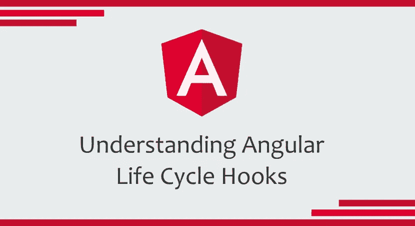

# 了解角度生命周期挂钩

> 原文：<https://itnext.io/understanding-angular-life-cycle-hooks-91616f8946e3?source=collection_archive---------1----------------------->

## 配有用的例子！



在 Angular 应用程序中，组件从创建到销毁的整个*生命周期*都由 Angular 管理。它为我们提供了对*生命周期钩子*的访问，这允许我们在组件的*生命周期*的关键时刻采取行动。

为了使用这些*钩子，*我们必须告诉 Angular 我们想要实现期望的*钩子接口*。Angular 检查组件类， ***调用* *钩子* *方法，如果它们被定义*** 。下面是这个语法是如何进行的*(对于 OnInit)* :

```
export class MyComponent **implements OnInit** { constructor() { } **ngOnInit() {** // Insert Logic Here! **}**}
```

这是 Angular 提供的钩子列表，这些钩子是按照这个顺序调用的，我们将在下面逐一深入研究:

```
╔════════════════════════════╗
║   ***lifecycle hooks*  **        ║
╠════════════════════════════╣
║   ngOnChanges()            ║
╠════════════════════════════╣
║   ngOnInit()               ║
╠════════════════════════════╣
║   ngDoCheck()              ║
╠════════════════════════════╣
║   ngAfterContentInit()     ║ 
╠════════════════════════════╣
║   ngAfterContentChecked()  ║  
╠════════════════════════════╣
║   ngAfterViewInit()        ║
╠════════════════════════════╣
║   ngAfterViewChecked()     ║
╠════════════════════════════╣
║   ngOnDestroy()            ║
╚════════════════════════════╝
```

## 恩贡昌斯

该方法在组件创建时被调用一次，然后在组件的*输入*属性之一检测到变化时被调用**。它接收一个[*simple changes*](https://angular.io/api/core/SimpleChanges)对象作为参数，该对象包含关于哪个*输入*属性已经更改的信息——如果我们有多个属性——以及它的当前值和先前值。**

```
export class MyComponent implements **OnChanges** { **ngOnChanges(changes: SimpleChanges) {**
        // Insert Logic Here!
    **}**}
```

*Obs:当输入属性没有设置值时，其值默认设置为字符串“CD_INIT_VALUE”。*

这是*生命周期挂钩*中的一个，可以在多种用例中派上用场。如果您需要根据接收到的*输入*属性处理组件中的任何特定逻辑，这将非常有用。

假设您有一个显示用户信息的组件，它接收 UserInfo 对象作为输入参数。下面是一个关于如何在组件中使用 *ngOnChanges* 来添加逻辑以处理 *UserInfo 属性*的变化的例子。

```
export class UserInfoComponent implements OnChanges { @Input userInfo: UserInfo; ngOnChanges(changes: SimpleChanges) {
    const previousValue = changes['userInfo'].previousValue;
    const currentValue = changes['userInfo'].currentValue;
    // Your Logic!
  }}
```

## 恩戈尼特

在组件生命周期中，在第一个 *ngOnChanges* 调用*之后，这个方法只被调用**一次**。*此时，在该方法中，您不仅可以访问*数据绑定属性*，还可以访问*组件的输入属性*。

```
export class MyComponent implements **OnInit** { **ngOnInit() {**
      // Insert Logic Here!
  **}**}
```

这是 Angular 中最常用的*生命周期挂钩*之一。在这里，您可以设置对服务器的请求以加载内容，可以为该组件处理的表单创建一个*表单组*，设置订阅等等。基本上， ***在组件构建完成后不久，您就可以在这里执行任何初始化。***

假设您有一个注册表单组件，您希望基于从服务器接收的字段创建表单，这些字段是根据用户类型获取的。下面是一个如何使用 *ngOnInit* 来实现这一点的例子。

```
export class RegisterFormComponent implements OnInit { public formGroup: FormGroup;
  private _userType: UserTypeEnum; constructor(
    private _activatedRoute: ActivatedRoute,
    private _myService: MyService
  ) {
    this._userType =
      this._activatedRoute.snapshot.paramMap.get('userType');
  } ngOnInit() {
    this._myService.getFormFieldsByType(
      this._userType
    ).subscribe((response) => {
      this.formGroup = this._createForm(
        response.data
      );
    }, (error) => console.error( error ) );
  } private _createForm(formFields: Array<FormFields>): FormGroup {
    // FormGroup Creation Logic!
  }}
```

## Obs:建造师 vs *恩戈尼特*？

也许你想知道为什么把你的初始化逻辑放在 *ngOnInit* 里面，当你可以在类*构造函数中做的时候。嗯，基本上构造函数最好留给依赖注入使用，我们的初始化逻辑应该放在 *ngOnInit* 上。*

**这是因为 *Javascript* 引擎处理的是*构造器*，而不是 *Angular* 。这也是为什么 *ngOnInit* 钩子被创建的原因之一，它被 Angular 调用，并成为由其管理的组件的*生命周期*的一部分。当然，这也是因为你还不能在构造函数上访问组件的输入属性。**

## ngDoCheck

这个钩子可以解释为 *ngOnChanges 的*【扩展】*。*你可以用这个方法**检测出 Angular**检测不到或者不会检测到的变化。在 *ngOnChanges* 和 *ngOnInit* 钩子之后，每次变化检测时，它都被调用。

```
export class MyComponent implements DoCheck { ...
  private _currentValue;
  private _previousValue;
  public changeDetected: boolean = false;
  ... ngDoCheck() {
    if (this._previousValue !== this._currentValue) {
      this.changeDetected = true;
      // Insert Logic Here
    }
  }}
```

Obs:这个钩子真的很昂贵，因为它被调用的频率非常高；在每个变化检测周期之后，不管变化发生在哪里。因此，为了不影响用户体验，其使用应谨慎。

## 后续内容和后续视图

在我们讨论这些挂钩之前，首先我们需要了解它们与什么相关:

> AfterContent 挂钩关注的是`[*ContentChildren*](https://angular.io/api/core/ContentChildren)`，投射到组件中的子组件。
> 
> AfterView 挂钩关注的是`[ViewChildren](https://angular.io/api/core/ViewChildren)`，其元素标签出现在组件模板中的*子组件。"*

为了说明我们正在讨论的内容，假设我们有下面的组件，它既有 *ContentChild* 又有 *ViewChild。*我们将有一个 *ng-content* 标签，它将呈现从父节点传递过来的*内容*，以及一个对 *div ViewChild (* ，我们称之为*包装器)*的引用。

```
@Component({
  selector: 'my-component',
  template: `
    <div **#wrapper** >
      **<ng-content></ng-content>**
    </div>`
})
export class MyComponent implements { ** @ViewChild('wrapper')** wrapper: ElementRef;
  **@ContentChild('content')** content: ElementRef;

}
```

## ngAfterContentInit

在组件的生命周期中，在第一次 *ngDoCheck 之后，这个方法只被调用一次。*在这个钩子中，我们在组件创建后第一次访问了 *ContentChild* 的*element ref*；在 Angular 已经将外部内容投影到组件视图中之后。

```
@Component({
  selector: 'my-component',
  template: `
    <div>
      <ng-content></ng-content>
    </div>`
})
export class MyComponent implements **AfterContentInit** { @ContentChild('content') content: ElementRef;

  **ngAfterContentInit() {**
    // Now we have access to 'this.content'!
    // Insert Logic Here!
  **}**
}
```

## ngAfterContentChecked

在组件的生命周期中，在 *ngAfterContentInit* 之后调用**一次**，然后在**之后每**次 *ngDoCheck 调用一次。*在 Angular 已经*检查过*投射到*当前摘要循环*中组件的内容后调用。

```
@Component({
  selector: 'my-component',
  template: `
    <div>
      <ng-content></ng-content>
    </div>`
})
export class MyComponent implements **AfterContentChecked** { @ContentChild('content') content: ElementRef;

  **ngAfterContentChecked() {**
    // We have access to 'this.content'!
    // Content has already been checked!
    // Insert Logic Here!
  **}**
}
```

## ngAfterViewInit

在组件的生命周期中，在 *ngAfterContentChecked 之后，这个方法只被调用**一次**。*在这个钩子中，我们在组件创建后第一次访问了 *ViewChildren* 的*element refs*；在 Angular 已经组合了组件的视图及其子视图之后。

```
@Component({
  selector: 'my-component',
  template: `
    <div #wrapper >
      ...
    </div>`
})
export class MyComponent implements **AfterViewInit** { @ViewChild('wrapper') wrapper: ElementRef;

  **ngAfterViewInit() {**
    // Now we have access to 'this.wrapper'
    // Insert Logic Here!
  **}**

}
```

当您需要在依赖于视图组件的视图上加载内容时，这个钩子非常有用；例如当你需要设置一个*视频播放器*或者从一个画布元素创建一个*图表*的时候。下面是一个如何使用*ngafterview it*钩子设置*图表*的例子。

```
@Component({
  selector: 'my-component',
  template: `
    <div>
      <canvas id="myCanvas" ></canvas>
    </div>`
})
export class MyComponent implements **AfterViewInit** { **ngAfterViewInit() {**
    // Now we can get the *canvas* element by its *id* // in order to create the chart this.chart = new Chart('radarCanvas', {
      ...
    });
  **}**
}
```

## ngAfterViewChecked

该方法在*ngafterview*之后调用一次**，然后在**之后每**次 *ngAfterContentChecked* 调用一次。在 Angular 已经在*当前摘要循环*中*检查了*组件的视图及其子视图后，调用该函数。**

```
@Component({
  selector: 'my-component',
  template: `
    <div #wrapper >
      ...
    </div>`
})
export class MyComponent implements **AfterViewChecked** { @ViewChild('wrapper') wrapper: ElementRef;

  **ngAfterViewChecked() {**
    // Now we have access to 'this.wrapper'!
    // View has already been checked!
    // Insert Logic Here!
  **}**
}
```

## OBS:*ExpressionChangedAfterItHasBeenCheckedError*

> Angular 的单向数据流规则禁止在视图合成后对其进行更新。这两个钩子(AfterViewInit 和 AfterViewChecked)在组件的视图组成后触发*。*

上面引用自 Angular Docs 的 *obs* 触发了著名的*ExpressionChangedAfterItHasBeenCheckedError。*了解何时使用这些*生命周期挂钩*有助于避免这种情况。如果你想了解更多，以及 Angular 的变化检测是如何工作的，你可以查看这篇文章。

## 恩贡德斯特罗伊

最后，这个方法在组件的生命周期中只被调用一次，就在角度销毁它*之前。*您应该在这里通知应用程序的其余部分，组件正在被销毁，以防需要对该信息执行任何操作。

```
export class MyComponent implements **OnDestroy** { **ngOnDestroy() {**
      // Insert Logic Here!
  **}**}
```

这也是你应该为组件放置所有的**清理逻辑**的地方。例如，在这里您可以删除任何 *localstorage* 信息，最重要的是，取消订阅*observables/*detach*event handlers/*stop*timers，等等。* **避免内存泄露**。

```
export class MyComponent implements OnDestroy { private _mySubject: Subject<string> = new Subject(); ... ngOnDestroy() {
    localStorage.removeItem('storageKey');
    this._searchSubject.unsubscribe();
  }}
```

*Obs:当用户刷新页面或关闭浏览器时，不调用 ngOnDestroy。因此，如果您需要在这些情况下处理一些清理逻辑，您可以使用 HostListener 描述符，如下所示:*

```
 @HostListener(‘window:beforeunload’)
  ngOnDestroy() {
     // Insert Logic Here!
  }
```

理解*Angular life cycle 钩子、*它们的目标以及它们何时被调用，在创建 Angular 应用程序时会非常有用。因此，重要的是要知道它们是如何工作的，以及你可以用它们实现什么，以便能够在你可能需要的时候应用它们。

希望有帮助！😉

# 参考资料:

[https://angular.io/guide/lifecycle-hooks](https://angular.io/guide/lifecycle-hooks)

[https://hacker noon . com/everything-you-need-know-on-the-expression changedafterithasbeencheckederror-error-E3 FD 9 ce 7 db 4](https://hackernoon.com/everything-you-need-to-know-about-the-expressionchangedafterithasbeencheckederror-error-e3fd9ce7dbb4)