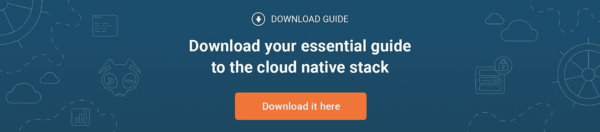

# 了解 Kubernetes 的基本概念 V —守护进程集和作业

> 原文：<https://itnext.io/understanding-basic-kubernetes-concepts-v-daemon-sets-and-jobs-da83eca7e3f7?source=collection_archive---------1----------------------->

这篇文章是一系列关于 Kubernetes 基本概念的博客文章中的第五篇。在第一篇中，我 [*解释了 pod、标签和副本集*](https://blog.giantswarm.io/understanding-basic-kubernetes-concepts-i-introduction-to-pods-labels-replicas/) *的概念。在第二篇* [*中我们谈到了部署*](https://blog.giantswarm.io/understanding-basic-kubernetes-concepts-using-deployments-manage-services-declaratively/) *。第三篇文章* [*解释了服务概念*](https://blog.giantswarm.io/basic-kubernetes-concepts-iii-services-give-abstraction/) *，在第四篇文章中我们看了一下* [*的秘密和配置图*](https://blog.giantswarm.io/understanding-basic-kubernetes-concepts-iv-secrets-and-configmaps/) *。在这最后一篇文章中，我们将讨论守护进程集和任务。*

在之前的文章中，我们讨论了如何在 Kubernetes 中以 pods 的形式运行我们的应用程序。还有两种方式来运行更加专业化的 pod。一个是*守护进程 Set* ，另一个叫做 *Jobs* 。

# 守护进程集

守护程序集确保特定 pod 的实例在集群中的所有(或一部分)节点上运行。它在每个添加的节点上创建 pod，并在从集群中删除节点时收集 pod。

顾名思义，您可以使用守护进程集来运行需要在集群的所有节点上运行的守护进程(和其他工具)。这些可以是集群存储守护进程(例如 Quobyte、glusterd、ceph 等。)、日志收集器(例如 fluentd 或 logstash)或监视守护程序(例如 Prometheus Node Exporter、collectd、New Relic agent 等)。)

最简单的用例是在所有节点上部署一个守护进程。但是，您可能希望将其拆分为多个守护进程集，例如，如果您有一个包含不同硬件节点的集群，这可能需要对守护进程的内存和/或 cpu 请求进行调整。

在其他情况下，您可能希望在集群的不同节点上使用不同的日志记录、监控或存储解决方案。在这些情况下，您希望只将守护程序部署到一组特定的节点，而不是所有节点，您可以使用[节点选择器](https://github.com/kubernetes/kubernetes.github.io/tree/release-1.3/docs/user-guide/node-selection)为守护程序集指定一个节点子集。请注意，要做到这一点，您需要相应地标记您的节点。

有四种方法可以与您的守护程序通信:

*   push:pod 被配置为将数据推送到服务，因此它们没有需要找到它们的客户机。
*   NodeIP 和已知端口:pods 使用一个`hostPort`，客户端可以通过每个 NodeIP 上的这个端口访问它们(在它们被部署到的节点范围内)。
*   DNS:通过使用`endpoints`资源或从 DNS 获取多个 A 记录，可以通过[无头服务](http://kubernetes.io/docs/user-guide/services/#headless-services)到达 pod。
*   服务:可以通过一个标准服务来访问这些 pod。客户端可以使用该服务访问随机节点上的守护程序。请注意，该选项不提供到达特定节点的方法。

目前，您无法更新守护程序集。半自动更新 pod 的唯一方法是删除用`--cascade=false`选项设置的守护进程，这样 pod 将留在节点上。然后创建一个新的守护进程集，使用相同的 pod 选择器，但是使用更新的模板。新的守护进程集将识别旧的 pod，但不会自动更新它们。您将需要通过从节点中手动删除旧的 pod 来强制创建具有新模板的 pod。

# 乔布斯

与用于长期运行流程的典型 pod 不同，作业允许您管理应该终止而不是重新启动的 pod。一个作业创建一个或多个 pod，并确保指定数量的 pod 成功终止。

您可以将作业用于典型的批处理作业(例如数据库备份)，也可以用于需要处理特定队列的工作人员(例如图像或视频转换器)。

有三种工作:

*   非平行作业
*   具有固定完成数量的并行任务
*   带有工作队列的并行作业

对于非并行作业，通常只有一个 pod 开始，一旦 pod 成功终止，作业就被视为完成。如果这个分离舱失败了，另一个会代替它启动。

对于具有固定完成计数的并行任务，当 1 和指定完成数之间的每个值都有一个成功的 pod 时，任务完成。

对于带有工作队列的并行作业，您需要注意，除非工作队列为空，否则 pod 不会成功终止。也就是说，即使工作者完成了它的工作，它也应该只在它知道它的所有同行也完成时才成功终止。一旦一个 pod 成功退出，那么所有其他 pod 也应该退出或正在退出。

对于并行作业，您可以定义请求的并行度。默认情况下，它设置为 1(任何时候只有一个 pod)。如果并行度设置为 0，作业基本上会暂停，直到它增加。

请记住，并行作业不是为了支持需要紧密通信的并行进程的用例而设计的，例如在科学计算中，而是为了处理特定数量的可以并行化的工作。

# 结局？

这是 Kubernetes 基础系列的最后一篇文章。然而，这并不意味着读完所有五篇博文就可以成为 Kubernetes 大师。

首先，引入的原语虽然可能不限于最基本的，但并没有涵盖 Kubernetes 中可用的所有原语。

第二，新版本中有新的原语，比如最近在 Kubernetes 1.3 中作为 alpha 资源引入的 Pet Sets。

所以一旦我觉得需要比现有的更多或更简单的解释，我很可能会写更多的原语。

此外，仅仅阅读这些博客文章或者浏览一下 Kubernetes 文档就能给你一个良好的基础。然而，您需要实际去尝试它，并找到使用这些原语来运行和管理实际应用程序的方法，以便精通它们的用法。没有理由说您手头没有集群，只需在本地环境中进行试验。

由[Puja Abbas si](https://twitter.com/puja108):**开发者拥护者@ [巨型虫群](https://twitter.com/giantswarm)**