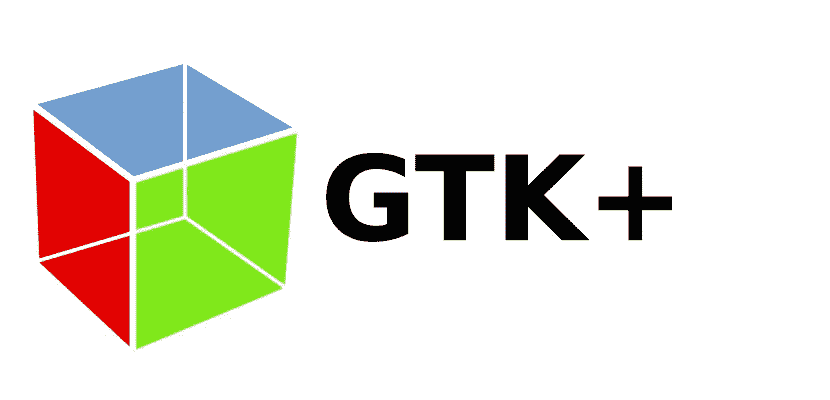
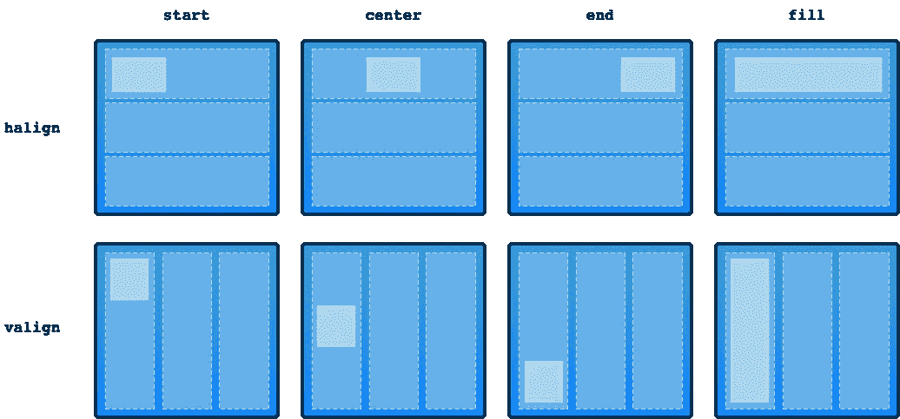
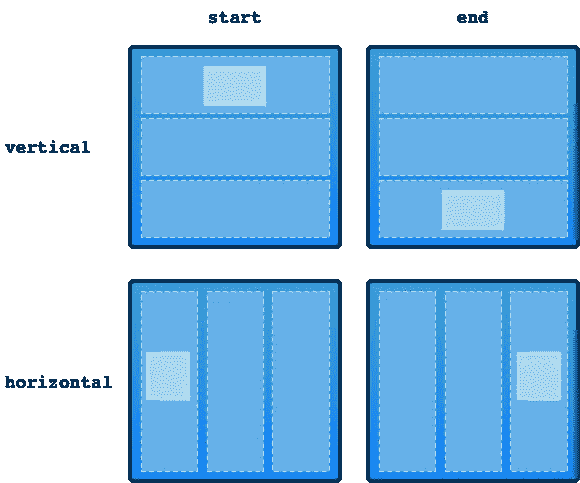
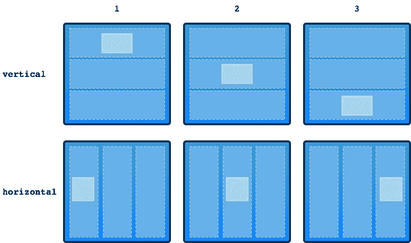
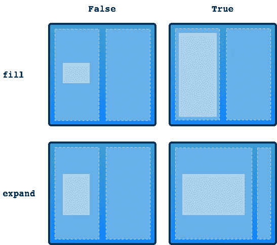
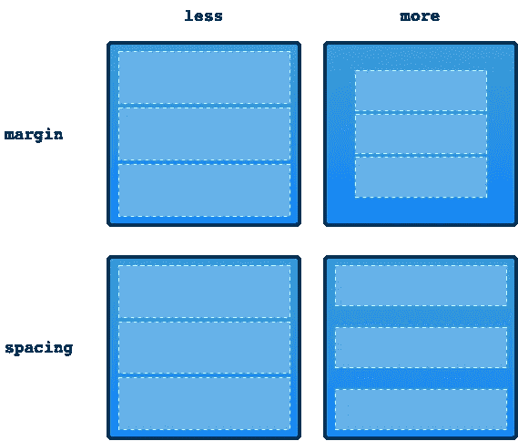

# 了解 GTK 布局

> 原文：<https://itnext.io/understanding-gtk-layouts-13e5a36256fa?source=collection_archive---------0----------------------->

## 使用 GTK UI 工具包的 GUI 布局，重点是 GtkBuilder XML 格式。理解打包、对齐、填充和扩展等概念。



这篇文章的目的是为那些想快速掌握 GTK GUI 布局而不需要大量阅读和实验的懒人创造一些东西。我们将通过视觉演示不同的布局选项在 GTK 是如何工作的来做到这一点。

首先，我们将关注对齐和打包的概念，因为这些概念对于初学者来说是最不明显的。

在大多数例子中，我将使用一个放置在布局容器中的按钮。按钮的类型是 [GtkButton](https://docs.gtk.org/gtk3/class.Button.html) ，我将在示例中使用的布局容器是 [GtkBox](https://docs.gtk.org/gtk3/class.Box.html) 和 [GtkGrid](https://docs.gtk.org/gtk3/class.Grid.html) 。请记住，`GtkBox`可以垂直或水平放置。

在示例中，我们将探索 GTK 组件如何根据我们选择的**对准**和**包装**选项改变位置、扩展和收缩。

# 用 GtkBuilder XML 格式描述 GUI

在进入示例之前，快速介绍一下 [Glade](https://glade.gnome.org) 和 [GtkBuilder](https://docs.gtk.org/gtk3/class.Builder.html) 使用的 XML 格式是很有用的。Glade 是一个 GUI 设计器应用程序，它以 XML 格式存储已设计的贵由，GtkBuilder 类的实例可以读取这种格式。

下面你会看到一个以这种格式定义的极简 GUI。这段代码所做的就是创建一个标题为 *Hello world* 标识符为`mywin`的空窗口。所有 GTK 组件都可以使用`id` XML 属性选择性地拥有一个标识符。

```
<?xml version="1.0" encoding="UTF-8"?>
<interface>
    <requires lib="gtk+" version="3.20"/>
    <object class="GtkWindow" id="mywin">
        <property name="can_focus">False</property>
        <property name="title">Hello world</property> 
    </object>
</interface>
```

这些标识符使得从代码中访问 GUI 组件变得更加容易。例如，如果上面的 XML 文件名为`hello.glade`，我可以用 Julia 代码加载它，并像这样更改标题:

```
**using** Gtk

builder = GtkBuilder(filename="hello.glade")
win = builder["mywin"]
set_gtk_property!(win, :title, "goodbye mars")
```

每个 GUI 对象都用`object` XML 标签定义。每个对象可以有许多用`property`标签定义的属性。使用`child`标签将每个 GUI 对象放入一个父容器中，比如一个`GtkBox`。在`child`标签中，您可以为添加为子对象的对象指定`packing`。

```
<?xml version="1.0" encoding="UTF-8"?>
<interface>
    <requires lib="gtk+" version="3.20"/>
    <object class="GtkWindow" id="mywin">
        <property name="can_focus">False</property>
        <property name="title">Hello world</property>

        <child>
            <object class="GtkBox">
                <property name="orientation">vertical</property>

                <child>
                  <object class="GtkSpinButton">
                    <property name="visible">True</property>
                  </object>

                  <packing>
                    <property name="expand">False</property>
                    <property name="fill">True</property>
                  </packing>
                </child>

            </object>
        </child>        
    </object>
</interface>
```

现在你已经有了一些大概的了解，我们可以进入更具体的内容了。在下面的例子中，为了清楚起见，我将删除布局标记之外的 XML 代码。

# 在容器单元格内对齐 GUI 对象

下面是一个定义文本标签的 XML 代码示例，该文本标签在其容器单元格中右对齐并垂直居中。

```
<object class="GtkLabel">
  <property name="halign">end</property>
  <property name="valign">center</property>
  <property name="label">Name</property>
</object>
```

为了更好地理解对齐是如何工作的，我将使用一个插图来可视化对齐的组件和它的容器之间的关系。第一行显示了为`halign`(水平对齐)属性设置不同值的效果。第二行显示了修改`valign`(垂直对齐)属性值的效果。



水平和垂直 GtkBox 中的对齐

您可能会注意到，对齐方式与文字处理器或图形设计工具中文本的对齐方式非常相似。对齐指定了 GUI 对象如何放置在它所在的单元格中。在插图中，您可以看到容器有三个单元格，我们将`GtkLabel`对象放在第一个单元格中。

# 指定带包装的容器单元

包装会影响 GUI 对象放在哪个容器单元中。因此，每个包装组件的可用属性取决于容器类型。`GtkBox`与`GtkGrid`具有不同的包装属性。

## 包装类型—添加开始的地方

使用`pack-type`我们可以指定是从头到尾添加组件还是相反。对于垂直放置的盒子，`start`表示顶部，`end`表示底部。使用`start`，GUI 组件被添加到容器中的第一个单元格，而`end`会将其添加到容器中的最后一个单元格。

```
<child>
  <object class="GtkButton">
    <property name="label">click me!</property>
  </object>
  <packing>
    <property name="pack-type">end</property>
  </packing>
</child>
```

`start`和`end`的含义会根据`GtkBox`是配置为`vertical`还是`horizontal`(用`orientation`属性指定)而有所不同



卧式和立式 GtkBox 的包装类型

## 位置—直接定位控制

为了更好地控制 GUI 组件的位置，我们可以使用`position`属性。该属性可以与`pack-type`属性结合使用。这种组合只有在`pack-typ`被设置为`start`值时才有效，否则没有意义。

```
<child>
  <object class="GtkButton">
    <property name="label">click me!</property>
  </object>
  <packing>
      <property name="pack-type">start</property>
      <property name="position">0</property>
  </packing>
</child>
```

编号从 0 开始。如果子组件的数量不同，并且您希望保证将一个组件放在最后，那么使用带有`end`值的`pack-type`属性会更有意义。



定位水平和垂直 GtkBox

## 填充和扩展—空间消耗

`fill` & `expand`打包设置影响 GUI 组件消耗多少空间。下面代码示例中的按钮占用了其布局单元格中的所有空间，但是布局单元格本身不会随着父单元格的增大而扩展。换句话说，当您调整包含窗口的大小时，按钮的大小看起来是固定的。

```
<child>
  <object class="GtkButton">
    <property name="label">click me!</property>
  </object>
  <packing>
      <property name="expand">False</property>
      <property name="fill">True</property>
  </packing>
</child>
```



填充和扩展如何影响空间需求

# 设置容器的边距和间距

您可以指定容器的边距和间距。容器的边距在容器的内容和它的父容器之间创建了空间。

相反，间距在容器的*子容器*之间。

```
<object class="GtkBox">
    <property name="margin-start">10</property>
    <property name="margin-top">6</property>
    <property name="orientation">vertical</property>
    <property name="spacing">15</property>

    <child>
      ...  
    </child>

    <child>
      ...  
    </child>

</object>
```



调整边距和间距对容器的影响

# 外卖食品

我们看到的第一个设置，如对齐和打包，与单个 GUI 组件如何与它所在的单元相关联有关。相反，边距和间距对容器本身起作用。边距与父对象相关，而间距与子对象相关。

这些属性为你在 GTK 布局图形用户界面提供了很大的灵活性。

# 相关故事

如果你对 GTK 编程或 GUI 设计感兴趣，你可能会对我的其他一些故事感兴趣。

*   [在 macOS 上用 Julia 写 GTK3 GUI 代码时的打嗝](https://towardsdev.com/hiccups-writing-gtk3-gui-code-in-julia-on-macos-2467483c2e78) —在 macOS 上用 Julia 进入 GTK 编程时如何妥善处理回调、选择等问题。
*   [理解 GUI 设计中的视觉布局](https://erik-engheim.medium.com/understanding-visual-layout-in-gui-design-2fa91792edef)——你应该如何放置按钮、标签、单选按钮等来传达用户界面的意图？
*   [图标设计和使用指南](https://erik-engheim.medium.com/the-no-bullshit-guide-to-icon-design-and-usage-40948878dbbb)——我读了太多关于如何设计好图标的无聊文章后写了这篇文章。从创建用户友好图标的角度来看，这是关于如何设计好图标的非常具体的建议。
*   [用 Godot 制作高级 GUI 应用程序是未来吗？](https://medium.com/swlh/what-makes-godot-engine-great-for-advance-gui-applications-b1cfb941df3b) —我详细讲述了我使用视频游戏 GUI 工具包的经历，我对此印象深刻。这是我用过的最令人印象深刻的 GUI 工具包解决方案之一。
*   [Godot 游戏引擎概念上](https://erik-engheim.medium.com/godot-concepts-dda36c3fff91)