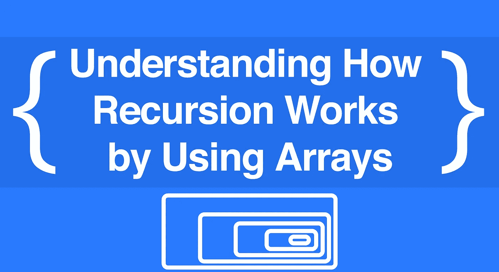
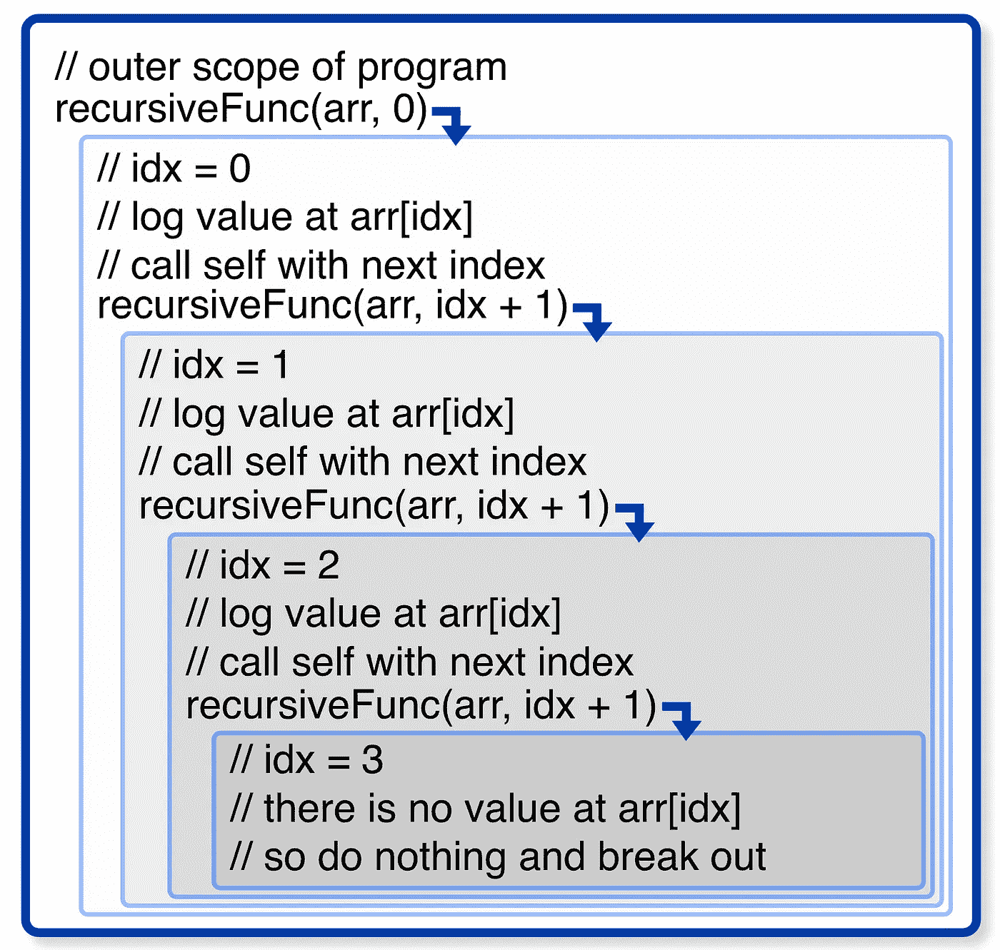
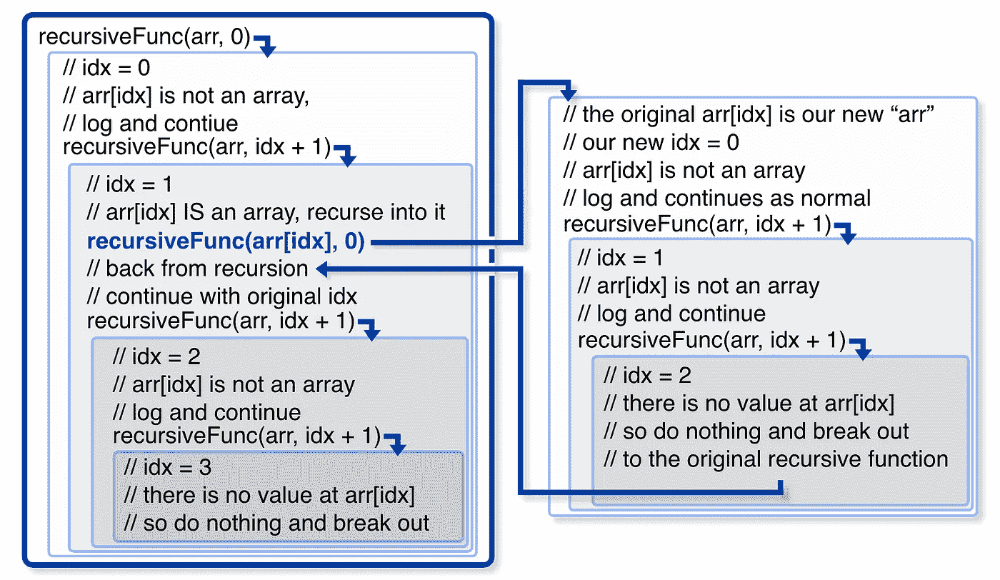

# 递归初学者指南

> 原文：<https://itnext.io/understanding-how-recursion-works-by-using-arrays-a072ba653717?source=collection_archive---------1----------------------->

## 使用数学函数学习递归如何在没有 T1 的情况下工作



***递归*** 是所有计算机科学中最怪异的概念之一，理解它真的很有挑战性。但是试图通过使用[斐波那契](https://medium.com/quick-code/fibonacci-sequence-javascript-interview-question-iterative-and-recursive-solutions-6a0346d24053)或[指数](https://medium.com/@julianjohannesen/banging-my-head-against-recursive-functions-a79f53fbab0f)函数来学习它会使它变得更糟。现在，你不仅仅是在学习核心概念，你还在试图跟踪大量令人困惑的返回值。幸运的是，这些值实际上与递归没有任何关系，使用数组使这一切变得更加简单。

# 什么是递归？

还有更好的定义，但是对于一个递归函数来说，它必须做两件事:1) **调用自己**和 **2)知道什么时候*停止*调用自己**。就这样，就这样。技术上来说，你甚至不需要第二个。当然，没有它你的函数会爆炸，但是它会递归爆炸。

# 让我们构建一个简单的函数

首先，让我们创建一个基函数。它所做的只是在数组中记录一个值:

```
const **recursiveFunc** = (**arr**, **idx**) => {
  **console.log**(`- ${**arr**[**idx**]}`);
}; 
```

太美了。现在，假设我们想使用这个函数来列出数组中的每个值。我们*能不能*偷懒，一直给索引加一:

```
const **arr**= ['*a*', '*b*', '*c*'];
**recursiveFunc(arr,** 0**);
recursiveFunc(arr**, 1**);
recursiveFunc(num**, 2**);**
```

# 但是让我们把它变成递归的

我们所要做的就是在函数中添加“+1”步骤*:*

```
const **recursiveFunc** = (**arr**, **idx**) => {
  **console.log**(`- ${**arr**[**idx**]}`);
  **recursiveFunc**(**arr**, **idx** + 1);
};
```

我们已经满足了递归的第一个要求:我们在函数内部调用函数。但是，如果我们运行这个，它会爆炸，因为我们从来没有告诉它在任何时候*停止*。我们仍然需要要求#2，一个停止条件:

```
const **recursiveFunc** = (**arr**, **idx**) => {
  if (**arr**[**idx**]) {
    **console**.log(`- ${**arr**[**idx**]}`);
    **recursiveFunc**(**arr**, **idx** + 1);
  }
};
```

现在，一旦我们命中一个不在数组中的索引，它不会做任何事情，链就断了。这就是它的作用:

```
**recursiveFunc(**[*'a'*, *'b'*, *'c'*]**,** 0**);** # returns:
- a 
- b 
- c
```

这张方便的图表将帮助您了解正在发生的事情:



我们的递归函数，每个新调用都在一个嵌套的盒子里

如您所见，我们每次都将索引值增加 1，因此我们遍历了整个数组。请注意，索引值会发生变化，但每次我们传入的都是同一个数组。当索引处没有值时，函数什么也不做，所以我们退出函数。

如果这是你第一次使用递归，花点时间熟悉一下这个结构。不可否认，一个函数调用自己是*怪异*。

# 使它更加递归

我们的函数符合我们对递归的定义，但是它不能递归地遍历*嵌套的*数组。这不好，因为这实际上是递归的真实应用。循环处理迭代，然而递归是处理未知深度的嵌套对象的最好方法。为了说明嵌套，我们需要做的就是添加一个步骤，在这个步骤中我们检查值是否是一个数组:

```
const **recursiveFunc** = (**arr**, **idx**) => {
  if (**arr**[**idx**]) {
    ***// add this extra check***
    if (**Array**.isArray(**arr**[**idx**])) {
      **recursiveFunc**(**arr**[**idx**], 0);
    } else {
      **console**.log(`- ${**arr**[**idx**]}`);
    }
    **recursiveFunc**(**arr**, **idx** + 1);
  }
};**recursiveFunc(**[*'a'*, [*'x', 'y'*], *'d'*]**,** 0**);** # returns:
- a 
- x
- y
- d
```

同样，图表非常有用:



我们新的递归函数在另一个框中显示了单独的数组步骤

这是在新数组上开始另一个递归调用链。看看我们如何传入新的数组和`0`来开始新的序列。一旦这个序列完成，我们回到我们的主链。另外，注意最后的`recursiveFunc`调用是在数组检查之外的*。这是因为当我们进入一个数组后，我们总是希望在返回时继续下去。*

# 通过想象来仔细检查

为了确保您理解主要概念，为什么不尝试添加另一个参数呢？这是更好的印刷的新水平:

```
const **recursiveFancy** = (**arr**, **idx**, **lvl**) => {
  if (arr[idx]) {
    if (**Array.**isArray(**arr**[**idx**])) {
      **recursiveFancy**(**arr**[**idx**], 0, **lvl** + 1);
    } else {
      **console**.log(`${'- '.repeat(**lvl**)}${**arr**[**idx**]}`);
    }
    **recursiveFancy**(**arr**, **idx** + 1, **lvl**);
  }
};**recursiveFancy**(['*a*', '*b*', ['*q*', ['*x*',]], '*c*'], 0, 1);
*# returns* 
- a
- b
- - q
- - - x
- c
```

这就是递归的基础。既然基础知识已经完成，学习递归返回值应该会容易得多。看看他们如何处理[斐波纳契面试问题](https://medium.com/quick-code/fibonacci-sequence-javascript-interview-question-iterative-and-recursive-solutions-6a0346d24053)。

大家编码快乐，

迈克

*最新文章:*