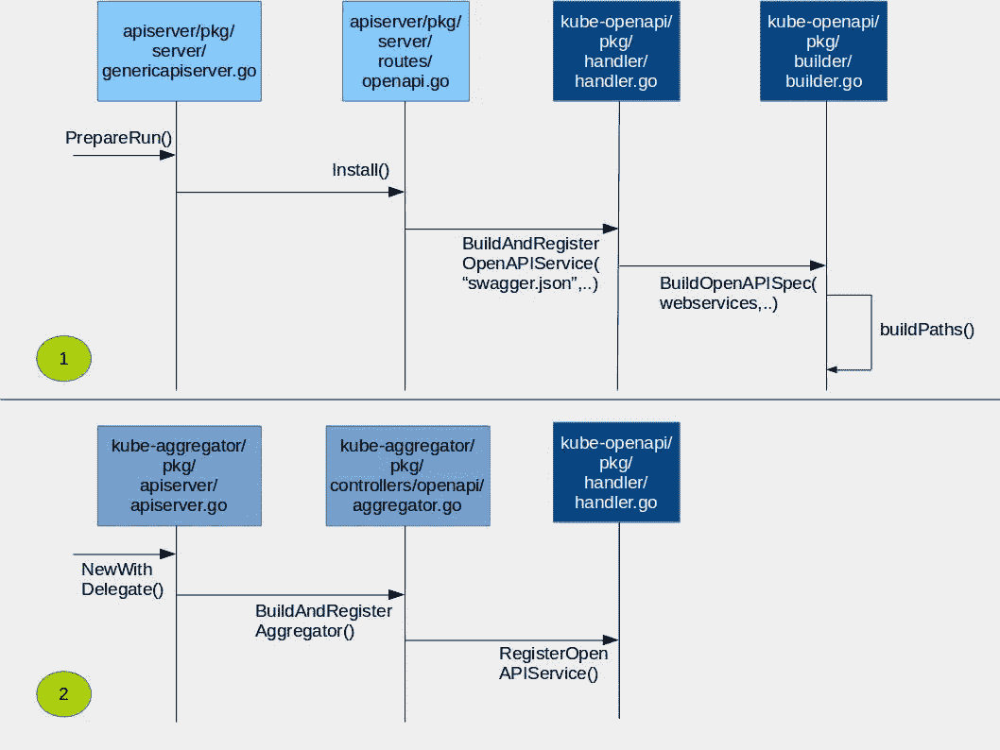
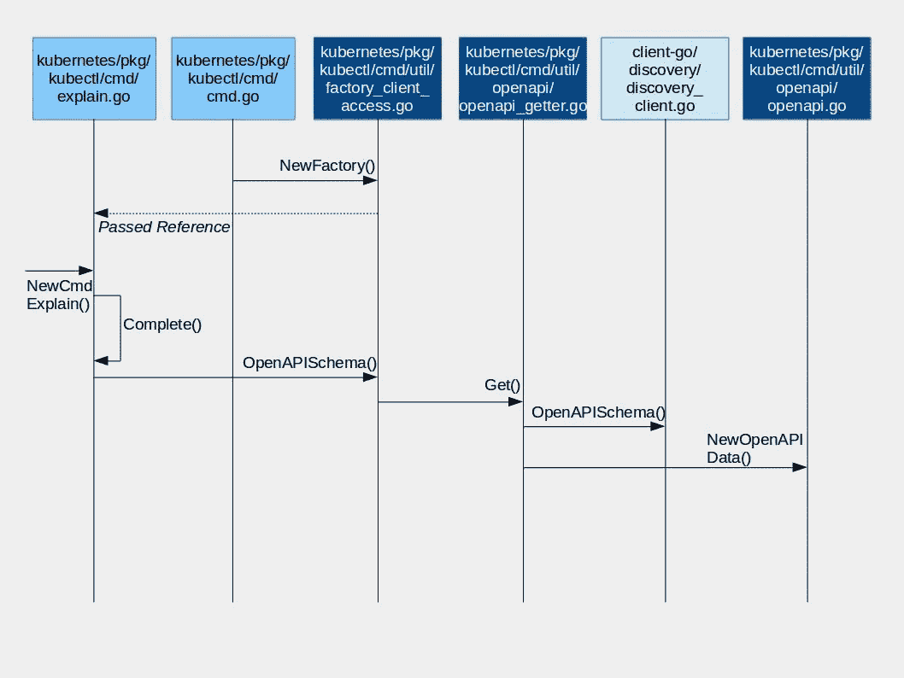

# 对自定义资源使用“kubectl explain”

> 原文：<https://itnext.io/understanding-kubectl-explain-9d703396cc8?source=collection_archive---------1----------------------->

## 目标:探索是否可以使用“kubectl explain”来发现关于定制资源的静态信息

最近，我们一直致力于构建一个 Kubernetes 聚合 API 服务器，帮助发现集群中关于 T2 定制资源的信息。例如，关于自定义资源的静态信息可以是—可以对其执行哪些操作，或者公开哪些可配置的参数以及如何修改这些参数。关于自定义资源的动态信息的例子可以是——哪些本地 Kubernetes 资源包含自定义资源的特定实例及其状态。

为了构建这个服务器，我们一直在研究“kubectl explain”命令的工作流，因为它似乎是一个很好的起点，可以用来研究我们是否可以使用它来支持发现定制资源的静态信息。这篇文章首先介绍了“kubectl explain”是如何工作的。然后，我们将分析它是否可以用于我们的用例。

**库贝克解释输出源**

kubectl explain 命令用于显示关于 Kubernetes 资源(如 pod)的文档。

例子

# kubectl 解释窗格

该命令输出显示的信息来自 Pod 的 OpenAPI 规范。所有类型的 OpenAPI 规范都是由主 API 服务器在启动时生成的，并由它在内存中维护。下面我们解释这个过程的细节。

## 库贝克的幕后解说

kubectl explain 的工作包括两个阶段。第一阶段发生在主 API 服务器启动时。在这个阶段，OpenAPI 规范在内存中构建和维护，以服务于 kubectl explain 调用。第二阶段是实际的“kubectl explain”命令执行。在这个阶段，从服务器获取、解析和显示所请求资源的 OpenAPI 规范。

**阶段 1:主 API 服务器启动并构建 OpenAPI 规范**

此阶段分为两个步骤，如下图所示。



第一步包括遍历注册的 Kubernetes REST API 资源端点，并为所有资源生成 OpenAPI 规范的内存表示。它始于 genericapiserver.go 的 [*PrepareRun()*](https://github.com/kubernetes/kubernetes/blob/master/staging/src/k8s.io/apiserver/pkg/server/genericapiserver.go#L240) *函数。*调用图包括 kube-openapi/中的 [*buildPaths()*](https://github.com/kubernetes/kubernetes/blob/master/vendor/k8s.io/kube-openapi/pkg/builder/openapi.go#L196) 方法../builder.go 包。该方法使用注册到主 API 服务器的 go-restful webservice 端点，并构建 OpenAPI 规范的内存表示。有一种方法可以使用 kubernetes/hack/update-OpenAPI-Spec . sh 脚本将 open API 规范的内存表示下载为 JSON 文件。这将下载规范的 json 文件，并将其保存为 kubernetes/api/openapi-spec 文件夹中的 swagger.json。

第二步是让服务器准备好在一个众所周知的 URL(例如/openapi/v2 或/swagger.json)上提供生成的 OpenAPI 规范。

**阶段 2:执行“kubectl explain”命令来检索和解析 OpenAPI 规范**

在“kubectl explain”的输出中显示信息包括首先从众所周知的 URL 路径中检索它，然后解析它。下图显示了此过程中涉及的组件。



该过程从 explain.go 的 [*NewCmdExplain()函数*](https://github.com/kubernetes/kubernetes/blob/master/pkg/kubectl/cmd/explain.go#L73) 开始。它被传递一个对 cmd util 工厂对象的引用。factory_client_access.go 包含 [OpenAPISchema()函数](https://github.com/kubernetes/kubernetes/blob/master/pkg/kubectl/cmd/util/factory_client_access.go#L175)，它是使用 [client-go](https://github.com/kubernetes/kubernetes/blob/master/staging/src/k8s.io/client-go/discovery/discovery_client.go#L386) 检索 OpenAPI 规范的调用图的起点。然后使用[解释包](https://github.com/kubernetes/kubernetes/tree/master/pkg/kubectl/explain)中可用的各种函数解析检索到的规范。

## 观察

1)‘ku bectl explain’输出的一个问题是它没有显示一个对象的完整 API 路径。例如，“kubectl explain Pods”并没有显示 Pods 可以在 api/core/v1/路径下访问。如果我们能得到这个完整的路径，那么使用‘kubectl get-raw’或 curl 命令就更容易了。

这种信息在 OpenAPI 规范中是可用的，但是“kubectl explain”并没有显示出来。

如果你已经下载了内存中的 OpenAPI 规范，你可以在 swagger.json 中的定义部分查找这个。Pod 定义包含在“io.k8s.api.core.v1.Pod”下。显示为“kubectl explain”输出的信息是从该定义的描述字段中获得的。

2)如果您想要更新一个本地 Kubernetes 资源(类型)的描述，您可以遵循这些步骤。

-在适当的地方修改描述文本(对于 Pod，在此处更改为

-运行 kubernetes/hack/update-open API-spec . sh。

这个脚本启动主 api 服务器，它将生成 OpenAPI 规范，如上面的第 1 阶段部分所述。该脚本还将下载规范的 json 文件，并将其保存为 kubernetes/api/openapi-spec 文件夹中的 swagger.json。

请注意，如果您正在使用 Minikube，那么您的更改将不会反映在“kubectl explain”中。您必须从源代码运行 Kubernetes 集群，以使更改生效。您可以按照这里的[所示的步骤](https://dzone.com/articles/easy-step-by-step-local-kubernetes-source-code-cha)从源代码运行集群。

3)[kube-openapi 库](https://github.com/kubernetes/kube-openapi)包含用于构建 open API 规范的包和函数。该库提供了一个注释—“+k8s:openapi-gen = true”，建议用于为类型生成 open API 规范的[。一旦在类型上添加了这个注释，就可以使用 kube-openapi 包中的脚本来为该类型生成 openapi 规范文件。但是，Kubernetes 的本地类型(如](https://github.com/kubernetes/kube-openapi/issues/96) [Pod](https://github.com/kubernetes/kubernetes/blob/master/staging/src/k8s.io/api/core/v1/types.go#L3076) )上没有这种注释。本机类型的 OpenAPI 规范是在运行时通过解析 API 路径生成的，如上面的阶段 1 部分所述。

**结论**

似乎使用“kubectl explain”来发现自定义资源的静态信息的唯一方法是，该信息是否可以通过主 API 服务器的 OpenAPI 规范提供。这个规范是通过在主 API 服务器启动时遍历注册的 API 端点来构建的。该等级库之后不会重新生成。当使用自定义资源定义注册自定义资源时，主 API 服务器已经在运行。它不会重新启动，因此无法生成自定义资源的 OpenAPI 规范。当使用聚合 API 服务器方法使用 APIService 对象注册自定义资源时，类似的逻辑也适用。因此，似乎没有办法使用“kubectl explain”来发现关于定制资源的静态信息。

我们正在考虑的一个选项是构建一个名为“explain”的自定义子资源，它可用于获取这些信息，如下所示:

```
kubectl get --raw /apis/kubediscovery.cloudark.io/v1/namespaces/default/Postgres/
explain
```

这里我们有“Postgres”作为自定义资源，我们将“explain”定义为它的子资源。

我们的计划如下。我们将用“+k8s:openapi-gen=true”注释 Postgres 类型定义，并使用 kube-openapi 库中的脚本为 Postgres 类型生成 openapi 规范文件。我们将把这个文件作为一个 ConfigMap 加载，我们的“explain”子资源的自定义处理程序将检索这个文件，解析它，并显示所需的信息。

如果你有任何其他想法/建议，我们渴望听到它们。

你可以在 Github [这里](https://github.com/kubernetes/kube-openapi/issues/97)追踪关于这个问题的讨论。

[www.cloudark.io](https://cloudark.io/)